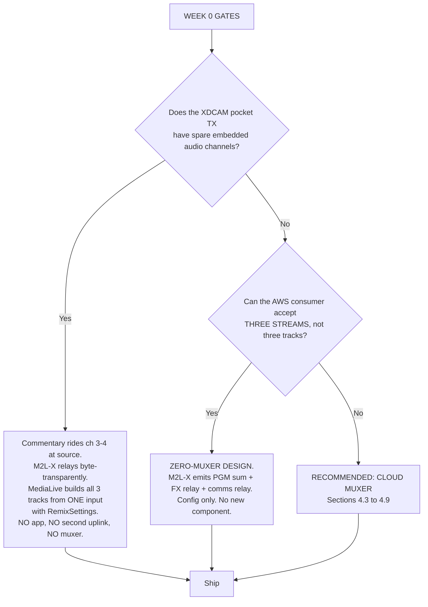
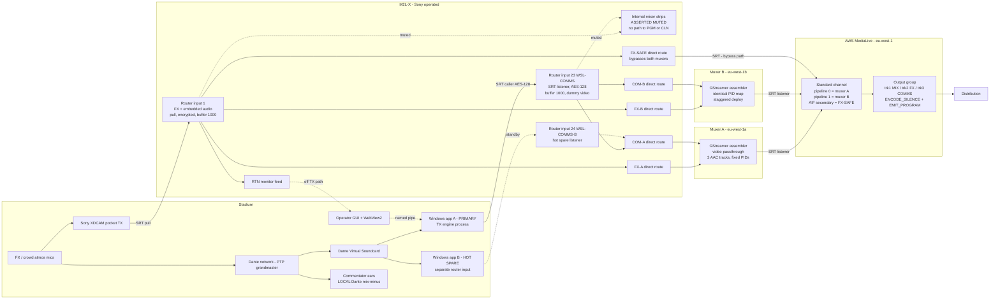
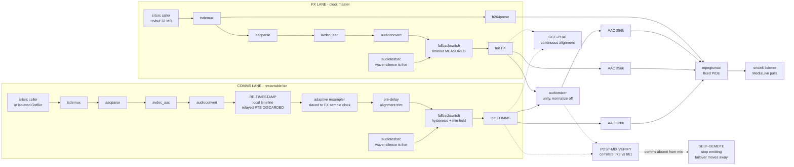

Verification complete — including two findings that change the design. Writing the document.

# WSL Studios × Sony M2L‑X — Commentary Contribution: Final Architecture Recommendation

**Instance:** `m2lx-wslstudios-matcht.etapsiota.com`, event `dl9-5p5ah0bd-empd` (DEV) · **Date:** 29 July 2026 · **Status:** for review with Sony

Evidence tags used throughout: **[E]** verified by experiment on the live instance · **[C]** verified from the M2L‑X Angular bundle · **[D]** verified from vendor documentation · **[U]** unverified — assumption plus fallback stated.

---

## 1. Executive summary

**What we are building.** A Windows application at the stadium that captures commentary from the Dante network and sends it to Sony's M2L‑X cloud switcher as its own independent contribution feed, so that AWS can be delivered three audio tracks: (1) effects + commentary mixed, (2) effects only, (3) commentary only.

**Is the client's reliability requirement satisfiable? Yes, and it is now measured rather than argued.** If the stadium machine crashes, is rebooted, loses power or loses its internet connection, the programme transmission continues completely unaffected. This is not a design aspiration — M2L‑X isolates contribution feeds from one another by construction, and we have measured that isolation across source outages of 2, 5, 10, 45, 76.8 and 93 seconds without a single downstream session being dropped. The commentary simply stops, and returns by itself about 2.4 seconds after the app comes back, with no operator action and no API call.

**One correction to an earlier concern.** Some review work raised the alarm that commentary might leak into the client's programme and clean feeds through M2L‑X's internal audio mixer. We checked this on the live instance today: every one of the 53 mixer strips is muted, the programme and clean buses both read digital silence (−99.99999 dBFS), and commentary therefore has no path into programme audio at all. We also found the exact control command that sets and reads back that mute state, so it can be **asserted and alarmed before every match** rather than assumed.

**The recommended approach, in one sentence:** commentary travels as its own contribution feed that never touches programme inside M2L‑X; M2L‑X relays effects and commentary onward as two untouched, byte-for-byte identical copies; and the three deliverable tracks are assembled in a pair of small, duplicated servers we run in AWS Ireland, alongside the encoder.

**What it depends on — the honest list.**

1. **A new component in the programme path.** The assembling servers carry the effects feed as well as commentary. We are not removing a component from the transmission chain; we are moving it from a single PC on a contended stadium internet link to two duplicated servers in the same AWS region as the encoder. That is a materially different risk, but it is not zero, and the client should accept it explicitly rather than have it buried. We have designed a bypass (below) so that even the total loss of both servers does not take programme off air.
2. **A licence that expires in three weeks.** M2X‑Trial, expiry **19 August 2026**, is the instance's *only* entitlement — not merely an audio option. Converting it is a commercial blocking task independent of every architectural choice here.
3. **Two questions to the client and to Sony that could delete most of this project.** Whether the XDCAM pocket transmitter has spare embedded audio channels (if it does, commentary rides the existing uplink and neither the app nor the assembling servers are needed); and whether the AWS-side consumer can accept three separate streams instead of three tracks in one file (if it can, the assembling servers are deleted). Both are half-hour conversations against a build measured in months. **They must be asked in week 0.**
4. **A staged go-live.** A full build cannot be ready for the season opener. We therefore recommend going live first on a configuration-only path that needs no new software, and cutting over to the full design once it is proven.

**Bottom line for the non-engineer:** the thing the client asked for — *"if the Windows app goes offline, the rest of the programme stays unaffected"* — is achievable, is measured, and is the default behaviour of the platform rather than something we have to engineer around. The remaining engineering risk is not in the stadium; it is in the small piece of cloud software that combines the three tracks, and most of this document is about making that piece safe or avoiding the need for it altogether.

> **UPDATE, 29 July 2026 — read §1a before the rest of this document.** The three tracks can now be
> produced by M2L‑X **configuration alone**, verified end to end with measured tones. This
> substantially reduces the scope described below and promotes the "interim" path of §6.1 to a
> serious candidate for the primary design.

---

## 1a. AUX bus routing — three tracks, configuration only **[E]**

Answering the client's question *"What are these AUXes? Can we construct an output consisting of the
main and the AUXes?"*

**What the AUX buses are.** The `advanced_audio_mixer` DSP node has seven stereo buses: `master`,
`aux1`, `aux2`, `mon1`–`mon4`. The UI addresses only three — PGM reads `master`, CLN reads `aux1`,
PFL reads `mon4` **[C]**. The bus the mixer surface labels **"AUX" and the bus the output list calls
"cln" are the same node, `aux1`** **[C][E]**. `mon1`–`mon3` are per‑MIC monitor buses; `mon4` is PFL.
No `mon` bus has any egress.

**The result — all three tracks, no new software, no licence change, no restart:**

| Track | Bus | Output source | Measured content |
|---|---|---|---|
| 1 — FX + commentary mix | `master` | `pgm` | FX 350/500 Hz **and** comms 950/1100 Hz, all at −4.5 dBFS |
| 2 — FX only | `aux1` | `cln` | FX at −5.0 dBFS; **commentary at −129 to −139 dBFS**, i.e. >125 dB down — genuinely absent, not merely quiet |
| 3 — commentary only | — | direct route of the comms router input, `through_mode` | comms at exactly −6.0 dBFS, bit‑transparent; FX ≤ −133 dBFS |

Achieved by per‑strip routing. The confirmed main‑matrix enum is **`"output"`** (`uD = {OUTPUT:"output", PFL:"pfl"}`), which closes a previously unconfirmed item in §3.3:

```json
{"node":"advanced_audio_mixer","command":"set_routing","args":{"matrix":"output","input":"cam21-1","outputs":["master","aux1"]}}
{"node":"advanced_audio_mixer","command":"set_routing","args":{"matrix":"output","input":"cam22-1","outputs":["master"]}}
```

FX routes to `master` + `aux1`; commentary routes to `master` only. This is the textbook use of a
clean-feed bus, not a workaround.

**Hard limits established:**

- **No output can carry more than one bus.** `source` accepts only `pgm | pvw | cln | <router input id>`. `aux`, `aux1`, `aux2`, `master`, `mon1` all return **HTTP 400 `{"detail":"Output source is invalid."}`** with nothing persisted **[E]**. So "one output of main + AUXes" is impossible; it is three parallel outputs.
- **`aux2` is routable but has no egress.** It is a live DSP bus — routing to it works, its meter responds, its fader works — yet it has **zero occurrences in the 19 MB UI bundle** and no valid output source **[E]**. Commentary‑only must therefore come from the direct route, not a bus.
- **PVW is not a fourth audio bus.** A `pvw`‑sourced output carries the **master** bus audio — identical four‑tone signature at −4.5 dBFS with the same −27.2 dB residual as PGM. Only the video differs **[E]**.
- Bus outputs are pinned **H.265 / 15000 kbps / AAC**; `codec:"h264"`, `bitrate:8000`, `audio_codec:"aes3"` all return **200 and silently revert** **[E]**.

**Risks specific to this approach:**

| Risk | Detail |
|---|---|
| **Egress cost** | ~34 Mbps total (PGM 15 + CLN 15 + comms direct ~3.6). 30 Mbps is redundant 1080p50 video carried solely to transport two stereo pairs |
| **Operator can break track 2 from the surface** | The AUX strip has a live fader and mute in the UI. `set_output_muted [{"name":"aux1","muted":true}]` took CLN to digital silence; an aux1 fader at −6 dB moved CLN −6 dB on both legs — while PGM stayed healthy **[E]** |
| **Factory routing leaks** | Every cam strip defaults to `["master","aux1","aux2"]`. Un‑muting any strip without first correcting its routing puts it into the FX‑only track |
| **Headroom** | `master` sums at unity and clips near full scale: two −5 dBFS‑per‑channel contributors summed to ≈ +1 dBFS and produced a **−27 dB distortion residual** on PGM/PVW, versus −75/−76 dB on CLN and the direct route **[E]**. Gain staging and an armed limiter are mandatory, not optional |
| **Silent command drops** | `set_ch_fader` / `set_output_fader` writes were repeatedly **ACKed 200 but silently dropped**. Every command must be read back from `switcher_status` **[E]** |
| **API shape** | `set_output_muted` requires the **array** form `[{name,muted}]`; the object form returns 400. Fader `gain` is in dB; mute is −144 **[E]** |

**What this does not solve.** The three tracks arrive as **three separate SRT streams**. MediaLive
cannot combine them (§4.2), so if the AWS consumer requires a single multi‑track asset, a downstream
remux is still needed — one ffmpeg pulling all three feeds into a single 3×stereo transport stream.
**This makes the week‑0 "can the consumer accept three streams?" gate (§4.1) the single highest‑value
question in the project**: if yes, the muxer and roughly 8 engineer‑weeks disappear.

**Note for the client:** strip `cam10-1` was found **already un‑muted** in the golden snapshot of the
production mixer state. It was preserved as found, but it is worth confirming that is intentional.

---

## 1b. What external audio mixer mode actually changes **[C]**

Answering *"When you change to external audio, do the outputs still carry audio in the same way?
What changes does external actually make?"* — from code, since switching restarts the instance.

| Output type | Internal mode (measured) | External mode | Confidence |
|---|---|---|---|
| **Direct route** (`source = <router input id>`, `through_mode`) | Byte-transparent TS relay; all PIDs/channels incl. 302M preserved | **Identical — no mode-dependent code path exists anywhere** | High **[C]** |
| **PGM** | Engine encode, `master` bus, 1 stereo AAC, codec pinned | Audio = NDI-return tracks per PGM assignment, **up to 8 stereo tracks**; assignment is event-stop-guarded | High for source/count; **packaging unknown** |
| **CLN** | Engine encode, `aux1` bus, 1 stereo AAC | As PGM, with an independent CLN assignment | Same |
| **PVW** | Audio = `master` bus, identical to PGM | **No external-mode provision exists in code — unresolved** | Low — Sony must confirm |
| **Programme monitor** (WebRTC) | **7 audio tracks** | **8 tracks** = return T1–T8, operator selects one | High **[C]** |

**The headline: direct-route outputs are untouched.** `app-output-edit` takes no mixer-mode input at
all, and a sweep of every mode flag (`audioMixerMode`, `isExternalAudio`, `showExternalAudio`,
`internalMixing`, `audioMixedExternally`) against all output/encoder/codec code found **zero
intersection**. The `output_audio_track` model contains only `PROGRAM_TRACK_INDEX=0` and
`CLEAN_TRACK_INDEX=1` — direct routes are not in it and cannot be assigned external tracks. So the
commentary-only track survives a mode change unchanged.

**What actually changes is the engine graph.** `get audioMixedExternally(){return this._audioOutputMixer!==this._audioInputMixer}`.
Internal mode has one node, `advanced_audio_mixer`, serving as both input and output side. External
mode splits it: input side becomes `audio_mixer` (a fan-out to the NDI send), output side becomes
`audio_mixer_out`, fed by `audio_mapper_out.0`–`.7` — the 8 stereo pairs demapped from a **16-channel
NDI return**. Track enum `zi`: `NOT_ASSIGNED=999`, `EXT_TRACK_1 "EXT Mixer T1(CH1/2)"` … `T8(CH15/16)`.

**Consequences worth weighing:**

- **MIC inputs and all mix-minus die.** `isEnableMicInput = (mode === Internal)`, and microphone discovery runs *only* for the `advanced_audio_mixer` node — so N‑1 MIC1‑3, self-monitoring and `mic_assign` are all dead in external mode **[C]**.
- **The mixer surface goes read-only.** Strips render with `isDisabled = !internalMixing`; the UI never sends `set_routing`, fader or mute commands in external mode. **The whole §1a routing scheme ceases to exist.**
- **After 19 Aug 2026 an external-mode event cannot even start.** The server flags `is_invalid_audio_mixer_mode` and `isEnableStatus` returns false — the start button is hard-disabled until the mode is switched back to Internal **[C]**. MESSAGE.9041: *"Please set Audio Mixer settings to Internal. License has been expired. (M2X-AU**)"*.
- **`audio_tracks_count` is meaningless in internal mode** — the form submits `-1` **[C]**. It sizes the NDI send only: SRT inputs up to 8 tracks, everything else 1, event cap 32 pairs (64 ch).
- **NDI bandwidth is substantial.** 32-bit float PCM at 48 kHz ≈ 1.54 Mbps/channel → ~24.6 Mbps for the 16‑ch return and up to ~98 Mbps for a fully loaded 64‑ch send **[U, from NDI spec not code]**.
- Each switch **stops the event and restarts the instance**, in both directions.

### 1b.1 A significant find for the application: the monitor already carries 7 discrete audio tracks

The WebRTC programme monitor requests `internalMixing ? 7 : 8` audio transceivers (`kb = {Internal:7, External:8}`) **[C]**. In internal mode those 7 tracks are enum `Ca`:

| Track | 0 | 1 | 2 | 3 | 4 | 5 | 6 |
|---|---|---|---|---|---|---|---|
| Content | **PGM** | **CLN** | MON | **MIC1 (N‑1)** | **MIC2 (N‑1)** | **MIC3 (N‑1)** | PFL |

**This solves the commentator return-audio problem natively.** The monitor stream the app is already
opening for picture also carries programme, clean feed, and three ready-made mix-minus feeds as
separate tracks — so the commentator can be given a proper N‑1 without building a return path, and
without the app touching the transmission chain. This supersedes the return-audio approach in §5.6.

Note the count is backend-dependent: the non-KVS (`/rtpreceiver`) monitor path requests `7 : 2`
instead **[C]**. This instance uses KVS, but a client should handle both.

**Net assessment.** External mode's only real gain is multi-track PGM/CLN on a single output, which
would cut the §1a egress cost and remove the downstream remux. Against that it destroys the routing
scheme of §1a and destroys MIC/mix-minus including the return-audio mechanism above.
**Superseded — see §1c.4: the time-alignment finding materially strengthens the case for external
mode, and the client has since ruled licensing and MIC inputs out of scope.**

---

## 1c. Test battery results, 29–30 July 2026 **[E]**

Five tests run against the dev instance. Four passed cleanly; one produced a **serious negative
finding** that changes the recommendation.

### 1c.1 Multi-PID delivery — PASS, no limit found

A direct-route relay carries **at least 8 discrete stereo AAC audio PIDs** (16 channels), every
channel resolving to its intended frequency within **0.3 dB** of source, worst-case cross-channel
separation **95 dB** (typically >130 dB). Language tags preserved (eng/fra/deu/spa/ita/nld/por/swe).
Mux bitrate rose only 6.17 → 7.16 Mbps from 2 to 8 audio PIDs. Each PID is **independently
extractable by stream copy** — demonstrated with `ffmpeg -map 0:a:1 -c copy`.

Combined with the AWS finding that MediaLive's `AudioPidSelection.Pids[]` **interleaves multiple PIDs
inside one selector before remix**, this means: *if FX and commentary can be got into one stream as
separate PIDs, MediaLive builds all three tracks natively with no remux and no bespoke component.*

### 1c.2 Output caller mode — WORKS. M2L-X can PUSH to AWS

`Vo.SRT_CALLER = new Vo("SRT-Caller", SRT, false)` / `Vo.SRT_LISTENER = (…, true)` **[C]** — so for
**outputs**, `reverse: false` = SRT caller and `address` is the destination. (Router *inputs* use the
inverted mapping; the two directions are genuinely opposite.)

Proven end to end by pointing output 13 (`reverse:false`) at the instance's own router input 20:
input 20 went `offline → online`, output 13 reported `status: online` with an empty
`status_message_id`, and content arrived bit-identical to a single-hop run. Against an unreachable
NAT address the same output reported **`MESSAGE.9017`**, which therefore means *caller could not
reach the destination* — a usable alarm signal.

**AWS does not have to pull.** Both directions are available.

### 1c.3 Fan-out — HARD LIMIT OF 4, enforced at config time

`MESSAGE.9013`: *"The output destinations for a single router input are limited to four."* HTTP 400.

**The switcher assignment consumes one of the four slots** **[E]**: router input 21 (which has a
`cam21-1` mixer strip) accepted only **3** direct outputs; router input 11 (no strip) accepted **4**.

Four concurrent consumers ran cleanly — identical byte counts, negligible drops (13–54 packets),
no degradation of earlier consumers when later ones started, ~25 Mbps aggregate egress.

**Design impact:** the commentary input can feed at most **3** direct-route outputs while also being
on the switcher. Enough for the three-track scheme, with no spare for redundancy.

### 1c.4 Time alignment — a **FIXED +310.7 ms** offset, not instability

> **CORRECTION.** An earlier pass reported this offset as wildly variable (0–580 ms across restarts).
> That was wrong. Those captures were contaminated by stray automation from a previous session that
> was holding the SRT listeners, and by non-simultaneous capture. The clean re-measurement below
> supersedes it.

Arrival skew between a **PGM bus output** (engine re-encode) and a **direct-route output**
(byte-transparent relay) of the same router input:

| Measurement | Value |
|---|---|
| Mean | **+310.5 ms** (engine bus later) |
| Median | **+310.7 ms** |
| Standard deviation | **0.6 ms** |
| Sample size | N = 16 burst pairs |

Method: frequency-coded 40 ms bursts (3000 + 200·n Hz) every 5.000 s into router input 20, with
**simultaneous timestamped capture of both outputs by one process** against a common wall clock.
Burst onsets landed exactly 5.000 s apart within each stream.

**This is a fixed, precisely characterised pipeline constant — 15.5 frames at 1080p50 — and it is
trivially correctable** with `adelay=14914S|14914S` on the commentary leg. It is not a source of
per-session unpredictability.

**Consequence: a small align-and-mux stage is required** — but not for the reason previously stated.
In internal mode the tracks leave M2L-X as **separate SRT streams**, and a MediaLive channel consumes
one active input at a time (multiple attachments are failover, not combination). `AudioPidSelection.Pids[]`
sums PIDs only **within one transport stream**. So something must (a) apply the 311 ms delay, which
MediaLive cannot do — `PremixSettings` offers remix, gain and loudness but **no offset** — and
(b) place both elementary streams in one container. That stage stream-copies the video and the FX
audio and decodes only the commentary; it is roughly 15 lines of ffmpeg with validated fail-open
behaviour.

*Still unmeasured:* **CLN-vs-PGM alignment.** Both are engine buses and are expected to match, but if
they differ the delay constant becomes per-path rather than global. Measure before shipping.

### 1c.4a The recommended egress shape (S1)

Leave the **commentary strip routed to no bus at all**. Then pull just two streams:

| Stream | Source | Carries | Bitrate |
|---|---|---|---|
| A | `source: "pgm"` | programme video (with DSK/graphics) + **FX audio only** | ~15 Mbps |
| B | `source: "<comms input>"`, `through_mode` | commentary, byte-transparent | ~2 Mbps |

≈ **17 Mbps total, versus ~32 Mbps for the three-output shape.** The mix is built in AWS from the two
PIDs, which means:

- Commentary **never touches the programme bus**, so the master-bus unity-sum clipping trap
  (two −5 dBFS contributors → +1 dBFS with a −27 dB residual) cannot arise at all.
- The venue's PGM bus is left **exactly as it already is** — nothing about the existing production
  changes.
- Commentary level in the mix becomes an **AWS-side control**, adjustable without touching the venue.

If the venue itself must hear commentary on the M2L-X PGM bus, switch to the three-output shape (S2)
at the cost of one more 15 Mbps pull and the clipping exposure that comes with it.

### 1c.4b Free commentator return — no extra transport

With FX routed to `["master","aux1"]`, the **aux1 / CLN bus is simultaneously the FX-only deliverable
and an inherent N−1 for the commentator**, and it is already present on the WebRTC monitor at
transceiver **mid 2** (`myAudioTrack1`). One bus, two consumers — **no extra SRT path, no extra port,
no listener contention**. This removes an entire transport from the application design.

### 1c.5 Gain staging — solved, with one dangerous trap

**`agc_mode` gates the limiter, and `"off"` makes it silently inert** **[E]**. Setting `limiter_th`
with `agc_mode:"off"` reads back correctly and has **no effect on level whatsoever**. The bundle
confirms: `case la.OFF: this.limiterCompressorOptions.disabled = !0`. Enum values are
`off | limiter | compressor | both`.

**A configuration that looks armed, and reads back as armed, can provide zero protection.**

With `agc_mode:"limiter"` it works exactly — a 0 dBFS tone clamped to precisely the threshold,
monotonic and transparent (residual unchanged at −68 dB):

| `limiter_th` | PGM peak |
|---|---|
| control (`off`) | −0.44 dBFS |
| −3 | **−3.00** |
| −6 | **−6.00** |
| −10 | **−10.00** |

The master bus sums at **exact unity** (within 0.03 dB) and **hard-clips at 0 dBFS** — the peak never
exceeded +0.10 dBFS even with 3 dB of overdrive. The knee is brutal: **~1 dB of overdrive costs
~33 dB of distortion** (residual −66 dB at −0.92, collapsing to −29.6 dB at +1.08).

`pre_gain` is exactly dB-calibrated and distortion-free (0/−6/−12 → −19.98/−25.98/−31.97 dBFS) —
**the right trim for matching commentary to FX**, rather than riding the channel fader.
`compressor_th` behaves as a ~2:1 compressor.

**Recommended commentary strip settings:**

```json
{"node":"advanced_audio_mixer","command":"set_comp_limit",
 "args":{"name":"cam22-1","agc_mode":"limiter","pre_gain":0,
         "compressor_th":0,"limiter_th":-9}}
```

With FX at −20 dBFS and commentary at −18 dBFS the measured PGM sum is **−12.94 dBFS** (12.9 dB
headroom); a −9 limiter caps worst-case sum at ≈ −8.6 dBFS. **Always read back `switcher_status`
after any `set_comp_limit`.**

### 1c.6 Not proven

- The **remux leg** was never demonstrated (three pulled streams into one TS with three audio PIDs).
- The **three-track scheme was never captured end to end in one run** — routing was verified and the
  PGM sum measured extensively, but all three tracks were not pulled simultaneously and verified together.
- **Skew between two direct-route outputs** — the key follow-up from §1c.4.
- A **final full-state mixer diff after restore** could not be run; the instance went down moments
  after. The three changed fields were individually read back as matching baseline.

### 1c.7 Instance state

At last contact: no outputs running; outputs 8–17 and client outputs 1–7 all `status: none`; test
outputs 13–17 restored to baseline objects; the three changed mixer fields
(`cam22-1.comp_limit.agc_mode`, `.pre_gain`, `cam22-1.muted`) restored and confirmed; routing already
back to factory `["master","aux1","aux2"]`; no local ffmpeg processes.

Two notes: **`is_streaming_enabled` flipped true→false on all 33 outputs** (including ones never
written to) immediately before shutdown — an event-level flag consistent with the event being
stopped, not test residue. And **stray automation from an earlier session** was found looping pushes
into input 21 and holding pullers on three ports; it contaminated some early measurements before
being killed. All figures above are from post-purge captures.

---

## 2. The reliability requirement, and how it is met

### 2.1 What happens when the stadium machine dies

Plainly: **nothing happens to the transmission.** Commentary stops; everything else continues untouched; commentary returns automatically when the machine does.

The mechanism is that commentary occupies its own M2L‑X router input, relayed onward by its own direct-route output. The effects/programme feed occupies a different router input with different outputs. Inside M2L‑X the two never meet. The measured behaviour of that arrangement:

| Property | Measured result | Evidence |
|---|---|---|
| Does a dead contribution input disturb any other output? | **No.** Programme output stayed online through 160 s spanning two separate contributor outages; zero PTS gaps in 155 s of programme video and audio | **[E]** `exp2.log` |
| Does the downstream SRT session survive the source dying? | **Yes, always.** Session held ESTABLISHED across outages of 2, 5, 10, 45, 76.8 and 93 s. Never torn down in any trial; no reconnect storm | **[E]** `exp1clean-a.log`, `exp1b.log`, `exp1c.log`, `exp2.log` |
| What does the output emit during the outage? | **Nothing at all.** No black, no silence, no frozen frame, no filler. Receiver's frame counter froze at 800, size at 32512 KiB, for 93.3 s with the process alive throughout | **[E]** `exp1clean-a.log` |
| How fast is it detected? | Input goes `stopped` at **+1.31 – 1.47 s**, identically for a process kill, a graceful quit and a network blackhole (n≥8, extremely consistent) | **[E]** `exp1c.log`, `exp1clean-a.log` |
| How fast does it recover? | Automatic, **no API call**: `starting` +1.73 s, `streaming` +1.89 s, downstream media +2.41 s | **[E]** `exp1clean-a.log` |
| Can commentary reach the client's programme or clean feeds? | **No.** All 53 mixer strips read `muted: true`; master and aux1 both read −99.99999 dBFS | **[E]** verified today, this session |

Two further points make the guarantee stronger than any single measurement:

- **Effects and commentary arrive on physically separate paths.** Effects reach M2L‑X as a *pull* from the XDCAM transmitter — input 1 is configured `reverse: true`, `srt://156.67.242.82:31013`, encrypted, buffer 1000 ms **[E]**. Commentary is a *push* from the stadium PC into an M2L‑X listener. A stadium internet failure that kills commentary does not necessarily touch effects, and nothing the app does can affect the effects path.
- **The app has no control-plane authority.** On match day it carries a read-only credential and cannot POST configuration. All writes live in a separate commissioning tool (§5.8).

### 2.2 Failure-mode table

Audience impact assumes the recommended architecture of §4.

| # | Event | Audience | Transmission | Detection | Recovery |
|---|---|---|---|---|---|
| 1 | **App TX process crash** | Commentary stops mid-word. Effects, crowd, picture unchanged. Track 1 loses exactly the commentary contribution (measured −3.01 dB total, effects component moved **0.01 dB**); track 3 continues as encoded silence, PID never leaves the PMT | **Unaffected** **[E]** | Supervisor sees child exit instantly; WS `cam<N>/stream_state` → `stopped` +1.44 s; muxer `CommsLinkUp` → 0 | Supervisor restarts < 2 s; SRT reconnect loop 1 s; M2L‑X re-locks automatically. **Requires the re-timestamping fix of §4.4** or commentary never returns |
| 2 | **App GUI / WebView2 crash** | Nothing | Nothing. GUI and TX engine are separate processes over a named pipe | GUI supervisor | GUI relaunches, re-attaches to the running engine; contribution never interrupted |
| 3 | **Stadium machine power loss** | As row 1, persisting until reboot | **Unaffected** | WS +1.3–1.5 s; app heartbeat stops | Auto-logon kiosk account, service supervisor auto-start. UPS recommended for commentary continuity, **not required** for programme safety |
| 4 | **Stadium internet total loss** | Commentary stops. Effects unaffected — separate path (§2.1) | **Unaffected** | Input offline +1.31 s; libsrt declares peer dead at exactly **5.27 s** and exits (n=2) | App's unconditional reconnect loop, ~1 s interval, indefinite, tolerating I/O-error rejection for ≥6 s. **M2L‑X never recovers this — the app must, and does** **[E]** |
| 5 | **Internet degraded / flapping** | Brief commentary dropouts; each gap is clean silence, not glitched audio | **Unaffected.** Glitches under 5.27 s do not even kill the SRT session | A 2 s blackhole flips the input offline and back within ~1.4 s — the operator-spam case | Alarm debounced 4 s, **plus** cumulative outage-seconds and flaps-per-minute counters (§5.9), because a 4 s debounce hides the entire 1.3–4 s dropout class |
| 6 | **Commentary input drops at M2L‑X** | Commentary silent; mix loses the contribution cleanly | **Unaffected.** Output stays `online`, session up, zero bytes out | WS `stream_state`; `advanced_audio_mixer /levels` — the **only** live audio-presence signal | Automatic, +2.41 s, no API call **[E]** |
| 7 | **Effects input drops (XDCAM)** | A genuine programme fault, not an app fault | Muxer does **not** substitute video. MediaLive repeats last frame 1000 ms → black → slate; commentary keeps airing | Muxer `FxLinkUp`; MediaLive `ChannelInputErrorSeconds`, `InputVideoFrameRate` | Venue/RF escalation; automatic on transmitter return. Note the symmetry: commentary survives an effects failure |
| 8 | **One muxer / one AZ fails** | Nothing | Input failover holds on the surviving muxer, fed by its **own** pair of M2L‑X outputs | `PrimaryInputActive`; instance alarm | ASG replaces; rejoins as standby. Degraded-but-serving shown explicitly |
| 9 | **Both muxers fail** (correlated software fault) | Loss of tracks 1 and 3; **effects and picture continue** | Failover secondary is a **direct byte-transparent effects relay that bypasses both muxers** (§4.6) | `PrimaryInputActive`; both-muxer heartbeat alarm | Automatic failover ~1 s. Deliverable degrades to one audio track — stated and accepted, not hidden |
| 10 | **Muxer up but commentary lane wedged** | Commentary silent while a healthy muxer sits idle — *the nastiest case* | Structurally invisible to MediaLive: three valid PIDs, one silent | Post-mix correlation of track 3 against track 1 (§4.7) — pre-mix metrics **cannot** see this | Muxer **self-demotes** (stops emitting) so failover moves off it automatically. No human comparison required |
| 11 | **Downstream receiver drops** | Nothing | Output stays `online`, input untouched; new receiver reattaches with no API call, 3/3 trials **[E]** | Consumer-side metrics | Reconnect backoff **≥6 s** — immediate reattach was rejected on 7 consecutive attempts from +0.3 s to +4.4 s **[E]** |
| 12 | **Wrong codec shipped (MP2/AC‑3)** | Otherwise the worst fault in the system: commentary on track 3, absent from track 1 | Building the mix in the muxer removes the split-brain — the muxer decodes both lanes itself | Pre-match self-test asserts detected format from the **WebSocket**, never REST; codec go/no-go gate blocks arming | Format hard-pinned at build time, no user-selectable codec |
| 13 | **Mixer strip state drifts** (mute cleared, routing changed, AFV enabled by a preset recall) | Commentary could leak into programme/clean feeds | Currently impossible — all strips muted **[E]** — but one preset recall away | Continuous diff of full strip state vs golden snapshot (§4.8) | Commissioning tool re-asserts via `set_input_muted` / `set_routing`; alarm on any drift |
| 14 | **Operator error mid-match** | Commentary silent at worst | M2L‑X refuses config changes while an output is started, blocking the worst class of mistake **[E]** | Config drift check | App holds read-only token and cannot write |
| 15 | **Telemetry / token failure** | Nothing | TX continues; only monitoring degrades | Amber "monitoring degraded, TX believed good" — explicitly distinct from red | Auto re-auth. **The one large RECONNECT button must not be offered in this state**, or a monitoring fault becomes a real 5–7 s outage |

### 2.3 The residual honesty

Three things are *not* proven and must be stated to the client:

- **Longest measured source absence is 93 s.** Behaviour beyond that — whether M2L‑X eventually tears down a starved direct-route session — is untested **[U]**. A full-match-half soak is mandatory before go-live. Note the operator quitting the app at half-time is a 15-minute absence, ~10× anything measured.
- **The muxer is a new component in the programme path.** Mitigated by duplication, staggered deploys, and the bypass of row 9 — but not eliminated.
- **The recommended architecture removes one unmeasured link, which is worth noting as a positive.** MediaLive's tolerance of a "connected but zero bytes" SRT input has never been characterised and is the one link nobody has measured. In the muxer design MediaLive **never sees that condition** — the muxer always emits video plus three audio tracks, converting "zero bytes" into "encoded silence" before it reaches AWS. In the three-stream alternative, MediaLive *does* see it, on the commentary leg, for the whole of any outage.

---

## 3. What we measured about M2L‑X

### 3.1 Constraints that shaped the design

| Finding | Status |
|---|---|
| A direct-route output (`source = "<router input id>"`, `through_mode = true`) is **byte-transparent**: 2 and 3 stereo AAC PIDs preserved with language tags; 8-channel SMPTE 302M preserved with ~77 dB channel separation; 16 channels across 2 PIDs intact; digital silence preserved | **[E]** |
| `through_mode = false` (re-encode) is **lossy/broken**: keeps only the first PID with AAC; with 302M input produces an audio stream with **zero decodable frames**. Never enable it | **[E]** |
| The internal mixer is **stereo-only**. Every bus reports `channel_count: 2` — master, aux1, aux2, mon1–4 (confirmed again today). Each input strip takes only channels 1–2; `assign_list` stays `[[1,2]]` even for 8-channel input. Channels 3+ provably never reach programme (−110 dB) | **[E]** |
| PGM/CLN/PVW outputs are an engine encode: **H.265 + ONE stereo AAC‑LC track**, and the codec is **pinned** — POSTing `codec:"h264"` returns HTTP 200 and silently reverts. `bitrate` pinned at 15000 kbps; SRT `buffer` *is* settable | **[E]** |
| Same-numbered first pairs **do sum across inputs** on the programme bus at exact unity (master +3 dB for two equal contributors) | **[E]** |
| **There is no cross-input mux.** An output's source is exactly ONE input or ONE bus. M2L‑X cannot combine two router inputs into one output while keeping them separable | **[E]** |
| **One router input can feed MANY direct-route outputs simultaneously** — outputs 9 and 12, both `source: "21"`, both went `online` together and each delivered a full 18 s capture of 1080p50 H.264 + stereo AAC (7.04 MB and 7.20 MB) | **[E] — verified today; previously the single largest unverified assumption in the whole design** |
| Each SRT listener (input **and** output) serves **exactly ONE peer**. A second simultaneous caller is rejected with I/O error; the incumbent is never displaced | **[E]** |
| After an abrupt disconnect a listener may refuse re-accept for up to **~5 s** (0 s in 4 of 6 trials, ~5 s in 2 of 6) | **[E]** |
| Input health is a **media-flow watchdog of ~1.3–1.5 s**, not an SRT connection state. A 2 s network glitch the SRT connection survives still flaps the input | **[E]** |
| Ingest accepts AAC and SMPTE 302M PCM; **MP2 and AC‑3 are silently dropped** from the internal decode while still being relayed byte-transparently — a split-brain where the commentary track has audio and the mixed track does not | **[E]** |
| Encryption works: AES‑128 and AES‑256, with clean `ERROR:UNSECURE` / `ERROR:BADSECRET` rejections | **[E]** |
| Ingest→egress round trip ≈ **1 s** (clock burned into video, read back) | **[E]** |

### 3.2 Live state of the instance, checked today

| Observation | Value |
|---|---|
| Licence | **M2X‑Trial only**, `status: Activated`, `expiryTime: 1787097600` = **19 Aug 2026**. `totalCount: 1` — it is the instance's sole entitlement **[E]** |
| Audio mixer mode | `internal` **[E]** |
| Router inputs | 48 slots. Only **input 1 online** — `h264 1920x1080 50 P`, `aac 48000 2ch`, streaming, encrypted, `buffer: 1000` **[E]** |
| Switcher inputs | **24 only** (router 1–10, clip 1–2, replay 1, router 14–24). `audio_tracks_count: 1` on every one. Switcher input 1 is `through_mode: false`; **all others are `true`** **[E]** |
| Outputs | 33 slots. 1–7 configured but **status `none`** — never started. 1/2/3 = pgm/pvw/cln (h265, 15000, encrypted); 4–7 = "HawkREPLAY 1–4" direct relays of inputs 1–4. **Output 5 is `through_mode: false`** — the broken re-encode mode **[E]** |
| Mixer strips | **53 of 53 muted.** `cam1-1` and `cam1-2` both `muted: true` **[E]** |
| Bus levels | `master` = **−99.99999 dBFS** both legs; `aux1` = −99.99999. **The programme audio bus is digitally silent today** **[E]** |
| Strip meter vs mute | `cam1-1` levels read **−28.70 / −28.65 dBFS** while `cam1-1.muted === true` and master reads −99.99999. **The `/levels` meter is PRE-MUTE** — proven, not inferred **[E]** |
| Bus routing | `matrix["cam1-1"].outputs = ["master","aux1","aux2"]` — and identically for every strip including `cam22-1`. **[C]** `getOutputNodeName` maps `cln → aux1`, so any unmuted strip reaches the clean feed **[E]+[C]** |
| Dynamics | Every strip: `comp_limit {agc_mode:"off", compressor_th:0, limiter_th:0, pre_gain:0}`, `delay {enabled:false,time:0}`, eq and filter disabled, `trim {enabled:false,gain:0}`, `pan_balance {gain:1}`. **No limiter armed anywhere** **[E]** |
| Strip asymmetry | `cam1-1.sub_ch_mode = "ST_W"` while `cam1-2.sub_ch_mode = "MONO"` (both `sub_ch_mode_set: "ST_W"`) — the unity-sum result is a property of a specific strip configuration, not of the bus **[E]** |
| Global lipsync | Node `lipsync` = `{"offset":"0@1000/1"}` — a global offset exists and is operator-mutable **[E]** |
| WS nodes | 36: `MIC 1`, `MIC 2`, **`MIC 3`**, `cam1`–`cam24`, `discovery1`, `lipsync`, `live_recorder`, `media_transfer`, `mixer`, `output_recorder`, `replay1`, `router`, `tally`, `vtr1`, `vtr2`. **Three MIC nodes, not two** **[E]** |

### 3.3 New finding: the mixer strip control path

Hostile review concluded that asserting the commentary strip's mute state was "unresearched", because `/api/audio/mixer/list`, `/api/advanced_audio_mixer/list` and `/api/input/list` all return 404. **They 404 because it is not a REST API.** Strip state is written over the `switcher_controller` WebSocket. From the bundle **[C]**:

```js
makeAudioMixerSetInputMutedCommand(e,i){ return {node:e, command:"set_input_muted", args:i} }
makeAudioMixerSetCompLimitCommand(e,i){ return {node:e, command:"set_comp_limit", args:i} }
makeAudioMixerSetRoutingCommand(e,i){ return {node:e, command:"set_routing",   args:i} }
```

Concrete envelopes, sent to `wss://<host>/api/v1/switcher_controller?access_token=<percent-encoded>`:

```json
{"node":"advanced_audio_mixer","command":"set_input_muted","args":[{"name":"cam23-1","muted":true}]}
{"node":"advanced_audio_mixer","command":"set_comp_limit","args":{"name":"cam23-1","agc_mode":"off","pre_gain":0,"compressor_th":0,"limiter_th":-3}}
{"node":"advanced_audio_mixer","command":"set_routing","args":{"matrix":"<MAIN|PFL>","input":"cam23-1","outputs":["master"]}}
```

The full audio command vocabulary **[C]**: `set_input_muted`, `set_output_muted`, `set_ch_fader`, `set_output_fader`, `set_input_volume`, `set_output_volume`, `set_ch_assign`, `set_channel_mapping`, `set_routing`, `set_pfl_mode`, `set_comp_limit`, `set_eq`, `set_filter`, `set_delay`, `set_trim`, `set_pan_balance`, `set_follow_mode`, `set_follow_sources`, `set_peak_hold_time`, `set_offset`.

**This closes three findings that were previously classed fatal:**

1. The clean-feed leak is fixable — `set_routing` can remove a strip from `aux1`.
2. The "no limiter between the app and programme" exposure is fixable — `set_comp_limit` arms a real limiter.
3. Strip state can be **asserted and verified** before every match: write with `switcher_controller`, read back from `switcher_status`.

Only the exact `matrix` enum value for the main (non‑PFL) matrix is still unconfirmed **[U]**; the PFL path is confirmed (`{matrix: PFL, input, outputs:[MON4]}`). This is a five-minute test on the dev instance.

### 3.4 What is still unproven

| Unknown | Consequence | Fallback |
|---|---|---|
| MediaLive tolerance of a connected-but-zero-bytes SRT input **[U]** | Only affects the three-stream path — the muxer design never presents this to AWS | Week‑1 lab test |
| MediaLive HEVC-over-SRT ingest **[U]** | Blocks the three-stream interim path (track 1 is a pinned H.265 PGM encode with no configuration escape) | Week‑1 lab test; if it fails, the interim delivers tracks 2 and 3 only and the muxer becomes the sole path to track 1 |
| Whether `ENCODE_SILENCE` covers an AudioSelector whose PID is absent for an **entire** session **[U]** | Gates the reduced-track failover secondary (row 9) — the muxer design's only bypass | Week‑1 lab test. If it fails, the secondary must carry three PIDs, which means a third muxer or accepting no bypass |
| Whether MediaLive accepts a failover pair with fewer audio PIDs on the secondary. AWS documents sources must be "exactly identical" **[D]**; whether that is validated or advisory is unknown **[U]** | Same as above | Same test |
| Behaviour beyond 93 s of source absence **[U]** | Half-time app shutdown is a 15-minute absence | Full-half soak; and instruct operators not to quit the app at half-time |
| Whether the ~1.3 s watchdog is configurable **[U]** | Venue glitches >1.3 s always flap the input | Debounce + outage counters (§5.9) |
| Whether `switcher_status` reconnects or backfills after a client-side disconnect **[U]** | An operator dashboard could go stale-green | WS message-age staleness timeout + REST poll alongside, mandatory |
| Aggregate egress ceiling of the instance **[U]** | Adding muxer legs could degrade the Hawk-Eye replay relays; output status gives no fault signal | Ask Sony; measure under load in commissioning |
| `MESSAGE.3060` / `MESSAGE.9017` human-readable text, and whether any message id exists for audio faults **[U]** | We cannot alarm on audio format problems from M2L‑X at all | Alarm from our own metering instead |
| SMPTE 302M acceptance by MediaLive **[U]** | Not blocking — the muxer re-encodes to AAC | n/a |
| External NDI mixer mode — **entirely untested** **[C] only** | Every audio finding here, including the graceful 3 dB degradation, applies to internal mode only | Not used (§4.2) |

---

## 4. Recommended architecture

### 4.1 Decision gates first

Two questions can delete most of this project. Both must be closed in **week 0**, before the plan is committed.



The XDCAM question is worth about 27 engineer-weeks. The three-streams question is worth about 8. Neither has been asked.

### 4.2 Options rejected, and why

**External NDI audio mixer mode — rejected.** It is disqualified by the client's own criterion. In external mode M2L‑X's internal mixer ceases to exist, so a cloud NDI mixer carries **all** programme audio, not just commentary — strictly worse than the design the client already rejected. Beyond that: the licence gate is evaluated against the event's `last_started_date` and every step required restarts the event, so with M2X‑Trial expiring 19 August the validation window has already effectively closed **[C]**; there is no in-match rollback because reverting is wrapped in `openEventStopDialogIfRun` **[C]**; the three-track mapping itself is event-stop-guarded, so transposed tracks discovered at kickoff cannot be corrected on air **[C]**; the NDI mixer is addressed by **name only** — the config object is `{display_name, ndi_source_name}` with no IP or port field — and mDNS does not traverse VPC peering **[C]**; the send is ~74 Mbit/s of uncompressed float PCM with no FEC; and the "PGM emits three AAC tracks" capability is entirely unproven, with `audio_tracks_count` being a *switcher input* field that sizes the NDI send rather than the PGM output **[C]**.

**Mixing on the M2L‑X programme bus — rejected as the primary design, retained as the interim.** It is the only place M2L‑X can natively make the mixed track, and the measurement is excellent: exact unity sum, and losing one contributor drops the master by exactly its contribution with the survivor bit-identical and zero PTS discontinuity over 155 s **[E]**. But it makes the app a summing contributor into programme audio, and today that bus also feeds the clean feed (`cln → aux1`, every strip routed to `["master","aux1","aux2"]` **[E][C]**) with no limiter armed anywhere **[E]**. Every graceful-degradation measurement covers the app *disappearing*; none covers the app *going wrong while connected* — wrong Dante device, concealed AAC artefacts, or a goal at −6 dBFS summing past 0 dBFS. Now that `set_routing` and `set_comp_limit` are known (§3.3) these are mitigable, and that is exactly why this path is good enough to serve as the **interim go-live** (§6) — but not as the primary design, because it leaves a direct app-to-programme-audio coupling that the muxer design does not have.

**Building the mix in AWS managed services — impossible.** MediaLive's multiple inputs exist only for switching; each AudioDescription references exactly one AudioSelector **[D]**. MediaConnect MERGE is SMPTE ST 2022‑7 recovery between "binary identical" copies of the same stream, and SRT sources support failover only **[D]**. The MediaConnect router is a matrix — each output connects to one input at a time **[D]**.

### 4.3 Signal flow



The four-output fan-out from input 1 (FX-A, FX-B, FX-SAFE, RTN) plus two from the commentary input is **proven buildable** — §3.1, verified today.

### 4.4 Media pipeline inside the muxer



**PID map** (identical in both muxers, satisfying AWS's identical-sources rule **[D]**): video `0x100`; track 1 mix `0x101`; track 2 FX `0x102`; track 3 comms `0x103`; ISO 639 language descriptors on all three.

**Load-bearing settings.** `audiomixer` at unity with **normalisation off** — the GStreamer analogue of `amix=normalize=0`, measured locally to hold the FX component to **0.01 dB** across a comms SIGKILL while total RMS fell exactly **3.01 dB**; the default would rescale and jump the surviving effects level on every dropout **[E]**. Video is `h264parse → mpegtsmux` with **no decode**, so the muxer adds **zero video generations**. `rcvbuf` 32 MB and deep queues on both lanes, because a stalled lane was measured to overflow a healthy lane's SRT receive buffer (`Space avail 0/8192 pkts`, `TSBPD ready in -44872ms`) **[E]**.

### 4.5 Contradictions between proposals, resolved

**(a) Should any deliverable audio track be stream-copied?** The Cloud Muxer said never; PGM‑as‑Mix copied the mix track and re-encoded the stems; a judge said never copy anything.

*Resolution — the Cloud Muxer's rule is right, but its stated reason is not the real one.* The rule is not "never copy". It is: **a track must be re-encoded from a lane that never runs dry if its absence must be silence rather than absence.** A stream-copied track *stops* when its source dies rather than going silent, and its PID vanishes from the PMT — measured as 19.648 s of audio in an 89.88 s file **[E]**. Track 3 (comms) must therefore be re-encoded, because commentary absence is routine and non-fatal. Track 1 must be re-encoded because it is a mix. **PGM‑as‑Mix is wrong to copy the mix track** — that is the one track that must never vanish. Track 2 (FX) is the interesting case: effects absence is a programme-fatal event that MediaLive's Input Loss Behaviour already handles, so copying it would be safe on that argument and would save a generation. **We nonetheless re-encode it**, because a mid-stream PMT change is an unnecessary risk to impose on MediaLive's demuxer, and one AAC generation at 256 kbps on crowd atmos is inaudible. Revisit only if the week‑1 lab test shows MediaLive handles a disappearing PID cleanly.

**(b) Which clock does the muxer run on?** The Cloud Muxer left `audiomixer` clocked by the EC2 host clock with only fixed-ratio `audioresample` — meaning ~20 ppm of host-vs-source drift becomes ~54 ms of dropped or padded quanta across a half, audible in tracks 1 **and** 2. That is programme content degraded by a component that exists only to carry commentary, which is precisely what the client forbade.

*Resolution:* **the FX lane is the clock master.** The pipeline is clocked from the FX audio sample count; the adaptive resampler sits on the **comms lane only**. Effects audio then receives no rate correction at all, and any drift artefact is confined to commentary — where it belongs.

**(c) Where is clock drift corrected — app or cloud?** The Cloud Muxer's app derived PTS from the pre-resampler Dante sample count while a SoXR loop simultaneously rate-converted onto the host clock, re-injecting exactly the drift being removed.

*Resolution:* **delete the app-side resampler entirely.** The app timestamps from its Dante capture sample count and transmits at the Dante rate, full stop. The direct-route relay is byte-transparent and does not reclock **[E]**, so the Dante clock propagates intact to the muxer, which corrects it once, in the cloud, where it is observable and instrumented. One correction point instead of two fighting each other — and it removes a whole subsystem from the stadium PC.

**(d) Is commentary isolated from programme inside M2L‑X?** One review called the Cloud Muxer's isolation claim false because strips are "unmuted by default".

*Resolution: the review is factually wrong, and the proposal is right — but for a weaker reason than it thought.* Verified today: all 53 strips read `muted: true`, master and aux1 both read −99.99999 dBFS. Isolation is the current state. However it is **one preset recall away from being false**, and `matrix` routes every strip to `["master","aux1","aux2"]` where `aux1` is the clean feed. So isolation is real but must be **asserted, read back and alarmed** (§4.8) — which §3.3 now makes possible.

**(e) Three streams or three tracks?** Minimal-Change argued the single-mux requirement is a packaging preference.

*Resolution:* it is a preference **only if** the consumer never recombines. Alternate-audio renditions in HLS/DASH must share a timeline with the video, and three independent MediaLive channels run three independent segmenters over admittedly non-sample-aligned sources. So the answer depends entirely on the consumer, which is why it is a week‑0 gate rather than an architectural assumption. If the consumer can take three streams, take the zero-muxer design — it is strictly more reliable.

**(f) Alignment.** The Cloud Muxer asserted "tens of milliseconds, fixed by a one-off rehearsal trim" with no measurement; `audiomixer` aligns live sources by arrival time, so the offset changes on every reconnect.

*Resolution: adopt PGM‑as‑Mix's engineering wholesale, corrected.* Set the commentary input's SRT buffer to **1000 ms to match input 1** — at the 300 ms test value commentary would sit roughly 700 ms *ahead* of the action. Apply a per-venue pre-delay measured at rehearsal. Then run **continuous GCC‑PHAT** cross-correlation of the comms lane against the FX lane at ~1 Hz on 2 s windows, applied as a slow-slewed delay with a sanity bound, and log the residual. Add the guard PGM‑as‑Mix missed: the correlation reference is a live production control, so **freeze the last good lag when correlation amplitude collapses** rather than slewing to a wrong peak.

**(g) `fallbackswitch timeout = 300 ms`.** An unmeasured guess against a relay whose inter-buffer arrival distribution nobody has characterised. Every false trip chops a syllable out of live commentary.

*Resolution:* **measure the arrival distribution in week 1** and set the timeout from the p99.9, with hysteresis and a minimum hold so it cannot chatter. Do not ship a guessed number.

### 4.6 Resilience topology

Two identical muxers, one per AZ, each fed by its **own pair** of M2L‑X direct-route outputs — mandatory, because each SRT listener serves exactly one peer **[E]**. Both bind SRT **listener** egress ports; MediaLive uses **SRT caller** inputs (pull inputs, quota 100, no security group, versus a push quota of 5) **[D]**.

MediaLive: **standard channel**, pipeline 0 fed by muxer A and pipeline 1 by muxer B. Automatic input failover with `InputPreference = EQUAL_INPUT_PREFERENCE` (no flap-back mid-match), `ErrorClearTimeMsec = 30000`, input-loss failover ~1000 ms. Output group: `M2tsSettings.AbsentInputAudioBehavior = ENCODE_SILENCE` (reachable via `SrtOutputSettings.ContainerSettings → UdpContainerSettings → M2tsSettings` **[D]**) and `InputLossAction = EMIT_PROGRAM`.

**Never enable MediaLive's audio-silence failover condition.** It fires at half-time on legitimately quiet programme and switches the entire second half onto a reduced-track secondary.

**Three mitigations for the correlated-pair problem** (identical AMI, identical GStreamer, identical bytes — dual-AZ buys nothing against a software fault):

1. **AIF secondary = `FX-SAFE`**, a direct byte-transparent effects relay that bypasses both muxers entirely. Now buildable because one input can feed multiple outputs **[E]**. Gated on the week‑1 `ENCODE_SILENCE`/reduced-PID test; if that fails, this becomes a third muxer instance rather than a direct relay.
2. **Staggered deploys.** Muxer B never runs the same build as muxer A until A has survived a match. A canary discipline is the only real defence against a content-triggered parser fault hitting both within milliseconds.
3. **Self-demotion** (§4.7) so a half-broken muxer removes itself rather than being pinned by `EQUAL_INPUT_PREFERENCE`.

Retain a PGM-sourced output provisioned and cold as a **break-glass emergency mix path**. Note honestly that arming it is not free: it requires unmuting `cam1-1` onto master, raising the master fader, removing the comms strip from `aux1`, and arming a limiter. Pre-rehearsed, documented, never automatic.

### 4.7 The two defects that would have shipped

**Commentary that never returns.** The byte-transparent relay forwards the app's PTS/DTS restart verbatim: measured on this instance, audio DTS jumped **backwards from 2044080 to 126000 (90 kHz units) = −21.3 s**, exactly the first encoder's uptime, with 1,523 non-monotonic DTS errors downstream **[E]**. GStreamer's live `audiomixer` discards buffers stamped in the past. At 40 minutes into a half, a TX-engine restart hands the muxer commentary buffers stamped 40 minutes ago: SRT reconnects, M2L‑X goes `streaming`, `CommsLinkUp` returns to 1, every lamp turns green — and commentary never returns for the rest of the match.

*Fix (mandatory):* an explicit re-timestamping element at the head of the comms lane. **The comms presentation timeline is generated locally and the relayed PTS is discarded.** Any demo that does not include a restart after ≥40 minutes of app uptime cannot expose this and must not be treated as validation.

**Commentary present on track 3 but absent from track 1.** `CommsRmsDbfs` is measured pre-mix, so a comms-bin rebuild that relinks the tee and the encoder but leaves the `audiomixer` request pad unlinked yields perfect track 3, `CommsLinkUp = 1`, green lamps, and no commentary in the mixed deliverable — recreating the exact split-brain the design exists to eliminate.

*Fix (mandatory):* **post-mix verification.** Continuously correlate track 3 against track 1 and publish `CommsInTrack1`. A muxer that fails this **self-demotes** — stops emitting — so failover moves away automatically rather than requiring a human to compare metrics across two instances under match pressure.

### 4.8 Alarming discipline

Straight from measurement, and non-negotiable:

- **Never alarm on M2L‑X output status.** It reads `online` with an empty `status_message_id` whether its source is healthy, dead for 90 s, or (in caller mode) never connected **[E]**.
- **Never alarm on MediaLive for commentary loss.** It cannot tell — the comms PID keeps flowing as silence, by design.
- **Never trust `statistics.bitrate` for liveness.** It freezes at its last value, so a dead input advertises a healthy 4.3 Mbps forever **[E]**. Use `stream_state`, or require `packet_count` to increase.
- **Never read detected format from REST.** `width`, `height`, `frame_rate`, `codec`, `audio_freq` are the *configured* values and will happily report 1080p50/48 kHz over a 720p25/44.1 kHz stream **[E]**. Only `audio_codec` reflects detection, and only as empty-vs-populated. Read `streams.video.format` / `streams.audio[].format` from the WebSocket.
- **Never treat `advanced_audio_mixer /levels` as proof of on-air.** It is **pre-mute** — proven today: `cam1-1` reads −28.7 dBFS while muted and master reads −99.99999 **[E]**. It is a contribution-integrity instrument, not an on-air indicator.
- **Watch input 1 (effects) as carefully as the commentary input.** The XDCAM is configured by the RF team; MP2 or AC‑3 would be silently dropped from decode while still relaying byte-transparently. Alarm on `cam1` `audio_codec` going empty and on `cam1-1` levels.
- **Assert the full mixer strip state every match** against a golden snapshot: `muted`, `ch_fader`, `sub_ch_mode`, `trim`, `pan_balance`, `matrix.outputs`, `follow` / `follow_sources`, `effect.delay`, `comp_limit`, and the global `lipsync` offset. Alarm on any drift. Write via `switcher_controller` (§3.3), read back via `switcher_status`.
- **Add a WS message-age staleness timeout** that invalidates WS-derived state, and **tear down and reopen the WebSocket on token rotation**, because the token is carried in the connection URL.
- **Debounce the offline alarm at 4 s** — a 2 s glitch produces a full flap — **but behind it run a cumulative outage-seconds counter and a flaps-per-minute rate with its own escalation.** A binary debounced lamp hides the entire 1.3–4 s dropout class; a link dropping 2 s every 30 s loses ~120 s of commentary per half behind a solid green lamp.

### 4.9 M2L‑X provisioning

Commentary router input (`WSL-COMMS`, ≤16 chars), SRT **listener**, `reverse: false`, buffer **1000 ms** to match input 1, `encrypted: true` with an AES‑128 per-match passphrase. Format pinned 1920×1080, 50 fps, progressive, H.264 High, stereo AAC‑LC 48 kHz. A **second** commentary input (`WSL-COMMS-B`) plus its own direct-route output pair, so a hot-spare machine can take over — because a wedged-but-alive PC holds the single peer slot and cannot be displaced **[E]**.

Direct-route outputs, all `through_mode: true`: `FX-A`, `FX-B`, `FX-SAFE`, `RTN` from input 1; `COM-A`, `COM-B` from the commentary input. Config POSTs must carry `status` and `status_message_id` or they 422, and are refused while a dependent output is started, so provisioning happens in a pre-match window and then freezes.

**Provisioning scripts must treat HTTP 400 / `MESSAGE.9301` ("Please press the [F5] key") as an idempotent retry, not a fatal error** — measured against an already-offline output. A script that aborts halfway leaves outputs half-configured 40 minutes before kickoff with config now frozen.

---

## 5. The Windows application

### 5.1 Stack and process model

.NET 8, WPF shell, **two processes**: `wsl-comms-tx.exe` (headless, the only thing on the contribution path) and `wsl-comms-ui.exe` (GUI, WebView2, telemetry), communicating over a named pipe. Killing the UI cannot touch the TX.

**Do not run the TX engine as a Session 0 Windows service** without proving it first. Audio endpoints are user-session objects and DVS's control surface runs per-user; Session 0 isolation may prevent a service from opening the DVS endpoints at all, and **the Dante NIC has been disconnected for every measurement taken so far**, so this is untested. Default plan: TX engine runs in an auto-logon kiosk session with a service-based supervisor that restarts it. Week‑1 lab test decides.

**Windows platform hygiene is part of the design, not an afterthought**: Windows Update deferral rings, Defender exclusions for the capture and encode paths, fixed-version WebView2 (never Evergreen), no RDP/screen-lock policy that can tear down the session, and a credential store whose identity matches the process identity (a DPAPI blob written interactively cannot be decrypted by a service account — resolve this explicitly or it is a sign-in failure scheduled for match day).

### 5.2 Dante capture and clock

WASAPI event-driven capture on the DVS endpoints (NAudio) at 48 kHz. Device names carry a double space on single digits: `"DVS Receive  1-2 (Dante Virtual Soundcard)"`.

**Clock: the app does not correct drift.** Per §4.5(c), PTS derive from the accumulated Dante capture sample count and the app transmits at the Dante rate. The dummy-video frame index is locked to the same counter (one frame per 960 samples at 50 fps), so the contribution stream is internally coherent by construction. Drift against the muxer is corrected once, on the comms lane, in the cloud. The app **logs** measured ppm drift every 5 minutes so the assumption stays observable.

If the DVS device stalls or the Dante NIC drops, the capture layer **injects digital silence at the nominal rate** so the SRT stream never stops — an input flap is worse than silence, and silence raises an explicit app alarm that M2L‑X could never generate. Clock the fallback from the host QPC and log the domain switch.

### 5.3 Dummy video

Required because only router inputs are routable. 1080p50 H.264 High, ~500 kbps CBR, 1 s GOP. Default is a **pre-encoded 50-frame loop re-timestamped at runtime** — no encoder in the live path, so no encoder stall can trip M2L‑X's ~1.3 s media watchdog. An optional live x264 `ultrafast` slate carrying burned-in wall clock, venue, commentator and a live audio meter is available for rehearsal and latency measurement, falling back to the loop on a 3-frame deadline miss.

Name the input defensively and confirm with Sony whether a router input can be locked out of the operator's switcher bank — a 1080p50 test slate sitting alongside the match cameras is one mis-punch from air.

### 5.4 SRT egress

libsrt via P/Invoke, caller mode, AES‑128, `latency = max(1000, 4 × measured RTT)` ms to match the input buffer, `oheadbw=25`.

Reconnect is an **unconditional jittered ~1 s loop, indefinitely**, tolerating I/O-error rejections for at least 6 s because the listener may hold a dead session ~5 s **[E]**. The first failed reconnect is never fatal and the process never exits.

**Do not implement a send-side stall watchdog shorter than ~6 s.** libsrt recovers loss by ARQ inside the latency window and does not itself give up until a measured **5.27 s** **[E]**. A 1.5 s watchdog tears down a session that was about to recover, and M2L‑X's re-accept refusal then turns a 1.8 s congestion event into a ~7 s commentary hole, repeating all match.

### 5.5 Programme monitor

Host Sony's own KVS WebRTC player in **WebView2**. AWS ships KVS WebRTC signalling clients for JS, Android, iOS and C only; a .NET reimplementation of SigV4-signed signalling, KVS TURN, DTLS‑SRTP and H.264 depacketisation is months of work for a monitor. Requirements: **fixed-version distribution** (a venue PC must not be reconfigured by a browser update the night before a match), its own user-data folder, its own process, auto-reload on `CoreWebView2ProcessFailed`, muted by default.

Day-one fallback: an M2L‑X browser tab beside the app. Zero code, and it means monitor integration can never block delivery.

### 5.6 Return audio for the commentator

**The commentator's ears are a local Dante mix-minus at the venue, never a cloud return.** Round trip through M2L‑X is ~1 s **[E]**; a commentator hearing themselves a second late cannot work. This is the one point on which all four architectural proposals agreed.

The app's programme return is an **operator confidence monitor only**, sourced from the dedicated `RTN` direct-route output. It is a pull, so it cannot affect TX under any failure.

### 5.7 Bandwidth discipline

The contribution is under 1 Mbps by design. The monitor and confidence return are video downlinks on the same contended link and **must not be allowed to cause the outage they exist to diagnose**. Therefore: a low-bandwidth kill switch, **plus automatic backpressure that tears the monitor and return down when SRT retransmit rate rises** — not a toggle the operator forgets at kickoff.

Recommend a **bonded 4G/5G modem** for the commentary uplink so it does not share the venue link with the press network, the effects path and the monitor downlink.

### 5.8 Control and status integration

`POST /api/local_auth/signin` with credentials from Windows Credential Manager, refreshed at 50% of the 86399 s lifetime via `/api/local_auth/refresh_token`. Verify the refresh token's own TTL — it is unmeasured — and whether repeated signin with the shared `matcht` alias invalidates the gallery operator's session.

**The API is telemetry-only. SRT egress must not depend on a valid token, on the WebSocket, or on the REST plane being reachable.** If the control plane is unavailable the app keeps transmitting and shows a degraded-telemetry banner, explicitly distinct from a TX fault — and the large RECONNECT button is *not* offered in that state.

**Credential split:** the match-day app carries a **read-only** token and cannot POST configuration. All writes — provisioning, strip assertion, limiter arming — live in a separate WSL-operated commissioning tool. Confirm with Sony that a read-only role exists; if it does not, that is itself a finding the client needs.

**Pre-match self-test, gated as an arming checklist rather than a diagnostic button:** validate 1920×1080 / 50p / H.264 High / AAC‑LC / 48 kHz end to end, read the **detected** format back from `streams.video.format` and `streams.audio[0].format`, assert the full mixer strip state, and **block go-to-air on any mismatch**. This is the only defence against the MP2/AC‑3 split-brain that does not rely on the app's own self-declaration.

### 5.9 Operator UI

Single window, no modal dialogs, readable from a metre away in a dark gallery.

- **Top strip** — one large state word: `ON AIR` / `RECONNECTING` / `TX DOWN` / `MONITORING DEGRADED`, from `cam<N>/stream_state` debounced 4 s. Beside it, an honest standing line: *"Programme video and the effects feed are unaffected by this application."* Not the stronger claim — until the limiter and strip assertions are proven, an overclaim trains operators not to escalate.
- **Left** — WebView2 programme monitor, 16:9, with mute and the low-bandwidth kill.
- **Centre** — per-channel Dante meters, PPM with peak hold, −18 dBFS reference, LUFS-S, silence timer, and a large cough/cut that mutes at source.
- **Right** — health column: Dante capture, encoder, SRT link (RTT / loss / retransmit / reconnect count), M2L‑X input, muxer `CommsLinkUp`, muxer `CommsInTrack1`. Each shows the age of its last good sample. Amber while debouncing, red only after 4 s.
- **Below the lamps** — the numbers a binary lamp hides: **commentary outage seconds this half**, **flaps per minute**, and current measured alignment offset.
- **Bottom** — event log with copy-to-clipboard and a one-button diagnostics zip.
- **Explicitly absent** — any control that touches programme, routing, outputs or other inputs.

---

## 6. Phased delivery

### 6.1 Staged go-live

A full build cannot be ready for the season opener. Recommended sequence:

- **Interim (from ~week 3): three separate streams, configuration only.** M2L‑X emits the PGM sum plus two byte-transparent relays. No new software components. This requires arming the internal mixer (unmute `cam1-1` onto master, raise the master fader, remove the comms strip from `aux1`, arm `set_comp_limit`) and carries the pinned-HEVC ingest risk on track 1. It delivers a working commentary product early and de-risks every shared element of the final design.
- **Target: cut over to the muxer** once §4.7's two defects are proven fixed and a full-half soak has passed.

All M2L‑X provisioning, the app, the commissioning tool, the strip assertions and the telemetry are **common to both**, so nothing built for the interim is wasted.

### 6.2 Plan

| Phase | Scope | Eng-weeks |
|---|---|---|
| 0 | **Gates:** XDCAM spare-channel question; three-streams question; **M2X‑Trial → M2X‑AU conversion started**; Sony question list issued; production instance surveyed (nothing here has been measured against it) | 0.5 |
| 1 | **Kill-tests, before any build:** config-only three-track proof driven by ffmpeg from a laptop; MediaLive HEVC-over-SRT; MediaLive zero-byte tolerance; `ENCODE_SILENCE` with a session-absent PID; reduced-PID AIF pair; DVS capture from Session 0; SRT inter-buffer arrival distribution; `set_routing` main-matrix enum | 2.0 |
| 2 | Muxer core: GStreamer graph, FX-clock-master, **comms re-timestamping**, fail-open lane, fixed PIDs, three tracks | 4.0 |
| 3 | Muxer resilience and telemetry: restartable comms bin, **self-demotion**, GCC‑PHAT alignment, **post-mix verification**, CloudWatch metrics, systemd, AMI, staggered-deploy pipeline | 2.5 |
| 4 | AWS IaC: muxer pair, MediaLive standard channel, AIF with `FX-SAFE` secondary, alarms, runbooks | 2.0 |
| 5 | Windows TX engine: WASAPI/DVS capture, Dante-clocked PTS, dummy video, libsrt, reconnect, supervisor, hot-spare machine | 4.0 |
| 6 | Commissioning tool: provisioning (idempotent against `MESSAGE.9301`), strip assertion via `switcher_controller`, limiter arming, golden snapshot and drift check, pre-match self-test, read-only match-day role | 1.5 |
| 7 | Operator GUI: fixed-version WebView2, telemetry, twin meters, outage/flap counters, automatic backpressure | 2.5 |
| 8 | Return audio and local mix-minus integration; venue network, bonded uplink, platform hardening | 1.0 |
| 9 | Soak (two full match halves), fault-injection drills including the 40-minute restart test, rehearsal, runbooks, operator training | 2.5 |
| — | Contingency (20%) | 4.5 |
| | **Total** | **27.0** |

At two engineers, ~14 calendar weeks; at three, ~10.

**This is higher than the winning proposal's 18.5 weeks, deliberately.** The delta is the week‑0/1 gates, the commissioning tool and strip assertions, the second stadium machine and second commentary input, re-timestamping, post-mix verification, self-demotion, and a real soak — all of which were absent from the original plan and each of which corresponds to a finding classed fatal or serious.

### 6.3 Earliest credible demo

**End of week 1 — three tracks landing in MediaLive, config only, no application code**, driven by ffmpeg from a laptop into the existing `CLAUDE-FX` (21) and `CLAUDE-COMMS` (22) inputs. This is the earliest *demonstration*.

**End of week 5 — the earliest demo that can actually falsify the design.** It must include: a comms sender SIGKILL showing the effects component of the mix unchanged to 0.01 dB and the comms track continuing as silence rather than disappearing; **and a restart of the comms sender after ≥40 minutes of uptime**, proving commentary returns. A demo without that second element structurally cannot expose the −21.3 s timestamp defect and must not be presented as validation.

---

## 7. Risk register

| # | Risk | Sev | Mitigation |
|---|---|---|---|
| 1 | **M2X‑Trial expires 19 Aug 2026 — 21 days.** It is the instance's *sole* entitlement, not merely an audio option (`totalCount: 1`) **[E]**. Entitlement is evaluated at event start against `last_started_date` **[C]**, so exposure is any restart after that date | **Critical** | Week‑0 blocking commercial task. Confirm M2X‑AU scope, lead time, and what happens to a running event at expiry. **Every architecture here is moot if this lapses.** Note: the recommended design does *not* need external mixer mode, but it does need the instance licensed |
| 2 | **Commentary never returns after an app restart** (−21.3 s backwards DTS, 1,523 non-monotonic errors) **[E]** | **Critical** | Mandatory re-timestamping element (§4.7); 40-minute-uptime restart test in every rehearsal |
| 3 | **The fail-open comms lane is unproven end to end.** UDP loopback receive is blocked on the Windows rig, so the decisive test could not be run | **Critical** | Week‑1 validation on a real Linux EC2 host, before any commitment. If dynamic bin replacement proves flaky, fall back to a two-process design with a paced PCM lane |
| 4 | **The muxer pair is a new component in the programme path** | High | Duplication across AZs, staggered deploys, self-demotion, and the `FX-SAFE` bypass. Stated plainly to the client, not buried |
| 5 | **Correlated failure of both muxers** (identical software, identical bytes) | High | `FX-SAFE` AIF secondary bypassing both; canary deploys; accept degradation to one audio track |
| 6 | **`ENCODE_SILENCE` / reduced-PID failover unverified** **[U][D]** — this gates the only bypass | High | Week‑1 lab test. If it fails, the secondary becomes a third muxer or the bypass is abandoned and disclosed |
| 7 | **MediaLive HEVC-over-SRT unverified** **[U]**; PGM codec is pinned with no configuration escape **[E]** | High | Blocks the interim path only. Week‑1 test; fallback is muxer-only delivery of track 1 |
| 8 | **Mixer strip drift** — one preset recall puts commentary on programme and the clean feed | High | Golden snapshot + continuous diff + `set_input_muted`/`set_routing` re-assertion (§3.3, §4.8) |
| 9 | **No armed limiter between any input and master** **[E]** | High | `set_comp_limit` armed on any strip that is ever unmuted (interim path). Not applicable to the muxer design, where commentary never reaches the bus |
| 10 | **Behaviour beyond 93 s of source absence untested** **[U]**; half-time shutdown is ~15 minutes | High | Full-half soak before go-live; operator instruction not to quit at half-time |
| 11 | **Single peer per listener** — a wedged stadium PC locks out a working spare **[E]** | High | Second commentary router input + second machine + documented, credentialled eviction procedure |
| 12 | **Session 0 / DVS capture untested** — Dante NIC has been disconnected for all measurement | Medium-High | Week‑1 test with real Dante hardware; kiosk-session default |
| 13 | **Alignment unmeasured**; XDCAM transmitter latency unknown and possibly variable | Medium-High | 1000 ms comms buffer, rehearsal pre-delay, continuous GCC‑PHAT with amplitude guard |
| 14 | **Instance egress ceiling unknown** **[U]**; input 1 already feeds the Hawk-Eye relays | Medium | Ask Sony; measure under load; stage output provisioning |
| 15 | **Silent failures are numerous and unalarmed**: wrong frame rate, wrong sample rate, missing audio, MP2/AC‑3 all report `online` with empty `status_message_id` **[E]** | Medium | Format pinned at build time; self-test gate reading detected format from WS |
| 16 | **Control plane may be in ap-northeast-1** (event metadata) while media is eu-west-1 **[U]** | Medium | Resolve and time the API hostname in week 0 — a trivial test with large consequences for dashboard latency |
| 17 | **~1.3 s watchdog probably not configurable** **[U]** | Medium | 4 s debounce plus outage-seconds and flap-rate counters |
| 18 | **Venue uplink contention** | Medium | Sub-1 Mbps contribution, bonded 4G/5G, automatic monitor backpressure |
| 19 | **Added latency from the muxer** (~0.4–0.7 s estimated, on top of ~1 s through M2L‑X) is an estimate, not a measurement **[U]** | Medium | Measure in week 1; confirm the delivery chain's latency budget |
| 20 | **MIC 3 exists** alongside MIC 1/2 in production **[E]** | Low | Confirm with the client whether any MIC input carries a production path (irrelevant to the recommended design; fatal to external mixer mode) |
| 21 | **Schedule vs season start** | High | Staged go-live (§6.1): config-only interim first |

---

## 8. Questions for Sony

**Commercial / blocking**

1. M2X‑Trial expires 19 August 2026 and `license/list` returns it as the instance's only entitlement. What is the conversion path and lead time to M2X‑AU, what happens to a running event at expiry, and are direct-route `through_mode=true` outputs gated behind any option we do not currently hold?

**Architecture and capacity**

2. We have verified that two direct-route outputs can share one router input as their source and both stream simultaneously. What is the supported maximum number of concurrent direct-route outputs per event, and is there a per-instance aggregate egress ceiling? We plan up to six outputs plus the client's existing seven.
3. Does M2L‑X hold a direct-route downstream SRT session open indefinitely when its source is absent for a full match half (45+ minutes)? We have proven 93 s. Please confirm from the implementation rather than by test.
4. Is combining separate contributions into one multi-track output on the M2L‑X roadmap? If a future release can mux two router inputs, the single-mux requirement becomes a wait rather than a build.
5. Is the media plane for event `dl9-5p5ah0bd-empd` genuinely in eu-west-1? Event metadata reports ap-northeast-1, which we believe is the SaaS control plane — but it materially changes our latency and resilience assumptions, and our telemetry design.

**Audio mixer control**

6. We have identified `set_input_muted`, `set_routing`, `set_comp_limit` and the rest of the audio command set on the `switcher_controller` WebSocket. Is this a supported integration surface, is it stable across releases, and can you confirm the `matrix` enum value for the main (non‑PFL) routing matrix?
7. `getOutputNodeName` maps CLN to `aux1` and every strip is routed to `["master","aux1","aux2"]` by default. Is removing a strip from `aux1` via `set_routing` the supported way to keep a contribution out of the clean feed, and does it survive a preset recall or an instance restart?
8. Are per-strip mute, fader, routing, `sub_ch_mode`, `follow` and the global `lipsync` offset preserved across an instance restart and across snapshot recall? Our safety design depends on asserting them.

**Diagnostics and alarming**

9. Please supply the human-readable text and full catalogue for `MESSAGE.0001-0016`, `1003-1025`, `3058-3066` and the 9xxx range. `/assets/i18n/en.json` returns `index.html`.
10. Is there **any** message id or status field that fires for an audio format problem — MP2, AC‑3, a missing audio elementary stream, or a wrong sample rate? We could not provoke one. If none exists, please confirm, because it changes what we can safely alarm on.
11. Is the ~1.3–1.5 s input media watchdog configurable? The input `buffer` field is 300 ms/1000 ms and we found no watchdog parameter.
12. Does the `switcher_status` WebSocket reconnect or backfill after a client-side disconnect, and can it be relied on as a sole telemetry channel, or must REST polling always run alongside?
13. Is the ~5 s listener re-accept refusal after an abrupt disconnect deterministic? We saw 0 s in 4 of 6 trials and ~5 s in 2 of 6, and it sets our reconnect backoff.

**Security and operations**

14. Can Sony provide a **least-privilege / read-only** API role, so the match-day application is architecturally incapable of writing configuration?
15. Does M2L‑X support an IP allowlist or any authorisation on SRT listener inputs beyond the AES passphrase? The commentary contribution crosses the public internet from a stadium.
16. Can a router input be locked out of the operator's switcher source bank, so a commentary slate cannot be mis-punched to air?
17. What is the availability SLA and maintenance/upgrade window policy for this instance during the WSL season, and what is the escalation path at 20:00 on a Sunday?
18. Can Sony supply a second dev event or a scheduled maintenance window, so mode and track-count changes can be rehearsed without touching production configuration?

**Product**

19. Can a PGM-sourced output be made to emit H.264 rather than H.265, and its bitrate lowered below 15000 kbps? Both fields return HTTP 200 and silently revert. Is that an intentional pin, and is there an event-level setting that governs it?
20. What is the internal latency of the PGM path versus a direct-route relay of the same input, and is that offset constant or can it shift when the encoder rebuffers?
21. What is the supported way to embed the KVS WebRTC programme monitor in a third-party desktop application? Is there a supported embed URL or player SDK, and are there licensing constraints on hosting the M2L‑X player page in WebView2?
22. Does Sony object in principle to a customer-run cloud process consuming two direct-route outputs?

**And one question for the client, not Sony, that outranks all of the above:** does the XDCAM pocket transmitter have spare embedded audio channels that could carry the Dante commentary at source? If it does, M2L‑X relays it byte-transparently, MediaLive builds all three tracks from one input with `RemixSettings`, and the application, the second uplink and the muxer pair all disappear.

---

## 9. What we changed on the dev system

All objects are `CLAUDE-` prefixed. **No client object was created, modified, started or stopped.** Client router inputs 1–19 and outputs 1–7 were read only.

**Router inputs (pre-existing from earlier work, left in place):**

| ID | Name | Config |
|---|---|---|
| 20 | `CLAUDE-TEST-SRT` | SRT listener :40020, buffer 300, unencrypted, offline |
| 21 | `CLAUDE-FX` | SRT listener :40021, buffer 300, unencrypted, offline |
| 22 | `CLAUDE-COMMS` | SRT listener :40022, buffer 300, unencrypted, offline |

**Outputs:**

| ID | Name | Source | Config | Origin |
|---|---|---|---|---|
| 8 | `CLAUDE-RTN20` | `20` | listener :40508, `through_mode=true`, h264/15000 | pre-existing |
| 9 | `CLAUDE-RTN21` | `21` | listener :40509, `through_mode=true`, h264/15000 | pre-existing |
| 10 | `CLAUDE-RTN22` | `22` | listener :40510, `through_mode=true`, h264/15000 | pre-existing |
| 11 | `CLAUDE-PGM` | `pgm` | listener :40511, h265/15000 | pre-existing |
| **12** | **`CLAUDE-FX-B`** | **`21`** | **listener :40512, `through_mode=true`, h264/15000** | **created this session** |

**Actions taken this session:**

- `POST /api/output/update/dl9-5p5ah0bd-empd/12` — created output 12 `CLAUDE-FX-B` with `source: "21"`, to test whether two outputs may share one router input source. HTTP 200.
- `POST /api/output/start/.../9` and `.../12` — both started, both reported `online` with empty `status_message_id`.
- A 55-second ffmpeg test push (1080p50 H.264 testsrc2 + 350/500 Hz stereo AAC) into input 21 on :40021.
- Two simultaneous 18-second SRT pulls from :40509 and :40512. Both captures complete: 1920×1080 @ 50/1 H.264 plus 48 kHz stereo AAC, 7,042,668 and 7,200,212 bytes.
- `POST /api/output/stop/.../9` and `.../12` — both stopped, HTTP 200.
- Read-only: `GET` on `/api/license/list`, `/api/audio/mixer/mode/…`, `/api/output/list/…`, `/api/input/router/list/…`, `/api/input/switcher/list/…`, and one 7-second `switcher_status` WebSocket snapshot.

**Current state: all `CLAUDE-` outputs are stopped. No test source is running. Nothing is transmitting.**

**Cleanup:** delete or reset outputs 8–12 and router inputs 20–22. Output 12 is the only new object; it can be reset by POSTing a blank config to `/api/output/update/dl9-5p5ah0bd-empd/12`, which returns it to `status: none`.

**Scratchpad artefacts** (all under `C:\Users\samsw\AppData\Local\Temp\claude\c--Users-samsw-GitProjects-M2LX-Commentary\2609fb7f-8b67-46ba-a5de-35b19c362845\scratchpad\`): `fin1.js`, `fin2.js`, `fin3.js`, `fin4.js` (probe scripts), `fin3.ws.raw` (150-message WebSocket snapshot, 245,776 bytes), `fin3-o9.ts`, `fin3-o12.ts` (the dual-output fan-out captures), plus the earlier `fm/` failure-mode logs and `main.js` (19 MB Angular bundle — never read whole; bounded greps only).