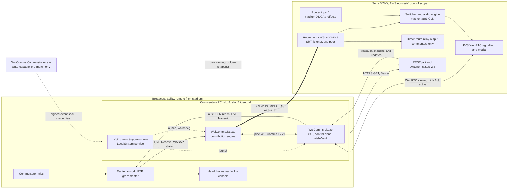
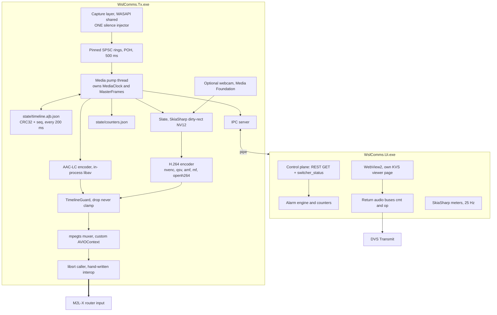

# WSL Commentary Contributor — Windows Application Specification

**Client:** WSL Studios × Sony · **Target:** Sony M2L-X cloud switcher · **Status:** for review

Evidence tags: **[E]** measured on the client dev instance · **[C]** from the M2L-X bundle · **[U]** unverified, fallback and settling test stated.

---

## 1. Purpose and scope

### 1.1 What the application is

**WSL Commentary Contributor** is a Windows 11 22H2+ x64 desktop application installed on a dedicated PC at a broadcast facility remote from the stadium. It does four things and nothing else:

1. Captures commentary audio from a Dante network through Dante Virtual Soundcard (WASAPI shared-mode capture of the `DVS Receive` endpoints).
2. Encodes it as H.264 High@4.2 1080p50 over a generated slate plus AAC-LC 48 kHz stereo, MPEG-TS, and delivers it to a Sony M2L-X cloud switcher as an **SRT caller** into a pre-provisioned router input (`WSL-COMMS` on slot A, `WSL-COMMS-B` on slot B). A router input requires video; the slate is therefore an architectural requirement, not decoration. An optional webcam may replace it.
3. Displays the M2L-X programme output and delivers the commentator's effects return, both from the same AWS Kinesis Video Streams WebRTC monitor session (video = the 2240×1440 multiviewer mosaic, cropped to the PGM tile; return audio = mid 2, the aux1/CLN bus, which is inherently N−1).
4. Reports the health of its own contribution — feed state, dropout seconds, flap rate, format as detected by the switcher, routing state — with an alarm vocabulary that never confuses a monitor fault with a contribution fault.

**Users.** The *commentary operator / facility engineer* arms the machine, watches health, and evicts a wedged slot. The *commentator* uses only the picture, the return level and the cough/cut. *WSL operations* act remotely through `wslcomms-admin` (diagnostics, eviction, updates outside the match window). The gallery vision-mixer operator is **not** a user of this application.

### 1.2 What the application does not do

| Excluded | Statement |
|---|---|
| Switcher control | The match-day credential is read-only. No routing, fader, mute, output or input configuration write exists in the app. The `switcher_controller` WebSocket is never opened; five layered mechanisms enforce this (§7.x). |
| Provisioning | No input, output, passphrase, latency or format is ever created or edited by the app. `MESSAGE.9301` handling belongs to the commissioning tool, not here. |
| Audio processing | Bit-transparent apart from one cough/cut mute with a 10 ms raised-cosine fade. No gain trim, EQ, AGC, limiting or auto-levelling. Gain structure is the facility console's job. |
| Failover arbitration | Slots A and B both transmit continuously and never talk to each other. Selection between them is a downstream, human decision (cloud-side, out of scope). |
| Cloud infrastructure | MediaLive, MediaConnect, relay topology, NDI/external-mixer mode and the AWS delivery architecture are decided elsewhere and are out of scope. |
| On-air proof | **There is no in-app proof that commentary is audible on the broadcast output.** Output status reads `online` regardless of source health; `advanced_audio_mixer /levels` is pre-mute; the `tally` node's contents are unread. In the discrete-track architecture (commentary routed to no bus) even the manual PGM/CLN compare is structurally impossible. This is stated to the operator, not papered over. |
| Automatic update | No background updater, no scheduled check. Updates run only when a human invokes them, and the supervisor holds an update lock across the match window. |

### 1.3 Strictly additive — stated numerically

The overriding requirement is that programme transmission is completely unaffected by this app, this machine, or this site's connection. Architecturally this is settled: commentary occupies **its own router input and its own direct-route relay output**, isolated from the effects/programme path inside M2L-X. The app is never on the critical path of programme.

What happens when the app, the PC or the link dies — all measured on the client's dev instance:

- The M2L-X commentary input goes `stopped` in **1.31–1.47 s**, identically for a process kill, a graceful quit and a network blackhole (n ≥ 8).
- The programme/effects path is unchanged. During the outage the commentary output emits **nothing** — no black, no silence, no frozen frame.
- The **downstream SRT session is never torn down**: it held `ESTABLISHED` across source outages of 2, 5, 10, 45, 76.8 and 93 s. Behaviour beyond 93 s is untested and is settled by soak S-3 (15-minute absence) before design freeze.
- Recovery is **automatic and requires no API call**: `starting` at +1.73 s, `streaming` at +1.89 s, downstream media at +2.41 s after the source returns.
- The app must do the reconnecting: on total network loss libsrt declares the peer dead at ~5.27 s and exits, and M2L-X never recovers this by itself. An M2L-X listener may refuse re-accept for up to ~5 s after an abrupt disconnect (0 s in 4 of 6 trials, ~5 s in 2 of 6), so reconnect backoff is ≥ 6 s with a 6 s I/O-error tolerance before any alarm.
- Each SRT listener serves exactly one peer; a second caller is rejected and the incumbent is never displaced. A wedged-but-alive machine therefore holds the slot — which is why a second input and a hot spare exist, and why TX self-terminates on a wedge to free the slot.

The practical consequence for an operator: **the worst thing this application can do to the broadcast is stop contributing commentary.** It cannot take programme off air, cannot alter the effects feed, and cannot change any switcher configuration.

### 1.4 The separate commissioning tool

`WslComms.Commissioner.exe` is a distinct application, holding the write-capable credential, run before match day and never during a live half except as documented break-glass. Everything that writes lives there:

- Creating and format-pinning both router inputs and both direct-route output pairs; setting SRT latency, passphrase and `pbkeylen`.
- Producing the **signed event pack** (ECDSA P-256, public key pinned in the MSI): endpoints, per-slot `latencyMs` (the app never computes latency), `statusNodeKey` (e.g. `cam7` — the app never derives it by name matching), `selectedSlot`, `kickoffUtc`, `requiredAppVersion`, `monitorTrackMap`, `goldenMixerSha256`, and the allow-list of object ids the tool itself may write.
- Installing credentials through the supervisor-mediated path (§3.3) and verifying them.
- Capturing the golden mixer snapshot; calibrating the multiviewer tile layout (this is the only place Mode B — hosting Sony's page — survives); running the return-delay click test; asserting the Dante subscription map so return channels can never re-enter the capture set.
- Break-glass stop of the commentary input, interleaving `GET /api/output/list` immediately before every write and treating HTTP 400 / `MESSAGE.9301` as an idempotent retry.

---

## 2. System context



| # | Interface | Direction | Protocol / endpoint | Authentication | Owner | If unavailable |
|---|---|---|---|---|---|---|
| 1 | M2L-X REST control plane | App → M2L-X | HTTPS `/api`, **GET only** plus `POST /api/local_auth/signin` and `/refresh_token` (body field is `alias`, not `username`) | Opaque ~1088-byte Bearer token, `expires_in` 86399 s | Ui | `MON-REST`. Telemetry cross-check lost, arming blocked. **Contribution unaffected** — TX has no `HttpClient` and no reference to the control-plane assembly. |
| 2 | `switcher_status` WebSocket | M2L-X → App (push-only) | `wss://<host>/api/v1/switcher_status?access_token=<percent-encoded>`; one snapshot then updates; client frames ignored | Token in the URL; expired → HTTP 401 `Token rejected` on upgrade. Rotation forces make-before-break socket rebuild | Ui | `MON-STALE` / `MON-WS-DOWN`. All WS-derived state becomes `Unknown` and renders grey with an age — never green. Contribution unaffected. |
| 3 | SRT contribution egress | App → M2L-X | `srt://<host>:<port>` caller (listener is `reverse=false`), MPEG-TS, `payloadsize` 1316, `MAXBW` 500000 B/s from the signed pack | AES-128 (`pbkeylen` 16), passphrase from Credential Manager | Tx | **This is the product.** Input `stopped` in 1.31–1.47 s; automatic recovery at +2.41 s once the source returns; unbounded flat jittered reconnect (6.5 s ± 1.5 s, then 15 s, then 30 s). Programme unaffected. |
| 4 | KVS WebRTC control plane | App → M2L-X, then AWS | HTTPS: `webrtc_info` / `webrtc_token` **[UNVERIFIED — week-1 test]**, then Cognito `GetCredentialsForIdentity`, `DescribeSignalingChannel`, `GetSignalingChannelEndpoint`, `GetIceServerConfig` | M2L-X Bearer, then short-lived Cognito credentials | Ui (.NET, never the renderer) | Monitor cannot start; `MONITOR: SIGNED OUT`. Established media survives credential expiry. Contribution unaffected. |
| 5 | KVS WebRTC media | Bidirectional | SigV4 WSS signalling + DTLS-SRTP; 8 transceivers offered, **only mids 1–2 subscribed** (master/PGM, aux1/CLN), mids 3–7 `inactive`, `b=AS:1500`; Opus 48 kHz discrete stereo, 20 ms ptime | Cognito credentials; app-chosen `ClientId` | Ui / WebView2 (own local page, Mode A) | Picture and **commentator return audio** lost. Blue-grey `MONITOR UNAVAILABLE` in-pane only; never red, never audible, never in the contribution banner. An independent facility effects return is a commissioning prerequisite. |
| 6 | Dante capture | Dante → App | WASAPI shared, event-driven, `AUDCLNT_STREAMOPTIONS_RAW`, one `IAudioClient` per stereo endpoint, 48 kHz asserted at open | None | Tx | Capture layer synthesises silence, `MasterFrames` keeps advancing, **SRT never stops**, hot-attach polls every 1 s indefinitely. `NO MIC AUDIO` driven by `captureOk`/`silenceInjected`, not by meter values. |
| 7 | Dante return render | App → Dante | `AudioContext({sinkId})` / `setSinkId` in WebView2 to a `DVS Transmit` endpoint; NAudio `WasapiOut` fallback | None | Ui | Commentator has no ears from the app. Alarms as a MONITORING-class fault with the CLN fader / aux1 routing named as likely causes. Contribution unaffected. |
| 8 | Peer-machine status | App ↔ App | HTTP GET `http://<peer>:47311/status` (Kestrel, loopback by default, LAN-bindable by config) | None; LAN-scoped | Ui | `SPARE: UNREACHABLE` tile. The spare's audio health becomes invisible; S-6 asserts it surfaces on the primary within 10 s. |
| 9 | Admin channel | WSL ops → Supervisor | WinRM/HTTPS 5986 → `\\.\pipe\WSLComms.Admin.v1` | Per-facility admin credential, held by WSL operations | Supervisor | Remote eviction, credential install and update control unavailable; local 3 s-hold stop and the power path remain. |
| 10 | Host time | NTP → OS | w32time against a facility source, configured at commissioning | — | OS | Timeline rebase falls back to the monotonic term; the UTC hint is bounded by `clamp(elapsed, 2 s, 4 h)` and a clock step > 5 s alarms. Never a backwards PTS. |

---

## 3. Architecture

### 3.1 Process model

| Binary | Session / identity | Owns |
|---|---|---|
| `WslComms.Supervisor.exe` | Session 0 service `WSLCommsSupervisor`, LocalSystem | Lifecycle, restart policy, crash-loop protection, wedge detection, update lock, admin pipe, creation of the `Global\` kernel objects with an explicit DACL |
| `WslComms.Tx.exe` | Interactive auto-logon session, `.\wsl-comms` (standard user) | **The entire contribution path**: DVS capture, `MediaClock`, slate/webcam, encode, mux, libsrt caller, counters, IPC server. Opens exactly one outbound socket. |
| `WslComms.Ui.exe` | Same session and account | WPF shell, WebView2 monitor and return audio, meters, alarm engine, **and the whole M2L-X control plane** |
| `WslComms.Commissioner.exe` | Operated separately, write-capable credential | §1.4 |
| `wslcomms-admin.exe` | WSL ops | Evict / release, credential install and verify, event-pack push, update, rollback, diagnostics |

**Why the engine is split from the GUI.** A WebView2/GPU fault, a Chromium OOM or an unhandled WPF dispatcher exception must not be able to flap the M2L-X input — the measured cost of that fault class is a 1.31–1.47 s input drop plus up to ~5 s of listener re-accept refusal plus ≥ 6 s backoff. **Why the control plane is in the UI.** TX holds no bearer token, parses no WebSocket frame and has no `HttpClient`; token expiry, a 403, WS staleness or a JSON parse fault therefore cannot reach the audio path. `ArchitectureTests.TxHasNoControlPlaneReference` fails the build if that reference appears. Audio never crosses the IPC: the UI opens its **own second shared-mode WASAPI capture** for direct mic monitoring — shared mode permits this, which is one reason it was chosen.

Single data root, created by the MSI with an explicit DACL (LocalSystem + Administrators full; `.\wsl-comms` read-only on `config\`, read-write on `state\`, `logs\`, `run\`): `%ProgramData%\WSLStudios\Comms\`. Startup asserts the ACL and refuses to write timeline state if it does not match.



**Media path in one line:** DVS → pinned ring → media pump (`MediaClock`, `MasterFrames`) → AAC-LC and slate/H.264 → `TimelineGuard` → `mpegts` muxer → custom `AVIOContext` → 1316-byte staging → libsrt caller. In-process libav only; `FFmpeg.AutoGen` is deleted (LGPL-3.0) and ~55 entry points plus all libsrt interop are hand-written in `WslComms.Media.Interop`. Encryption is mbedTLS; `libcrypto-3-x64.dll` is neither shipped nor signed.

**Timeline, one owner.** The media pump thread owns `MediaClock`. Audio publishes into it, video derives from it: video frame *n* is emitted at the boundary `(n+1) × 960` samples. `MasterFrames` advances on real **or** synthesised frames and never stalls. Persistence is `state\timeline.{a,b}.json`, double-buffered with CRC32 and a sequence number, written every 200 ms, one schema. Resume is `T0 = highWater90k + clamp(elapsed, 2 s, 4 h) × 90000`. On total anchor loss: a new `sessionId` starting at 900000, a mandatory 12 s SRT quarantine, and a latched CRITICAL alarm. The internal timeline is 64-bit and masked to 33 bits only at the muxer; nothing ever prompts mid-match. `TimelineGuard` **drops** a bad sample, never clamps, raises CRITICAL and rebases forward under control.

### 3.2 IPC contract

One contract assembly, `WslComms.Ipc.Contracts`, consumed by both sides so the message set cannot drift. Pipe `\\.\pipe\WSLComms.Tx.v1`, message mode, TX is the server (UI restarts are free); DACL grants LocalSystem full and the `.\wsl-comms` SID read/write, nothing else. Framing is a 4-byte little-endian length prefix (max 64 KiB) plus **MessagePack 3.1.x** with the built-in source generator; a CI test serialises every contract type with the dynamic resolver disabled.

TX → UI: `Hello`, `EngineState` (10 Hz — carries `state`, `armed`, `captureOk`, `silenceInjected`, `coughLatched`, `silenceDurationMs`, `avSkewMs`, `contributionPressure`, `Counters`), `Meters` (25 Hz, cosmetic), `LinkStats` (2 Hz), `TimelineTick` (1 Hz), `LogEvent`, `Ack`. UI → TX, the complete set: `SetCough{on}`, `SetChannelMute{index,on}`, `SetSlateMode`, `RequestReconnect{}`, `RequestDiagnostics{}`, `Ping{seq}`. No command changes codec, format, endpoint, passphrase, latency or any M2L-X configuration.

Two rules that make the contract safe rather than merely typed:

- **Any value that drives an alarm or a banner is computed in TX and carried losslessly on `EngineState`.** `Meters` uses a bounded channel with `DropOldest` and is decoration only; silence duration, clip counts and `contributionPressure` (with its hysteresis and 60 s recovery) are TX-side scalars. A hung UI loses telemetry, never applies backpressure to the media path.
- **Interlocks live in TX, not in the disposable process.** `RequestReconnect` is rejected with `Ack{accepted:false, reasonCode:"IPC-011 socket healthy"}` unless the socket has been non-`CONNECTED` for ≥ 6000 ms on TX's own monotonic clock. `SetCough` is a **lease**: a non-latched cut auto-releases if no refresh arrives within 500 ms, so a dead UI restores audio rather than muting the match; a latched cut persists and sets `coughLatched`, which drives its own banner state and relabels `CONTRIB-PATHMISMATCH`.

### 3.3 Supervisor policy

Children run in a job object created **without** `JOB_OBJECT_LIMIT_KILL_ON_JOB_CLOSE`, launched into the interactive session via `WTSQueryUserToken` + `CreateProcessAsUser`. On supervisor restart, TX is re-adopted from `run\tx.pid` plus a `Ping` probe, never duplicated. Because `.\wsl-comms` lacks `SeCreateGlobalPrivilege`, the **supervisor** creates `Global\WSLComms.Tx.Heartbeat` (MMF) and `Global\WSLComms.Tx.Singleton` (mutex) with a DACL granting that SID access; TX *opens* them and asserts at startup, failing loudly if it cannot — a silently absent wedge detector is worse than none.

Exit codes: `0` operator stop (no restart, but the supervisor re-arms after 120 s unless `run\evicted.flag` is present); `10` configuration invalid; `12` event-pack signature invalid; `20` unhandled exception; `21` watchdog self-terminate. **Code 11 and `--no-capture` are deleted** — a capture failure never exits the process. Crash-loop protection is a 5-starts-per-120 s token bucket, then 15 → 30 → 60 s backoff, never giving up. Configuration or pack validation failure starts TX in `NotConfigured` rather than exiting.

**Wedge detection is two-stage.** The media pump writes `{qpcTicks, framesSent}` into the heartbeat MMF at 10 Hz. At **3 s** stale the supervisor alarms and TX attempts in-process recovery (silence generator, fallback GOP). Only at **8 s** stale, with `framesSent` flat, does the supervisor `TerminateProcess` **first** and capture the dump **second**, so the single-peer listener slot is freed within the measured window rather than after a full-memory flush on the storage that may itself be the fault.

### 3.4 Threading and real-time discipline in TX

Process class `HIGH_PRIORITY_CLASS` (not realtime), `timeBeginPeriod(1)`.

| Thread | Priority | Job |
|---|---|---|
| Capture, one per DVS stereo endpoint | MMCSS "Pro Audio", `AVRT_PRIORITY_CRITICAL` | Wait event → `GetBuffer` → copy into a pinned SPSC ring → `ReleaseBuffer`. Nothing else. |
| Media pump (single) | MMCSS "Pro Audio", critical | Sole owner of `MediaClock`/`MasterFrames`; assembles 1024-sample AAC frames; emits a video frame per 960 samples; stamps PTS/DTS; writes the heartbeat |
| Encoder | AboveNormal | AAC-LC + H.264, bounded 32-slot queue |
| Mux + SRT send | AboveNormal | `av_write_frame` from a 2-element DTS-ordered queue (max 200 ms A/V skew, `avSkewMs` published, alarm at 300 ms), `srt_sendmsg2`. All blocking calls live here |
| SRT connect/supervise | Normal | `srt_connect`, backoff, teardown, `srt_bstats` |
| Telemetry/IPC | Normal | MessagePack, pipe writes, logging, counter persistence |

**Never on the capture or pump threads:** allocation of any kind, `lock`/`Monitor` shared with non-RT threads, `async`/`await`, LINQ, string formatting or `ToString()`, logging or any file/registry/WMI/COM call, `DateTime.UtcNow` (QPC only), or exception throwing in steady state — device errors set a flag consumed by a supervising thread.

**Memory.** Workstation concurrent GC (Server GC rejected: per-core heaps and GC threads contend with MMCSS on a small venue PC), `SustainedLowLatency`, never `TryStartNoGCRegion`. Ring buffers are allocated once with `GC.AllocateArray<float>(n, pinned: true)` and land on the **pinned object heap (POH)**, not the LOH — that distinction is what makes a lifetime pinned allocation safe. A fixed pool of 64 × 8 KiB pinned blocks serves TS packets and encoder output and **drops on exhaustion** rather than allocating; `ArrayPool<byte>.Shared` is used only on the non-RT threads. A 3 s warm-up on synthetic silence runs before the SRT socket opens. Soak gates: pump iteration > 5 ms zero times in 4 hours, allocation < 50 kB/s, Gen2 ≤ 4/h, POH size flat, RSS growth < 20 MB / 4 h.

**Counters survive the UI.** TX persists `outageSeconds`, `flapCount`, `longestOutageMs`, `reconnectCount` and `pktSndDropTotal`-derived loss to `state\counters.json` and publishes them on `EngineState`; the UI persists its M2L-X-derived counters likewise and displays the **element-wise max** of the two. A UI restart mid-match changes no displayed figure.

## 4. Audio capture and clocking

### 4.1 Capture API

**Decision: WASAPI, shared mode, event-driven, `AUDCLNT_STREAMOPTIONS_RAW`, one `IAudioClient` per DVS stereo endpoint, 48 kHz asserted at open.** Shared mode cannot be refused or evicted by another shared client, coexists with the UI process's own capture (§4.9, §6.9), and uniquely exposes `u64DevicePosition`/`u64QPCPosition`, on which every clock decision below rests. The shared-mode resample hazard is removed by asserting the mix format, not by taking the device exclusively.

Rejected: **WASAPI exclusive** (fails `AUDCLNT_E_DEVICE_IN_USE` 0x8889000A, depends on untested DVS exclusive-format negotiation, blocks parallel taps, buys only latency that a ~1 s end-to-end path does not need); **DirectShow/`dshow`** (no device position, no QPC correlation, no discontinuity flags, silent resampling); **PortAudio/CSCore** (hide `DevicePosition`; CSCore unmaintained since 2017).

**Open sequence per endpoint.** `IMMDeviceEnumerator::GetDevice(id)` → `Activate(IID_IAudioClient3)` → `GetMixFormat` → **require `nSamplesPerSec == 48000 && nChannels == 2`** → `IAudioClient2::SetClientProperties(AudioCategory_Media, AUDCLNT_STREAMOPTIONS_RAW)` → `Initialize(AUDCLNT_SHAREMODE_SHARED, AUDCLNT_STREAMFLAGS_EVENTCALLBACK, hnsBufferDuration: 0, 0, mixFormat, null)`. `hnsBufferDuration: 0` is mandatory in shared event-driven mode and yields the default ~10 ms period; `IAudioClient3::InitializeSharedAudioStream` is **not** used — stability beats latency here.

A format mismatch is a named configuration fault, never a silent resample, and the message names the **Windows Sound control panel**, which is where the shared-mode format actually lives:

> `Windows is set to {actual} for "{endpointName}". Open Sound Control Panel → Recording → that device → Properties → Advanced and set 2 channel, 24 bit, 48000 Hz.`

**Threading.** One dedicated capture thread per endpoint, `AvSetMmThreadCharacteristicsW("Pro Audio")` + `AvSetMmThreadPriority(AVRT_PRIORITY_CRITICAL)`. `WaitForSingleObject(hEvent, 2000)`; a timeout is a fault, not a retry. No allocation, no `lock`, no `async`, no LINQ, no `string`, no logging, no `DateTime.UtcNow` on this thread — enum fault codes go into a fixed 256-entry struct ring drained by the telemetry thread. Rings are allocated once with `GC.AllocateArray<float>(n, pinned: true)`, which places them on the **POH** (not the LOH — that distinction is what makes a permanently pinned buffer safe); soak asserts `poh-size` flat.

**Libraries (pinned centrally in `Directory.Packages.props`, `ManagePackageVersionsCentrally=true`):**

| Component | Version | Licence | Role |
|---|---|---|---|
| .NET | 8.0 (`net8.0-windows10.0.19041.0`) | MIT | Self-contained win-x64, R2R |
| `Microsoft.Windows.CsWin32` | 0.3.106 | MIT | Source-generated interop for `IMMDeviceEnumerator`, `IMMNotificationClient`, `IAudioClient/2/3`, `IAudioCaptureClient`, `IAudioSessionEvents`, `avrt.dll` |
| `NAudio` | 2.2.1 | MIT | Enumeration for the pickers, `WaveFileWriter`, non-realtime resampling only |
| `libsamplerate` | 0.2.2 (`samplerate.dll`, x64) | BSD-2-Clause | ASRC, built but bypassed (§4.4). ~120 lines of hand-written P/Invoke |

`NAudio.CoreAudioApi.WasapiCapture` is **not** used for capture: its `GetBuffer` wrapper discards `devicePosition` and `qpcPosition`, which are load-bearing. libsamplerate has been BSD-2-Clause since 0.1.9 (2016); libsoxr (LGPL-2.1) is rejected for a relink obligation at zero technical gain.

### 4.2 ASIO — the licensing position, plainly

**v1 ships no ASIO.** The Steinberg ASIO SDK is not open source and not redistributable: it requires a licensing agreement executed **by the legal entity that ships the product**, forbids redistribution of SDK sources or headers, and mandates the trademark acknowledgement. The obligation cannot be laundered through a wrapper — `NAudio.Asio` reimplements the `IASIO` vtable and struct layouts derived from the SDK; PortAudio and JUCE both refuse to ship the SDK for exactly this reason. BASSASIO adds a second commercial licence on top. DVS additionally selects **either** ASIO **or** WDM as its audio interface, so ASIO removes the WASAPI endpoints entirely: it is a one-way commissioning decision, not a runtime fallback.

Capture sits behind `ICommentaryCaptureSource` so an ASIO backend is a later drop-in. **Start the Steinberg paperwork in week 1 regardless** — it costs nothing and it is the schedule dependency if the cross-endpoint alignment test (§4.10) fails.

### 4.3 Channel mapping and `DeviceNameMatcher`

**Default and fully validated configuration is one stereo pair.** Up to 4 stereo AAC tracks (8 channels, 4 endpoints) is tested; the schema reaches 8 tracks / 16 channels (`MaxProgrammeTracks = 8`), matching the measured relay capability. Each track carries an ISO 639-2 language tag.

Mapping lives in `config\capture-profile.json` under the single data root `%ProgramData%\WSLStudios\Comms\`: per track an index, name, language, `layout`, and two `legs`, each `{endpointId, endpointName, endpointChannel, label}`. The only transforms are `monoToBoth` and `swapLegs`, applied by index copy — never by a gain stage.

**`DeviceNameMatcher` — one class, one assembly (`WslComms.Audio.Devices`), serving capture *and* render.** There are **no DVS device-name string literals anywhere in the product**: not in source, not in config defaults, not in spec text, not in test data outside the matcher's fixtures.

```csharp
public static class DeviceNameMatcher {
    public static string Normalise(string name);              // trim, collapse all \s+ runs to one space, ToUpperInvariant
    public static bool   Matches(string a, string b);         // ordinal on Normalise(a) vs Normalise(b)
    public static bool   TryParseDvsPair(string name, out DvsPair p); // ^DVS (RECEIVE|TRANSMIT) (\d{1,2})-(\d{1,2})\b
    public static MatchResult Resolve(IReadOnlyList<EndpointInfo> present, LegRef want);
}
```

`Resolve` ladder: exact `endpointId` → exact `endpointName` → normalised `endpointName` → configured secondary endpoint. A level-3 hit is logged `CAP-031` and shown in the UI as a warning (it means DVS was reinstalled or its channel count changed). Fixtures cover both the one-space and the **two-space** single-digit forms, in both Receive and Transmit directions, so the return-audio sink resolution (§6.9) uses the same code path as capture and cannot drift from it.

WASAPI knows the WDM endpoint name and nothing about the Dante transmitter. The UI therefore shows the endpoint string verbatim in a monospace face (the double space is visible), the L/R leg, an operator free-text label, and an optional pasted Dante label — and never claims to know the subscription.

### 4.4 The clock

**The selected capture device's sample clock is the app's sole master. Nothing runs on wall time.** Audio PTS derive from `MasterFrames`; video frame *n* is emitted at the `(n+1) × 960` boundary; PCR derives from the same counter. Inside one clock domain there is nothing to correct, and a resampler on the primary path would manufacture the drift it claims to remove.

Three boundaries where a second clock intrudes: the QPC-clocked silence generator (§4.8); the optional webcam, whose frames are **pulled** by the audio-derived timeline (§5); and mixed-domain channel selection, which v1 **forbids** — every leg of every track must share one `ClockDomainId`.

**Quantified drift.** DVS's endpoints follow the Dante PTP grandmaster; QPC follows an undisciplined host oscillator (QPC is not NTP-disciplined). The relevant quantity is |ε_dante − ε_qpc|, plausibly 10–40 ppm and up to ~100 ppm. At 48 kHz, **1 ppm = 0.048 samples/s = 172.8 samples/hour = 3.6 ms/hour**:

| Offset | samples/h | ms/h | Skew over a 2 h match |
|---|---|---|---|
| 1 ppm | 173 | 3.6 | 7.2 ms |
| 10 ppm | 1 728 | 36 | 72 ms |
| 25 ppm | 4 320 | 90 | 180 ms |
| 50 ppm | 8 640 | 180 | 360 ms |
| 100 ppm | 17 280 | 360 | 720 ms |

**Estimation (always running, whether or not correction is applied).** Every packet yields `(DevicePosition Dᵢ, QpcPosition Qᵢ)`. Decimate to 1 Hz, keeping the lowest-jitter pair per second.

- **Short:** OLS slope over a rolling **60 s** window. ≈ ±20 ppm resolution — a fault detector, not a correction input. `|ppm| > 200` sustained 30 s ⇒ alarm `CAP-040 clock domain implausible` (wrong device, DVS unlocked, or broken host timer).
- **Long:** RLS, forgetting factor **λ = 0.999**, **600 s** window. ≈ ±2 ppm. This is the reported value and the feed-forward term.
- Both reject samples flagged `AUDCLNT_BUFFERFLAGS_TIMESTAMP_ERROR`, and **reset** (not merely skip) on any device reopen or on a `DevicePosition` step > 100 ms unexplained by a discontinuity flag — a grandmaster election steps the clock, and a step must never be read as a rate.

**The ASRC is built, wired, instrumented and held bypassed at ratio exactly 1.0 — the resampler object is not instantiated.** The one residual risk is M2L-X's SRT ingest buffer over a multi-hour Dante-clocked source: unmeasured (all measured sessions ≤ 93 s), and 360 ms of skew at 50 ppm over 2 h is comparable to the latency budget. Keeping the ASRC bypassed makes that a config flag rather than a redesign; the 4-hour soak decides (§10).

**Control loop, when enabled.** `libsamplerate` `SRC_SINC_MEDIUM_QUALITY`, per-channel state, `src_process` with `src_ratio` set per call. The controlled variable is elastic-buffer occupancy, not the ppm estimate; ppm is feed-forward only. Buffer 200 ms, setpoint 100 ms.

```
e            = fillMs − 100
ratio_target = 1 + ppm600·1e−6 + Kp·e + Ki·∫e dt
Kp = 1.0e−6 /ms      Ki = 2.0e−9 /(ms·s)
deadband ±2 ms · slew limit 5 ppm/s · hard clamp ±300 ppm
```

Outside the clamp: disable the ASRC, revert to 1.0, alarm. The applied ratio in ppm is displayed on the health panel whenever non-zero — a silently active resampler is not acceptable in a contribution path.

**Logged.** UI update every 60 s; one JSONL record every 300 s and on every ratio change, clamp or deadband exit:
`{ts, session, ppm60, ppm600, ratioAppliedPpm, bufferFillMs, framesDelivered, framesSynthesised, framesInsertedForGaps, discontinuities, devicePosGaps, silentBlocks, timestampErrors}`.

### 4.5 Timestamping — publishing into `MediaClock`

`MediaClock` is owned by the **media pump thread** in `WslComms.Tx.exe` and is the sole source of every timestamp in the process. The capture layer does not own it; it **publishes into it**.

```csharp
// capture → pump, called once per delivered or synthesised block, on the pump thread
long MediaClock.PublishAudio(ReadOnlySpan<float> interleaved, int frames, CaptureBlockFlags flags);
long MediaClock.MasterFrames  { get; }   // 64-bit, 48 kHz, monotonic, never reset while the process lives
long MediaClock.Epoch90k      { get; }
long MediaClock.AudioPts90k(long aacFrameIndex);   // Epoch90k + aacFrameIndex * 1920
long MediaClock.VideoPts90k(long videoFrameIndex); // Epoch90k + videoFrameIndex * 1800
```

**`MasterFrames` advances on real *or* synthesised frames and never stalls while the process lives.** This is the contract that makes a Dante failure a silent-but-flowing stream rather than a stalled pipeline. The muxer-side silent-frame injector exists only as a last-resort assertion: if it ever fires, the capture contract has been broken, and it raises `CAP-099` CRITICAL.

**Exact integer arithmetic, no floating point.** 90000/48000 = 15/8; AAC-LC frames are always 1024 samples, so `pts90k += 1920` per audio frame and `Epoch90k + (MasterFrames × 15) / 8` is exact at every AAC boundary. Video frame *n* is emitted at the `(n+1) × 960` boundary, i.e. once its full 20 ms of audio exists. Unit test: the first video PTS and the first audio PTS both equal `Epoch90k`.

**Gap accounting.** Per block, `expected = lastDevicePosition + lastFrames`. If `DevicePosition > expected`, the driver dropped `G = DevicePosition − expected` frames (normally with `AUDCLNT_BUFFERFLAGS_DATA_DISCONTINUITY`). Insert exactly `G` frames of digital silence *before* the block and advance `MasterFrames` by `G`, so media time keeps tracking device time and A/V lock is preserved. `G` is capped at 10 s; beyond that, treat as a device restart, reset the device-position baseline and enter the §4.8 fallback. Every insertion is logged with its frame count. If `DevicePosition` proves unreliable on real DVS, a QPC-delta estimator with a fractional-frame residual accumulator is selected by a config flag set from the week-1 lab test — never auto-detected.

**Restart survival** is `MediaClock`'s: `state\timeline.{a,b}.json`, double-buffered, CRC32 + sequence number, 200 ms; `T0 = highWater90k + clamp(elapsed, 2 s, 4 h) × 90000`. The capture layer's only obligations are (a) never to reset `MasterFrames`, (b) to publish `framesSynthesised` so the anchor's provenance is auditable, and (c) to report a failed anchor write as CONTRIBUTION-class, since it silently degrades the restart guarantee.

### 4.6 Metering

**Standards:** ITU-R BS.1770-4 (true peak, loudness), IEC 60268-10 Type IIb / EBU (ballistics), EBU R68 (scale).

All meter mathematics is computed **in TX**. Scalars that drive an alarm or a banner (`peakDbfs`, `truePeakDbtp`, `clipCount`, `silenceDurationMs`, `lufsS`) are published losslessly in `EngineState`; the 25 Hz `Meters` stream is lossy decoration and no alarm is ever reconstructed from it.

- **Sample peak** `max|x|` per block, dBFS.
- **True peak (dBTP)** BS.1770-4 Annex 2: attenuate 12.04 dB, 4× polyphase 48-tap FIR (the Recommendation's coefficients), peak the oversampled signal, restore 12.04 dB. Required — AAC-LC overshoots and no limiter is armed anywhere.
- **Ballistics** Type IIb: 10 ms integration, fallback 20 dB in 1.7 s (11.8 dB/s). Type IIa (24 dB in 2.8 s) selectable per facility. **Peak hold** 1.5 s then decay at the fallback rate; a separate session-max marker holds until operator reset.
- **Scale** −60…0 dBFS, alignment **−18 dBFS**, permitted maximum **−9 dBFS**; amber above −9 dBTP, red above −1 dBTP.
- **Clip** latches on any true peak ≥ 0.0 dBTP **or** ≥ 3 consecutive samples ≥ −0.1 dBFS, with timestamp and count, cleared only by the operator.
- **Loudness** momentary (400 ms/100 ms hop), short-term (3 s), gated integrated per session. Guidance band −23 LUFS-S ±3, configurable. **No auto-gain, ever.**
- **Correlation** per pair: ≥ 0.999 for 30 s ⇒ "dual mono?" advisory; ≤ −0.5 for 10 s ⇒ out-of-phase warning.

**Two meters, both displayed, both labelled: SOURCE (pre-cut) and SENT (post-cut, computed on the exact buffer handed to the encoder).** This is the direct lesson from M2L-X's `/levels`, which is pre-mute and read −28.7 dBFS on a muted strip: a meter that does not state its tap point is a lie waiting to happen.

**Processing policy.** The path is bit-transparent except for one permitted operation: the **cough/cut**, applied in the capture layer with a 10 ms raised-cosine fade, between the SOURCE and SENT taps. No gain, no EQ, no AGC, no limiter — gain structure is the facility console's job. Momentary cut is held by a refreshed lease: if refreshes stop, the capture layer restores audio within 500 ms, so a dead UI can never leave the microphone cut. A latched cut persists and is published as its own state (`coughLatched`) with elapsed time, so it can never be presented as "audio not arriving".

### 4.7 Silence and fault detectors

Football commentary is legitimately silent for long stretches, so one threshold-and-timer either false-alarms continuously or misses a dead mic. Four detectors, **all timers on the host monotonic clock (QPC)** — a sample-count timer stops when the device stops, which is precisely the failure it exists to catch. (DSP integration windows use the sample counter; alarm timers use QPC. This split is a rule.)

| Detector | Condition | Duration | Published cause |
|---|---|---|---|
| Digital zero | every sample exactly 0.0 | 2.0 s | `NoSignal` — Dante channel not subscribed. Cannot occur on a live mic path |
| Below floor | true peak < **−60 dBFS** (configurable −50…−70) | **10.0 s** | `BelowFloor` — mic path dead or muted at source |
| No speech | no sample above −40 dBFS | 120 s | `NoSpeech` — **advisory only**, with a one-click "expected quiet" suppress |
| Stuck sample | identical non-zero value > 4 800 samples (100 ms) | — | `StuckSample` — driver or DVS stall |

Plus DC offset: `|mean| > 0.001 FS` over 10 s ⇒ warn.

**There is exactly one below-floor threshold pair, −60 dBFS / 10 000 ms, and it is stated here.** The capture layer publishes `silenceDurationMs` and `silenceCause` continuously in `EngineState`; the UI renders that running figure and the alarm engine consumes the same field. No other section re-derives silence from meter frames, and no other section states a different timer.

Cumulative silence seconds and switches-per-minute are maintained alongside the binary condition and persisted in `state\counters.json` at 1 Hz — a binary lamp hides exactly the 1–4 s dropout class that matters.

### 4.8 Device loss and hot-attach

**Detection.** `IMMNotificationClient::OnDeviceStateChanged` (`ACTIVE 0x1`, `DISABLED 0x2`, `NOTPRESENT 0x4`, `UNPLUGGED 0x8`), `OnDeviceRemoved`, `OnPropertyValueChanged`; `IAudioSessionEvents::OnSessionDisconnected` with `AudioSessionDisconnectReasonExclusiveModeOverride` (the one way a shared-mode stream can be evicted); loop HRESULTs `AUDCLNT_E_DEVICE_INVALIDATED` 0x88890004, `AUDCLNT_E_RESOURCES_INVALIDATED` 0x88890026, `AUDCLNT_E_SERVICE_NOT_RUNNING` 0x88890010, `AUDCLNT_E_DEVICE_IN_USE` 0x8889000A, `AUDCLNT_E_UNSUPPORTED_FORMAT` 0x88890008; and an event wait > 2 s with no data.

**Dante NIC loss is invisible to all of the above** — the DVS driver stays loaded and its endpoints stay `ACTIVE`, delivering zeros or stalling. It is inferred from the audio domain: digital-zero detector, `DevicePosition` stall against QPC, and the short drift estimator going implausible. Optionally the operator names the Dante NIC and the app watches `NetworkInterface.OperationalStatus` as an **advisory-only** lamp. Rejected: Audinate's Dante Control and Monitoring SDK — a second commercially licensed dependency for a signal we can infer.

**Recovery: capture failure NEVER exits the process.** There is no exit code 11 and no `--no-capture` flag; both are deleted. On any capture fault the layer switches immediately to the **silence generator** — digital silence at nominal 48 000 Hz clocked from QPC, advancing `MasterFrames` exactly as real audio would — so the SRT stream, the timeline and the video never stop. An M2L-X input flap costs 1.3–1.5 s minimum plus the risk of the ~5 s re-accept refusal; silence costs nothing and raises an alarm M2L-X could never generate. Over a 60 s outage at 20 ppm the QPC-clocked generator misplaces 58 samples (1.2 ms); the domain switch is logged with the synthesised frame count.

**Hot-attach polls every 1 s, indefinitely** — the same path on cold boot, on mid-match device loss, and after three consecutive open failures. Resolution uses the §4.3 ladder. Return to live audio is a plain splice: `MasterFrames` continues, no reset, no discontinuity. Attach logs `CAP-010 capture attached at +N s`.

**The banner is driven by `captureOk == false || silenceInjected == true`, not by meter values** — absence of capture must be louder than low level, not quieter, and with no device open there are no meter values at all.

**What the operator sees.** Green / amber (4 s debounce) / red, plus the age of the last good sample, cumulative silence seconds this session, and the switch count. Reasons in plain English: "Dante NIC link down", "DVS endpoint removed", "endpoint taken in exclusive mode by *process*", "audio service restarted". A red Dante lamp never implies the SRT feed has stopped, and the UI says so explicitly.

**Commissioning mitigation:** disable "Allow applications to take exclusive control of this device" on every DVS endpoint, recorded in the golden machine snapshot.

### 4.9 `Identify`

A full-window view showing all sixteen Dante receive channels as live meters, regardless of which are mapped: the operator talks into a mic and watches which channel lights. This is how mapping is confirmed without licensing Audinate's control API. Reachable in one click from the mapping screen and from the pre-match self-test.

**It runs in `WslComms.Ui.exe` on its own shared-mode capture clients**, using the same `DeviceNameMatcher` — consistent with the rule that no audio traverses the IPC, and it therefore cannot perturb the contribution path whatever it does.

Whether eight endpoints open reliably and simultaneously is unproven. **Fallback, shipped from day one: rotation** — two endpoints at a time, 1.5 s dwell, with a visible scan indicator and a "scanning 5-8 of 16" caption, so the page never claims simultaneity it does not have. Simultaneous mode is enabled by a config flag set from the week-1 test (§4.10 item 4).

### 4.10 Test

**Without Dante.** `SimulatedDanteSource : ICommentaryCaptureSource` generates 16 channels from WAV or synthesis and is the primary CI target. Deterministic, scriptable faults: an exact ppm offset applied to the emitted `DevicePosition`/`QpcPosition` relation; `DevicePosition` gaps with and without the discontinuity flag; a PTP-style clock **step**; digital zero per channel; stuck samples; DC offset; simulated `AUDCLNT_E_DEVICE_INVALIDATED`; endpoint disappearance and reappearance under a changed ID.

CI assertions: PTS strictly monotonic across 10 000 injected faults; `MasterFrames` advance equals real elapsed device frames within the injected gap total; ppm estimator converges to the injected offset within ±2 ppm over 600 s; ASRC settles fill to 100 ±2 ms with no excursion beyond the clamp; each detector fires on its own stimulus and no other; zero allocation in the steady capture loop (`GC.GetAllocatedBytesForCurrentThread()` delta = 0).

A virtual audio cable is useful as a WDM stand-in for UI work but is slaved to the host clock and **cannot test drift at all**. Nobody may present a green VB-Cable run as validation.

**Rig:** two PCs on an isolated gigabit switch, each with its own DVS licence (budget one for the match machine *and* one for the hot spare), plus a Dante AVIO analogue-input adapter (~£150) and Dante Controller to give a real PTP participant and a real grandmaster election.

**Must be validated on real hardware before design freeze:**

1. Endpoint enumeration with a live NIC — confirm eight stereo endpoints and the naming forms against `DeviceNameMatcher` fixtures.
2. **`u64DevicePosition`/`u64QPCPosition` validity and monotonicity across a `DATA_DISCONTINUITY`**, with deliberate CPU starvation. This single test gates the §4.5 gap-accounting design and selects the QPC-delta fallback flag.
3. Confirm DVS's "Audio Interface: WDM / ASIO" setting is mutually exclusive.
4. **Cross-endpoint alignment:** one tone to all 16 Dante channels; open **8** endpoints (not 4 — the `Identify` page needs eight) and cross-correlate. Require ≤ 1 sample offset after start alignment and zero drift over 4 h. Failure forces ASIO for >2-channel configurations and starts the Steinberg process that week; it also pins `Identify` to rotation mode.
5. Measured ppm between the Dante clock and host QPC **on the actual match hardware** — the number that sizes everything in §4.4.
6. NIC unplug/replug; DVS stop/start; PTP grandmaster failover — assert PTS never moves backwards and the 10 s gap cap does not fire in normal operation.
7. Exclusive-mode grab by a third-party app; recovery and operator message.
8. Behaviour under session lock and remote-access attach, since capture runs in an auto-logon interactive session.

The 4-hour soak with encoder restarts at T+90 and T+150 min, which is the only test that can expose the measured 21.3 s DTS regression and which also settles whether the ASRC must be enabled, is specified in §10 and is a release gate.

## 5. Video, encoding, muxing and SRT egress

Scope: everything between "PCM frames exist in memory" and "encrypted SRT payloads leave the NIC". All of it runs inside `WslComms.Tx.exe`, in-process against libav through `WslComms.Media.Interop` (~55 hand-written entry points; `FFmpeg.AutoGen` is deleted for LGPL-3.0 reasons, see §9). libsrt interop is likewise hand-written (~15 entry points, `Cdecl`).

**Governing rule.** The media pipeline runs unconditionally from process start and is never restarted by a network event. The SRT socket, the encoder, the muxer and `MediaClock` have four independent lifetimes and only the SRT socket may be recreated at runtime. Every observed instance of "commentary never came back" traces to a component restart that reset a counter.

### 5.1 The slate

1920×1080p50, progressive, BT.709, limited range (16–235), 8-bit, NV12 into the encoder. Rendered with **SkiaSharp 2.88.9** (CPU raster, BGRA8888; one version pinned centrally in `Directory.Packages.props` for both TX and UI). Fonts are bundled, never system-resolved: Inter (SIL OFL 1.1) and Roboto Mono (Apache-2.0).

| Zone | Content | Rate |
|---|---|---|
| Background | Flat `#101418`, 40 px magenta/black hazard border, centred `NOT FOR TRANSMISSION` watermark | static |
| **NOT ARMED band** | Full-width 1920×120 solid magenta `#E5007A` band with 72 px black `NOT ARMED — DO NOT TAKE`, drawn whenever `EngineState.armed == false` | on state change |
| Top band | `WSL COMMENTARY` · input name (`WSL-COMMS`/`WSL-COMMS-B`) · **`SLOT A`/`SLOT B`** · hostname · sessionId | static per session |
| Centre-left | UTC `HH:MM:SS` (1 Hz) and `:FF` frames field, 128×64 box (50 Hz) | mixed |
| Centre-right | Heartbeat: 64×64 four-state block, one step per frame | 50 Hz |
| Lower band | Per-channel 30-segment PPM, peak hold 1.5 s, −18 dBFS mark, numeric peak/LUFS-S, silence timer | **5 Hz** |
| Bottom strip | `SRT: CONNECTED 21 ms / 0.2% rtx`, encoder name, uptime, timeline PTS, `avSkewMs` | 1 Hz |

Rendering is dirty-rect only: a static NV12 master (`bgSlateNv12`, 3,110,400 B) is built once; per tick only the dirty rows are `Buffer.BlockCopy`'d back and the dynamic zones blitted after `sws_scale` BGRA→NV12 with `SWS_POINT`. **Every dynamic zone is quantised to a 16×16 grid so that a changed pixel is a changed macroblock and no more.** Budget ≤2.0 ms/frame on the reference PC; >8 ms for 3 consecutive frames raises `SlateRenderSlow` and drops the meter band to 1 Hz.

**Bitrate — corrected.** The area's ~756 kbps figure rested on a P-frame cost of 0.8–1.5 kB, which is not supportable: 1080p50 has 8160 macroblocks per frame and the area's own 8 % changed-pixel ceiling is ~650 coded MBs, realistically 8–20 kB per P-frame, i.e. ~4–5 Mbps. The correction is to the artwork, not to the estimate. With the rate limits above, the honest arithmetic is:

| Term | MBs changed | Basis |
|---|---|---|
| Heartbeat block 64×64 @50 Hz | 16 | macroblock-aligned |
| Frames field 128×64 @50 Hz | 32 | macroblock-aligned |
| Seconds/clock @1 Hz | 96, amortised 1.9 | 6 digits |
| Meter band @5 Hz | ~120, amortised 12 | worst-case segment churn |
| Status strip @1 Hz | ~100, amortised 2 | |
| **Mean per P-frame** | **~64 MBs** | ≈ 30 B/MB + slice overhead ⇒ **~2.3 kB** |

IDR of a flat synthetic 1080p frame: 90 kB (derived). Per 2 s GOP: 90 + 99×2.3 = 318 kB ⇒ **~1.27 Mbps mean**; a worst-case GOP (all meters live, clock rollover, banner change) at 5 kB/P ⇒ **~2.34 Mbps p99**.

**Committed figures: encoder target 1500 kbps, maxrate 2500 kbps, bufsize 2500 kbps (1.0 s VBV).** These are estimates, not measurements: **T-08** (render the final artwork, encode 30 minutes at production settings, report mean/p99) must run before freeze. Acceptance: mean ≤1.6 Mbps, p99 ≤2.5 Mbps. If exceeded, the fix is artwork — meters to 1 Hz, heartbeat to a 32×32 block — never a longer GOP; the 2 s IDR cadence is fixed because it is the configuration proven to reach `streaming` in 1.1 s with zero error packets.

| Encode parameter | Value | Reason |
|---|---|---|
| Profile / level | High @ 4.2 | 1080p50 = 408,000 MB/s exceeds L4.1; matches the proven-good ingest |
| GOP | 100 frames = 2.000 s, closed, every I an IDR | exactly the proven-good stream |
| B-frames | **0** | DTS == PTS by construction; deletes the reorder class from the timeline audit |
| Scene-cut | off | a meter jump must never force an unscheduled IDR |
| Rate control | VBV-constrained VBR 1500/2500/2500 | CBR would stuff ~1 Mbps of nulls onto a shared uplink |
| AUD / SPS-PPS | on / in-band before every IDR | see §5.3 for the `dump_extra` fallback |

**Fallback GOP.** At startup, after the encoder opens and before SRT connects, the live encoder instance encodes 100 frames of the static-only slate into `fallbackGop`; its SPS/PPS are therefore byte-identical and it splices at any IDR with no receiver re-lock. If the encoder misses 3 consecutive frame deadlines or faults, the muxer feeds `fallbackGop` **re-stamped with current `MediaClock` values, never the stored ones**. **Each replay restarts at the IDR** — a complete 100-frame GOP per cycle, preserving a legal 2 s IDR cadence indefinitely. Verified by a 60 s encoder-outage test with `tsp analyze` asserting zero continuity-counter and PCR errors.

### 5.2 Optional webcam source

**Media Foundation via Vortice.MediaFoundation 3.6.x** (MIT). Rejected: libavdevice `dshow` — weaker frame-rate control, inconsistent BRIO enumeration, and it would put a second device stack in the process. Device selected and persisted by `MF_DEVSOURCE_ATTRIBUTE_SOURCE_TYPE_VIDCAP_SYMBOLIC_LINK`.

Negotiation order: NV12 1920×1080@50 → MJPG 1920×1080@50 → MJPG 1920×1080@60 (expected for the Logitech BRIO 4K Stream Edition) → 1920×1080@30 → any ≥1280×720 upscaled with `SWS_BICUBIC`.

**The pacer owns the clock, not the camera.** At each `MasterFrames ≥ (n+1)×960` boundary the pipeline takes the most recently arrived camera frame and repeats the previous one if none arrived. At 60 fps this discards 10 frames/s; at 30 fps it repeats 20/s. A camera stall therefore cannot stall the stream, which is the only property that matters against the measured 1.3–1.5 s media-flow watchdog. The encoder is configured once at 1920×1080/50 and never reconfigured; all source changes happen upstream of it.

**Camera loss.** `MF_E_HW_MFT_FAILURE` (0xC00D36B3), `MF_E_VIDEO_RECORDING_DEVICE_INVALIDATED` (0xC00D3704), `MF_SOURCE_READERF_ERROR`, or 300 ms with no frame ⇒ on the next frame boundary the source switches to the slate. No encoder restart, no muxer restart, no SRT reconnect, no timeline discontinuity. The slate gains a persistent `CAMERA LOST hh:mm:ss` banner; `VideoSourceDegraded` is raised. Re-enumeration every 2 s and immediately on `DBT_DEVNODES_CHANGED`; recovery requires 10 consecutive good frames. "Camera held by another process" is a distinct operator message.

### 5.3 Encoder selection, the probe, and the software-encoder problem

Probe order: **`h264_nvenc` → `h264_qsv` → `h264_amf` → `h264_mf` → `libopenh264`.** Each candidate must pass a real probe, not a capability query: `avcodec_open2` with the full production parameter set at 1920×1080/50, encode 10 slate frames, then assert (a) success; (b) SPS `profile_idc == 100`, `level_idc == 42`; (c) first AU is IDR with SPS+PPS in the elementary stream **natively or after `dump_extra` with `freq=keyframe`**; (d) mean encode time < 8 ms/frame; (e) **output-to-input frame lag ≤ 3 frames** (this bounds the interleave queue of §5.4). First pass wins; the full probe table is logged; the winner is cached in `config\encoder.json` and re-probed when the hardware inventory changes. `--encoder=<name>` overrides for support.

**The problem the reviewers found.** The Windows Media Foundation H.264 MFT delivers its sequence header out of band (`MF_MT_MPEG_SEQUENCE_HEADER`) and does not reliably repeat SPS/PPS in band, so `h264_mf` fails assertion (c) as originally written; and the OpenH264 *encoder* is Constrained Baseline in practice, so it fails (b). As specified there was **no working software H.264 encoder in the chain at all**, on an MSI whose launch conditions never mentioned a GPU.

Resolution, three parts:

1. `--enable-bsf=dump_extra,h264_mp4toannexb` is added to the FFmpeg configure line (under `--disable-everything` it was absent, so the area's own stated fallback could not have been built). Assertion (c) accepts an in-band parameter set produced by the bitstream filter. This makes `h264_mf` a real fallback, at zero installer cost, covered by the Windows licence.
2. **T-09** measures whether M2L-X accepts `profile_idc` 77/66 on an input configured for High, read from `streams.video.format` and `error_packet_count` on the WebSocket (never from REST). If it does not, `libopenh264` is removed from the chain entirely rather than left as a fallback that cannot go to air.
3. **Minimum hardware becomes a requirement, not an assumption.** Reference spec: 6-core/12-thread 12th-gen Core i5 or better, **a probe-passing hardware encoder present and BIOS-enabled** (QSV or NVENC), 16 GB RAM, NVMe, two NICs. Enforced as an MSI launch condition and re-asserted as a blocking commissioning check, so a machine with QSV disabled in BIOS behind a discrete GPU fails at install, not at kickoff.

**Licensing.** libx264 is GPL-2.0-or-later; linking it makes the FFmpeg build GPL and would oblige source release for a closed deliverable to Sony — **rejected for the shipped product**, permitted only in an internal `-dev` A/B reference build that is never delivered. OpenH264 is BSD-2-Clause; Cisco's AVC royalty arrangement attaches to *their* prebuilt binary from `ciscobinary.openh264.org`, not to a self-compiled copy. Hardware wrappers are LGPL and their headers (ffnvcodec, oneVPL, AMF) are MIT. AVC pool (Via LA): no royalty below 100,000 units/year, so single-digit units is a paperwork item — but counsel must **record** that Sony's existing coverage extends to this deliverable before shipping.

**Mid-stream encoder switching is suspended pending measurement.** M2L-X's reaction to a mid-stream SPS change is untested and plausibly produces a format re-detect, an `error_packet_count` spike, or a silent audio drop of the kind measured for MP2/AC-3. Until **T-10** (switch encoders on a live input, read `stream_state`, `streams.video.format` and `error_packet_count` across the transition) shows it is tolerated, an encoder that fails 4 consecutive times runs on `fallbackGop` and raises a CONTRIBUTION-class CRITICAL; the switch is deferred to a half-time boundary or a restart. Retry policy within an encoder is unchanged: 3 retries over 3 s on `fallbackGop` first.

### 5.4 Muxing

libavformat's `mpegts` muxer writing to a custom `AVIOContext` — the exact code path already proven against M2L-X. Options are set explicitly, never defaulted:

| Option | Value | | Option | Value |
|---|---|---|---|---|
| `mpegts_transport_stream_id` | 1 | | `pcr_period` | **20 ms**, on the video PID |
| `mpegts_original_network_id` | 1 | | `pat_period` | 0.1 s |
| `mpegts_service_id` | 1 | | `sdt_period` | 0.5 s |
| `mpegts_pmt_start_pid` | 0x1000 | | `muxrate` | **unset (VBR TS)** |
| video PID | 0x0100 | | `muxdelay` / `muxpreload` | 0.05 / 0.05 |
| audio PID | 0x0101 | | `avoid_negative_ts` | `AVFMT_AVOID_NEG_TS_DISABLED` |
| metadata | `service_provider="WSL Studios"`, `service_name="WSL COMMS"`, audio `language=eng` (ISO 639 descriptor — measured to survive the relay) | | `output_ts_offset` | 0 |

VBR TS because the proven-good ingest was a default VBR ffmpeg TS reaching `streaming` in 1.1 s with zero error packets; a CBR mux would burn ~2 Mbps of nulls. **Risk:** a 50 ms PCR-to-DTS lead is untested against M2L-X's demuxer; **T-13** repeats the 1.1 s clean-lock test with the exact production muxer settings over 10 minutes, and the fallback is the ffmpeg default 0.7 s at the cost of 650 ms of latency.

**Interleaving is ours.** `av_write_frame()` with a 2-element DTS-ordered queue, not `av_interleaved_write_frame` — this removes any dependence on `max_interleave_delta` heuristics that can add up to 1 s of hidden buffering. Because hardware encoders queue internally and the AAC encoder has a priming delay, arrival order is not timestamp order, so the queue has a hard bound: **200 ms maximum A/V skew, beyond which the queue emits whatever it holds rather than waiting.** The current value is published as `avSkewMs` in `EngineState` and alarms at 300 ms. Probe assertion (e) rejects any encoder whose output lag exceeds 3 frames.

Audio: native FFmpeg `aac`, `aac_low`, 256 kbps, 48 kHz, stereo, 1024-sample frames. Codec pinned at build time — no runtime choice — because MP2 and AC-3 are silently dropped by M2L-X while video stays online. **There is exactly one silence injector and it lives in the capture layer.** The muxer's cached-silent-frame path is retained only as a last-resort assertion: if it is ever used it means the capture layer's contract was broken, and it raises a CRITICAL rather than quietly papering over the gap.

Payload assembly: `avio_alloc_context` with a 64 KB buffer and `AVFMT_FLAG_FLUSH_PACKETS`; the write callback accumulates into a 1316-byte staging buffer (7×188) and hands it to the sender when full or when its oldest byte is 20 ms old.

### 5.5 The monotonic presentation timeline

This is the countermeasure to the measured relay defect: on an encoder restart the audio DTS jumped **backwards by 21.3 s** (2,044,080 → 126,000 in 90 kHz units, exactly the first encoder's uptime), producing 1,523 non-monotonic DTS errors. A live mixer discards buffers stamped in the past, so commentary can read healthy on every lamp and never actually return.

**One owner.** `MediaClock`, owned by the **media pump thread** inside `WslComms.Tx.exe`. Audio publishes into it; video derives from it; the muxer and PCR read from it. There are not three owners.

```
long Epoch90k              // T0, fixed for the session
long MasterFrames          // 48 kHz frames, advances on REAL OR SYNTHESISED capture; never stalls
long AudioPts90k(long k)   => Epoch90k + k * 1920      // AAC-LC frames are always 1024 samples
long VideoPts90k(long n)   => Epoch90k + n * 1800      // 90000/50
long HighWater90k          // max PTS ever handed to the muxer
```

Exact integer arithmetic, no floating point, no accumulation error. **Video frame *n* is emitted at the boundary `MasterFrames ≥ (n+1) × 960`** — a frame is never emitted for audio that does not yet exist. A unit test asserts the first video PTS and the first audio PTS both equal `Epoch90k`. A/V lock is correct by construction rather than by correction.

**Anchor persistence.** One file pair, one schema, one cadence: `state\timeline.a.json` / `state\timeline.b.json`, double-buffered with a sequence number and a CRC32, written **every 200 ms** by the pump thread (write-temp + `MoveFileEx(REPLACE_EXISTING | WRITE_THROUGH)`), the higher valid sequence winning on read.

```json
{ "seq": 41822, "sessionId": "2026-08-15-WSL-ARS-CHE", "highWater90k": 184320000,
  "monotonicMs": 4812331, "utc": "2026-08-15T15:47:12.418Z", "crc32": "0x8F2A11B4" }
```

**One resume formula:**

```
T0 = highWater90k + clamp(elapsed, 2 s, 4 h) × 90000
```

`elapsed` is taken from the boot-relative monotonic clock when the boot session matches, and from UTC otherwise; UTC is a **bounded hint** that must agree with the monotonic value within 5 s or the clamped monotonic value wins. Both ends are clamped, always. The downstream gap therefore equals the true outage, never a backwards step and never an artificial forward leap that would strand buffers in the future.

Deleted, explicitly: "resume at `lastPts90k + 1 frame`" (it stamps buffers in the past by a different route — after a 15-minute reboot the timeline is 15 minutes behind wall clock, which reproduces the exact discard condition) and "`max(0, unixNow90k mod 2^33)`" (an arbitrary point in a 26.5 h cycle that can land *below* the previous high water).

**Total anchor loss** (both copies missing or CRC-invalid): a new `sessionId`, `Epoch90k = 900000`, a **mandatory 12 s SRT quarantine** before the socket is opened, and a **latched CRITICAL** alarm that survives until an operator acknowledges it. Nothing is guessed from an undisciplined wall clock. A **failed anchor write is itself a CONTRIBUTION-class alarm** — it silently degrades the restart guarantee — and free space below 5 GB is a blocking arming check.

**33-bit handling.** The internal timeline is 64-bit throughout and is masked to 33 bits **only at the muxer**. The wrap at 2³³/90000 ≈ 26.5 h is legal MPEG-TS behaviour that the muxer handles; the anchor, the rebase and the guard all operate correctly across it (unit-tested against a synthetic wrap boundary). **The app never prompts mid-match.** The 20 h notice appears in the arming checklist and the update window only.

**`TimelineGuard`** sits immediately before `av_write_frame`. Any packet whose DTS ≤ the previous DTS on the same PID is **dropped — never clamped**. Clamping to `prev + 1` produces a degenerate timeline that a live mixer rejects just as thoroughly while hiding the defect behind a plausible-looking monotonic stream. On a violation: drop, increment `TimelineViolations`, raise CONTRIBUTION-class CRITICAL, and perform a **controlled rebase forward** from the current high-water mark rather than continuing to emit from a broken counter. Throws in Debug/CI.

**Release gate.** S-1: run TX for ≥45 minutes, restart the process, and verify **downstream of the relay** that audio DTS continues monotonically and that commentary is audible for ≥5 minutes afterwards. The harness must refuse to emit a pass verdict if pre-restart uptime was under 40 minutes — a shorter run structurally cannot expose the −21.3 s defect. Repeated at 3 h.

### 5.6 SRT egress

The M2L-X router input is an SRT **listener** (`reverse=false`), so the app dials in as **caller** — NAT-friendly, no inbound firewall rule. Options are applied via `srt_setsockflag`, never by URL parsing. **`srt_bind()` is called on the resolved `nicBinding` local IPv4 address before `srt_connect()`**, failing with a named diagnostic if the adapter is absent: this is a deliberately dual-NIC machine and the routing table must not be allowed to source SRT from the isolated Dante VLAN.

| Option | Value | Justification |
|---|---|---|
| `SRTO_TRANSTYPE` | `SRTT_LIVE` | **Set first** — it overwrites latency, payloadsize, tsbpd, tlpktdrop, nakreport |
| `SRTO_PEERLATENCY` | **from the signed event pack** | The pack is the sole latency authority; the app never computes or derives it. Commissioner default 200 ms = 4.4× the measured worst-case 45.2 ms RTT. The **negotiated** value from `srt_getsockflag(SRTO_LATENCY)` is read back after connect and is the only figure displayed |
| `SRTO_RCVLATENCY` | 120 ms | control traffic only |
| `SRTO_PAYLOADSIZE` | 1316 (7×188) | 1360 B on wire, safe under 1500 MTU |
| `SRTO_MSS` | 1500 (1332 if the pack says so) | not lowered without a measured PMTU problem |
| `SRTO_PBKEYLEN` / `SRTO_PASSPHRASE` | 16 (AES-128) / from Credential Manager `WSLComms/<facilityId>/<eventId>/srt-passphrase` | both key lengths measured working; AES-128 is ~30–40 % cheaper in SRT's AES-CTR path for a feed with ~1 s of value. Never in a config file, never logged |
| `SRTO_STREAMID` | **empty** pending T-12 | whether the listener rejects a populated streamid is unmeasured; empty is the safe default |
| `SRTO_MAXBW` | **500000 bytes/s (4.0 Mbps)**, from the pack | an absolute cap; `INPUTBW`/`OHEADBW` are unused. Against a 2.93 Mbps p99 this leaves 1.07 Mbps (37 %) of ARQ headroom, so the cap protects the facility uplink from a runaway encoder without rationing retransmission |
| `SRTO_PEERIDLETIMEO` | **5000 ms (default)** pending T-11 | this governs when *we* declare the peer dead; M2L-X's own listener idle timeout is unmeasured, and raising ours asymmetrically would only make us send into a socket the peer has already released |
| `SRTO_CONNTIMEO` | 3000 ms | fits inside the ≥6 s backoff |
| `SRTO_SNDSYN` | false + `srt_epoll_uwait` 20 ms | the sender must never block the muxer |
| `SRTO_TLPKTDROP` / `SRTO_SNDDROPDELAY` | on / 0 | correct for live |
| `SRTO_SNDBUF` | 1 MB (~6 s) | the 12 MB default is 66 s of stale data |
| `SRTO_LOSSMAXTTL` | 20 | suppresses spurious NAKs from mild reordering on the UK→eu-west-1 path |
| `SRTO_IPTOS` / `SRTO_IPTTL` | 0xB8 (DSCP EF) / 64 | useful on a managed facility LAN |

**T-11** (20 minutes on the dev instance) settles `PEERIDLETIMEO`: blackhole the link for 3, 6, 8, 12 and 20 s and, from a second machine, attempt to connect as caller at each point, recording whether the listener accepts (peer released) or refuses (peer still held). Set the value just below the measured release time.

#### 5.6.1 The reconnect state machine

`IDLE → RESOLVING → [QUARANTINE] → CONNECTING → CONNECTED → BROKEN → BACKOFF → CONNECTING …`

The measured facts it is built on: on total network loss **libsrt declares the peer dead at ~5.27 s and exits**; **M2L-X never recovers this by itself, so the app must reconnect**; after an abrupt disconnect the listener **may refuse re-accept for up to ~5 s** (0 s in 4 of 6 trials, ~5 s in 2 of 6), so backoff must be **≥6 s**; and the app must tolerate I/O-error rejection for ≥6 s.

- **QUARANTINE** is entered only on total anchor loss (§5.5): 12 s during which no connection is attempted.
- **While not CONNECTED the pipeline keeps running and its output is discarded at real time.** Nothing is queued for later delivery — stale commentary is worthless and delivering it would inject a burst downstream. The 4 MB ring absorbs scheduling jitter only.
- **BROKEN** on `srt_getsockstate() ∈ {SRTS_BROKEN, SRTS_CLOSING, SRTS_CLOSED, SRTS_NONEXIST}` or on `srt_sendmsg2` returning `SRT_ECONNLOST` (2001), `SRT_ENOCONN` (2002) or `SRT_EINVSOCK`. `SRT_EASYNCSND` is **not** an error: drop the payload, increment `SendBlockedDrops`.
- **Never reuse a socket.** Every attempt calls `srt_create_socket` and reapplies the full option set with `TRANSTYPE` first.
- **Backoff is flat with jitter, not exponential.** Exponential backoff protects a struggling server; here the peer is a single-slot listener whose only pathology is a ≤5 s re-accept refusal, and every second of delay is lost commentary.

| Attempts | Interval | |
|---|---|---|
| 1–10 | 6500 ms ± 1500 ms uniform | the ≥6 s floor is mandatory |
| 11–30 | 15000 ms ± 3000 ms | |
| >30 | 30000 ms ± 5000 ms | **unbounded — the process never exits on connection failure** |

The attempt counter resets after 60 s of continuous `CONNECTED`.

- **≥6 s I/O-error tolerance.** For the first 6000 ms in BACKOFF, connect failures and `SRT_ECONNREJ` are logged at Debug and the UI shows amber `RECONNECTING`. Only after 6 s of continuous failure does the state go red. `srt_getrejectreason()` maps to distinct operator text: `SRT_REJ_BADSECRET` → "wrong SRT passphrase"; `SRT_REJ_UNSECURE` → "M2L-X requires encryption"; `SRT_REJ_RESOURCE`/`SRT_REJ_CLOSE` → "input slot held by another machine — check the spare"; `SRT_REJ_TIMEOUT` → "no response from M2L-X".
- **Resume gate on CONNECTED:** force an IDR on the next video frame, force PAT/PMT emission, and hold the send gate closed until the staging buffer produces a TS packet carrying PID 0x0000. Worst case ~120 ms; it makes receiver lock-on immediate and matches the measured +1.73 / +1.89 / +2.41 s recovery profile.
- **No send-side stall watchdog shorter than 6 s.** libsrt repairs loss by ARQ inside the latency window and does not give up until ~5.27 s; a shorter watchdog turns a 2 s congestion event into a ~7 s hole, repeatedly.
- **`RequestReconnect` is interlocked in TX, not in the UI.** TX rejects it with `Ack{accepted:false, reasonCode:"IPC-011 socket healthy"}` unless `srt_getsockstate()` is already not `SRTS_CONNECTED`, or the session has been non-CONNECTED for ≥6000 ms on TX's own monotonic clock. The UI enable rules are a second layer, not the safety property — the UI is the process that is allowed to be wrong, and the command is reachable from a MIDI CC and a footswitch. A fault-injection test spams `RequestReconnect` at 10 Hz during a healthy stream and asserts zero SRT reconnects.

#### 5.6.2 Statistics and pressure

`srt_bstats(sock, &perf, clear=0)` every 500 ms on the sender thread. Published: `msRTT`, `mbpsSendRate`, `mbpsBandwidth`, `pktSentTotal`, `pktRetransTotal`/`Period`, `pktSndLossTotal`/`Period`, **`pktSndDropTotal`** (TLPKTDROP — this is measured lost commentary), `msSndBuf`, `byteAvailSndBuf`, `pktFlowWindow`, `pktCongestionWindow`, plus app-side `SendBlockedDrops`, `ReconnectCount`, `avSkewMs`, and **`retransHeadroomMbps` = MAXBW − current send rate**, which is the real early-warning indicator, ahead of `msSndBuf`.

Thresholds: retransmit ratio >2 % over 10 s → amber, >8 % → red; `msSndBuf` >150 ms for 3 s → amber; **any increase in `pktSndDropTotal` → red**; `msRTT` >120 ms sustained 10 s → amber.

**`ContributionPressure ∈ {Normal, Elevated, Critical}` is computed in TX**, where `srt_bstats` lives, and published as a level (not an edge) on `EngineState` at 10 Hz so it survives the telemetry channel's `DropOldest` policy. Recovery is hysteretic: 60 s below the amber thresholds. Hard rule: **the governor may never throttle the contribution** — video is at its floor and audio is never reduced. The monitor is the variable, and monitor *audio* is non-sheddable (§6.1).

**The outage counter is three-termed**, sampled at 4 Hz: `stream_state != streaming` **OR** SRT not CONNECTED **OR** `pktSndDropTotal` increasing in the current 250 ms sample. Chronic mild congestion loses audio while both of the first two terms read healthy. WS-Unknown seconds are accumulated and displayed **separately** (`unmeasured 00:12`) — "we could not see" is never counted as "no outage". Counters persist in `state\counters.json` in TX and in the UI, displayed as the element-wise maximum, so a UI restart cannot erase them.

### 5.7 Local recorder and bitrate discipline

**The local recorder ships.** After "the commentary was missing", the bytes we actually sent are the only artefact that settles the argument, and the diagnostics bundle's 60 s ring cannot recover a lost half. It taps the muxer output **before the SRT gate**, so a disconnect does not punch holes in the recording:

- `state\rec\<sessionId>\seg-NNNNN.ts` — 5-minute segments of the exact muxed TS, ring-retained by size (default 8 GB ≈ 8.5 h at 2 Mbps), configurable.
- `state\rec\<sessionId>\src-NNNNN.wav` — parallel 48 kHz/24-bit WAV of the **pre-mute (SOURCE)** capture, so a match lost to a latched cough is still recoverable.
- Written on a dedicated normal-priority writer thread with a bounded queue that **drops and alarms rather than blocking**; the recorder can never apply backpressure to the pump. Below 5 GB free the recorder alarms; below 2 GB it stops itself first, before anything else on the machine is affected.

**Contribution budget, on wire:**

| Component | Mean | p99 |
|---|---|---|
| Video slate (VBR 1500/2500) | 1270 kbps | 2340 kbps |
| Audio AAC-LC stereo | 256 kbps | 256 kbps |
| TS overhead (188/184 + PSI/PCR) | ×1.03 | ×1.03 |
| SRT header overhead (44/1360) | ×1.033 | ×1.033 |
| **On-wire total** | **1.62 Mbps** | **2.76 Mbps** |
| **Hard ceiling (`SRTO_MAXBW`)** | — | **4.00 Mbps** |

Facility ask: **5 Mbps committed uplink**, and the commentary uplink should be provisioned separately from the monitor downlink so the two cannot contend. Multi-track audio is proven by the relay (8 stereo PIDs, ≤0.3 dB, ≥95 dB separation) but the default build ships exactly one stereo PID; each additional PID adds 256 kbps and the pack's `MAXBW` must be recomputed before enabling it.

---

## 6. The programme monitor

### 6.1 Purpose and the Mode A decision

The monitor does two jobs, and only one of them is a convenience.

1. **Operator confidence picture** — the M2L-X programme output, so the operator can see what the switcher is doing. Convenience.
2. **The commentator's return audio** — `mid 2` = `aux1`/CLN, which is inherently N−1 when effects are routed to `["master","aux1"]` and commentary to `["master"]` (or nowhere). **Load-bearing.** The commentary facility is separate from the stadium and receives effects only via M2L-X; a commentator who cannot hear the match cannot commentate. This is why the return needs no extra SRT path, no extra port and no listener contention — and why monitor audio is treated as a production requirement rather than a feature.

The monitor is **never a cue source**: it is ~0.5–0.8 s behind air and carries a permanent, non-dismissible overlay saying so.

**Mode A ships.** The app hosts its own local page — `monitor.html` + `monitor.bundle.js`, bundling `amazon-kinesis-video-streams-webrtc` **2.3.0** offline with **esbuild 0.21.5** — served through `SetVirtualHostNameToFolderMapping("monitor.wslcomms.local", <appdir>\web, DenyCors)` so the origin, and therefore the salted `deviceId` values from `enumerateDevices()`, is stable across runs. It connects to the KVS signalling channel itself as a VIEWER with its own `clientId`. **The M2L-X bearer token never enters the renderer.**

**Mode B — hosting Sony's `/live-operation/{eventId}` page behind injected CSS — is removed from the app.** Sony's page opens `switcher_controller` as well as `switcher_status` and requires a bearer token injected into its storage. That would place a live, write-capable switcher control surface inside a commentator's window with nothing but a CSS injection race between them and it, and it would void the read-only guarantee: the guard forbidding `switcher_controller` in our binaries says nothing about JavaScript we load with a token we supply. Mode B survives only as a **`WslComms.Commissioner.exe`** capability, used once per event configuration to discover the multiviewer tile rectangles by reading the page's own computed transforms; the result is written into `monitor-layout.json`, which Mode A consumes.

Rejected alongside it: a native .NET KVS-WebRTC client (AWS ships JS/Android/iOS/C signalling clients only; SigV4 signalling + DTLS-SRTP + Opus depacketisation is months for a convenience feature) and a libwebrtc/Pion sidecar (same cost, extra process, no benefit over Chromium's stack).

**Fixed shape of the session.** Only **mids 1 and 2** are subscribed; mids 3–7 are set `inactive` at connect rather than as a backpressure action. Video is capped at **`b=AS:1500`** — a 640×360 crop of the mosaic cannot use 3 Mbps. **Three fixed initial offers** are defined (`full`, `audioOnly`, `videoOnly`) and **renegotiation is eliminated entirely as a backpressure lever**, because whether the KVS master tolerates a viewer-initiated renegotiation is unknown and a design must not depend on it.

**The boundary with contribution.** The monitor lives entirely in `WslComms.Ui.exe`, with its own WebView2 processes. `WslComms.Tx.exe` has no WebView2, no KVS, no `HttpClient` and no bearer token; it opens exactly one socket, the SRT caller. A renderer crash, a GPU fault, a Cognito expiry, a KVS outage or a killed UI therefore cannot reach the audio path — asserted by a fault-injection test that kills the UI and the WebView2 renderer and requires zero SRT reconnects and no change in `EngineState`.

That boundary is also a presentation rule. Monitor states are confined to the monitor pane, rendered blue/grey, **never red**, never using the words FAIL/DOWN/LOST/OFF AIR, with no audible alert and no change to the contribution banner; every non-live monitor state renders a standing line inside the pane mirroring the live contribution word (`Contribution is unaffected — LIVE`). The only control in the pane is **"Reconnect monitor"**, which is inherently safe because it cannot touch a different process.

**Under `ContributionPressure`, monitor audio is non-sheddable.** At `Elevated` the monitor is warned; at `Critical` the `full` profile degrades to `audioOnly` **by teardown and reconnect (~2–3 s)**, never by renegotiation. **The app never closes the peer connection for pressure** — closing it would remove the commentator's ears in order to protect the bitrate of a stream that would then carry nothing worth protecting. If the degrade itself fails, the app alarms and takes no further automatic action.

WebView2 is the **Fixed Version** distribution, runtime **150.0.4078.105**, SDK **1.0.3351.48**, both recorded in `versions.lock.json` and asserted at startup; on mismatch the monitor refuses to start and the contribution is unaffected.

### 6.2 The KVS credential and signalling chain

All AWS and M2L-X control-plane work happens in .NET inside `WslComms.Ui.exe`. The page is a pure media component: it receives a finished, short-lived, KVS-scoped credential bundle and does SigV4 inside the SDK.

| # | Call | Package / version | Yields |
|---|---|---|---|
| 0 | `GET /api/config/aws-use` | — | `{"is_aws":true}`. Gate: `false` ⇒ `MONITOR UNAVAILABLE`; the Kurento/STUNner `/rtpreceiver` path is dead on this deployment (409, empty stunner url) and is out of scope |
| 1 | `GET /api/live_operation/kvs/webrtc_info/{eventId}` **[UNVERIFIED]** | — | `{region:"eu-west-1", signaling_channel:{pgm:["webrtc-…"]}}` |
| 2 | `GET /api/live_operation/kvs/webrtc_token/{eventId}` **[UNVERIFIED]** | — | `{identity_id, token}` |
| 3 | `GetCredentialsForIdentityAsync(identity_id, Logins)` | `AWSSDK.CognitoIdentity` 3.7.401.* | `{accessKeyId, secretAccessKey, sessionToken, expiration}` |
| 4 | `DescribeSignalingChannelAsync(ChannelName)` | `AWSSDK.KinesisVideo` 3.7.4* | `ChannelARN` |
| 5 | `GetSignalingChannelEndpointAsync(SingleMasterChannelEndpointConfiguration{Protocols=["WSS","HTTPS"], Role=VIEWER})` | `AWSSDK.KinesisVideo` 3.7.4* | `wssEndpoint`, `httpsEndpoint` |
| 6 | `GetIceServerConfigAsync(ChannelARN, ClientId)` | `AWSSDK.KinesisVideoSignalingChannels` 3.7.4* | `iceServers[]` (TURN, with credentials) |

Steps 1–2 use the app's read-only M2L-X bearer token, held in the host and never posted to the renderer. The host then sends one `PostWebMessageAsJson` message:

```
connect { v:1, region, channelARN, wssEndpoint, httpsEndpoint,
          credentials{accessKeyId, secretAccessKey, sessionToken, expiration},
          iceServers[], clientId, profile:"full" }
```

**`clientId` scheme:** `wslcomms-{slot}-{machineNameSha256[0..7]}-{sessionNonce8}` (e.g. `wslcomms-A-3f9c1b02-7ad41e6c`), ASCII, ≤64 chars, no reserved characters. It is deliberately unique per session so the app cannot collide with Sony's page whichever way their `X-Amz-ClientId` behaves. The same value is reused across a **soft** reconnect (page-level teardown and rebuild) so KVS does not see a re-join as a second viewer; a **new nonce** is minted on a hard reload or a nuclear environment recreate.

**Refresh policy.** The host re-runs steps 2–6 at `expiration − 10 min`, treating the returned `expiration` as authoritative and **logging the observed lifetime on every refresh** so the assumption becomes observable rather than assumed. A refresh failure **never tears down a working session** — established WebRTC media survives credential expiry — the pane simply shows `MONITOR: CREDENTIALS STALE`. Signalling connect attempts are rate-limited to **one per 5 s**; the KVS control-plane APIs are low-TPS and will throttle.

**What is unverified, and the tests that settle it.** These must run before the monitor design freezes; one CDP session on the dev instance settles all three.

| Id | Question | Test | Fallback if it fails |
|---|---|---|---|
| **T-20** | Do `/api/live_operation/kvs/webrtc_info/{eventId}` and `/webrtc_token/{eventId}` exist, with those shapes, for a read-only credential? They are **not** in the measured-facts set — five of the six steps above depend on them | Chrome + CDP capture of a Sony live-operation login, recording every request and response between signin and the first `ontrack`; 30 minutes | Carry `region` and `channelName` in the signed event pack (captured once by the commissioning tool from the same trace) and obtain Cognito credentials by whatever mechanism the trace reveals. If no path is reachable from a read-only credential, the monitor becomes commissioning-provisioned static config; if that also fails, the in-app monitor is dropped and the commentator return falls back to a dedicated CLN-sourced SRT output (one fan-out slot, ~9–17 Mbps downlink) |
| **T-21** | Does the KVS channel serve **two simultaneous viewers**? | (a) record `X-Amz-ClientId` across 4 separate Sony sessions — constant means collision is the whole risk and our unique id solves it; randomised means concurrency is already expected. (b) From two machines on different public IPs, hold Sony's page and our Mode A page for 5 minutes, sampling `getStats()` every 2 s. **Pass:** both show monotonically increasing `framesDecoded` and `packetsReceived` throughout with no `connectionState` transition. (c) Control: repeat with a deliberately duplicated `clientId` and record the exact failure (expected: signalling close, not a media stall) | `MONITOR: YIELDED` — detect displacement, stop retrying after 2 attempts, show "Another viewer holds the monitor — contribution is unaffected" with a two-click "Request monitor". The CLN SRT return above becomes the standing fallback for the commentator's ears |
| **T-22** | Cognito credential lifetime, and whether the identity is per-user or tenant-shared | Hold a session and log every refresh's `expiration` and observed validity across 26 h | The refresh policy is already expiration-driven; a short lifetime only increases refresh frequency, and established media survives expiry |

### 6.3 Hosting: WebView2, pinning and the host-page channel

**Fixed Version distribution, never Evergreen.** `CoreWebView2Environment.CreateAsync(browserExecutableFolder: %ProgramFiles%\WSL Studios\Commentary\Runtimes\WebView2_150.0.4078.105_x64, userDataFolder: %ProgramData%\WSLStudios\Comms\webview2, options)`. SDK **`Microsoft.Web.WebView2` 1.0.3351.48**, runtime **150.0.4078.105**, both recorded together in `versions.lock.json`; startup asserts `GetAvailableBrowserVersionString(folder)` equals the expected value and, on mismatch, **refuses to start the monitor while leaving the contribution untouched**. *(Two areas pinned 1.0.2903.40 and one 1.0.3351.48; `versions.lock.json` cannot hold both, and central package management now makes a divergence a build error.)*

Evergreen self-updates in the background: a Chromium change to autoplay policy, `setSinkId`, `AudioContext({sinkId})`, SDP handling or occlusion throttling can break the monitor overnight with no code change on our side and no rollback at 14:30 on a Sunday. The cost of pinning is that it never self-patches, so the re-base policy of §9.7 and risk R-18 are the other half of this decision, not an afterthought.

Browser arguments: `--autoplay-policy=no-user-gesture-required --disable-background-timer-throttling --disable-renderer-backgrounding --disable-features=CalculateNativeWinOcclusion,HardwareMediaKeyHandling`.

Local content is served through `SetVirtualHostNameToFolderMapping("monitor.wslcomms.local", <appdir>\web, DenyCors)` so the origin - and therefore the salted `deviceId` values from `enumerateDevices()` - is stable across runs. `CoreWebView2.PermissionRequested` grants `Microphone` for that origin only, so `enumerateDevices()` returns labels.

**Host-page channel:** `PostWebMessageAsJson` / `WebMessageReceived`, every message a versioned envelope `{v:1, type, id?, ...}`. *Rejected: `AddHostObjectToScript`* - COM marshalling pins CLR objects into the renderer, so a renderer crash has to unwind host state; postMessage has no lifetime coupling.

Host -> page: `connect{sessionCfg}` · `disconnect` · `setProfile{"full"|"audioOnly"}` · `setMix{bus, tracks:[{mid, enabled, gainDb}]}` · `setMasterGain{bus, gainDb}` · `setMute{bus, muted}` · `setSink{bus, endpointName}` · `setCrop{"pgm"|"pvw"|"full"|{x,y,w,h}}` · `setTally{onAir}` · `ping{seq}`.

Page -> host: `hello{ua, sdkVersion}` · `hb{seq, ts}` (1 Hz) · `state{pcConnectionState, iceConnectionState, signalingOpen, ctxState[bus]}` · `stats{video:{framesDecoded, frameWidth, frameHeight, fps, freezeCount}, audio:[{mid, packetsReceived, bytesReceived, jitter, concealed}], rtt}` (0.5 Hz) · `levels{bus, peakDbfs, lufsS}` (10 Hz) · `envelope{bus, rms20ms[]}` (for §6.8) · `sinks[{deviceId, label}]` · `layout{intrinsicW, intrinsicH}` · `error{code, detail}`.

### 6.4 The peer connection: three fixed offers, and only two tracks

Logging into the live-operation page creates exactly **one** `RTCPeerConnection` with 8 recvonly transceivers: 1 video (mid 0) plus 7 audio (mids 1-7) in KVS stream `myKvsVideoStream`. The measured track map, established by injecting tone per bus and reading back, with swaps as a control:

| Index | mid | Bus |
|---|---|---|
| 0 | 1 | **master (PGM)** |
| 1 | 2 | **aux1 (CLN)** |
| 2 | 3 | aux2 |
| 3 | 4 | mon1 |
| 4 | 5 | mon2 |
| 5 | 6 | mon3 |
| 6 | 7 | mon4 (PFL) |

**The enum names in Sony's code (MON/MIC1/MIC2/MIC3) are misleading and must never appear in our UI**: mids 4-6 are the ordinary mon1-3 buses, which merely have MIC 1/2/3 routed to them by factory default. They are not pre-baked N-1 mixes. All 7 tracks are Opus 48 kHz, negotiated discrete stereo (`stereo=1`, `useinbandfec=1`), 20 ms ptime, 50 packets/s.

**Only mids 1 and 2 are subscribed. Mids 3-7 are set `inactive` at connect.** *(The area specification subscribed all seven and justified it as "nearly free - 1.2 kbps silent, 256.3 kbps active". That assumption fails in the actual configuration: master carries programme, aux1 carries effects, and mon1-3 carry MIC 1/2/3 by factory default, so four to six tracks are **active** at 256.3 kbps each - roughly 1.0-1.5 Mbps of downlink decoded and discarded on the same contended facility link the contribution shares, feeding a backpressure system that then responds by deafening the commentator.)* Mids 3-7 remain available as a `spare` profile behind the engineer unlock, for a producer or talkback bed.

**Video is capped at `b=AS:1500`.** A 640x360 crop of the mosaic cannot use 3 Mbps. `MonitorMaxDownlinkMbps` is an enforced SDP constraint, not a configuration note.

**Three fixed initial offers; renegotiation is eliminated entirely.**

| Profile | Content | Typical |
|---|---|---|
| `full` | 1 video (`b=AS:1500`) + mids 1-2 audio | ~1.8 Mbps |
| `audioOnly` | mids 1-2 audio, video transceiver absent from the offer | ~0.5 Mbps |
| `spare` | `full` plus mids 3-7 (engineer unlock only) | up to ~3.3 Mbps |

Switching profile is a **teardown and reconnect** (~2-3 s), never a renegotiation. *(Renegotiating the mid-0 transceiver to `inactive` was the preferred backpressure lever in the area specification and was simultaneously flagged as untested - the design would then have rested on an unverified mechanism, with "close the peer connection" as the only alternative, which removes the commentator's ears. Eliminating renegotiation removes the dependency on the unknown.)* The application **never closes the peer connection for pressure** (§5.11 rule 2).

### 6.5 The mosaic, and how it is presented

The KVS video track is a single **2240x1440 multiviewer mosaic**, not a clean programme feed; every tile is a CSS crop of one decoded track. Measured on the dev event (31 tiles): **PVW `(0,0,640,360)`, PGM `(0,360,640,360)`**, source thumbnails on a 320x180 grid at x in {640,960,1280,1600,1920}, y in {0,181,362,543,723,904}.

**Default view is the PGM tile alone**, cropped and scaled to fill the pane. Cropping uses CSS on the `<video>` element (`transform: scale(k) translate(...)` inside an `overflow:hidden` wrapper), not a `<canvas>` + `drawImage` loop, so the crop stays on the GPU compositor and costs no per-frame JavaScript on a machine whose primary job is encoding. Tally and status overlays are absolutely-positioned DOM on top. Aspect is always preserved; there is no anamorphic stretch and **no zoom beyond 1:1** - the tile is 640x360 and zoom buys nothing. A one-time dismissible note states that softness is expected.

**Geometry is never hard-coded.** `web/monitor-layout.json` holds profiles keyed by `{mosaicW, mosaicH, routerInputCount}`; the `2240x1440/31` profile ships with the rects above, and the signed pack names which profile applies (`monitorLayoutProfile`). At connect the application compares the router input count from `GET /api/input/router/list/{eventId}` and the intrinsic size reported by the page's `layout` message. **If either does not match, the pane falls back to FULL MOSAIC with an amber inline note "tile layout unverified for this event". It never crops blind**, because a wrong crop silently shows the operator the wrong picture, which is worse than a small one.

Calibration happens in the commissioning tool, by either mechanism: automatically, by loading Sony's page and walking the tile `<video>` elements to derive the true source rect per tile for *this* event (the Mode B capability, §1.6); or manually, with a draggable rectangle snapped to the 320x180 grid. **The layout must be re-calibrated for the WSL match event before freeze and re-checked whenever the event's input list changes** (risk R-23) - it has been observed on exactly one configuration.

### 6.6 Monitor failure detection and the recovery ladder

Detectors, all in the host:

| Detector | Threshold |
|---|---|
| Page heartbeat absent | > **5 s** |
| `pcConnectionState` in `failed`/`disconnected` | > **3 s** |
| `framesDecoded` not increasing, `full` profile | > **3 s** |
| Per-track `packetsReceived` not increasing | > **3 s** (valid liveness: DTX is not negotiated, so even a silent Opus track sends 50 pkt/s at 1.2 kbps) |
| `CoreWebView2ProcessFailed` | any kind |

**Ladder:** *soft* (the page tears down and rebuilds its `SignalingClient` and `RTCPeerConnection` in place) -> after 2 softs or 20 s, *hard* (`Reload()`) -> after 2 hards, *nuclear* (dispose the `CoreWebView2Controller`, recreate the environment) -> then a fixed **30 s** retry, indefinitely. **No more than one signalling connect attempt per 5 s** (KVS control-plane APIs are low-TPS and will throttle). Every transition is logged with the detector that fired. `CoreWebView2ProcessFailed` additionally reloads with 2/4/8 s backoff, at most 5 per 10 minutes, then leaves the pane blank.

**If the KVS channel serves only one viewer `[U]`** (open question 2, T-14), the application must not silently fight the gallery: it detects displacement (a signalling close, or a media stall with a clean `connectionState`), **stops retrying after 2 attempts**, and shows `MONITOR: YIELDED` - "Another viewer holds the monitor - contribution is unaffected" - with a `Request monitor` button requiring a two-click confirm. The standing fallback for the thing that actually matters, the ears, is a **dedicated CLN-sourced SRT output** provisioned by the commissioning tool and pulled by the application as an SRT caller: one of only 3-4 fan-out slots and roughly 9-17 Mbps of downlink, which is why it is not the default. **It is specified and costed now, not built now**; T-14 decides whether it is ever needed.

### 6.7 Return audio: buses, sources, summing and render routing

**Two independent Web Audio graphs with independent sinks:**

| Bus | Sink | Default source | Purpose |
|---|---|---|---|
| `cmt` | DVS playback endpoint (Dante) | **mid 2 = aux1/CLN** | The commentator's headphones |
| `op` | local PC output | **mid 1 = master/PGM** | Operator confidence |

Graph per bus: `AudioContext({sinkId, latencyHint:'interactive'})` -> per-track `MediaStreamAudioSourceNode` (fed `new MediaStream([track.clone()])`, cloned per context so one track can serve both buses) -> per-track `GainNode` -> bus `GainNode` -> bus mute `GainNode` -> `AnalyserNode` + destination. Both subscribed tracks are always wired; enable and disable are gain ramps (`setTargetAtTime`, tau = 20 ms), never subscription changes.

**Why aux1/CLN is the default, and why this is the whole reason no SRT return exists.** With effects routed to `["master","aux1"]` and commentary routed to `["master"]` or to nothing, **aux1 carries the effects bed and not the commentator - it is simultaneously the effects-only deliverable and an inherent N-1 for the commentator**, already present on mid 2. The return therefore needs no extra SRT path, no extra port, no extra fan-out slot and no listener contention.

**Gain.** Per-track gain **-inf to +24 dB**, with a `monitorMakeupDb` default of **+18 dB** on `cmt` taken from the signed pack. The +18 dB compensates a measured ~18 dB monitor-versus-ingest offset **whose cause has never been established and which was never measured against the client's production input 1** (risk R-24, open question 4 in the area set) - so it is a **control with a calibrated default, never a constant**. The single unified range is -inf...+24 dB throughout the application; the narrower -40...+12 dB range specified by one area is deleted.

**Presets on `cmt`:** `EFFECTS (CLN)` = [mid 2] (default); `PROGRAMME (PGM)` = [mid 1], **interlocked** (§6.8). `AUX2`, `MON1-3` and `PFL` require the `spare` profile and the engineer unlock, and are labelled by bus name only.

**Render routing.** Primary mechanism is `AudioContext({sinkId})` / `setSinkId()` inside the pinned Chromium, targeting a DVS Transmit endpoint resolved through the shared `DeviceNameMatcher` (§4.3) - **the application persists the label, not the salted `deviceId`, and re-resolves at every start**, matching case-insensitively on whitespace-collapsed strings. The host additionally enumerates render endpoints with NAudio 2.2.1 `MMDeviceEnumerator` to render a friendly picker and to detect a missing device before the page is asked for it (`RET-DEVICE`).

**Whether `setSinkId` resolves DVS playback endpoints at all is untested `[U]`** - the Dante NIC was disconnected for every measurement taken so far, so the entire DVS return path is unproven in practice (open question 14, T-15). Fallback (`monitor.audioOut=native`): an `AudioWorkletProcessor` posts Float32 blocks to the host, which renders them with NAudio `WasapiOut` (shared, event-driven, 10 ms). It adds ~20-40 ms and a second buffering stage and is off by default.

**Clock interaction with capture:** the DVS playback endpoint is in the same Dante PTP domain as the capture endpoints, but the two paths share no buffer - capture is in TX, render is in the UI - and NetEq resamples Opus onto the render clock continuously, so no drift accumulates and no application-side resampler is needed. This is consistent with §4.4: the application performs no clock correction anywhere.

**Commissioning check, mandatory:** the DVS Transmit channels carrying the return must be subscribed **only** by the commentator's headphone path and **must never** be subscribed by the DVS Receive channels TX captures. A loop here would put programme back into the contribution. The commissioning tool asserts the subscription map and refuses sign-off otherwise.

**The CLN fader coupling is surfaced and alarmed, not hidden.** The monitor tap is post-output-fader, so a gallery operator riding the CLN output fader changes both the AWS effects-only deliverable and the commentator's return level. The application reads `output_fader` for aux1 from `switcher_status` and displays it beside the `cmt` bus; movement during `Live1`/`Live2` raises `RET-FADER` with the from/to values.

### 6.8 The self-voice guarantee

A commentator hearing themselves ~1 s late cannot commentate. This is guaranteed in three layers, not by operator discipline.

1. **Routing, continuously evaluated.** The application subscribes to `switcher_status` and evaluates the commentary strip's routing against the buses feeding the `cmt` sum. **If the commentary strip is ever found routed to a bus in that sum, the `cmt` bus ramps to -inf over 50 ms** and a red in-pane banner reads `RETURN CONTAMINATED - YOUR VOICE IS IN THIS BUS` (`RET-CONTAMINATED`, RETURN class, CRITICAL - the commentator bar is the one place outside row 0 permitted to render red). **It does not attempt to fix the routing**: the match-day credential is read-only (A2). If the WebSocket message age exceeds 5 s the check invalidates and the pane reads `RETURN UNVERIFIED`.
2. **The PGM interlock.** Selecting mid 1 (master) on the `cmt` bus is **disabled** whenever the routing check says commentary reaches master, with the reason shown: *"Your commentary is routed to programme; this would put your own voice in your ears about a second late."* It remains freely available on the `op` bus, which the commentator does not hear. *(One area offered `PROGRAMME (PGM)` as one of two normal segmented options with only an inline text warning, while another specified the interlock. The interlock wins: in the architecture where commentary is routed to master, the warning would have been offering the fault as a menu item.)*
3. **An independent detector.** An `AudioWorklet` computes a 20 ms RMS envelope of the `cmt` sum; the host correlates it against `EngineState.MicEnvelopeDb` (already published for metering) across lags 0.3-2.5 s. Sustained correlation > 0.6 for 3 s raises the same banner. This catches contamination the routing model cannot see - a gallery operator soloing commentary to PFL while a PFL-inclusive preset is selected.

### 6.9 Direct mic monitoring

**The commentator's own voice is monitored in the Dante domain, by the facility, not by this application.** The facility's Dante routing sends the mic directly to the headphone bus with a local level control on the commentator's box: zero latency, no software, and it survives the PC being switched off. The application only **displays** the state (`EARS: facility mix-minus`, `direct monitor: facility-provided`) and offers no control over it, because a software path would place the application between a commentator and their own voice.

A software fallback exists for facilities that cannot provide this (`monitor.directMonitor=software`, default **off**): **the UI process opens its own second shared-mode WASAPI capture on the commentator's DVS Receive endpoint** and renders it into the `cmt` bus through its own gain node. It displays its measured round-trip latency prominently and **refuses to enable itself above 25 ms**. It is labelled as a compromise.

*(One area fed this "from the TX capture ring" over the named pipe. That is impossible under the frozen contract and would be wrong even if it were possible: 48 kHz float32 stereo is 384 kB/s, frames are capped at 64 KiB, and the telemetry channel drops frames under load - audible dropouts in a commentator's own-voice path with a 25 ms target. WASAPI shared mode explicitly permits a second capture client on the same endpoint, which is one of the reasons shared mode was chosen in §4.1. **No audio ever traverses the IPC.**)*

Whether the facility can provide a Dante-domain direct monitor, **and an independent effects return as fallback ears**, is a named client question and a go/no-go item, not a footnote (open question 33).

### 6.10 Return content liveness and the return delay

**Transport liveness is not content liveness.** `packetsReceived` increasing proves the track is flowing; because DTX is not negotiated, a completely silent Opus track still sends 50 packets per second. If the gallery re-routes effects off aux1, or rides the CLN output fader to -inf, **the commentator's headphones go silent while every monitor indicator stays green.** The design had a detector for the commentator's voice being present where it should not be, and none for the match audio being absent where it must be.

**`RET-SILENT`**, computed from the same `AudioWorklet` envelope: `cmt` bus below **-50 dBFS for 20 s** during `Live1`/`Live2` -> WARNING, escalating to MAJOR at 60 s. Suppressed outside `Live1`/`Live2`. The wording names the likely cause and the evidence: *"No match sound in the headphones. Check the CLN output fader (last seen {x} dB) and that effects are still routed to aux1."*

**The return delay is stated as one measured number, not a range.** Budget, for reference:

| Stage | Value |
|---|---|
| Stadium -> M2L-X ingest (XDCAM pocket transmitter) | out of scope, assume 0.5-2 s |
| Ingest -> engine bus | **+310.7 ms** (sd 0.6 ms, n=16), measured **on master**; **aux1 assumed equal, untested `[U]`** (T-25) |
| Opus encode + KVS transit + jitter buffer (~61 ms) | ~150-250 ms estimated; control-inclusive upper bound 489 ms measured |
| Web Audio + WASAPI render | ~30 ms estimated |
| **Application-attributable (ingest -> ears)** | **~0.5-0.8 s** |

The commissioning tool runs a click test (inject a burst on aux1, capture the DVS return) and writes `returnDelayMs` into the signed pack; the pane displays **"MONITOR - about {returnDelayMs/1000} s behind air. Do not use for timing."** permanently and non-dismissibly (§8.6). It is re-measured whenever the event is restarted, because the stability of the 310.7 ms constant across restarts is untested.

### 6.11 Failure presentation

**Rule: monitor failure never uses the visual language of contribution failure** (A6). This is enforced by four independent differences - position, size, typography and palette - and by a code-review rule that **no monitor-derived signal may write to the row-0 banner**.

- **Contribution** owns the full-width top strip, is the only class permitted to render red there, and is the only class with an audible alert (default: none, §7.9).
- **Monitor** states live in a 28 px lower-case chip inside the picture, in blue-grey `#4C7A99` or grey, **never red, never large, never in row 0**, and never use the words FAIL, DOWN, LOST or OFF AIR: `Monitor: connected` · `Monitor: reconnecting...` · `Monitor: audio only to protect commentary` · `Monitor: another viewer holds it` · `Monitor: credentials stale` · `Monitor: off`.
- **Every non-live monitor state renders a large standing line inside the pane: "Contribution is unaffected - {current contribution state}"**, mirroring the live top-strip word so the two cannot be conflated at a glance from a metre away.
- Monitor loss produces **no sound, no modal, no toast and no change to the top strip**. It is logged at WARN, counted, and reported in the diagnostics bundle.
- **Audio-first degradation:** under pressure the monitor drops video before audio, `full` -> `audioOnly`, automatically on `ContributionPressure` and not by a toggle someone forgets at kickoff. The commentator's ears outrank the picture.
- The only control offered in the pane is **`Reconnect monitor (does not affect commentary)`** - deliberately not labelled "Reconnect" - and it is inherently safe, because the monitor lives entirely in the UI process while the SRT contribution lives in TX. Controls that could touch TX are governed by §8.8 and by the TX-side interlocks of §3.4.

---

## 7. Control plane

### 7.1 Authentication and session

**The control plane exists only in `WslComms.Ui.exe`.** `WslComms.Tx.exe` never authenticates, never holds a token, and has no `HttpClient` (§3.1). The only secret TX holds is the SRT passphrase. It follows that a token expiry, a `403`, a rejected WebSocket upgrade or a failed sign-in is, by construction, a monitoring event and never a contribution event.

**Sign-in.**

```
POST https://{host}/api/local_auth/signin
Content-Type: application/json
{"alias":"<alias>","password":"<pw>"}
```

The field is **`alias`**. Sending `username` returns HTTP 500, so the request DTO has exactly one property, `[JsonPropertyName("alias")]`, and the string `"username"` cannot be constructed. Response: `{refresh_token, access_token, expires_in, id, roleIds}`. `expires_in` is **seconds** (86399 observed, ~24 h) and binds to `int`, not `TimeSpan`. `ExpiresAtUtc = responseSentUtc + TimeSpan.FromSeconds(expires_in)`, where `responseSentUtc` is captured **before** the request is issued (pessimistic). The token is an opaque ~1088-byte base64 blob, **not a JWT**, and is never parsed, inspected or split.

| Status | Handling |
|---|---|
| `200` | Success |
| `400` | Bad credentials -> `AuthCredentialException`, **fatal and non-retrying**, `MON-AUTH-CRED`. Retrying a wrong password for a whole match achieves nothing and may lock the account |
| `401`/`403` on a later call | Token invalid -> force re-signin |
| `5xx`, timeout | Retryable |

**The alias is a dedicated read-only account** (`wsl-comms-ro`), never the shared gallery alias. Whether repeated sign-in with a shared alias invalidates the gallery operator's session is unmeasured `[U]` (open question 23); a dedicated alias removes the question rather than answering it.

**Storage at rest: one scheme, and one mechanism.**

All four target-name schemes from the area specifications are deleted in favour of one, rooted at the single data root of §9.1:

| Secret | Credential Manager target | Read by |
|---|---|---|
| M2L-X read-only credential | `WSLStudios/Comms/{facilityId}/m2lx-readonly` | `WslComms.Ui.exe` |
| SRT passphrase | `WSLStudios/Comms/{facilityId}/{eventId}/srt-passphrase` | `WslComms.Tx.exe` |
| Spare status token | `WSLStudios/Comms/{facilityId}/{eventId}/spare-status-token` | `WslComms.Ui.exe` |

Windows Credential Manager, `CRED_TYPE_GENERIC`, `CRED_PERSIST_LOCAL_MACHINE`, via `CredReadW`/`CredWriteW` P/Invoke on `advapi32.dll` - not the abandoned `CredentialManagement` NuGet package. *Rejected: a DPAPI blob on disk* - it has the same per-user binding without making the binding explicit or auditable (`cmdkey /list`). *Rejected: machine-scope DPAPI (`DataProtectionScope.LocalMachine`)* - any local process could then decrypt.

**The identity trap, and the only mechanism that survives it.** Credential Manager entries are DPAPI-protected per user. **A credential written by an administrator interactively cannot be read by a process running as `.\wsl-comms`** - that is a sign-in failure scheduled for match day. Therefore:

> **Credentials are installed by the process that will read them, mediated by the supervisor.** `wslcomms-admin install-credential` sends the secret over the LocalSystem admin pipe; the supervisor passes it to the running TX or UI process, which performs the `CredWriteW` itself under its own identity.

The bootstrapping consequence is explicit and belongs in the runbook: **install -> start -> push credentials -> verify -> arm.** `wslcomms-admin verify-credentials` asks each process to read its secret back and return only the first 8 hex characters of its SHA-256, compared against the commissioning record. **Verification of both secrets is a blocking arming step.**

*(One area had the commissioning tool write credentials directly "under the same Windows identity that runs the app", which is the version that fails; another had the operator type an alias and password into a setup screen, which additionally permits installing the gallery's write-capable credential and voids the entire match-day credential split. **There are no password fields anywhere in the shipping application.** Setup step 1 shows a read-only display of the installed credential - alias, `roleIds`, SHA-256 prefix, token expiry as a wall-clock time - and a `Verify` button.)*

**Tokens in memory only.** The `access_token`, `refresh_token` and issue time are held as `byte[]`, zeroed on dispose, and are never materialised as a `string` beyond the moment the `Authorization` header is built. **Nothing token-shaped is ever persisted.** On process restart the application re-signs-in from Credential Manager - one round trip at ~22 ms RTT - which removes an entire class of stale-token bug for a negligible cost. Redaction (§7.10) scrubs `access_token`, `refresh_token`, `password`, the SRT passphrase, the spare-status token, the KVS/Cognito `token` and `identity_id`, and any `Authorization` header from every log path, the raw WebSocket frame ring (on write, not on export) and the diagnostics bundle; WebSocket URLs are rewritten to `access_token=<redacted:sha256[0..8]>` so **rotation stays traceable without the token being exposed**.

**Expiry and refresh.**

```
POST /api/local_auth/refresh_token   {"refresh_token":"<rt>"}
refreshAt = issuedAt + min(0.5 * expires_in, expires_in - 3600 s)
```

For the observed 86399 s lifetime that is ~12 h, and the second term guarantees at least an hour of margin for any shorter lifetime Sony might ship. **Two forced refreshes run independently of the timer**: one at arming, one on the transition into `HalfTime`. A token with under 4 hours remaining at arming is refreshed regardless. **The application must never enter a half holding a token that could expire during it.**

Failure ladder, each step logged and escalating `MON-AUTH`:

1. `refresh_token` fails -> retry at 5 s, 15 s, 45 s (3 attempts).
2. Still failing -> full `signin` from Credential Manager, every 60 s +/-20% jitter, **indefinitely**.
3. While unauthenticated: the WebSocket is torn down, REST polling is suspended, and **all** WS/REST-derived tiles go grey with `LAST KNOWN mm:ss`. **Contribution tiles must never render green from stale data**, and the `unmeasured` counter accrues (§3.6).

The banner reads `LIVE - CANNOT CONFIRM` and the reconnect control is hidden, because in this state the application cannot distinguish a dead contribution from a dead control plane and pressing it would tear down a healthy stream.

**The refresh token's own TTL is unmeasured `[U]`, and whether refresh rotates it is unknown** (open question 22, T-16: two calls over one calendar day). The fallback - step 2 - is unconditional and does not depend on the answer.

**Token rotation forces a WebSocket rebuild**, because the token rides in the connection URL and cannot be applied to a live socket. Make-before-break, detailed in §7.3.

**The read-only credential principle.**

> **The credential installed on a match machine can issue only `GET`, plus `POST /api/local_auth/signin` and `POST /api/local_auth/refresh_token`. Nothing else. There is no code path, no configuration flag, no engineer unlock and no user interface through which the shipping application can write to M2L-X.**

This is enforced by the five mechanisms of §7.2, of which the credential itself is only one - and the weakest, because **whether a server-side read-only role exists at all is unconfirmed with Sony `[U]`** (open question 13, T-17). `roleIds` from sign-in is compared at arming against `readOnlyRoleIds[]` in the signed pack; a mismatch raises `CFG-ROLE` and **refuses to arm**. If Sony's role model turns out to offer no such role, the four client-side mechanisms are the entire defence, and **that fact is stated in the handover document rather than papered over** (§10.7, risk R-17).

Everything that requires a write - provisioning, format pinning, output configuration, mixer assertion, the `MESSAGE.9301` retry loop, and the break-glass input stop - lives in `WslComms.Commissioner.exe` with a separate write-capable credential, held by WSL operations, constrained to an allow-list of object ids taken from the signed pack, and never installed on a match machine (§1.6).

### 7.2 Read‑only enforcement — five mechanisms, corrected

1. **Method guard.** All control‑plane HTTP goes through one named `HttpClient` whose only `DelegatingHandler` is `ReadOnlyGuardHandler`. It throws `InvalidOperationException` unless `request.Method == HttpMethod.Get`, with exactly two ordinal‑equality exceptions: `/api/local_auth/signin` and `/api/local_auth/refresh_token`. No wildcards, no prefix matching.
2. **Banned symbols.** `Microsoft.CodeAnalysis.BannedApiAnalyzers 3.3.4` with `BannedSymbols.txt` banning `HttpMethod.Post/Put/Patch/Delete` and `HttpClient.PostAsync/PutAsync/PatchAsync/DeleteAsync` project‑wide; the auth module is the only file with a documented `#pragma warning disable RS0030`.
3. **No controller socket — enforced by an analyzer, not a string scan.** *(The original "the string `switcher_controller` must not appear in any shipped binary" check is not implementable as described: .NET string literals live in the `#US` metadata heap as UTF‑16LE, so a POSIX `strings` scan will not find them, and the publish output is ~200 MB of BCL plus a fixed WebView2 runtime full of arbitrary Chromium text, requiring an exclusion list that voids the proof.)* Replaced by:
   - a Roslyn analyzer banning `ClientWebSocket` construction outside `WslComms.M2lx.Control.Status`;
   - a **runtime assertion** that the only WebSocket URI path opened by the process is `/api/v1/switcher_status`, asserted in the socket factory and logged;
   - the string scan retained as belt‑and‑braces, searching **both UTF‑8 and UTF‑16LE** encodings and restricted to first‑party assemblies by name.
4. **Architecture test.** `NetArchTest.Rules 1.3.5`: no type outside `WslComms.M2lx.Control.Auth` may reference `System.Net.Http.HttpMethod`.
5. **Runtime role assertion at arming.** `roleIds` from signin is compared against the read‑only role id set recorded in the signed event pack. Mismatch → **refuse to arm**, `CFG-ROLE`. Whether Sony's role model offers a read‑only role at all is unconfirmed `[U]` (T‑17); **if it does not, mechanisms 1–4 are the entire defence and that must be stated in the handover document, not papered over.**

Mode B is not in the shipping app (§6.1), so no renderer we host ever holds the bearer token or opens `switcher_controller`.

### 7.3 The `switcher_status` WebSocket

`System.Net.WebSockets.ClientWebSocket` (.NET 8 BCL), wrapped in `ResilientStatusChannel`. *Rejected: `Websocket.Client` 5.1.x* — pulls in System.Reactive and its auto‑reconnect owns the URL, which fights the token‑rotation rebuild that is mandatory here.

```csharp
var url = $"wss://{host}/api/v1/switcher_status?access_token={Uri.EscapeDataString(token)}";
```
`Uri.EscapeDataString`, not the obsolete `EscapeUriString` (which leaves `+` intact), correctly encodes `+ / =`. A unit test round‑trips a fixture token containing all three.

Options: `KeepAliveInterval = 30 s` (control frames only — liveness is never inferred from it; the server silently ignores client data frames), HTTP/1.1, 15 s connect timeout. Upgrade `401` with body `Token rejected` → force a token refresh and reconnect immediately without consuming backoff; anything else → normal backoff (1, 2, 4, 8, 15, 30 s cap, ±20 % jitter, **indefinite, never fatal**).

**Token rotation forces a socket rebuild** because the token rides in the URL. Make‑before‑break: open a new socket with the new token → wait for its snapshot (10 s timeout) → close the old with `NormalClosure`, reason `"token-rotate"` → suppress `MON-STALE` for 10 s. Whether the instance permits **two concurrent sockets from one account is unmeasured `[U]`** (T‑18); fallback is break‑before‑make with 15 s staleness suppression, scheduled at a natural gap (arming, half‑time).

**Parsing.** `JsonDocument` + explicit path extraction of ~15 scalars, never POCO binding of the whole snapshot (36 top‑level nodes observed: `MIC 1`–`MIC 3`, `cam1`–`cam24`, `router`, `tally`, `mixer`, `advanced_audio_mixer`, `lipsync`, …). Every extracted value is wrapped as `Observed<T> { Value, AsOfUtc, Source: Ws|Rest }`. **A missing path yields `Unknown`, never a default** — the type system must make "we don't know" unrepresentable as "good".

Receive into a 64 KiB `ArrayPool` buffer, accumulate to `EndOfMessage`, hard cap 8 MiB per message (beyond that: abort, log `WsOversizeFrame`).

Incremental update semantics are **not characterised `[U]`** (we know only "one large snapshot then updates"). Implement `INodeUpdateApplier` supporting both full‑node replacement and JSON‑merge‑patch, selected per message by whether the node body carries the canonical snapshot shape. Every shape mismatch logs `WsUpdateShapeUnknown`. Test T‑19 settles it in week 1.

On reconnect the incoming snapshot **replaces** state wholesale; no merging (we do not know whether the server backfills, so we assume it does not).

**Staleness.** Every message stamps `LastWsMessageUtc` from `Stopwatch.GetTimestamp()` (wall clock is for display only). If `age > StaleThreshold`, **all** WS‑derived indicators go `Unknown` (grey, `LAST KNOWN 00:14`), `MON-STALE` fires, and no WS‑derived value may render green. Default `StaleThreshold = 6 s`, but the idle inter‑message gap is unmeasured; commissioning test T‑20 logs gaps over 30 minutes and sets `StaleThreshold = max(6 s, 3 × P99 gap)` into the arming profile. **If the instance is silent when idle, WS staleness cannot be a liveness proof at all** — fallback is 30 s for shape‑change detection only, with REST promoted to the primary liveness cross‑check.

### 7.4 REST polling — mandatory cross‑check

| Call | Interval | Used for |
|---|---|---|
| `GET /api/input/router/list/{event}` | 5 s | cross‑check `stream_state`; `audio_codec` empty‑vs‑populated (the only detection‑bearing REST field) |
| `GET /api/output/list/{event}` | 30 s | output existence and source mapping only |
| `GET /api/events/detail/{eventId}` | 300 s | endpoint drift (avrouter :8001, switcher :443) → `CONFIG-ENDPOINT` (§5.8) |

~13 requests/minute. `SocketsHttpHandler` with `PooledConnectionLifetime = 5 min`, 5 s per‑request timeout, `Polly 8.4.x` (2 retries, exponential + jitter, no retry on 400/401/403).

**REST is explicitly banned as a source of detected format.** `width`, `height`, `frame_rate`, `codec`, `audio_freq` are the *configured* values and will report 1080p50/48 kHz over a 720p25/44.1 kHz stream.

**The `MESSAGE.9301` claim is deleted from this table.** *(The control‑plane area described its 30 s `GET /api/output/list` poll as "the documented clearer for MESSAGE.9301". The measured behaviour is that a list call must be interleaved **immediately before the write, in the writing process** — eight consecutive stop calls failed until one was. A background poll in a read‑only process cannot satisfy that, and reading it here left the impression the trap was handled.)* The requirement now lives where it belongs, in §11.3 and in the eviction rehearsal script.

If WS and REST `stream_state` disagree for > 10 s: `MON-DISAGREE`, and **take the pessimistic value** for the contribution lamp.

### 7.5 Which node is ours

**The app never derives the node key by name matching.** The signed event pack carries, per slot:

```json
"commentary": {
  "A": { "routerInputId": "7", "statusNodeKey": "cam7", "mixerStripKey": "cam7-1",
         "outputIds": ["12","13"], "inputName": "WSL-COMMS" },
  "B": { "routerInputId": "8", "statusNodeKey": "cam8", "mixerStripKey": "cam8-1",
         "outputIds": ["14","15"], "inputName": "WSL-COMMS-B" }
}
```
These are captured by the commissioning tool from `GET /api/input/router/list/{eventId}` and a live `switcher_status` snapshot at provisioning time. If `statusNodeKey` is absent from the live snapshot at arming → `CONFIG-DRIFT` CRITICAL, arming blocked. *(This was an unfilled gap: every alarm in the control‑plane area was written against `cam{N}` with no specification of how `N` is obtained.)*

### 7.6 Field‑to‑indicator map

| Indicator | Authoritative source | Rule |
|---|---|---|
| **FEED LIVE** | WS `{statusNodeKey}.stream_state` | `streaming` = good; `starting`/`stopped` = bad. Sole liveness truth. |
| Liveness corroboration | WS `…statistics.packet_count` | must strictly increase across a 2 s window |
| Bitrate | WS `…statistics.bitrate` | **display only**, labelled "last reported". **Never an alarm input** — it freezes at its last value, so a dead input advertises 4.3 Mbps forever |
| Video format | WS `…streams.video.format` | expect `h264`, `1920x1080`, `50`, `P` |
| Audio format | WS `…streams.audio[0].format` | expect `aac`, `48000`, `2ch`. Empty/absent array = the MP2/AC‑3 silent‑drop signature |
| Stream errors | WS `…statistics.error_packet_count` | delta > 0 over 10 s |
| Audio decoded (corroboration) | REST `audio_codec` | empty vs populated only |
| Contribution integrity | `advanced_audio_mixer` levels for `{mixerStripKey}` | **PRE‑MUTE.** Tile label: *"Contribution level (pre‑mute — not an on‑air indicator)"*. Proves arrival only. |
| Config drift | `advanced_audio_mixer` `muted`, `ch_fader`, `matrix[…].outputs`, `trim`, `comp_limit`, `follow`, plus `lipsync.offset` | diff vs golden snapshot |
| Upstream effects | WS `cam1.stream_state`, `cam1.streams.audio[0].format` | separate UPSTREAM class, never mixed with ours |
| Outputs | REST `output.status`, `status_message_id` | **arming‑time only.** Banned as an alarm input: it reads `online` with an empty `status_message_id` whether its source is healthy, dead for 90 s, or never connected. |

**Banned‑field enforcement in code.** Each alarm rule declares `IReadOnlySet<string> InputFields`. `AlarmRuleTests.NoRuleUsesBannedField` asserts the intersection with `{ "output.status", "output.status_message_id", "statistics.bitrate", "rest.width", "rest.height", "rest.frame_rate", "rest.codec", "rest.audio_freq" }` is empty. The traps are encoded, not remembered.

### 7.7 The match‑phase model

**A gap that six behaviours silently depended on.** Silence‑alarm severity, the no‑speech suppress, the self‑test tone interlock, the update‑lock window, the outage‑counter half reset and the return‑bus silence detector each invented their own notion of match time.

```
enum MatchPhase { Unknown, Pre, Live1, HalfTime, Live2, Post }
```

**Owned by TX**, published in `EngineState`, consumed by everything. Derived from the signed event pack:

```json
"schedule": { "kickoffUtc": "2026-08-15T14:00:00Z",
              "halfMinutes": 45, "halfTimeMinutes": 15, "stoppageAllowanceMinutes": 10 }
```
- `Pre`: from launch until `kickoffUtc`
- `Live1`: `kickoffUtc` → `kickoffUtc + half + stoppage`
- `HalfTime`: → `+ halfTime`
- `Live2`: → `+ half + stoppage`
- `Post`: thereafter
- `Unknown`: no valid pack

**Operator override is authoritative and immediate.** `SetMatchPhase{phase}` from four large buttons — `KICK OFF`, `HALF TIME`, `SECOND HALF`, `FULL TIME` — which is how a real match is actually timed. Once overridden, the schedule is used only as a prompt ("second half is 3 minutes overdue by the clock"). Every transition is logged and resets the phase outage counters, with the previous phase's totals retained and displayed.

### 7.8 On‑air state — what is genuinely knowable, and what is not

There is a `tally` node in `switcher_status` (its existence is measured; **its contents are not `[U]`**, test T‑21). It is the video switcher's tally for switcher inputs. The commentary router input is delivered by a direct‑route output, is not punched on a video bus, and may be routed to no audio bus at all. **A video tally therefore cannot say anything about whether commentary is audible, and the app must not invent one.**

Three separate states, never collapsed into one lamp:

**A. FEED LIVE** — knowable, live, primary. `stream_state == streaming` AND `packet_count` increasing AND WS not stale. Word: **`FEED LIVE`**, never `ON AIR`. Permanent sub‑caption: *"Your feed is reaching the switcher. This does not confirm you are audible on the broadcast output."*

**B. ROUTED** — knowable at arming, latched. From `GET /api/output/list/{event}`: at least one output with `source == routerInputId`, `through_mode == true`, `status == online`. Because output status is worthless at match time, this is verified during arming and thereafter displayed as a timestamped assertion with its own age: **`ROUTED ✓ verified 14:32 (2 h 11 m ago)`** — never a live lamp.

**C. IN THE MIX** — a configuration truth, not a signal truth. In the recommended architecture the strip is muted and/or routed nowhere, and the tile reads **`N/A — commentary is delivered as a discrete track, not via the programme mix`**. Where a deployment *does* route commentary to `master`, the tile is green iff `strip.muted == false` AND `"master" ∈ matrix[strip].outputs` AND `ch_fader > −∞`, captioned *"configuration says yes; this is not a measurement of audio."*

**The PGM/CLN compare, stated honestly.** The compare toggle (listen to mid 1, then mid 2; commentary present on PGM and absent from CLN) is a genuine on‑air confirmation **only where commentary is routed to master**. In the recommended discrete‑track architecture commentary appears on neither bus, which is indistinguishable from commentary being dead. Therefore:

> **In the discrete‑track architecture there is no in‑app proof that commentary is audible on the broadcast output.** The PGM/CLN compare control is **disabled** whenever routing says commentary reaches no bus, with the reason shown. A downstream (cloud‑side) confirmation of commentary presence is a **named dependency on the client**, escalated as such, because it cannot be met inside this app.

*(The control‑plane area presented the compare as "the one real on‑air check available" while recommending the architecture that makes it structurally impossible. That is now stated plainly rather than resolved by omission.)*

### 7.9 Alarm model

Five classes. **CONTRIBUTION and MONITORING are never confusable:** CONTRIBUTION owns the full‑width top strip and is the only class allowed to render red there; MONITORING is confined to the right‑hand TELEMETRY column, amber maximum, always accompanied by *"Your feed is unaffected by this."*; **RETURN** owns the commentator bar and may render red there (the commentator's ears are their own product); UPSTREAM and CONFIG have their own tiles.

**Audible alerts, resolved:** the control‑plane area specified one audible alert for `CONTRIB-DOWN` to the operator's default endpoint; the UI area specified none because the microphone is open. **The UI position wins.** Default is `alertEndpoint: "none"`. If a facility configures one, it is a named endpoint asserted at arming **not** to be any DVS transmit channel and **not** the default render device, and it is suppressed whenever the mic is not cut. Otherwise a `CONTRIB-DOWN` alert goes to air the moment the feed recovers.

| Id | Class | Sev | Trigger | Debounce | Wording |
|---|---|---|---|---|---|
| `CONTRIB-DOWN` | CONTRIBUTION | CRIT | `stream_state != streaming` OR srtState != CONNECTED | **4.0 s** | `COMMENTARY FEED DOWN — RECONNECTING` |
| `CONTRIB-FLAP` | CONTRIBUTION | MAJ | ≥3 exits from `streaming` in a rolling 60 s window | none | `LINK UNSTABLE — {n} DROPS IN THE LAST MINUTE` (clears after 180 s clean) |
| `CONTRIB-OUTAGE-CUM` | CONTRIBUTION | W>5 s / MAJ>20 s / CRIT>60 s | cumulative outage seconds this phase | **none, by design** | `OUTAGE THIS HALF 00:47` |
| `CONTRIB-DROPPED` | CONTRIBUTION | MAJ | `pktSndDropTotal` increasing | 0 s | `LINK CONGESTED — AUDIO PACKETS BEING DISCARDED` |
| `CONTRIB-ERRPKT` | CONTRIBUTION | MAJ | `error_packet_count` delta > 0 / 10 s | 10 s | `STREAM ERRORS AT SWITCHER` |
| `CONTRIB-FORMAT` | CONTRIBUTION | CRIT pre‑arm (blocks) / MAJ in‑match | WS video or audio `format` ≠ pinned expectation | 5 s | `SWITCHER SEES WRONG FORMAT: {actual}` |
| `CONTRIB-AUDIOGONE` | CONTRIBUTION | CRIT | `streams.audio[]` empty while video present | 5 s | `SWITCHER SEES VIDEO BUT NO AUDIO` |
| `CONTRIB-NOSIGNAL` | CONTRIBUTION | CRIT | digital zero | 2.0 s | `NO SIGNAL FROM DANTE — CHANNEL NOT SUBSCRIBED` |
| `CONTRIB-SILENCE` | CONTRIBUTION | **CRIT in Live1/Live2, WARN otherwise** | true peak < −60 dBTP | 10 s | `NO MIC AUDIO` / on entering Live‑n with silence present: `KICKOFF WITH NO MIC AUDIO` |
| `CONTRIB-QUIET` | CONTRIBUTION | WARN | no sample above −40 dBFS, Live‑n only | 120 s | `NO SPEECH FOR 2 MINUTES` (one‑click suppress) |
| `CONTRIB-CAPTURE` | CONTRIBUTION | CRIT | `captureOk == false` | 0 s | `DANTE CAPTURE LOST — SENDING SILENCE, FEED IS UP` |
| `CONTRIB-PATHMISMATCH` | CONTRIBUTION | MAJ | local meter active but strip levels < −60 dBFS. **Suppressed while `coughLatched` or `captureOk == false`** | 15 s | `AUDIO NOT ARRIVING AT MIXER STRIP` |
| `CONTRIB-COUGH-LATCHED` | CONTRIBUTION | MAJ | `coughLatched` for 60 s | — | `MICROPHONE CUT (LATCHED) {mm:ss}` |
| `CONTRIB-COUGH-UNCONF` | CONTRIBUTION | MAJ | no `Ack` within 250 ms | 0 s | `MIC CUT NOT CONFIRMED` |
| `CONTRIB-TIMELINE` | CONTRIBUTION | CRIT, latched | `TimelineGuard` violation, or anchor loss | 0 s | `TIMELINE FAULT — CONTACT ENGINEERING` |
| `CONTRIB-TIMELINE-DEGRADED` | CONTRIBUTION | MAJ | 3 consecutive anchor write failures | — | `CANNOT SAVE TIMELINE — RESTART PROTECTION DEGRADED` |
| `CONTRIB-ENCODER` | CONTRIBUTION | MAJ | `fallbackGopActive` > 2 s | 2 s | `VIDEO ENCODER RECOVERING` |
| `CONTRIB-SKEW` | CONTRIBUTION | MAJ | `avSkewMs` > 300 | 3 s | `AUDIO/VIDEO SKEW {n} ms` |
| `CONTRIB-PRESSURE` | CONTRIBUTION | WARN / MAJ | `Elevated` / `Critical` | 10 s | `LINK UNDER STRAIN — {retrans}% RETRANSMIT` |
| `RET-SILENT` | RETURN | WARN 20 s / MAJ 60 s | `cmt` envelope < −50 dBFS, Live‑n only | — | `NO MATCH SOUND IN HEADPHONES — check CLN routing and fader (last seen {x} dB)` |
| `RET-CONTAMINATED` | RETURN | CRIT | routing check or correlator | 0 s / 3 s | `RETURN CONTAMINATED — YOUR VOICE IS IN THIS BUS` |
| `RET-FADER` | RETURN | WARN | aux1 `output_fader` moves during Live‑n | 0 s | `GALLERY CHANGED THE CLN FADER: {from} → {to} dB` |
| `RET-DEVICE` | RETURN | MAJ | return sink endpoint missing | 5 s | `RETURN OUTPUT DEVICE MISSING` |
| `MON-STALE` | MONITORING | WARN | WS age > threshold | 0 s | `TELEMETRY STALE — FEED STATUS UNKNOWN` |
| `MON-WS-DOWN` | MONITORING | WARN | socket disconnected | 10 s | `SWITCHER STATUS LINK DOWN` |
| `MON-AUTH` | MONITORING | MAJ | refresh + signin both failing | 30 s | `SWITCHER LOGIN LOST` |
| `MON-AUTH-CRED` | MONITORING | MAJ | HTTP 400 on signin | 0 s | `SWITCHER PASSWORD REJECTED` (non‑retrying) |
| `MON-REST` | MONITORING | WARN | REST poll failing | 30 s | `SWITCHER API UNREACHABLE` |
| `MON-DISAGREE` | MONITORING | WARN | WS/REST `stream_state` differ | 10 s | `CONFLICTING STATUS — SHOWING WORST CASE` |
| `MON-VIDEO` | MONITORING | WARN | WebView2 failure or no frames | 10 s | `PROGRAMME MONITOR DOWN` |
| `MON-YIELDED` | MONITORING | WARN | viewer displaced | 0 s | `ANOTHER VIEWER HOLDS THE MONITOR` |
| `MON-CREDS` | MONITORING | WARN | Cognito refresh failed | 0 s | `MONITOR CREDENTIALS STALE` |
| `UPSTREAM-FX` | UPSTREAM | WARN | `cam1.stream_state != streaming`, or `cam1` audio format empty | 4 s | `EFFECTS FEED FROM STADIUM DOWN — NOT YOUR FEED` |
| `CONFIG-DRIFT` | CONFIG | CRIT at arming / WARN in‑match | mixer strip or `lipsync` differs from golden snapshot | 5 s | `SWITCHER CONFIGURATION CHANGED: {field}` |
| `CONFIG-ENDPOINT` | CONFIG | CRIT | avrouter host/port differs from the pack | 0 s | `SWITCHER ENDPOINT CHANGED — A NEW EVENT PACK IS REQUIRED` |
| `CFG-ROLE` | CONFIG | CRIT (blocks arming) | `roleIds` ≠ commissioned set | 0 s | `THIS LOGIN IS NOT THE READ-ONLY ACCOUNT` |
| `CFG-TIME` | CONFIG | WARN (blocks arming) | no NTP sync in 24 h | 0 s | `THE PC CLOCK IS NOT SYNCHRONISED` |
| `CFG-DISK` | CONFIG | WARN < 20 GB / MAJ < 5 GB | free space | 0 s | `DISK SPACE LOW — {n} GB FREE` |
| `CFG-SPARE` | CONFIG | WARN | spare unreachable, not streaming, or no mic audio | 10 s | `SPARE MACHINE: {state}` |
| `CFG-SLOT` | CONFIG | CRIT (blocks arming) | pack slot ≠ installation slot, or the peer reports the same slot | 0 s | `SLOT MISMATCH — THIS MACHINE IS CONFIGURED AS {x}` |
| `CFG-ENCODER` | CONFIG | CRIT (blocks arming) | selected encoder ≠ commissioned encoder | 0 s | `VIDEO ENCODER DIFFERS FROM COMMISSIONING: {actual}` |
| `SUP-031` | CONTRIBUTION | MAJ | pump heartbeat stale ≥ 3 s | — | `ENGINE STALLED — RECOVERING` |

**The numbers behind the lamp are permanently displayed, never hidden behind an alarm:** *outage seconds this phase*, *unmeasured seconds*, *flaps per minute*, *longest single outage*, *reconnect count*, *silence seconds*. Sampled at 4 Hz from the three‑term union (§3.6). A binary debounced lamp hides the entire 1.3–4 s dropout class, and a link dropping 2 s every 30 s loses ~120 s of commentary per half behind solid green.

### 7.10 Logging, diagnostics and export

**Serilog 4.1.0** (one version, centrally pinned) + `Serilog.Sinks.File 6.0.0` + `Serilog.Formatting.Compact 3.0.0` (CLEF) + `Serilog.Sinks.Async 2.0.0` (bounded queue 10 000, `blockWhenFull: false` — logging must never back‑pressure TX; drop counts are themselves logged). *Rejected: NLog and hand‑rolled writers* — CLEF is directly queryable with `seqcli`/`jq` by a support engineer with no tooling install.

Two independent streams in `%ProgramData%\WSLStudios\Comms\logs`: `tx-*.clef` and `ui-*.clef`, never a shared file. `rollingInterval: Day`, `fileSizeLimitBytes: 64 MB`, `rollOnFileSizeLimit: true`, `retainedFileCountLimit: 60`, `retainedFileTimeLimit: 30 days`.

Every record carries `app_version`, `machine`, `slot`, `session_id`, `event_id`, `match_phase`, `monotonic_ms`, `utc`. Key events: `AuthSignin`, `AuthRefresh(outcome, ttl_s)`, `WsOpen`, `WsClose(status, reason)`, `WsStale(age_ms)`, `SnapshotApplied(bytes, nodes)`, `InputStateChange(from, to, prev_duration_ms)`, `SrtConnect`/`SrtDisconnect(reason, rtt_ms, loss_pct, retrans_pct)`, `EncoderRestart(pts_base_90k)`, `TimelineRebase(from, to, elapsed_ms)`, `ClockStepDetected(delta_ms)`, `CaptureAttached/Detached`, `PhaseChange(from,to,source)`, `AlarmRaised/AlarmCleared(id, severity, latched_ms)`.

**1 Hz match telemetry line**: one compact CLEF record per second with ~26 numerics (stream_state, packet_count, error_packet_count, bitrate‑as‑reported, SRT RTT/loss/retrans/drop/headroom, Dante peak/true‑peak/LUFS‑S per track, strip level, outage_s, unmeasured_s, flaps_60s, ws_age_ms, free_space_gb, anchor_write_ok, pump_deadline_misses). ~3 600 records per half; this reconstructs every graph in the post‑match review.

**Raw frame ring**: the last 15 minutes of raw `switcher_status` frames, gzipped, in a 32 MB on‑disk ring. **Redaction is applied on write, not on export.**

**Redaction.** A Serilog enricher plus a write‑time regex scrubber removes `access_token`, `refresh_token`, `password`, the SRT passphrase, `streamid`, the KVS/Cognito `token` and `identity_id`, the spare‑status token, and any `Authorization` header. WebSocket URLs are rewritten to `access_token=<redacted:sha256[0..8]>` so rotation stays traceable. `RedactionTests.KnownSecretNeverAppears` writes a fixture secret through every logging path and greps the produced files and the diagnostic zip.

**One‑click diagnostic bundle** — `wsl-comms-diag-{machine}-{utcISO}.zip`, assembled on a background thread, ≤ 500 MB, ≤ 60 s, never touching the TX path:
- last 3 days of `tx-*.clef` / `ui-*.clef`
- the raw WS frame ring plus the last snapshot pretty‑printed
- alarm history CSV and the 1 Hz telemetry stream for the current match
- arming self‑test report; golden mixer snapshot and its diff; the signed event pack (secrets excluded)
- machine inventory: OS build, NIC list + link state + speed, DVS device enumeration **verbatim including double spaces**, Dante NIC status, WebView2 runtime version, GPU/encoder probe table
- **the last 5 minutes of the actual muxed TS we transmitted and the matching 5 minutes of Dante WAV** (from the local recorder, §5.7 — extended from 60 s, because after "the commentary was missing" the actual bytes we sent are the single most valuable artefact)
- `manifest.json` with SHA‑256 of every member

**No cloud telemetry export in v1.** The uplink is contended and this subsystem must not cause the outage it exists to diagnose. Instead the app writes `state\status.json` at 1 Hz (atomic replace) and serves it read‑only over **Kestrel** bound to `127.0.0.1:47311` and, when `statusBind` names the facility LAN address, to that address as well. *(HttpListener would require `netsh http add urlacl` because `.\wsl-comms` is a standard user; Kestrel is a plain socket bind with no URL ACL and no admin.)* Routes `/status` (JSON) and `/metrics` (Prometheus text). Hosted by the **UI** process, which merges TX's `Counters`/`EngineState`/`LinkStats` with its own control‑plane state. Escape hatch, **disabled by default**: an outbound‑only 1 Hz POST of the same document to a WSL‑supplied HTTPS endpoint, rate‑limited to 2 kB/s and wired to the same backpressure kill switch as the monitor.

**Post‑match report:** `match-report.md` auto‑generated at each phase transition — outage seconds per half, unmeasured seconds, flap count, longest single outage, reconnect count, detected format at first and last frame, cough/cut log, and the full alarm timeline. This is the artefact the client will be asked for on Monday morning.

### 7.11 Cross‑machine spare visibility

**A gap that voided the hot‑spare guarantee.** Running B hot proves B's SRT path and B's video, but nothing observed B's **audio** after arming. B is unattended by definition; if its Dante subscription drops at minute 20, B transmits slate and silence into `WSL-COMMS-B` with a perfectly healthy input, and the downstream operator switching to B in an emergency gets silence.

Each machine's UI polls the peer's `http://{peer}:47311/status` at 1 Hz with a bearer header carrying the `spare-status-token` from the event pack, plus an IP allow‑list of the peer's address. It renders a compact tile:

`SPARE: OK` · `SPARE: NO MIC AUDIO` · `SPARE: NOT STREAMING` · `SPARE: NOT ARMED` · `SPARE: WRONG SLOT` · `SPARE: UNREACHABLE (age 00:14)`

`CFG-SPARE` fires on anything other than OK. S‑6 gains a pass criterion: **the spare's audio‑loss condition is visible on the primary within 10 s.** The same channel detects two machines claiming the same slot (`CFG-SLOT`).

---

## 8. User interface

### 8.1 Platform

| Item | Decision | Rejected |
|---|---|---|
| Shell | .NET 8 + **WPF**, `WslComms.Ui.exe`, per‑monitor‑DPI‑V2 in `app.manifest` | WinUI 3 (packaging and fixed‑version WebView2 friction); Electron (a second runtime on a broadcast PC) |
| MVVM | **CommunityToolkit.Mvvm 8.3.2** | Prism (weight); hand‑rolled INPC (churn) |
| Meters | **SkiaSharp.Views.WPF**, one `SKElement` per meter cluster, 25 Hz `DispatcherTimer` | Hundreds of WPF `Rectangle` segments (layout/GC churn, degrades over remote sessions) |
| Monitor | **Microsoft.Web.WebView2 1.0.3351.48, Fixed Version runtime 150.0.4078.105** | Evergreen; native KVS re‑implementation |
| Control surface | **Melanchall.DryWetMidi 7.2.0** + HID footswitch | Stream Deck SDK (vendor runtime, plugin process) |
| Logging | Serilog 4.1.0 | — |

SkiaSharp is used in **both** TX (slate) and UI (meters), so both processes carry `libSkiaSharp.dll`. A single version is guaranteed by central package management (§10.2) — two areas pinned 2.88.9 and 2.88.8, which NuGet would have unified silently with a native/managed mismatch risk.

The UI process is **strictly non‑load‑bearing**. Killing, restarting or never launching it cannot affect contribution. Every screen states this; nothing in the UI may contradict it.

### 8.2 Window layout

Single window. **No modal dialogs anywhere in the application** — a modal can cover the contribution banner and the cough button under live pressure. Target 1920×1080; minimum 1280×800; below 1280 wide the Health column collapses into a slide‑over (`Ctrl+H`).

Root is a 4‑row `Grid`:

| Row | Height | Contents |
|---|---|---|
| 0 | **96 px fixed** | Contribution banner (left, 60 %), routing tally (centre), event name + clock + match phase + token expiry (right) |
| 1 | `*` | **A** Monitor `*` (min 720 px) · **B** Meters **260 px fixed** · **C** Health **360 px fixed** |
| 2 | **132 px fixed** | Commentator bar: return source, return level, ears source, COUGH/CUT |
| 3 | 0 or **180 px** | Event log + diagnostics (`Ctrl+L`, collapsed by default) |

Only column A resizes (a `GridSplitter`, 720–1400 px). **Rows 0 and 2 are fixed at all sizes: the state banner and the commentator controls can never be scrolled, resized or covered.**

From the M2L‑X web GUI we keep PGM and optionally PVW, and discard the source strip, the switcher bank and the audio mixer panel entirely — they are controls over programme this app must not offer, and noise to a commentator.

**Second monitor.** `F11` reparents column A into a borderless `MonitorWindow` on a chosen display, remembered in `state\ui\{sid}\layout.json`. When detached, column A is replaced by a 320×180 confidence thumbnail with the same overlays, so the operator is never left unable to see picture. The detached window has no controls except `Esc` and the overlay chips, never steals focus, and never accepts the cough key.

### 8.3 The contribution banner (row 0)

48×48 glyph, 56 px / weight 700 state word, 20 px sub‑line, readable at 3 m. Derived from four independent facts: TX's own SRT session state; WS `stream_state` (4 s debounce); WS message age; `EngineState.captureOk`/`silenceInjected`/`coughLatched`/`armed`. **Never from `statistics.bitrate`, never from output `status`.**

| State | Word | Glyph | Colour | Sub‑line |
|---|---|---|---|---|
| Connecting | `CONNECTING` | ◔ 1 Hz sweep | slate `#5A6570` | "Connecting to M2L‑X…" |
| Live, not armed | `TRANSMITTING — NOT ARMED` | ● outline | slate `#5A6570` | "Self‑test has not passed. Run the self‑test before the match." |
| Live | `LIVE` | ● filled | green `#30A46C` | "Commentary is reaching M2L‑X." |
| Degraded | `BREAKING UP` | ◐ + 45° hatch | amber `#F5A524` | "Commentary is arriving but dropping out. {n} dropouts in the last minute." |
| Offline | `NOT REACHING M2L-X` | ✕ + hatch | red `#E5484D` | "Reconnecting automatically in {n} s. Nothing to do." |
| No mic audio | `NO MIC AUDIO` | ⊘ | red `#E5484D` | "The stream is up but there is no sound from the microphone." |
| Capture lost | `DANTE CAPTURE LOST` | ⊘ + hatch | red `#E5484D` | "Sending silence. The feed to M2L‑X is still up." |
| Mic cut latched | `MIC CUT (LATCHED) {mm:ss}` | ⊘ filled | red `#E5484D` | "The microphone is cut. Press COUGH/CUT to restore." |
| Telemetry lost | `LIVE — CANNOT CONFIRM` | ● + ? | green fill, slate border | "Commentary is still going out. M2L‑X status is unavailable." |

**`NO MIC AUDIO` and `DANTE CAPTURE LOST` are driven by `EngineState.captureOk == false` OR `silenceInjected == true` OR `silenceDurationMs ≥ 10 000` — independently of meter values.** *(The previous design drove the banner from meter values below −60 dBFS; with no capture device open there are no meter values at all and the banner could have shown nothing rather than red. Absence of capture must be louder than low level, not quieter.)*

Transitions animate over 200 ms and never flash faster than 1 Hz (photosensitivity, and flashing reads as panic). Red appears **only** here, in the routing‑not‑routed case, and in the RETURN class inside row 2. Standing line under the banner, always present, 16 px:

> *"Programme video and the effects feed are not affected by this application."*

Three always‑visible 28 px tabular counters: **`OUT 4 s this half`**, **`UNMEASURED 0 s`**, **`FLAPS 2 /min`**, plus `RECONNECTS 1`. Each turns amber past its threshold, with the numeral changing weight as well as colour.

**Monitor health is deliberately different:** a 28 px lower‑case chip inside column A's top‑left corner, **never red, never in row 0, never large** — `Monitor: connected` / `Monitor: reconnecting…` / `Monitor: audio only to protect commentary` / `Monitor: another viewer holds it` / `Monitor: off`. Distinguished by position (inside the picture), size (¼ the banner), typography (sentence case) and palette (blue‑grey `#4C7A99` / grey). **Code‑review rule: no monitor‑derived signal may write to the row‑0 banner.**

**Routing tally** (centre, 44 px): `ROUTED TO PROGRAMME` (green outline, ▶) / `NOT ROUTED` (red, ✕, sub‑line "The mixer has commentary muted or unrouted. Tell the gallery.") / `DISCRETE TRACK — NOT IN THE MIX` (slate, the normal state in the recommended architecture) / `TALLY STALE` (grey, hatched, WS older than 5 s). Hover shows the three underlying fields and their timestamps. The tooltip states it is configuration‑derived.

### 8.4 Meters (column B)

**Local input meter — the primary instrument.** Per stereo pair: two vertical bars 44 px wide, 20 px gap, minimum 420 px tall, drawn in Skia from TX's `Meters` frames.

- Scale −60…0 dBFS, non‑linear (−60…−30 compressed 40 %, −30…0 expanded). Ticks at 0, −6, −9, −12, −18, −24, −30, −40, −60 in 14 px tabular figures.
- Solid white line at **−18 dBFS**; dashed amber at **−9 dBFS**.
- Peak bar attack instantaneous, decay 20 dB / 1.5 s; darker inner bar = 300 ms RMS; peak hold 1.2 s then 26 dB/s; numeric max‑hold under each bar, reset `Ctrl+K`.
- **CLIP** latches the top 20 px red for 3 s; session clip count below, cleared only by `Ctrl+K`. **Both the clip count and the silence timer come from `EngineState`, not from the meter frames.**
- Below the pair: `LUFS-S −21.3` in 20 px figures and a 60 s sparkline 240×32.
- Both **SOURCE** and **SENT** meters are shown, each explicitly labelled (§4.8).

**M2L‑X‑side confirmation — visually different on purpose.** `advanced_audio_mixer /levels` for the commentary strip is **pre‑mute** (it proves arrival, not air). Rendered as a **horizontal, 5‑segment, coarse bar** 220×18 labelled **`RECEIVED AT M2L-X (pre-fader)`**, 1 s hold, with its update interval printed beside it (`upd 1.0 s`). Segmented, horizontal and slow so nobody mistakes it for a meter. If its update age exceeds 4 s it greys and reads `no data`. Beneath it, two text confirmations sourced from `switcher_status` only: `M2L-X sees: 1920x1080p50` and `Audio: AAC-LC 48 kHz stereo`; if `audio[].format` is empty the line reads `Audio: NOT DETECTED` in amber — the MP2/AC‑3 silent‑drop signature.

*(Its update rate has not been measured `[U]`, test T‑22. If it updates slower than ~1 s the bar may be too coarse to be useful, which would leave no live end‑to‑end audio confirmation at all on the live surface — a fact that must then be stated on the surface itself, not hidden.)*

### 8.5 The Identify page

`Ctrl+I` from anywhere, one click from the mapping screen, and a step in the self‑test. Full‑window, sixteen channel meters in a 4×4 grid, each 200×160 with the **verbatim endpoint string in a monospace face** (so the double space is visible), the L/R leg, an operator free‑text label, and an optional pasted Dante channel label. The operator talks into a mic and watches which channel lights.

If 8 concurrent WASAPI endpoints prove unreliable (T‑04), the page opens them **4 at a time on a 2 s rotation with a visible scan indicator**, and never claims simultaneity it does not have.

The app never claims to know the Dante subscription — WASAPI can tell us the WDM endpoint name and nothing else.

### 8.6 The monitor pane (column A)

View modes cycle with `V`, remembered per event: **PGM only** (default, `(0,360,640,360)`), **PGM + PVW stacked** (PVW at 60 % height), **Full mosaic** (letterboxed). Aspect always preserved; no anamorphic stretch; no zoom beyond 1:1. A `Region…` control shows the full mosaic with a draggable 16:9 rectangle snapped to the 320×180 grid, pre‑filled with the PGM rect, confirmed once per event.

Overlays (60 % opacity black plate, never covering the centre 60 %): top‑right **clock**, 32 px tabular local facility time, amber if the system clock has no NTP sync; top‑left monitor chip; bottom‑left `PGM`/`PVW` label; bottom‑right, **permanent and non‑dismissible**:

> **"MONITOR — about {returnDelayMs/1000} s behind air. Do not use for timing."**

using the commissioning‑measured `returnDelayMs`, not a range. Centre, when backpressure has reduced the profile: `MONITOR AUDIO ONLY TO PROTECT COMMENTARY` with the retransmit figure that triggered it.

Monitor controls, all in the pane, all incapable of touching TX: **`Reconnect monitor (does not affect commentary)`** — deliberately not labelled "Reconnect" — `Hide picture (saves bandwidth)`, and the audio controls of §8.7. `CoreWebView2ProcessFailed` triggers automatic reload with 2/4/8 s backoff, max 5 per 10 minutes, then a blank pane reading `MONITOR DOWN — CONTRIBUTION UNAFFECTED`. **The banner is untouched.** Every non‑live monitor state renders a large standing line inside the pane: **"Contribution is unaffected — {current contribution state}"**, mirroring the live top‑strip word so the two cannot be conflated at a glance from a metre away.

### 8.7 Commentator bar (row 2) and the cough lease

Controls left to right, each ≥ 44 px tall with a 20 px label and a 24 px tabular value.

1. **RETURN SOURCE** — segmented, two options: `EFFECTS (CLN)` [default] and `PROGRAMME (PGM)`. **`PROGRAMME (PGM)` renders disabled whenever the routing check says commentary reaches master**, with the reason shown (§6.8). `AUX2`, `MON1–3` and `PFL` sit behind an `Advanced` disclosure that requires the engineer unlock.
2. **RETURN LEVEL** — horizontal slider **−∞ … +24 dB** (unified with §6.7), plus a `MUTE` step reached only by a 500 ms hold. Arrows ±1 dB, Shift ±0.5 dB, `F7`/`F8`. dB value always shown. A 12‑segment output meter under it so a dead return is visible with headphones off.
3. **EARS** — read‑only indicator: `EARS: monitor (CLN)` or `EARS: facility mix-minus`, plus `direct monitor: facility-provided` (or the software fallback's measured round‑trip if enabled).
4. **COUGH / CUT** — 220×96, red outline.

**Cough semantics, corrected — this was a whole‑match‑loss bug.**

- **Momentary cough is a lease, not a state.** While the button/key/footswitch is held, the UI sends `SetCough{on:true, latch:false}` every **200 ms**. TX auto‑releases a non‑latched cut if no refresh arrives within **500 ms**. A dead UI, a dead pipe or a stuck key therefore **restores audio** rather than cutting it for the rest of the match. *(Previously, if the UI died between key‑down and key‑up, TX was instructed "must not change cough/mute state" on pipe close — leaving the microphone cut indefinitely while the SRT feed stayed up carrying digital silence, `FEED LIVE` stayed green, `packet_count` kept increasing, and no alarm fired.)*
- **Latched cut** (double‑tap, or `SetCough{on:true, latch:true}`) persists across a UI death, but sets `EngineState.coughLatched`, which drives the dedicated red banner state `MIC CUT (LATCHED) mm:ss`, raises `CONTRIB-COUGH-LATCHED` after 60 s, and **suppresses `CONTRIB-PATHMISMATCH`** so the operator is told "your cut is latched", not "audio not arriving at mixer strip".
- **Acknowledgement is required.** The button does not render latched until TX returns `Ack{accepted:true}`. A 250 ms timeout renders `MIC CUT NOT CONFIRMED` and raises `CONTRIB-COUGH-UNCONF`.
- **Focus independence.** `Space` works when the main window has focus; in addition a global chord is registered via `RegisterHotKey` (default `Ctrl+Alt+Space`, configurable), and **the HID footswitch is mandatory kit, not optional** — a commentary position with a browser or scoring app open cannot rely on window focus.
- While cut, the meter column carries a diagonal `MIC CUT` stripe.

Optional MIDI control surface (Behringer X‑Touch Mini or any class‑compliant device): CC 1 → return level, CC 2 → mic monitor, Note 8 → cough. Mapping is a JSON file plus a learn mode. Loss of the surface is logged and never changes a level. **A MIDI mapping can never reach `RequestReconnect` or `SetArmed`** — those commands are not exposed to the surface at all, and TX enforces its own interlocks regardless (§8.8).

Levels, source, view mode and window layout persist per Windows user and are restored on launch, so the position cannot be lost by a restart mid‑match.

### 8.8 Health column and the two dangerous controls

Column C is a health stack: **Dante capture · Encoder · SRT link (RTT / loss / retransmit / headroom / reconnects) · M2L‑X input · Control plane (token expiry) · Spare machine** — each a 40 px row with a glyph, a word, and **the age of its last good sample** in tabular figures. Amber while debouncing, red only after 4 s. A disabled control **always shows its reason** in 14 px beneath it; never a bare grey button.

| Control | Enabled when | Disabled text |
|---|---|---|
| `Reconnect commentary` | contribution has been `NOT REACHING M2L-X` for ≥ 6 s **and** the backoff timer is not mid‑attempt | LIVE/BREAKING UP → "Commentary is going out. Reconnecting would interrupt it."<br>during backoff → "Reconnecting automatically in {n} s."<br>telemetry fault → "Nothing to reconnect — commentary is still going out." |
| `Restart monitor` | always | — |
| `Sign in again` | always (telemetry only) | label carries "(status only — does not affect commentary)" |
| `Show monitor picture` | retransmit below threshold for 10 s | "Commentary is under strain. The picture stays off until the link recovers." |
| **`Stop transmitting`** | see below | see below |

**The interlock lives in TX, not in the UI.** *(Every guard previously lived in the process the spec explicitly allows to be wrong, and the command was additionally exposed to a MIDI CC and a footswitch. A UI bug, a mis‑learned mapping or a stuck switch would tear down a healthy SRT session at a cost of 1.3–1.5 s watchdog + up to 5 s re‑accept refusal + ≥6 s backoff — a 7–12 s hole created by a control that exists to prevent holes.)*

- TX rejects `RequestReconnect` with `Ack{accepted:false, reasonCode:"IPC-011 socket healthy"}` unless `srt_getsockstate()` is already not `SRTS_CONNECTED`, **or** the session has been non‑CONNECTED for ≥ 6 000 ms measured on TX's own monotonic clock.
- The UI enable rules above remain as a **second** layer.
- **FI‑11** spams `RequestReconnect` at 10 Hz during a healthy stream and asserts zero SRT reconnects.

**`Stop transmitting` — gated on contribution state, never on routing.** *(The previous rule enabled it "only when tally is NOT ROUTED", but the recommended architecture routes commentary to no bus, so `NOT ROUTED` is the permanent state and the interlock on the most destructive control in the application was permanently satisfied by design. Combined with "exit 0 → no restart", a 3‑second hold within a commentator's reach produced the only unrecoverable state in the whole design.)*

Enabled only when **either**:
- `FEED LIVE` has been continuously false for > 60 s, **or**
- contribution telemetry has been stale/unknown for > 15 s (the wedged‑machine case, which is exactly when the eviction procedure needs it and exactly when routing is unreadable).

In both cases: a **3 s hold with a progress ring, plus typing the slot letter** (`A` or `B`) to confirm. Otherwise the disabled text reads: *"Commentary is going out. To take this machine off the input, use `wslcomms-admin evict`."*

**`Start transmitting`** exists and is enabled only when the engine link is present and `EngineState.state == Idle` after an operator stop. It sends a start command over the admin pipe. The supervisor also re‑arms automatically after 120 s (§3.7), so a mispress costs two minutes.

No control in the live surface can touch programme, routing, outputs, faders or other inputs. Any 403 on a write is treated as a bug and logged loudly.

### 8.9 Setup, arming and self‑test

Setup is a **mode of the same window** (row 3 expands to a checklist panel), never a wizard, never modal. `F2` enters; **entering setup while contributing requires the engineer unlock** (§10.7). Five independently re‑runnable steps.

1. **Sign in.** Read‑only display of the installed credential: alias, `roleIds`, SHA‑256 prefix, token expiry as wall‑clock time, `Verify` button. **No password fields.**
2. **Event and slot.** Event from the signed pack; commentary input, SRT host/port/latency/passphrase target all displayed read‑only. The operator cannot type an SRT URL. Cross‑checks: pack `slot` vs `installation.json` `slot`; peer status reporting the same slot → `CFG-SLOT`, arming blocked.
3. **Dante channels.** Enumerates capture endpoints via `DeviceNameMatcher` with the pattern `^DVS Receive\s+(\d{1,2})-(\d{1,2})`. Live preview per pair, one‑click to the Identify page. If DVS is absent the step fails with the §8.11 text.
4. **Return and monitor.** Output endpoint, headphone level, mode A/B, `returnDelayMs` from the pack, tile region confirmation.
5. **Self‑test → GO / NO‑GO.**

**Self‑test checks.** Each row shows name, pass criterion, measured value, and on failure a one‑sentence action.

| # | Check | Criterion |
|---|---|---|
| 1 | Credential valid, read‑only role, ≥ 4 h remaining | else NO‑GO |
| 2 | SRT connected; **measured RTT reported**; **negotiated latency read back** from `srt_getsockflag(SRTO_LATENCY)`; source interface reported | warn if `4 × RTT > latencyMs`, naming the commissioning action. **The app never computes or applies latency.** |
| 3 | **Detected** format from the WebSocket: `streams.video.format == 1920x1080p50`, `streams.audio[0].format` non‑empty AAC | REST values are never accepted as evidence; **if the WS is unavailable the check fails as "cannot verify" — it never passes** |
| 4 | **Per‑leg audio arrival** — see below | ±6 dB against the calibrated value, per leg |
| 5 | Mixer state vs golden snapshot | mismatch = NO‑GO: "The mixer is not set up for commentary. Contact the commissioning operator." The app is read‑only and must not offer to fix it. |
| 6 | Monitor: WebRTC connected, video track 2240×1440, mid 2 packets increasing, tile profile matched | reports the two‑viewer status |
| 7 | **Timeline monotonicity**: TX's `Epoch90k` > the previous run's `highWater90k` | guards the −21.3 s defect |
| 8 | Stability soak: 60 s, zero flaps, zero `stream_state` transitions, zero `pktSndDrop` | |
| 9 | Headroom: uplink ≥ 3 × measured contribution bitrate; sustained CPU < 50 %; free space ≥ 20 GB; encoder == commissioned encoder; NTP synced | |
| 10 | Spare machine reachable, streaming, armed, with mic audio | warn only if the pack declares no spare |

**Check 4, corrected.** The old criterion — inject −18 dBFS 1 kHz and require the strip to exceed −50 dBFS — is a 32 dB tolerance window in a system with an unexplained ~18 dB offset. It passes with one leg dead, with a mono source in both legs, with the legs swapped, and with a 20 dB gain error, while being described as "the only end‑to‑end audio proof available". Replaced by:

1. Inject on **L only**: assert the strip level rises to within **±6 dB** of the commissioning‑calibrated expected value **and that R does not**.
2. Repeat for **R only**.
3. Inject both: assert correlation **< 0.99** (catches dual mono).

The calibrated offset is recorded in the arming profile so the tolerance can be tight rather than defensive. Any leg outside the window fails arming.

**Tone injection is hard‑interlocked in TX, not gated by a mode flag.** TX rejects `RequestToneTest` with `Ack{accepted:false, reasonCode:"IPC-012"}` whenever **any** of: match phase is `Live1` or `Live2`; this slot is `selectedSlot` in the pack; or `FEED LIVE` has been continuously true for more than 60 s. **Regardless of the engineer unlock.** *(Previously a commissioning engineer re‑running a self‑test on the live machine with `--engineer` could put 1 kHz to air.)* A **passive** alternative is always available: correlate the live mic envelope against the strip level over 20 s, which needs no injected signal and is what the in‑match check uses.

**Arming.** `SetArmed{on:true, selfTestSha256}` is accepted by TX only if every check is green and the hash matches the report TX itself observed. Arming: removes the `NOT ARMED` band from the slate, starts the update lock, resets the phase counters, latches the `ROUTED ✓` assertion with its timestamp. **It does not gate transmission** — TX transmits from launch by design (A3), and gating it would trade a reliability guarantee for a procedural one. Arming gates the *claim*, and the slate makes the claim visible on any multiviewer.

Result is a full‑width block: **`READY`** (green ✓) or **`NOT READY`** (red ✕) listing only failed rows. `Copy report` puts plain text on the clipboard; `Ctrl+D` writes the diagnostics zip.

### 8.10 Accessibility and environment

Dark theme by default, tuned for a dim commentary position: background `#101214`, panels `#181B1E`, text `#E6E8EA` (not pure white — halation), borders `#2A2F34`. `Bright room` theme (`Ctrl+Shift+T`) inverts to `#F4F6F7` / `#16191C`. Body ≥ 14 px, labels 20 px, values 24 px tabular, banner 56 px; Segoe UI Variable Display with `tnum` on all numerals so digits do not jitter.

**State is never encoded by colour alone**: every state carries a word, a distinct glyph shape (● ◐ ✕ ⊘ ◔), and degraded/offline additionally carry a 45° hatch — legible in deuteranopia, protanopia and monochrome. Green/amber/red from the Radix dark scales (`#30A46C`, `#F5A524`, `#E5484D`), all ≥ 4.5:1 against `#101214`; text on coloured plates `#0B0D0E` at ≥ 7:1. No animation above 1 Hz; nothing flashes.

Full keyboard operation, shown by `F1`: `Space` cough (hold), `Ctrl+Alt+Space` global cough, `F2` setup, `F7`/`F8` return level, `F9`/`F10` own‑mic monitor, `F11` detach monitor, `V` view mode, `Ctrl+I` identify, `Ctrl+L` log, `Ctrl+H` health, `Ctrl+D` diagnostics, `Ctrl+K` reset meter holds, `Ctrl+R` reconnect (only when enabled). Focus ring 2 px `#7CC4FF`, always visible. All controls carry UI Automation `Name`/`HelpText`; the banner is a live region announcing state changes once, not repeatedly.

**No audible alerts** (§7.9). The only tone the app can emit is an optional 400 ms confidence beep into the headphone bus when the mic is cut, off by default.

### 8.11 Exact strings

Errors say what happened, what it means for air, and what to do. No apologies, no jargon, no error codes in the primary line (codes go in the log).

- **Sign‑in 400:** "Wrong user name or password. Check the user name is the M2L‑X alias, not an email address."
- **Sign‑in 500:** "M2L‑X rejected the sign‑in. Check the user name field is being sent as the alias. Commentary is not affected."
- **Host unreachable:** "Cannot reach M2L‑X. Check the network. Commentary transmission is not affected by this."
- **Token expired (403):** "Your session expired. Signing in again. Commentary is still going out."
- **WebSocket rejected ("Token rejected"):** "Status connection refused. Reconnecting with a fresh sign‑in. Commentary is unaffected."
- **SRT I/O rejection after a drop:** "M2L‑X is not accepting the connection yet. This is normal for a few seconds after a drop. Retrying in 6 s."
- **Second‑caller rejection:** "Another machine is already sending to this commentary input. Only one can send at a time. Use the spare input, or ask the gallery to check machine B."
- **Passphrase wrong (`ERROR:BADSECRET`):** "M2L‑X refused the stream key for this input. Ask the commissioning operator to re‑check the passphrase."
- **No passphrase (`ERROR:UNSECURE`):** "This input needs an encryption passphrase and none is set."
- **Dante device missing:** "The Dante device 'DVS Receive  1‑2' is not available. Check Dante Virtual Soundcard is running and the Dante cable is connected. Sending silence for now, so the connection stays up."
- **Wrong mix format:** "Windows is set to {actual} for \"{endpoint}\". Open Sound Control Panel → Recording → {endpoint} → Properties → Advanced and set 2 channel, 24 bit, 48000 Hz. This is a Windows setting, not a Dante Virtual Soundcard setting."
- **Audio not detected at M2L‑X:** "M2L‑X is receiving video but no audio. Do not go to air. Run the self‑test."
- **Monitor lost:** "Monitor picture lost. Commentary is unaffected. Retrying."
- **Backpressure:** "Monitor reduced to audio only to protect commentary. The picture will come back on its own."
- **Stale telemetry:** "Status information is out of date. What you see may not be current. Commentary is still going out."
- **Return contaminated:** "Your voice is in this bus. The return has been muted. Ask the gallery to check the commentary routing."
- **Return silent:** "No match sound in the headphones. Check the CLN output fader (last seen {x} dB) and that effects are still routed to aux1."
- **Timeline fault:** "The media timeline has been reset. Commentary may not be reaching air even though it looks healthy. Contact engineering."
- **Anchor lost:** "The timeline record was lost. Reconnecting in 12 seconds to protect the downstream mixer."
- **Standing line, always visible:** "Programme video and the effects feed are not affected by this application."

---

## 9. Configuration, packaging, signing and update

### 9.1 One data root

**`%ProgramData%\WSLStudios\Comms\`** — six spellings across five areas are collapsed to one. This is not cosmetic: the deployment area carefully ACL'd one root while other areas created folders elsewhere that would inherit `%ProgramData%`'s permissive default, where any authenticated user can create and modify files — **including the timeline anchor, on which the entire monotonicity guarantee rests.**

```
%ProgramData%\WSLStudios\Comms\
  config\        installation.json, config.schema.json, events\<eventId>.wslpack
  state\         timeline.a.json, timeline.b.json, counters.json, counters.ui.json,
                 session.json, encoder.json, status.json, dumps\, ui\<sid>\layout.json
  logs\          tx-*.clef, ui-*.clef, ws-ring\
  record\        ts\, wav\
  packages\      previous MSI
  webview2\      user-data folder
  run\           tx.pid, evicted.flag, unlock.token, boot marker
%ProgramFiles%\WSL Studios\Commentary\     binaries, web\, Runtimes\WebView2_150.0.4078.105_x64\
```

**ACL is set by the MSI with an explicit DACL, never created lazily by the app:** `LocalSystem` + `Administrators` full; `.\wsl-comms` read‑only on `config\`, read‑write on `state\`, `logs\`, `record\`, `run\`. **TX asserts the ACL at startup and refuses to write timeline state if it does not match** (`SUP-012`).

### 9.2 Central package management

`Directory.Packages.props` with `ManagePackageVersionsCentrally=true`. A single version of SkiaSharp, Serilog, WebView2, MessagePack and every other package wins by construction, and a mismatch is a build error rather than a silent NuGet unification. `versions.lock.json` additionally records: the WebView2 SDK **and** runtime pair, the FFmpeg configure line and output SHA‑256s, the libsrt/mbedTLS CMake lines and hashes, and the toolchain container digest.

### 9.3 Configuration files

| Scope | File | Written by | Contents |
|---|---|---|---|
| Per‑installation | `config\installation.json` | Installer / `wslcomms-admin` | `schemaVersion`, `facilityId`, `slot` (`A`\|`B`), `machineName`, `danteDevices[]` (exact strings + labels), `nicBinding` (uplink adapter GUID), `statusBind`, `peerStatusUrl`, `videoEncoderPreference`, `recordBudgetGb`, `logRetentionDays` |
| Per‑event | `config\events\<eventId>.wslpack` (**signed**) | Commissioner | `m2lxHost`, `eventId`, `commentary{A,B}` (§7.5), per‑slot `{srtHost, srtPort, latencyMs, pbkeylen, maxBwBps, inputName}`, `schedule{kickoffUtc, halfMinutes, halfTimeMinutes, stoppageAllowanceMinutes}`, `selectedSlot`, `requiredAppVersion` (semver range), `monitorLayoutProfile`, `returnDelayMs`, `calibratedStripLevelDbfs`, `readOnlyRoleIds[]`, `goldenMixerSha256`, `alertEndpoint`, `staleThresholdMs` |
| Per‑session | `state\session.json` | TX | cough/mute state, armed flag, phase overrides |

**Format: JSON, validated against `config.schema.json` (JSON Schema 2020‑12) at load** using `System.Text.Json` + `JsonSchema.Net` 7.x. *Rejected: YAML* (indentation faults when hand‑edited under pressure); *registry/INI* (no typing, no schema, no diff).

**Validation rules,** each with a code, a human sentence and the offending JSON pointer: `latencyMs` 120–8000; passphrase length 10–79 (SRT limit); `pbkeylen ∈ {16,32}`; `srtPort` 1024–65535; `slot ∈ {A,B}` and must equal `installation.json`'s slot; `maxBwBps` 500 000–2 000 000 B/s; every `danteDevices[].name` must resolve to a present endpoint (**warn, not fail** — Dante may come up later); `requiredAppVersion` must be satisfied by the running build (`CFG-060`, blocks arming, does not block start).

**On validation failure TX starts anyway, in `NotConfigured` state, and does not exit.** A match is 45 minutes; a permanently stopped engine is worse than a crash loop, and an exiting process turns a wrong config field into a flickering window instead of a named error. Exit code 10 is therefore never returned.

**Event‑pack distribution:** a zip containing `event.json`, `golden-mixer.json`, `monitor-layout.json` and `event.json.sig` (ECDSA P‑256 over SHA‑256, signed by the WSL commissioning key, public key pinned in the MSI). TX refuses a pack whose signature fails (`CFG-050`, exit 12) or whose `schemaVersion` differs (no forward‑compatibility guessing). Delivered by `wslcomms-admin push-event`, or by USB with a printed SHA‑256.

### 9.4 Minimum hardware, and the MSI

**A gap: no CPU, GPU, encoder, disk or NIC requirement existed anywhere**, while the machine must simultaneously do 1080p50 H.264 encode, 2240×1440 H.264 decode, 7 Opus decodes, GPU compositing in WebView2, BS.1770‑4 4× oversampled true peak and gated R128 on up to 16 channels, 25 Hz Skia meters, and a 2 ms/frame slate render.

**Reference specification (an MSI launch condition and a commissioning check):**

| | Minimum |
|---|---|
| CPU | 6 physical cores / 12 threads, Intel i5‑12500 or AMD Ryzen 5 5600 or better |
| Encoder | **At least one probe‑passing H.264 encoder** — Intel QSV with the iGPU enabled in BIOS, or NVIDIA NVENC (driver ≥ 551). Verified by running the probe as an MSI custom action and again at commissioning. |
| RAM | 16 GB |
| Storage | 512 GB NVMe, **≥ 128 GB free** (local recording, dumps, logs, diagnostics) |
| NICs | Two physical, one for Dante on an isolated network, one uplink |
| Power | No sleep/hibernate; restore on AC power loss = Power On (facility checklist, not software) |

**Installer: WiX Toolset v5 MSI**, per‑machine, `%ProgramFiles%\WSL Studios\Commentary\`. Chosen because the product must install a Windows service, create a local account, write an LSA secret, apply machine policy and be deployable through Intune. *Rejected: MSIX* (container restrictions on services and machine‑wide registry/LSA writes); *Inno Setup* (no transactional rollback, weaker enterprise deployment and patching story).

MSI properties: `SLOT`, `FACILITYID`, `CREATEACCOUNT=1`, `APPLYPOLICY=1`. Launch conditions: Windows 11 22H2+ x64; DVS present (`HKLM\SOFTWARE\Audinate\Dante Virtual Soundcard`) — **the MSI never installs DVS**; the hardware minimums above; probe‑passing encoder.

**Code signing:** EV certificate on an HSM (or Azure Trusted Signing with EV‑equivalent validation). Signed: every first‑party `.exe`/`.dll`, the shipped native binaries (**`srt.dll`, `mbedtls.dll`, `mbedcrypto.dll`, `mbedx509.dll`, `avcodec-*.dll`, `avformat-*.dll`, `avutil-*.dll`, `swscale-*.dll`, `swresample-*.dll`, `samplerate.dll`, `libSkiaSharp.dll`** — note there is no `libcrypto-3-x64.dll`, since libsrt is built against mbedTLS), the bootstrapper and the MSI. `signtool sign /fd sha256 /tr http://timestamp.digicert.com /td sha256 /a`. **SmartScreen reputation accrues to the publisher certificate**, so it must not be rotated mid‑season; rotation is a pre‑season activity with a warm‑up period. Symbols and a CycloneDX SBOM per release.

**.NET deployment: self‑contained, .NET 8.0 LTS (pinned patch), `win-x64`, `PublishReadyToRun=true`, `PublishSingleFile=false`, `PublishTrimmed=false`.** Self‑contained removes "which .NET is on the venue PC" as a match‑day variable. Not single‑file (it extracts native DLLs to temp on first run, costing startup, a Defender interaction and worse crash‑dump symbolisation — and it would break the LGPL replaceability argument). Not trimmed (NAudio's COM interop and the WebView2 loader make trimming a failure class that appears only in production).

Defender exclusions for the install path, `%ProgramData%\WSLStudios\Comms\` and the DVS install path.

### 9.5 Unattended operation

- Dedicated local standard account `.\wsl-comms`, 24‑char random password stored as an LSA secret via `LsaStorePrivateData("DefaultPassword")` — **never** plaintext in `HKLM\…\Winlogon\DefaultPassword`.
- `AutoAdminLogon=1`, `ForceAutoLogon=1`, `AutoLogonCount` unused (must survive unlimited reboots).
- Policy applied by the installer: screensaver off; `NoLockScreen=1`; inactivity limit 0; `powercfg /change monitor-timeout-ac 0`, `standby-timeout-ac 0`, `hibernate-timeout-ac 0`, `disk-timeout-ac 0`; high‑performance plan; USB selective suspend off; **fast startup off** (it breaks clean cold‑boot recovery).
- **Remote access:** `mstsc /shadow` console shadowing, which attaches to the existing console session and does not create or switch one. *(Rejected: shipping TightVNC 2.8.x inside the MSI. It is GPL‑2.0 and effectively unmaintained; distributing it triggers GPLv2 conveyance obligations with a source offer, and it has a CVE history in a component listening on the network of a machine whose whole purpose is uninterrupted operation. Every other licence in this document is worked through; this one was named as a version pin with no licence note.)* Whether `mstsc /shadow` is available on Windows 11 Pro without RDS licensing must be confirmed in week 1 (T‑23); if not, a **commercially licensed** remote tool is purchased. Full RDP is permitted only after FI‑10 proves a connect/disconnect cycle leaves capture and SRT undisturbed; otherwise it is prohibited by policy.
- **Host time:** `w32tm /config /manualpeerlist:"{facility ntp}" /syncfromflags:manual /update`, poll ≤ 64 s. Startup check on `w32tm /query /status`: last sync > 24 h or unusable stratum → `CFG-TIME`, arming blocked. A clock‑step detector compares `DateTime.UtcNow` against `Stopwatch` every 1 s; divergence > 5 s in one sample logs `TL-010`. *(The timeline is monotonic‑driven so a step is harmless to media, but three areas derived a rebase term from wall clock and no area specified a time source at all.)*

**Reboot mid‑match, fully automatic:** power on → auto‑logon → service starts → TX launched. **TX does not wait for Dante**: it opens SRT and sends slate + digital silence immediately, then polls `MMDeviceEnumerator` every 1 s **indefinitely** and hot‑attaches capture when the endpoint appears (`CAP-010`). An input that is present‑but‑silent is far better than an absent input, and the format lock is established early.

Target: **power‑on to `Streaming` ≤ 90 s** on the reference PC, measured per facility (FI‑8) and printed on the runbook. **This target is provisional until S‑3 runs** — the longest measured M2L‑X source absence is 93 s and behaviour beyond it is untested, so a 90 s reboot target has a 3 s margin against the edge of the only measured envelope, on hardware whose boot time has not been measured. If S‑3 shows the direct‑route session survives 15 minutes, the target relaxes. If it shows a teardown threshold below 900 s, the 90 s target becomes a hard requirement enforced per facility by a boot‑time gate at commissioning.

| Automatic | Manual |
|---|---|
| Service start, auto‑logon, TX + UI launch | Pre‑match ARM |
| SRT connect, reconnect, indefinite retry | Cough/cut, channel mute |
| TX restart after crash or wedge | Match‑phase marking |
| Capture hot‑attach when Dante appears | Slot switchover decision (downstream) |
| UI/WebView2 relaunch | Eviction |
| Timeline anchor persistence | Any software update |
| Monitor profile switch under pressure | DISARM after the match |

### 9.6 The hot spare

**(a) Two inputs, two machines, permanently.** `WSL-COMMS` (slot A) and `WSL-COMMS-B` (slot B), each with its own direct‑route output pair and its own AES‑128 passphrase, all pre‑provisioned. Machine identity is one `slot` field; the binaries are byte‑identical.

**(b) The spare runs HOT.** TX‑B transmits continuously into `WSL-COMMS-B` for the whole match. A second router input is inert unless selected downstream, it costs < 1 Mbps, and it removes the start‑up race entirely: at switchover there is nothing to start, no SRT connect, no format lock, no 6 s re‑accept window. **And B's audio health is continuously visible on A (§7.11), which is what makes "proven working" true rather than a claim that decays at arming.**

**(c) No coordination between the machines.** No leader election, no arbiter, no heartbeat between A and B — any arbiter is a new single point of failure that can produce both‑transmitting or neither‑transmitting, and with two independent inputs "both transmitting" is the normal, harmless state. Switchover is a **downstream selection** made by a human. The app's only obligation is to make the slot unmistakable: the title bar reads `SLOT A`/`SLOT B` in 48 pt, the slate carries it, and `selectedSlot` renders as `SELECTED (ON AIR PATH)` or `STANDBY (TRANSMITTING)`.

**Dante subscription model (a gap).** Both machines must receive the commentator's mic flow simultaneously. **The commissioning tool asserts the flow is multicast**, or that the transmitter's unicast subscriber count permits two, and refuses sign‑off otherwise. Without this the spare is silent and the hot‑spare guarantee evaporates.

**Eviction procedure** (documented, credentialled, rehearsed):

1. **Local (5 s):** hold `Stop transmitting` for 3 s and type the slot letter. Enabled per §8.8 — the stale‑telemetry path exists precisely for the wedged case.
2. **Remote (15 s):** `wslcomms-admin evict --host TX-A --reason "<text>"` over WinRM/HTTPS 5986 with a per‑facility admin credential **held by WSL operations, not by the commentator**. The supervisor stops TX, sets `run\evicted.flag`, and refuses restart until `wslcomms-admin release`.
3. **Power (30 s):** pull mains. The slot frees 1.31–1.47 s after media stops.
4. **Break‑glass, control plane:** the commissioning tool stops the router input. This requires stopping the dependent output first (M2L‑X refuses configuration changes while an output is started), and **each write must be immediately preceded by its own `GET /api/output/list` in the same process and the same connection**; HTTP 400 / `MESSAGE.9301` ("Please press the [F5] key") is an **idempotent retry** — list, retry, up to 3 times — never a fatal error. Never performed during a live half unless commentary is already lost.

After any eviction the incoming peer must wait **≥ 6 s**. The admin tool prints a 6‑second countdown so an operator does not "help" by retrying.

### 9.7 Update, and the engineer unlock

**There is no automatic update client. That absence is the enforcement.**

1. `WslComms.Updater.exe` runs only when invoked by an operator or by `wslcomms-admin update --package <msi>`. No scheduled task, no timer, no background check.
2. The supervisor holds an **update lock**: it refuses to stop TX while a session is active, where active = operator `ARM` → `DISARM`, **or** match phase ∈ {`Live1`, `HalfTime`, `Live2`}, **or** automatically from `kickoffUtc − 60 min` to `kickoffUtc + 150 min`. A blocked update returns exit 30 with `Update blocked until <UTC>; use --force-outside-window only with WSL ops authorisation`. `--force` requires the admin credential and writes a `SUP-090` audit record.
3. Windows Update policy applied by the installer: `AUOptions = 2` (notify only), quality deferral 7 days, feature deferral 365 days, active hours covering match days, `NoAutoRebootWithLoggedOnUsers = 1`. Defender platform/definition updates cannot be deferred, hence the exclusions.
4. `requiredAppVersion` means a facility that silently updated fails the **pre‑match** arming check rather than surprising anyone mid‑match.
5. Rollback: MSI major upgrade; the previous MSI is retained at `state\..\packages\`; `wslcomms-admin rollback` reinstalls it in one command.

**The engineer unlock (`--engineer`), a previously unspecified authorisation.** It unlocks: entering setup while contributing, the `spare` monitor profile and advanced return sources, and the Mode B commissioning capability. It is **not** a command‑line flag alone. It requires a token issued by the commissioning key: ECDSA P‑256, bound to `{machineName, facilityId, notBefore, notAfter}` with a maximum validity of 12 hours, installed by `wslcomms-admin unlock --token <blob>`. The supervisor validates it and writes `run\unlock.token`. The flag is cleared automatically at expiry and **immediately on entering `Live1` or `Live2`**. Every unlock and every action taken under it is audited.

### 9.8 Disk and write failure

Previously unspecified, with unbounded growth against a 20 GB condition. Now:

- Free space is sampled at 1 Hz and published in telemetry. `CFG-DISK` WARNING below 20 GB, MAJOR below 5 GB. **Arming is blocked below 20 GB.**
- Dump retention capped **by bytes (2 GB)**; `MiniDumpWithIndirectlyReferencedMemory`, not `FullMemory`.
- Local recording capped by `recordBudgetGb` (default 40), ring‑deleted oldest.
- Logs capped by rotation policy (~3.8 GB worst case).
- Diagnostics zips are written to `state\diag\` and pruned to the two most recent.
- **A failed timeline‑anchor write is never silent** (§5.1): three consecutive failures raise a CONTRIBUTION‑class MAJOR, because it degrades the restart guarantee. `anchorWriteOk` and a write‑failure counter appear in the 1 Hz telemetry line.

---

## 10. Test plan

### 10.1 The pre‑freeze test campaign (Week 0–2)

These are not "nice to have". Fourteen of them gate design freeze; four of them can invalidate a whole subsystem. They are cheap — most are minutes on the dev instance — and several settle simultaneously in one session.

| # | Question | Test | If it fails |
|---|---|---|---|
| **T‑01** | Does DVS enumerate 8 stereo endpoints with a live NIC, with the double‑space naming? | Lab rig, Dante Controller | Rework mapping |
| **T‑02** | Is `u64DevicePosition` monotonic and accurate on the DVS WDM driver, and does it account for dropped frames across a discontinuity? | Capture a known‑length tone with deliberate CPU starvation; compare `DevicePosition` delta against real elapsed time | Select the QPC‑delta fallback with fractional residual, by config flag |
| **T‑03** | Can TX open DVS endpoints under a locked auto‑logon session, and survive lock/unlock and `mstsc /shadow`? | Lab rig | Prohibit remote sessions by policy; physical KVM |
| **T‑04** | Can 4 **and 8** DVS endpoints be opened simultaneously and hold sample‑accurate alignment for 4 h? | One tone to all 16 Dante channels; cross‑correlate. Require ≤1 sample offset, zero drift | >2‑channel configs need ASIO; start Steinberg immediately; Identify page rotates |
| **T‑05** | Is the DVS "Audio Interface: ASIO/WDM" setting mutually exclusive? | DVS control panel | Determines whether ASIO is a one‑way door |
| **T‑06** | Does `muxdelay=0.05 / muxpreload=0.05` reach `streaming` as cleanly as the proven default? | Repeat the 1.1 s lock test with our exact muxer config; zero error packets over 10 min | Fall back to the ffmpeg default 0.7 s, costing 650 ms |
| **T‑07** | Does M2L‑X accept H.264 Main (77) or Constrained Baseline (66) on an input configured for High? | Push all three profiles; read `streams.video.format` and `error_packet_count` from the **WebSocket** | Drop openh264; exercise the commercial x264 contingency |
| **T‑08** | How does M2L‑X react to a mid‑stream SPS change (encoder switch + forced IDR + PAT/PMT)? | Switch encoder on a live input; read format, `error_packet_count`, `stream_state` across the transition | Encoder switching is permanently a between‑halves action only |
| **T‑09** | Does M2L‑X's SRT ingest tolerate a 4‑hour Dante‑clocked source without buffer under/overrun? | The S‑1 soak (§10.4) | Enable the pre‑built ASRC |
| **T‑10** | **What is the real slate bitrate with the final artwork?** | Render the actual artwork; encode 30 min at production settings; report mean and p99 | Reduce dynamic‑zone area/rate; recompute `maxBwBps` and the facility ask |
| **T‑11** | What is M2L‑X's listener idle timeout? | Blackhole the link for 3, 6, 8, 12, 20 s; from a second machine attempt to connect as caller at each point, recording accept (peer released) vs refuse (peer held) | Set `PEERIDLETIMEO` just below the measured release time; otherwise keep 5 000 ms |
| **T‑12** | Path MTU on the facility uplink | `ping -f -l` sweep / `tracepath` | `SRTO_MSS` 1332 and recompute payload arithmetic |
| **T‑13** | Does the listener accept, ignore or reject a populated `SRTO_STREAMID`? | Connect once with `#!::r=wsl-comms,m=publish`; confirm `streaming` with zero error packets; else read `srt_getrejectreason()` | Ship empty streamid (the default) |
| **T‑14** | **Does the KVS channel serve two simultaneous viewers, and do `/api/live_operation/kvs/webrtc_info` and `/webrtc_token` exist with the assumed shapes?** | One CDP session on Sony's page: capture the signalling WSS URL and `X-Amz-ClientId` across 4 logins; capture both REST calls and their responses; then two machines, two viewers, 5 minutes, sampling `getStats()` every 2 s | Constant ClientId ⇒ choose a unique one. One viewer only ⇒ `MONITOR: YIELDED` + the CLN SRT return fallback. Different REST shapes ⇒ §6.2 steps 1–5 rework **before any monitor code is written** |
| **T‑15** | Does `setSinkId`/`AudioContext({sinkId})` resolve DVS playback endpoints by label in the pinned Chromium? | Lab rig with live Dante | Enable the AudioWorklet→NAudio native render path |

Additional, non‑gating but cheap and scheduled in the same sessions: **T‑16** refresh‑token TTL and whether refresh rotates it (2 calls over one calendar day); **T‑17** does a read‑only role exist and what `roleIds` does it return; **T‑18/T‑24** the **aggregate socket‑concurrency ceiling** — N concurrent `switcher_status` sockets from one alias, N from two aliases, and N KVS viewers, in one 90‑minute session (four areas each raised a piece of this as if it were a single‑consumer question); **T‑19** the incremental‑update envelope shape (capture 10 min while toggling an input; diff applied state against a fresh snapshot — they must be identical); **T‑20** idle inter‑message gap P50/P99 over 30 min; **T‑21** the `tally` node's contents while an operator punches sources; **T‑22** the `/levels` update interval and dynamics (1 kHz stepped in 6 dB increments, logged with timestamps for 60 s); **T‑23** `mstsc /shadow` availability on Windows 11 Pro; **T‑25** does aux1/CLN carry the same +310.7 ms engine‑bus delay as master, and is it stable across event restarts.

### 10.2 Unit tests (xUnit 2.8 + NSubstitute, virtual clock)

- `Timeline_ResumesMonotonic_AfterRestart` — parameterised over simulated uptimes of 1 s, 40 min and 3 h.
- `Timeline_NeverGoesBackward_UnderClockStep` — step the host clock ±1 h.
- `Timeline_ElapsedIsClampedBothEnds` — inject elapsed values of −1 h, 0, 1 s, 3 h, 30 h; assert `[2 s, 4 h]`.
- `Timeline_SingleWriterOfAnchor` — reflection over the binary asserts exactly one writer.
- `Timeline_SurvivesSyntheticWrap` — run anchor/rebase/guard across a 2³³ boundary.
- `Timeline_FirstVideoAndAudioPtsBothEqualEpoch`.
- `TimelineGuard_DropsNeverClamps`.
- SPSC ring stress: 10⁸ frames, no torn reads, no loss, `GC.GetAllocatedBytesForCurrentThread()` delta = 0 in the steady loop.
- Reconnect FSM on a virtual clock: ≥ 6 s minimum interval, jitter bounds, no path exits the process, `Epoch90k`/counters unchanged across 1 000 reconnects.
- `DeviceNameMatcher` fixtures with single‑ and double‑space forms, capture and render.
- `IpcContracts_SerialiseWithoutDynamicResolver`.
- `AlarmRuleTests.NoRuleUsesBannedField`.
- `RedactionTests.KnownSecretNeverAppears`.
- Config/schema fixtures: one file per error code, asserting code + JSON pointer.
- Alarm logic driven by a recorded `switcher_status` trace: 4 s debounce, outage accrual, three‑term union, flaps/min escalation, `unmeasured` accounting.
- IPC framing fuzz: truncated frames, oversize prefixes, garbage payloads → connection closed, TX unaffected.
- Cough lease: simulate a UI death mid‑hold; assert audio restores within 500 ms and a latched cut does not.

### 10.3 Integration without a live M2L‑X

**(a) Local SRT listener.** `ffmpeg -i "srt://0.0.0.0:9000?mode=listener&passphrase=…&pbkeylen=16&latency=1000000" -c copy out.ts`. Verify with `ffprobe -show_packets -select_streams a -of json` for DTS monotonicity and gaps, and `tsp -I file out.ts -P analyze` (TSDuck 3.38) for PID structure, PCR continuity and continuity‑counter errors.

**(b) `FakeM2lx` — a simulator that reproduces the *measured* behaviours, not an idealised server.** Mandatory features: an SRT listener that **accepts exactly one peer and rejects a second with an I/O error without displacing the incumbent**; configurable re‑accept refusal of 0 s or 5 s; a media‑flow watchdog flipping the input to `stopped` after 1 400 ms and back through `starting`/`streaming` at +1.73 s/+1.89 s; a `switcher_status` WS server replaying a recorded snapshot and updates **including the traps** — output permanently `online` with an empty `status_message_id`, `statistics.bitrate` frozen at its last value, REST returning configured‑not‑detected format; REST returning `422` without `status`/`status_message_id`, and `400 MESSAGE.9301` until a `GET /api/output/list` is interleaved. **Contract tests replay golden captures from the real dev instance against the simulator so it cannot drift into fiction.**

### 10.4 Fault injection (`clumsy` 0.3 / WFP filters, scripted)

| ID | Injection | Pass criterion |
|---|---|---|
| FI‑1 | Total link loss 30 s | libsrt declares peer dead ~5.27 s; reconnect interval ≥ 6 s; M2L‑X `streaming` within 2.5 s of link return; TX never exits |
| FI‑2 | 2 s blackhole ×20 at 30 s spacing | Input flaps each time; the 4 s lamp stays green; **outage counter accrues ≈ 40 s and flaps/min escalation fires** |
| FI‑3 | 5 % loss + 300 ms latency + 200 ms bursts | SRT session survives; no send‑side teardown; **`pktSndDropTotal == 0` for the full run** (a hard assertion the original lacked, so the test passed while silently losing audio) |
| FI‑3b | 10 % loss | Any drops are reported, counted as outage, and alarmed |
| FI‑4 | Second caller into an occupied listener | Rejected; incumbent stream bit‑identical throughout |
| FI‑5 | `Stop-Process -Force WslComms.Tx` | Supervisor restart < 2 s; **downstream DTS monotonic across the restart** |
| FI‑6 | Suspend all TX threads (`NtSuspendProcess` hook) | Alarm at 3 s; terminate at 8 s; **slot release within 3.5 s of the terminate decision, measured from a second machine attempting to connect** |
| FI‑7 | Kill UI; kill the WebView2 renderer | Zero SRT reconnects; `EngineState.state` unchanged; UI relaunches and re‑attaches; **a held cough releases within 500 ms** |
| FI‑8 | Hard power cut mid‑stream | Power‑on to `Streaming` ≤ 90 s (see §9.5); timeline monotonic across the reboot |
| FI‑9 | Unplug the Dante NIC | Digital silence injected; **zero process restarts, zero SRT reconnects, zero `stream_state` transitions**; distinct `CONTRIB-CAPTURE` alarm |
| FI‑10 | Session lock; remote‑session connect/disconnect | Capture and SRT undisturbed (failure ⇒ policy prohibition) |
| FI‑11 | Spam every UI→TX command at 10 Hz during a healthy stream | Zero SRT reconnects, zero state changes, zero tone injections; all rejected with the right reason codes |
| FI‑12 | Kill and relaunch the UI mid‑match | Displayed outage figure unchanged |
| FI‑13 | Fill the disk to < 1 GB | `CFG-DISK` MAJOR; anchor write failure alarmed, not silent; TX keeps streaming |

### 10.5 Soak — the tests the measurements demand

- **S‑3, the long‑absence test — run this first, before anything else.** The longest measured M2L‑X source absence is 93 s; a half‑time quit is ~15 minutes, roughly 10×. Kill the source for **15 minutes** and record whether the downstream direct‑route session survives and, if not, at what elapsed time it tears down. This is the single most important unmeasured behaviour in the design; it is one afternoon, and it collapses a whole class of unknowns including the FI‑8 reboot target.
- **S‑1, the long‑restart test (hard release gate).** Four hours continuous, real Dante source, real SRT into M2L‑X, encoder killed at **T+90 min** and again at **T+150 min**. Both restarts occur after the first encoder's uptime exceeds any plausible short test — the condition under which the measured 21.3 s DTS regression appeared. Assertions: downstream DTS strictly monotonic across both restarts (`ffprobe -show_packets` on the M2L‑X egress); zero non‑monotonic DTS errors; `stream_state` never leaves `streaming`; `packet_count` increases throughout; measured ppm logged every 5 min and within ±5 ppm of the T‑04 figure; inserted‑silence frames accounted for exactly; commentary audible downstream for ≥ 5 min after each restart. **The harness must refuse to emit a pass verdict if pre‑restart uptime < 40 min** — a shorter run structurally cannot expose the defect and must never be presented as validation. This run also settles T‑09.
- **S‑2, full match‑half soak.** ≥ 50 minutes continuous with real Dante audio, all telemetry recorded.
- **S‑4, 4‑hour endurance** with `dotnet-counters`. Pass: RSS growth < 20 MB; **POH size flat**; handles ±50; threads flat; Gen2 ≤ 4/h; **zero pump deadline misses > 5 ms**; zero pool exhaustion; sustained CPU < 50 %. Validates the 3 s/8 s wedge thresholds on real venue hardware.
- **S‑5, 24‑hour unattended endurance** on reference hardware before each season, with automated log assertion and a fault injected every hour.
- **S‑6, dual‑machine rehearsal.** A and B both hot for a full half, a scripted eviction of A at minute 30, and a downstream switch to B, timed end to end. Target: commentary gap < 10 s. **Additional pass criterion: B's audio‑loss condition is visible on A within 10 s.**
- **S‑7, commentator rehearsal.** A working commentator, a real match feed, a full half. Assesses cough ergonomics, the ~0.6 s return delay, headphone bus levels, whether PVW is a distraction that tempts anticipation of cuts, and every piece of alarm wording. **This is a design‑freeze input, not a validation step.**

### 10.6 CI

Self‑hosted Windows 11 runner matching the reference spec. Every PR: build (including the reproducible FFmpeg/libsrt build from `versions.lock.json`), unit tests, integration against `FakeM2lx` and the local SRT listener, plus FI‑1/4/5/7/11/12. Nightly: S‑4. Release job: signed MSI + SBOM + symbols, **gated on a green S‑1**.

### 10.7 Acceptance and handover

**Definition of done.** The deliverable is accepted when: S‑1, S‑3, S‑4 and S‑6 pass on the actual facility hardware; the arming self‑test passes end to end on both slots; the eviction procedure is rehearsed end to end by WSL operations; the commentator rehearsal (S‑7) has been run and its findings closed; the runbook, the per‑facility environment survey and the handover document (including the explicit statement of what the read‑only guarantee does and does not cover, §7.2) are signed; and the SBOM, symbols and source‑offer materials are delivered.

**Acceptance test:** one full rehearsal match with a real commentator, real Dante, both slots hot, a scripted eviction and a scripted mid‑match reboot, witnessed by WSL and Sony, producing a `match-report.md` with zero unexplained outage seconds.

**Support model:** the facility's remote‑session path plus the diagnostics bundle; a named escalation contact; a per‑season pre‑season window for runtime re‑basing and certificate checks.

---

## 11. Effort estimate and phasing

### 11.1 The estimate, bottom‑up

The area estimates totalled 37.75 eng‑weeks and omitted the commissioning tool entirely, which every area depends on and without which the app cannot be armed. Several individually confident sentences hide multi‑week problems: a custom MSVC LGPL FFmpeg build reproducible in CI, hand‑written libav and libsrt interop, a BS.1770‑4 + R128 + IIb metering stack, and a nine‑check self‑test.

| Area | eng‑weeks | Notes |
|---|---|---|
| **Week 0** — lab rig, dev‑instance test campaign (T‑01…T‑25), legal starts (Steinberg, AVC, LGPL review) | **3** | Gates everything |
| Shared foundations — `WslComms.Ipc.Contracts`, config + schema, ProgramData/ACL, logging, CPM, CI, reproducible native build | **3** | |
| Audio capture, clocking, metering, Identify backend | **7.5** | CsWin32 capture engine, OLS+RLS estimators, ASRC + PI loop, BS.1770‑4 TP, gated R128, IIb/IIa ballistics, five detectors, gap accounting, simulated source with scriptable faults |
| Media interop — hand‑written libav + libsrt P/Invoke, FFmpeg/libsrt build engineering | **4** | Build reproducibility alone is 1–2 weeks |
| Slate compositor, webcam source, encoder selection and probe | **4** | |
| Mux, `MediaClock`, timeline + anchor, SRT egress + reconnect FSM, local recorder | **6** | |
| Programme monitor + return audio (Mode A) | **6** | |
| Control plane, telemetry, alarm engine, status endpoint, peer polling | **5.5** | |
| UI shell, Skia meters, Identify page, monitor pane, setup, self‑test, accessibility | **8** | |
| Process architecture — supervisor, IPC, kernel objects, wedge detection, packaging, signing, update gating, unattended policy | **8.5** | |
| **Commissioning tool + `wslcomms-admin`** | **6** | Provision both inputs and output pairs, format pinning, event‑pack signing, credential install, golden snapshot, mosaic calibration, return‑delay click test, Dante subscription assertion, break‑glass with the 9301 retry loop, write allow‑list |
| `FakeM2lx` + fault‑injection harness | **2.5** | |
| Soak, drills, runbooks, commentator rehearsal, handover | **3** | |
| **Core total** | **67** | |
| Contingency (20 %, justified by the 14 freeze‑gating unknowns) | **13** | |
| **Delivered range** | **60 – 80 eng‑weeks** | |

At four engineers, roughly **five months** to acceptance. The range is a range because of §13; it narrows to a point estimate once Week 0 completes.

### 11.2 Build order

| Phase | Weeks | Content | Exit gate |
|---|---|---|---|
| **P0** | 1–3 | Lab rig procured (2 PCs, 2 DVS licences + 1 for the rig, a Dante AVIO analogue‑input adapter ≈£150, Dante Controller, isolated gigabit switch). Dev‑instance test campaign. Legal starts. | **S‑3 result recorded.** T‑14 answered before any monitor code. T‑02/T‑04 answered before the timestamping design is coded. |
| **P1** | 2–6 | Foundations, `FakeM2lx`, media interop, `MediaClock` + anchor, minimal headless TX streaming slate + synthetic silence into `FakeM2lx` and then into the real dev instance. | Clean lock in 1.1 s with our exact muxer settings (T‑06); zero error packets over 10 min |
| **P2** | 5–10 | Real DVS capture, metering, detectors, silence generator, encoder probe, SRT reconnect FSM, supervisor + IPC. | **Milestone D1 (see §11.3)** |
| **P3** | 9–15 | UI shell, meters, health, banner, commentator bar, cough lease, Identify page. Control plane, alarm engine, counters. | Full FI suite green |
| **P4** | 12–18 | Monitor Mode A, return audio, contamination guards, backpressure. Commissioning tool. | S‑6 dual‑machine rehearsal |
| **P5** | 16–20 | Packaging, signing, update gating, unattended policy, per‑facility survey, runbooks. | S‑1 + S‑4 green; acceptance |

### 11.3 The earliest demo that genuinely falsifies the design

**Milestone D1 — "The Long Restart", target end of week 8.**

A headless `WslComms.Tx.exe` on the reference PC, taking **real audio from a real Dante network**, streaming slate + AAC into the **real M2L‑X dev instance's commentary router input**, for **four hours**, with the encoder killed at T+90 min and again at T+150 min, and the M2L‑X egress captured and analysed with `ffprobe -show_packets`.

It is the earliest demo that can falsify the design because it simultaneously exercises every load‑bearing assumption that could kill the product:

- **the timeline** — the −21.3 s DTS regression only appears when the pre‑restart uptime exceeds any plausible short test;
- **the clock** — four hours at 20–40 ppm is 300–600 ms of divergence, which is where M2L‑X's SRT ingest tolerance (T‑09) is either proven or the ASRC has to be switched on;
- **the ingest** — our exact muxer settings, our exact encoder, our exact GOP, against the real listener;
- **the capture** — real DVS, real PTP, real `DevicePosition`, real grandmaster behaviour, over a duration long enough for a discipline event;
- **the process** — GC, POH, MMCSS, pump deadlines, handle and memory growth.

It requires none of the UI, none of the monitor, none of the control plane, and none of the packaging. If it fails, the failure is in something that cannot be worked around by a different UI or a different installer, and the design must change before the other 50 weeks are spent. **S‑3 (the 15‑minute absence) should be run even earlier — it is one afternoon in P0 and it bounds the whole reboot and half‑time design.**

---

## 12. Risk register

Severity: **1** = can lose a match; **2** = can lose a feature or a schedule quarter; **3** = manageable.

| # | Sev | Risk | Mitigation | Trigger to escalate |
|---|---|---|---|---|
| R‑01 | 1 | `u64DevicePosition` may be unreliable on the DVS WDM driver. Gap accounting, drift estimation and A/V lock all rest on it, and it is untested (the Dante NIC was disconnected for every measurement so far). | QPC‑delta fallback with fractional residual, selected by a config flag from T‑02. The fallback is measurably worse across discontinuities. | T‑02 fails |
| R‑02 | 1 | M2L‑X behaviour beyond 93 s of source absence is untested; half‑time is ~15 minutes, roughly 10×. If the direct‑route session tears down, the recovery path is unproven and may need a credential the match‑day app does not hold. | S‑3, run first. | S‑3 shows a teardown threshold |
| R‑03 | 1 | **The slate bitrate estimate is derived, not measured, and is likely 3–5× low.** The 2.0 Mbps budget, `maxBwBps` and the VBV maxrate all sit downstream of it. | Carry 2.5 Mbps video / 4 Mbps facility ask until T‑10. Fix is artwork (5 Hz dynamic zones, macroblock‑aligned quantisation), never encoder settings. | T‑10 p99 > 1.2 Mbps |
| R‑04 | 1 | **There may be no working software H.264 encoder.** `h264_mf` delivers its sequence header out of band; openh264's encoder may emit `profile_idc` 66/77 and M2L‑X is proven only against High. A PC with QSV disabled in BIOS and no NVENC has no path to air. | `dump_extra` bsf built and permitted by the probe; MSI + commissioning require a probe‑passing encoder; commercial x264 licence pre‑approved as contingency. | T‑07 fails |
| R‑05 | 1 | The KVS channel may serve only one viewer. The app would compete with the gallery operator's browser, and both the monitor and the return‑audio path change. | Mode A chooses a unique `ClientId`, which likely settles it. `MONITOR: YIELDED` degraded mode. Standing fallback: a dedicated CLN SRT return output (one fan‑out slot of 3–4, 9–17 Mbps). | T‑14 shows one viewer |
| R‑06 | 1 | `/api/live_operation/kvs/webrtc_info` and `/webrtc_token` are **assumed, not measured**. Five of six control‑plane steps and the whole credential‑refresh design depend on them. | Marked `[U]`; T‑14 settles it **before any monitor code is written**. | Shapes differ |
| R‑07 | 1 | A gallery re‑route of effects off aux1, or a CLN fader pull, silences the commentator with everything green. | `RET-SILENT` content‑liveness detector; `RET-FADER` alarms on movement; a facility mix‑minus is a commissioning prerequisite and a go/no‑go item. | Facility cannot provide a fallback ears source |
| R‑08 | 1 | DVS is licensed per machine; the hot spare needs its own. A missing licence turns the documented failover into a non‑failover, invisibly, until the day it is needed. | Named procurement owner; verify‑credentials‑style check at commissioning; `CFG-SPARE`. | No named owner by end of P0 |
| R‑09 | 2 | Cross‑endpoint sample alignment across multiple DVS WASAPI endpoints is unproven. Failure forces ASIO for >2 channels, which drags in Steinberg legal with no engineering control over duration. | T‑04; Steinberg paperwork started week 1 regardless; ship stereo‑only if both fail. | T‑04 fails |
| R‑10 | 2 | Facility IT may be domain‑joined with GPO blocking auto‑logon, local account creation, Windows Update deferral or Defender exclusions. The installer cannot fix this. | Written per‑facility environment survey well before match day. | Any survey answer is "no" |
| R‑11 | 2 | The Dante flow may not reach both machines (unicast subscriber cap). The spare would be silent with no alarm from the app's own instruments. | Commissioning asserts multicast or a sufficient subscriber count; `CFG-SPARE` reads the peer's own mic‑audio state. | Assertion fails |
| R‑12 | 2 | The negotiated SRT latency is `max(ours, the M2L-X input buffer)`. If the input is provisioned at 1000 ms to align with the XDCAM path, our 200 ms is irrelevant and any displayed figure would mislead. | Always display `srt_getsockflag(SRTO_LATENCY)` read back after connect. | — |
| R‑13 | 2 | M2L‑X's reaction to a mid‑stream SPS change is unmeasured but was specified as an in‑match recovery action. | Encoder switching restricted to non‑Live phases pending T‑08. | T‑08 shows a flap |
| R‑14 | 2 | `muxdelay/muxpreload = 0.05` is untested against M2L‑X; a 50 ms PCR‑to‑DTS lead may be too tight for its demuxer. | T‑06; fallback is the ffmpeg default 0.7 s at the cost of 650 ms. | T‑06 shows error packets |
| R‑15 | 2 | Sony's live‑operation page is a third‑party asset and the commissioning tool's Mode B calibration depends on its DOM. Question 21 to Sony (supported embed and licensing) is unanswered. | Manual grid calibration is the always‑available fallback. | Sony declines |
| R‑16 | 2 | M2L‑X is Sony‑operated SaaS and can change between matches. Every behaviour here is pinned to one dev instance. There is no versioning contract, no canary beyond arming, and no defined response to a mid‑season shape change. | Golden captures replayed in CI; `WsUpdateShapeUnknown` and `CONFIG-ENDPOINT`; **request a change‑notification commitment from Sony as a named dependency.** | Sony declines |
| R‑17 | 2 | A server‑side read‑only role may not exist. Then the five client‑side guards are the entire defence and a binary substitution would be unconstrained. | Stated explicitly in the handover document rather than papered over; T‑17. | T‑17 shows no role |
| R‑18 | 2 | Pinned components (WebView2, FFmpeg, libsrt, mbedTLS, .NET) never self‑patch on a networked broadcast PC with Defender exclusions. | Pre‑season re‑base window; 10‑working‑day out‑of‑cycle response to a critical CVE; SBOM monitored. | Critical CVE in season |
| R‑19 | 3 | Defender definition updates cannot be deferred and may cause pump deadline misses despite exclusions; a security baseline may strip the exclusions. | Two‑stage wedge detector (alarm at 3 s, terminate at 8 s) so a transient scan does not cause a flap; S‑4 validates thresholds on real hardware. | Deadline misses in S‑4 |
| R‑20 | 3 | EV SmartScreen reputation accrues to the publisher certificate; a mid‑season rotation or a first release from a fresh certificate produces a red warning the night before a match. | Certificate is a pre‑season item with a warm‑up period; never rotated in season. | Rotation forced |
| R‑21 | 3 | Crash‑loop protection never gives up, so a persistent fault produces continuous restarts and high log volume that can mask a second fault. | `SUP-030` rate‑limited to one line per 30 s; the correct trade is retained. | — |
| R‑22 | 3 | A shared‑mode capture stream can still be evicted by a third‑party app opening the endpoint in exclusive mode. | Exclusive control disabled per endpoint at commissioning and recorded in the golden machine snapshot; the setting is one reinstall from reverting. | — |
| R‑23 | 3 | The mosaic tile layout has been observed on exactly one event configuration (31 tiles, 2240×1440). A change to the input list moves the PGM tile. | Blind cropping is forbidden; unmatched layouts degrade to FULL MOSAIC; re‑calibrate per event. | — |
| R‑24 | 3 | The ~18 dB monitor‑vs‑ingest offset has no established cause and was never measured against the client's production input 1. | It is a control with −∞…+24 dB range, not a constant. | — |
| R‑25 | 3 | A large MSI (fixed WebView2 + self‑contained untrimmed .NET) requires a Defender exclusion during install; a facility refusing it will see multi‑minute installs or failures. | Documented in the per‑facility survey. | — |

---

## 13. Open questions

Each has the test that settles it, the fallback if it settles badly, and a freeze gate. **F** = must be settled before design freeze.

| # | Question | Settles by | Fallback | Gate |
|---|---|---|---|---|
| 1 | **Does M2L‑X tear down a starved direct‑route SRT session beyond 93 s, and at what elapsed time?** | S‑3 — kill the source for 15 minutes and record | If it tears down, the reboot and half‑time designs need an operator action, and the 90 s boot target becomes a hard per‑facility gate | **F, run first** |
| 2 | **Does the KVS signalling channel serve two simultaneous viewers, and is Sony's `X-Amz-ClientId` constant or randomised?** | T‑14: CDP capture across 4 logins + a 5‑minute two‑machine concurrency test + a duplicate‑ClientId control | Constant ⇒ Mode A chooses a unique id. One viewer only ⇒ `MONITOR: YIELDED` + a dedicated CLN SRT return output (one fan‑out slot, 9–17 Mbps) | **F** |
| 3 | **Do `/api/live_operation/kvs/webrtc_info/{eventId}` and `/webrtc_token/{eventId}` exist with the assumed shapes?** | T‑14, same session | §6.2 steps 1–5 and the "control plane in .NET" decision need rework | **F, before any monitor code** |
| 4 | **Is `u64DevicePosition` monotonic and accurate on DVS, across a discontinuity?** | T‑02 | QPC‑delta fallback with fractional residual, by config flag | **F** |
| 5 | **Can 8 DVS endpoints be opened simultaneously with sample‑accurate alignment for 4 h?** | T‑04 | ASIO for >2 channels (Steinberg on the critical path); Identify page rotates 4 at a time; ship stereo‑only | **F** |
| 6 | **What is the measured ppm between the Dante media clock and host QPC on the match hardware?** | T‑04/S‑1 | Everything in §4.5 is sized off this; currently a 10–40 ppm plausibility estimate | **F** |
| 7 | **Does M2L‑X's SRT ingest tolerate a 4‑hour Dante‑clocked source?** | S‑1 | Enable the pre‑built, bypassed ASRC | **F** |
| 8 | **What is the real slate bitrate with the final artwork?** | T‑10 | Reduce dynamic‑zone area and rate; recompute `maxBwBps` and the facility ask | **F** |
| 9 | **Does M2L‑X accept `profile_idc` 77 or 66?** | T‑07 | Drop openh264; buy a commercial x264 licence | **F** |
| 10 | **What is M2L‑X's own listener idle timeout?** | T‑11 | Keep `PEERIDLETIMEO = 5000` (the value the measured recovery figures were taken with) | **F** |
| 11 | **What is the exact envelope shape of `switcher_status` incremental updates?** | T‑19 | Dual applier + `WsUpdateShapeUnknown`; if neither shape fits, applied state diverges silently and every derived lamp is untrustworthy | **F** |
| 12 | **Does the instance accept two concurrent `switcher_status` sockets from one alias — and what is the aggregate socket/viewer ceiling?** | T‑18/T‑24, one 90‑minute session covering N sockets from one alias, N from two aliases, and N KVS viewers | Break‑before‑make rotation with a 10–15 s telemetry blackout scheduled at arming or half‑time | **F** |
| 13 | **Does a server‑side read‑only role exist, and what `roleIds` does it return?** | T‑17 | The five client‑side guards are the entire defence, stated explicitly in the handover document | **F** |
| 14 | **Does `setSinkId`/`AudioContext({sinkId})` resolve DVS playback endpoints by label in the pinned Chromium?** | T‑15 | The AudioWorklet→NAudio native render path (+20–40 ms) | **F** |
| 15 | Can TX open DVS endpoints under a locked auto‑logon session, and survive a remote‑session cycle? | T‑03 / FI‑10 | Prohibit remote sessions by policy; physical KVM | F |
| 16 | Does M2L‑X flap on a mid‑stream SPS change? | T‑08 | Encoder switching permanently restricted to non‑Live phases | F |
| 17 | Does `muxdelay=0.05` lock as cleanly as the proven default? | T‑06 | ffmpeg default 0.7 s (+650 ms latency) | F |
| 18 | What is the idle inter‑message gap on `switcher_status`, and does the server emit anything when nothing changes? | T‑20 | If silent when idle, WS staleness cannot be a liveness proof; `StaleThreshold = 30 s` and REST becomes the primary cross‑check | F |
| 19 | What does the `tally` node contain? | T‑21 | The app ships with no tally until it is read; the honest three‑state design stands either way | — |
| 20 | What is the `/levels` update interval for a router‑input strip? | T‑22 | If slower than ~1 s, the `RECEIVED AT M2L-X` bar is too coarse and the surface must say so rather than imply a live confirmation | — |
| 21 | Does aux1/CLN carry the same +310.7 ms engine‑bus delay as master, and is it stable across event restarts? | T‑25 | The published `returnDelayMs` is re‑measured whenever the event restarts | — |
| 22 | What is the refresh‑token TTL, and does refresh rotate it? | T‑16, two calls over one calendar day | Unconditional full re‑signin every 60 s | — |
| 23 | Does repeated signin with the same alias invalidate an existing session? | One dev‑instance test | A dedicated read‑only alias makes this moot; determines whether it is a nicety or a hard requirement | — |
| 24 | Is the DVS "Audio Interface: ASIO/WDM" setting mutually exclusive on the deployed DVS version? | T‑05 | Determines whether ASIO is a one‑way commissioning decision or a live fallback | — |
| 25 | What does DVS do on a Dante grandmaster failover — smooth pull‑in or a hard sample‑position step? | Lab rig, forced election | Determines whether the 10 s gap cap ever fires in normal operation | — |
| 26 | Is `mstsc /shadow` available on Windows 11 Pro without RDS licensing? | T‑23 | Purchase a commercially licensed remote tool. **Do not ship GPL‑2.0 TightVNC in the MSI.** | — |
| 27 | What is the path MTU on the facility uplink, especially over bonded 4G/5G or VPN? | T‑12 | `SRTO_MSS` 1332 and recomputed payload arithmetic | — |
| 28 | Does the M2L‑X SRT listener accept, ignore or reject a populated `SRTO_STREAMID`? | T‑13 | Ship the empty default | — |
| 29 | Is the ~1.3–1.5 s input media watchdog configurable? | Ask Sony | If it is, raising it would eliminate the entire 1.3–4 s flap class and simplify the alarm model materially | — |
| 30 | Does Sony's existing AVC/H.264 pool coverage extend to a WSL‑branded contribution tool? | Counsel, in writing | Own Via LA licence; sub‑100 000‑unit tier should apply, but this needs a recorded answer, not an assumption | F (legal) |
| 31 | Will WSL Studios or Sony be the named licensee on the Steinberg ASIO agreement, and how long will legal take? | Ask in week 1 regardless of scope | Ship stereo‑only if T‑04 fails and legal stalls | F (legal) |
| 32 | Will facility IT permit local account creation, LSA auto‑logon, Windows Update deferral rings and Defender exclusions? | Written per‑facility survey | These are environmental blockers no installer can fix | F (per facility) |
| 33 | Does the commentary position have a local console capable of building the headphone mix, and can it provide an **independent** effects return as the fallback ears? | Facility question | If not, the software direct‑monitor path must be built, and the loss of the monitor becomes a loss of ears — a go/no‑go item, not a footnote | F |
| 34 | Does the facility require an operator gain trim on the contribution path? | Facility question | The spec forbids all gain in the app and pushes gain structure to the console; needs explicit confirmation, not assumption | — |
| 35 | Which machine performs the downstream slot selection, and how quickly? | WSL/cloud team | The S‑6 target of a <10 s commentary gap cannot be validated until this is known | — |
| 36 | Is `HIGH_PRIORITY_CLASS` + MMCSS "Pro Audio" sufficient on the actual venue hardware? | S‑4 | Pin threads 1–2 to dedicated cores via `SetThreadAffinityMask` | — |
| 37 | How many DVS licences are budgeted, and does the spare have one? | Named procurement owner | A licensing gap silently invalidates the failover story | F |
| 38 | Does the non‑KVS `/rtpreceiver` monitor path need to be supported at all? | This deployment reports `is_aws: true` and the event's stunner url is `""` | **Declared out of scope unless the client states otherwise.** | — |

---

## 14. Resolution register

Every contradiction the reviewers found, and how it is resolved. This table is the change log against the six area specifications.

| # | Contradiction | Resolution |
|---|---|---|
| 1 | **Timeline persistence** — three paths, schemas, cadences and formulas | One owner (media pump, TX), one path (`state\timeline.{a,b}.json`), double‑buffered with CRC32 + seq, 200 ms, one schema, one formula: `T0 = highWater90k + clamp(elapsed, 2 s, 4 h) × 90000`. §5.1 |
| 2 | **`lastPts90k + 1 frame`** resume rule | **Deleted.** It re‑introduces the headline bug by stamping every buffer in the past |
| 3 | **`max(0, unixNow90k mod 2^33)`** corruption fallback | **Deleted.** On total anchor loss: new `sessionId` at 900 000, a mandatory 12 s SRT quarantine, latched CRITICAL alarm |
| 4 | **Timeline ownership** — three "sole owners" | `MediaClock`, owned by the media pump thread in TX. Audio publishes into it; video derives from it |
| 5 | **Encoder architecture** — audio spec'd an ffmpeg subprocess the video area rejected | In‑process libav only. The subprocess branch and `-copyts`/`-output_ts_offset` are deleted |
| 6 | **Silence injection** — two injectors, and a literal reading that stalled the pipeline | One injector, in the capture layer. `MasterFrames` advances on real **or** synthesised frames and never stalls. The muxer's injector becomes a last‑resort assertion that alarms if used |
| 7 | **Video frame boundary** — `n×960` vs `(n+1)×960` | `(n+1)×960`. Unit test asserts first video and first audio PTS both equal `Epoch90k` |
| 8 | **Monitor architecture** — Mode A vs Mode B | **Mode A ships.** Mode B is removed from the app and becomes a commissioning‑tool capability |
| 9 | **IPC** — two pipe names, two wire formats, three rate assumptions | One contract in `WslComms.Ipc.Contracts`; `\\.\pipe\WSLComms.Tx.v1`; MessagePack **3.1.x** (2.5.187 had no source generator); the Process‑area message set plus `Counters` and `contributionPressure` |
| 10 | **Direct mic monitoring** — over the IPC vs a second WASAPI capture | The UI opens its own second shared‑mode WASAPI capture. No audio ever traverses the IPC |
| 11 | **Capture failure** — never exits vs exit code 11 + `--no-capture` | Never exits. Exit code 11 and `--no-capture` deleted; hot‑attach polls indefinitely |
| 12 | **Silence timers** — 10 s / 20 s / 5 s+10 s | One detector set in TX publishing `silenceDurationMs`; one threshold set (§4.9) |
| 13 | **Audible alerts** — one vs none | None by default. Any configured endpoint is asserted at arming not to be a DVS transmit channel or the default render device, and is suppressed unless the mic is cut |
| 14 | **Credential installation** — commissioning tool vs supervisor‑mediated vs operator‑typed | Supervisor‑mediated write by the process that reads it. UI password fields deleted. Install → start → push → verify → arm |
| 15 | **Credential target names** — four schemes | One scheme, §7.1 |
| 16 | **SRT latency authority** — three owners | The signed event pack. The app never computes or applies latency; the self‑test reports and warns |
| 17 | **Stop transmitting interlock** — gated on routing, permanently open, and it blocked the eviction procedure | Gated on contribution state (FEED LIVE false > 60 s) **or** telemetry stale > 15 s; 3 s hold + typed slot letter; a `Start transmitting` control added; supervisor re‑arms after 120 s |
| 18 | **`RequestReconnect`** — every guard in the disposable process | Interlock moved into TX (`IPC-011`); UI rules retained as a second layer; FI‑11 added |
| 19 | **Cough** — no ack, no dead‑man, focus‑dependent, and a UI death latched the mic cut for the match | 200 ms lease / 500 ms auto‑release; latched cut sets `coughLatched` → dedicated red banner, suppresses `CONTRIB-PATHMISMATCH`; 250 ms Ack timeout → `MIC CUT NOT CONFIRMED`; global hotkey; footswitch mandatory |
| 20 | **Counters in the disposable process** | Persisted in TX (`state\counters.json`) and in the UI, displayed as the element‑wise max; three‑term outage union plus a fourth `unmeasured` category; FI‑12 |
| 21 | **Backpressure closes the peer connection**, deafening the commentator | Monitor audio is non‑sheddable. `full` → `audioOnly` by teardown/reconnect, never renegotiation; the app never closes the connection for pressure; a facility mix‑minus is a commissioning prerequisite |
| 22 | **Monitor renegotiation** as the only backpressure lever, itself untested | Eliminated. Three fixed initial offers; mids 3–7 `inactive` at connect; `b=AS:1500` |
| 23 | **All 7 tracks "nearly free"** | False in the real configuration (4–6 active at 256.3 kbps). Only mids 1–2 are subscribed |
| 24 | **PGM on the cmt bus** — interlock vs a normal segmented option | The interlock wins; the segment renders disabled with the reason |
| 25 | **Return gain range** — −∞…+24 vs −40…+12 | −∞…+24 dB |
| 26 | **DVS device string whitespace** — one space vs two | No literals anywhere; one `DeviceNameMatcher` for capture **and** render, with fixtures for both forms |
| 27 | **WebView2 SDK pin** — 1.0.3351.48 vs 1.0.2903.40 | 1.0.3351.48, with a CI assertion against the shipped runtime and a named patch policy |
| 28 | **Encryption library** — mbedTLS vs a signed OpenSSL DLL | mbedTLS. `libcrypto-3-x64.dll` removed from the signing list |
| 29 | **ProgramData roots** — six spellings, with an ACL hazard on the timeline anchor | One root with an MSI‑set explicit DACL and a startup assertion |
| 30 | **Binary names** | `WslComms.{Supervisor,Tx,Ui,Commissioner}.exe`, `wslcomms-admin.exe` |
| 31 | **Library versions** — two SkiaSharp, two Serilog | Central package management; a mismatch is a build error |
| 32 | **Identify page** — required by audio, absent from the UI | Added to the UI layout, keyboard map, self‑test and effort estimate, with a rotation fallback if T‑04 fails |
| 33 | **Backpressure transport** — no IPC message existed | `contributionPressure` on `EngineState`, computed in TX |
| 34 | **`MESSAGE.9301`** — claimed as handled by a 30 s read‑only poll | Deleted from the app; the immediately‑before‑each‑write requirement moved to the commissioning tool and the eviction script |
| 35 | **PGM/CLN compare** as "the one real on‑air check" in an architecture that makes it impossible | Stated plainly: there is no in‑app audibility proof in the discrete‑track architecture. The control is disabled when routing says commentary reaches no bus, and a downstream confirmation is escalated as a named client dependency |
| 36 | **`PEERIDLETIMEO = 10 000`** justified by an assumption about an unmeasured peer | Reverted to the 5 000 ms default pending T‑11 |
| 37 | **`MAXBW=0 / INPUTBW=1.4M / OHEADBW=25`** strangles ARQ under the loss FI‑3 injects | Explicit `SRTO_MAXBW = 500 000 B/s` (4 Mbps) from the pack; FI‑3 gains `pktSndDropTotal == 0` |
| 38 | **Wedge detector** dumps before freeing the slot, at a threshold a Defender scan can trip | Two stages: alarm at 3 s, terminate‑then‑dump at 8 s with `MiniDumpWithIndirectlyReferencedMemory` |
| 39 | **`Global\` kernel objects** created by a standard user | Supervisor creates them with a DACL; TX opens them and asserts success |
| 40 | **`TimelineGuard`** "clamped and dropped" | Drop, never clamp; CRITICAL; controlled forward rebase |
| 41 | **`fallbackGop`** loop semantics unspecified | Each cycle restarts at the IDR; verified with `tsp analyze` over a 60 s outage |
| 42 | **FFmpeg.AutoGen** LGPL‑3.0 | Deleted; ~55 entry points hand‑written in `WslComms.Media.Interop` |
| 43 | **`h264_mf`** would fail its own probe | Probe assertion (c) relaxed to "in band **or** injected by `dump_extra`"; `--enable-bsf=dump_extra,…` added to the configure line |
| 44 | **Binary string scan** for `switcher_controller` not implementable | Roslyn analyzer + runtime URI assertion; the scan is belt‑and‑braces, UTF‑8 **and** UTF‑16LE, first‑party assemblies only |
| 45 | **`HttpListener`** on `127.0.0.1:47311` under a standard user | Kestrel, hosted by the UI |
| 46 | **LOH vs POH** | POH; S‑4 asserts `poh-size` flat |
| 47 | **48 kHz error message** named the DVS control panel | Corrected to the Windows Sound control panel, with the exact path, added to the string catalogue |
| 48 | **Self‑test check 4** — a 32 dB window called "the only end‑to‑end proof" | Per‑leg, ±6 dB against a calibrated value, with a correlation check; tone injection hard‑interlocked in TX regardless of `--engineer` |
| 49 | **`CONTRIB-SILENCE`** fires for 15 minutes twice a match | Match‑phase model (§7.7); severity degrades outside Live‑n; entering Live‑n with silence escalates with distinct wording |
| 50 | **TightVNC 2.8.x** shipped in a commercial MSI | Removed. `mstsc /shadow`, or a commercially licensed tool |
| 51 | **Effort** — 37.75 eng‑weeks with the commissioning tool unestimated | Re‑estimated bottom‑up at 67 core, 60–80 delivered (§11.1) |
| 52 | **Interleaving** — `av_write_frame` with no skew bound | 200 ms max skew, `avSkewMs` published, alarm at 300 ms, probe rejects encoders with > 3 frames of lag |
| 53 | **33‑bit wrap** — three treatments, one of which prompts mid‑match | 64‑bit internal timeline, masked only at the muxer; never prompts during a match; synthetic‑wrap unit test |
| 54 | **Commissioning‑tool write scope** unconstrained | Allow‑list of object ids from the signed pack; `--i-understand` plus the object's full name typed for any write during Live‑n; every write audited with its pre‑write list response |
| 55 | **Node key `cam{N}`** never derived | Captured by the commissioning tool into the signed pack; the app never name‑matches |
| 56 | **Host time source** unspecified while three areas derived a rebase term from it | w32time configuration specified, clock‑step detector, `CFG-TIME` blocks arming |
| 57 | **Spare audio health** invisible after arming | Peer status polling on 47311, `CFG-SPARE`, S‑6 criterion |
| 58 | **Disk full / failed anchor write** silent | `CFG-DISK`, byte‑capped dumps, alarmed anchor write failure, FI‑13 |
| 59 | **ARMED vs NOT ARMED** undefined | `armed` in `EngineState`; a magenta `NOT ARMED` band on the slate so it is visible on any multiviewer; arming gates the claim, never transmission |
| 60 | **`--engineer`** authorisation undefined | Signed, time‑limited, machine‑bound unlock token; cleared on entering Live‑n; fully audited |

**Findings rejected:** none. Every blocking and serious finding is incorporated. Two were incorporated in a different form than proposed:

- The reviewer proposed raising `SRTO_OHEADBW` to 50–100. **An explicit `SRTO_MAXBW` ceiling is used instead**, because `OHEADBW` only takes effect when `MAXBW == 0` and the intent — "protect the facility uplink from a runaway encoder, not ration ARQ" — is expressed more directly and more auditably by a hard byte‑rate ceiling read from the signed pack.
- The reviewer proposed that on a missing or corrupt anchor the app "start a new `sessionId` at a fresh epoch of 900000". That is adopted, **plus a mandatory 12 s SRT quarantine before the first connect**, because 900 000 can be below a prior high‑water mark and the quarantine is the only mechanism that makes the restart provably safe rather than probably safe.
