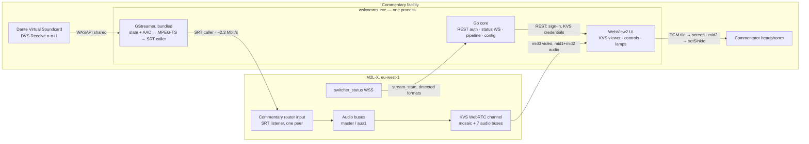

# WSL Studios Commentary Contribution — Specification v2 (SUPERSEDED)

> **ARCHIVED 2026-08-07, unchanged, and materially wrong in several places.**
> Superseded by [windows-app-spec.md](windows-app-spec.md) **v3**, whose §0 lists exactly where and
> why. In short: the picture no longer comes from the KVS mosaic, the return has bus and channel
> selection, there is a mixer drawer, `switcher_status` is snapshot-then-delta and `<statusKey>` is
> not a top-level property, the honest line has been withdrawn from the GUI, the encoder is chosen
> by preference rather than rank, the pipeline string in §5 below **cannot be run as published**
> (`mfh264enc` has no `bframes` property), and Go is 1.25.
>
> It is kept because v3 cites it, because the open questions in §13 record what was and was not
> known on 2026-07-31, and because the reasoning in §5 and §6 is still the reasoning.

**Replaces:** the rejected over-engineered specification. **Target:** Windows 11 x64, one commentary position at a broadcast facility.

---

## 1. What it is

`wslcomms.exe` is a single Windows desktop application, run by the commentator (or the facility engineer sitting with them) from a desktop shortcut. It takes commentary audio from one Dante Virtual Soundcard stereo input, encodes it against a static slate, and sends it to a pre-provisioned Sony M2L-X router input over SRT. In the same window it shows the M2L-X programme picture, plays the effects return into the commentator's headphones, and shows whether the feed is up. One process, one installer, one shortcut. Everything it needs — including GStreamer — sits in its own program folder and is installed with it. Nothing else is installed, no service is registered, and nothing runs when the app is closed.

---

## 2. Scope

**In v1 — the whole product:**

- **R1** Capture commentary audio from a DVS input chosen from a dropdown.
- **R2** Send it to M2L-X as an SRT router input: H.264 slate + AAC-LC commentary, MPEG-TS over SRT caller.
- **R3** Show the M2L-X programme output in the window.
- **R4** Play the effects return (aux1/CLN) to the commentator's headphones.
- **R5** Show whether the feed is connected and working.

**Not in v1.** Webcam instead of slate. Any provisioning of M2L-X — inputs, outputs, passphrases, latency and formats are configured on M2L-X by someone else before the app is pointed at them. Redundant/spare machine coordination. Mixer control of any kind. Talkback. Recording. Level metering, loudness measurement, cough control, mute. Audio delay or sample-rate correction between Dante and the pipeline. Diagnostic bundles, structured telemetry, log shipping. Auto-update. Multi-event or multi-user support. Preview tile, source thumbnails, or any multiviewer tile other than PGM. Return-bus mixing beyond a single selectable source. Codec, resolution or bitrate choices exposed to the user. Pre-match self-test. Alarm severities, escalation, notifications. Installer-driven configuration.

---

## 3. Stack

| Component | Choice | How it ships | Why, and what was rejected |
|---|---|---|---|
| Language | Go 1.25, `CGO_ENABLED=1` | the .exe | Client preference. cgo is required for GStreamer. Rejected: C#/.NET (the rejected spec's stack). *(Was 1.24; Wails v2.13.0, go-gst v0.0.2 and gosrt all declare `go 1.25.0`, so 1.24 is not reachable.)* |
| GUI | Wails v2.13.0, rendering in WebView2 | frontend embedded via `//go:embed all:frontend/dist` | The UI is HTML, so WebRTC video, Opus decode and headphone-device selection come free. Rejected: Fyne/Gio (per-frame CPU RGBA upload, no video sink), walk + `d3d11videosink` (native, but still leaves signalling and decode to write). |
| WebView2 | Evergreen runtime; `wails build -webview2 embed` puts Microsoft's ~150 KB bootstrapper in the .exe | in the .exe | Evergreen is part of Windows 11 — nothing to install on the target machine. Rejected: Fixed Version (+250 MB, no benefit here). |
| Media | GStreamer 1.28.5 (mingw-x86_64), hand-picked DLL allowlist | `<appdir>\gst\` (~60–110 MB) | Client preference, and it is bundled. Rejected: the 916 MB full installer, and any design requiring the user to install GStreamer. |
| Bindings | `github.com/go-gst/go-gst` v0.0.2 (`pkg/gst`, `pkg/gstapp`), version-pinned | linked into the .exe | Covers everything needed. Fallback if the MinGW build fights it (open issue #179, no Windows CI): a ~200-line hand-written cgo shim over fifteen C entry points. Rejected: spawning `gst-launch-1.0.exe` — that is a second process and breaks the one-program rule. |
| Video encoder | `mfh264enc` (Media Foundation) | part of Windows | LGPL wrapper over a codec already in the OS. Rejected: `x264enc` — GPL, cannot be shipped in a commercial deliverable. |
| Audio encoder | `mfaacenc` | part of Windows | AAC-LC 48 kHz stereo, no extra library, no AAC patent licence. Rejected: `fdkaac` (not in the Windows builds at all), `voaacenc`/`avenc_aac` (extra DLLs for no gain). |
| Audio capture | `wasapi2src` | GStreamer bundle | Takes the IMMDevice endpoint ID in `device=`, and is the maintained plugin. Rejected: legacy `wasapisrc`. |
| SRT | `srtsink` with `auto-reconnect=false` | libsrt DLL in the bundle | Reference implementation, already in the bundle. Rejected: `datarhei/gosrt` — it would remove libsrt, but there is no reason to swap a proven stack for an unproven one. |
| Monitor | AWS `amazon-kinesis-video-streams-webrtc` JS SDK, npm-vendored at build time | in the .exe, inside the embedded frontend | The only AWS-supported KVS signalling client we can host; there is none for Go. Never loaded from a CDN — facility networks have no outbound web access. |
| Secrets | `github.com/danieljoos/wincred` | linked into the .exe | The M2L-X password and SRT passphrase go in Windows Credential Manager instead of a plaintext file. Two calls, not a subsystem. |

Bundling mechanism: before `gst_init`, the Go side sets `GST_PLUGIN_SYSTEM_PATH_1_0=""` (disables all default plugin search), `GST_PLUGIN_PATH_1_0=<appdir>\gst\lib\gstreamer-1.0`, and `GST_REGISTRY_1_0=%LOCALAPPDATA%\WSLComms\registry.bin`. Go's `os.Setenv` calls `SetEnvironmentVariableW`, which is exactly what GLib reads, so this crosses the cgo boundary cleanly. A GStreamer installation elsewhere on the machine is therefore invisible to the app, and vice versa.

Plugin allowlist (an explicit list, never a directory copy — a directory copy would drag GPL `x264enc` into a commercial deliverable): `coreelements`, `typefindfunctions`, `videoconvertscale`, `audioconvert`, `audioresample`, `imagefreeze`, `png`, `audioparsers`, `videoparsersbad`, `wasapi2`, `mediafoundation`, `mpegtsmux`, `srt`.

---

## 4. How it works



**Outbound.** On launch the app signs in to M2L-X (`POST /api/local_auth/signin`, body `{"alias":"…","password":"…"}` — the field is `alias`; `username` returns HTTP 500), stores the bearer token, and opens the status WebSocket. The user picks their DVS input from the dropdown and presses **Start**. GStreamer opens that WASAPI endpoint in shared mode, freezes the slate PNG into a 1080p50 live video stream, encodes both, muxes to MPEG-TS and dials M2L-X as an SRT caller. M2L-X's input is an SRT *listener*, so no inbound firewall rule is needed. The input locks in about 1.1 s. That is the whole contribution path; the app makes no REST call to start or stop anything on M2L-X, because none is required.

Because each SRT listener accepts exactly one peer and never displaces the incumbent, only one machine may point at a given router input at a time — if a stale session is still held, the app's reconnect backoff simply keeps trying until libsrt times the old one out.

**Return.** Separately, the app fetches KVS credentials from M2L-X and hands them to the embedded page, which opens one `RTCPeerConnection` with the same eight recvonly transceivers Sony's own GUI uses. The video track is a 2240x1440 multiviewer mosaic; the page CSS-crops the PGM tile out of it and displays it (R3). Audio mid2 (aux1/CLN) is routed through Web Audio to an `<audio>` element whose `setSinkId` points at the commentator's headphone device (R4). Measured control-to-audible upper bound on this path is 489 ms, so the return is a monitor feed, not a reference for lip-sync work.

---

## 5. The media pipeline

One `gst_parse_launch` string, built once at Start. `srtsink` properties are set with `g_object_set` rather than in the URI, so the passphrase never has to be percent-encoded or appear in a log line.

```
mpegtsmux name=mux alignment=7 pcr-interval=3600
  ! queue name=srtq leaky=downstream max-size-buffers=4000
  ! srtsink name=srtout sync=false async=false auto-reconnect=false

filesrc location="<appdir>\slate.png" ! pngdec ! imagefreeze is-live=true
  ! videoconvert ! videoscale
  ! video/x-raw,format=NV12,width=1920,height=1080,framerate=50/1,pixel-aspect-ratio=1/1,colorimetry=bt709
  ! mfh264enc name=venc bitrate=2000 rc-mode=cbr gop-size=100 low-latency=true cabac=true
  ! video/x-h264,profile=high
  ! h264parse config-interval=-1
  ! video/x-h264,stream-format=byte-stream,alignment=au
  ! queue max-size-time=1000000000 ! mux.

wasapi2src name=asrc device="<IMMDevice endpoint id>" low-latency=true
  ! audio/x-raw,rate=48000,channels=2
  ! audioconvert ! audioresample
  ! audio/x-raw,format=S16LE,rate=48000,channels=2,layout=interleaved
  ! mfaacenc bitrate=128000
  ! aacparse ! audio/mpeg,mpegversion=4,stream-format=adts
  ! queue max-size-time=1000000000 ! mux.
```

`srtout` properties: `uri="srt://<host>:<port>"`, `mode=caller`, `latency=120`, `passphrase="<from Credential Manager>"`, `pbkeylen=16`.

**Verified end to end at Gate C, 2026-07-30.** This pipeline, driven from a real capture device into M2L-X router input 22, brought the input to `online` reporting `h264 1920x1080@50` and `aac/48000`, and held it. Two corrections came out of that run, both now applied above: `bframes=0` is removed because **`mfh264enc` has no such property** in GStreamer 1.28.5 and `gst_parse_launch` rejects an unknown property outright — pasting the old string into `gst-launch-1.0` failed with `no property "bframes"` rather than merely warning; and `videoscale` is added so a slate that is not exactly 1920x1080 is scaled rather than failing negotiation. The intent behind `bframes=0` is unaffected: Media Foundation's H.264 MFT emits no B-frames in low-latency mode.

**Decided values and why.** 2000 kbps CBR video plus 128 kbps AAC-LC is about 2.3 Mbit/s on the wire after MPEG-TS and SRT overhead; provision 2.9 Mbit/s of uplink to cover libsrt's default 25% retransmission allowance. CBR rather than quality-targeted rate control: a static slate under QVBR collapses to 200–350 kbps, which is cheaper but makes the stream bursty at every IDR and makes "is it flowing" harder to observe. `gop-size=100` is a 2 s GOP at 50p, matching the profile M2L-X locked cleanly. `bframes=0` and `low-latency=true` because there is nothing to gain from reordering a slate. `config-interval=-1` puts SPS/PPS in front of every IDR so M2L-X can re-lock mid-stream. `alignment=7` gives 7 × 188 = 1316-byte buffers, exactly one SRT payload, so nothing fragments. `imagefreeze is-live=true` is mandatory — without it the slate branch is not a live source and will not pace correctly. `latency=120` is milliseconds (srtsink's property is ms, not µs as the brief's example string suggests), roughly 5× the measured 21 ms median RTT.

Audio codec is pinned. M2L-X silently drops MP2 and AC-3 — video stays online and the audio just vanishes — so there is no codec choice in the UI and none in the config file.

**The dropdown.** Populated from a `GstDeviceMonitor` filtered to `Audio/Source` on the wasapi2 provider. The list shows `display-name`; what is persisted and passed to `wasapi2src` is the **IMMDevice endpoint ID GUID**, never the friendly name. That sidesteps the double space in "DVS Receive  1-2 (Dante Virtual Soundcard)" entirely and survives a rename. No identify tone, no metering, no fingerprinting: the user knows what they patched.

---

## 6. Timestamps and reconnect

### 6.1 Monotonic timestamps across a pipeline restart

The measured bug — audio DTS jumping backwards by exactly the previous run's uptime, 1,523 non-monotonic errors downstream, commentary never returning while every indicator read healthy — is precisely GStreamer's documented default behaviour. Running time is `clock − base_time`. Taking a pipeline to READY or NULL and back re-samples the clock, resets base time to the new value, and `mpegtsmux` restarts PTS from zero. M2L-X's relay forwards our timestamps verbatim, so the jump lands downstream and nothing recovers it.

The primary defence is structural: **the capture, encode and mux chain never leaves PLAYING for the life of the process.** Reconnect replaces only the `srtsink` element. Running time never moves, so the problem cannot arise on the path that actually happens during a match.

The secondary defence is four lines, for the one case that does force a rebuild — the user picking a different DVS device mid-match:

```go
var savedBase = gst.ClockTimeNone           // process-lifetime, never reset
clk := gst.SystemClockObtain()
pipeline.UseClock(clk)                       // pinned; never renegotiated
pipeline.SetStartTime(gst.ClockTimeNone)     // stops the base-time reset on PAUSED->PLAYING
if savedBase == gst.ClockTimeNone { savedBase = clk.GetTime() }
pipeline.SetBaseTime(savedBase)              // the SAME value on every rebuild, forever
pipeline.SetState(gst.StatePlaying)
```

Do **not** set `start-time-selection=first` on `mpegtsmux` — that reproduces the bug. The cost of pinning the system clock is that the Dante audio clock drifts slowly against it; `audioresample` absorbs it, and because the structural fix means this path is rarely exercised, the accumulated correction stays small.

### 6.2 Reconnect

`srtsink`'s built-in `auto-reconnect` is worse than useless here. Reading `gstsrtobject.c`: on a write failure it closes the socket, reopens it *immediately* with no backoff, and retries once; if that single reopen fails it raises `GST_ELEMENT_ERROR(RESOURCE, WRITE)` and the pipeline errors out. Fired straight into M2L-X's ~5 s re-accept refusal window, that will reliably hard-fail — while looking, to anyone reading the property name, as though reconnect is handled. Set `auto-reconnect=false` and own the loop.

On total network loss libsrt declares the peer dead at ~5.27 s and exits, and M2L-X never recovers by itself. The app must reconnect indefinitely.

```
CONNECTING ──connect ok──> CONNECTED ──error on srtout──> DRAINING ──> BACKOFF ──> CONNECTING
     └──connect fails──────────────────────────────────────────────────> BACKOFF
```

- **DRAINING**: block the src pad of `srtq` (`GST_PAD_PROBE_TYPE_BLOCK_DOWNSTREAM`), unlink, set `srtout` to NULL, remove it from the pipeline. Everything upstream stays in PLAYING.
- **BACKOFF**: on a goroutine — never inside the pad probe or the bus callback — sleep 7 s, 7 s, 10 s, 15 s, 20 s, then 30 s capped, forever. The first delay must be ≥ 6 s to clear the listener's re-accept refusal window; the same backoff is what eventually wins the one-peer race against our own stale socket.
- **CONNECTING**: create a fresh `srtsink` with identical properties, add, link, `SyncStateWithParent`, remove the probe. On success, send a `GstForceKeyUnit` event upstream so the picture recovers immediately instead of waiting up to 2 s for the next IDR.

The `leaky=downstream` queue means output produced during an outage is dropped rather than back-pressuring the live capture, so the encoder never stalls and the timestamps never bunch.

---

## 7. The monitor and return audio

R3 and R4 come from one `RTCPeerConnection`, opened inside the WebView2 page using AWS's KVS WebRTC JS SDK, doing exactly what Sony's own GUI does. Go fetches the credentials (`GET /api/live_operation/kvs/webrtc_info/{eventId}` for region and channel, `GET /api/live_operation/kvs/webrtc_token/{eventId}` for the Cognito identity and token, then Cognito `GetCredentialsForIdentity`) and passes them to the page through a bound method; the SDK does `GetSignalingChannelEndpoint` with role VIEWER, `GetIceServerConfig`, and the SigV4-presigned WSS connect. A KVS signalling channel serves up to ten viewers, so this does not displace the gallery operator's browser.

The page offers the same eight recvonly transceivers Sony's page offers — 1 video (mid 0) + 7 audio (mids 1–7) — so the mid-to-bus map holds positionally. Silent tracks cost ~1.2 kbps, so leaving mids 3–7 subscribed but unrouted is cheaper than risking a re-mapped answer.

**Video (R3).** The single video track is a 2240x1440 mosaic. The PGM tile is at (0, 360, 640, 360). Crop it in CSS: a 640x360 container with `overflow:hidden`, the `<video>` inside at natural size with `left:0; top:-360px`, the container wrapped in `transform: scale(k); transform-origin: 0 0` to fit the window. Decode cost is the full mosaic either way, and it is hardware-decoded.

**Audio (R4).** Route mid1 (master/PGM) and mid2 (aux1/CLN) into Web Audio — a `GainNode` each into a `MediaStreamAudioDestinationNode` feeding an `<audio>` element with `setSinkId(headphoneDeviceId)`. Default to **mid2**. When effects are routed to master+aux1 and commentary is not, aux1 is inherently an N-1: the commentator hears the match without hearing themselves delayed by the cloud round trip. That is a gallery routing convention the app cannot verify or enforce, so it belongs in the handover note: *commentary must not be routed to aux1.*

One environment variable, set in Go before the window is created, is needed so `enumerateDevices()` returns device labels rather than blanks:

```go
os.Setenv("WEBVIEW2_ADDITIONAL_BROWSER_ARGUMENTS",
  "--autoplay-policy=no-user-gesture-required --auto-accept-camera-and-microphone-capture")
```

If the peer connection fails or the signalling socket closes, tear the whole thing down, re-fetch credentials in Go and redo the chain. No refresh scheduler.

---

## 8. Status display

Five indicators, all driven from facts the measurements say are trustworthy.

| Indicator | Source | Good state |
|---|---|---|
| **SENDING** | The app's own SRT state machine (§6.2) | `CONNECTED` |
| **SWITCHER SEES FEED** | Status WebSocket, `<statusKey>.stream_state` | `streaming`. `starting`/`stopped` are bad. This is the sole liveness truth. |
| **VIDEO OK** | WebSocket, `<statusKey>.streams.video.format` | h264, 1920x1080, 50 |
| **AUDIO OK** | WebSocket, `<statusKey>.streams.audio[0].format` | aac, 48000, 2ch. An empty or absent array is the MP2/AC-3 silent-drop signature. |
| **MONITOR** | `RTCPeerConnection.connectionState` | `connected` |

Not used, deliberately: `statistics.bitrate` (freezes at its last value, so a dead input advertises a healthy bitrate forever — it is not displayed at all, because displaying it invites the wrong conclusion); REST `width`/`height`/`frame_rate`/`codec` (these are the *configured* values and will report 1080p50 over a 720p25 stream); output `status` (reads "online" whether its source is healthy, dead for 90 s, or never connected).

Debounce `stream_state` by 4 s so a momentary transition does not flap the lamp. If the WebSocket has been silent for more than 15 s, grey the three WebSocket-derived lamps and say `STATUS UNAVAILABLE` rather than showing stale green. A token refresh means reopening the socket, since the token is in the URL.

**The honest line, shown permanently under the lamps:** *"Your feed is reaching the switcher. This does not confirm you are audible on the broadcast output."* There is no reliable in-app proof that commentary is on air, and the app will not imply otherwise.

---

## 9. Configuration

One JSON file at `%APPDATA%\WSLComms\config.json`, editable from a Settings screen in the app. The M2L-X password and the SRT passphrase are the only exceptions: they go in Windows Credential Manager under `WSLComms/m2lx` and `WSLComms/srt`.

- `m2lxHost`, `alias`, `eventId`
- `srtHost`, `srtPort`, `srtLatencyMs` (default 120), `pbkeylen` (16 or 32)
- `statusKey` — the switcher_status node for our router input, e.g. `cam7`
- `audioDeviceId` — WASAPI endpoint ID, written by the dropdown
- `headphoneDeviceId` — written by the output dropdown
- `returnMid` — default 2
- `monitorTile` — `{x:0, y:360, w:640, h:360}`
- `slatePath` — defaults to the bundled `slate.png`

`monitorTile` and `returnMid` are in the file rather than in code because the tile geometry and the mid-to-bus map are M2L-X *configuration*, measured on the dev event. If Sony changes the multiviewer layout, that is two edited numbers, not a code change and not a detection subsystem.

---

## 10. UI

One window. The PGM tile fills the top, scaled to the window width. Below it, a single row of controls and the status lamps. A Settings screen (same window, swapped view) holds everything in §9. There is no other screen and no menu.

```
+--------------------------------------------------------------------------+
|  WSL Commentary                                          [ Settings ]    |
+--------------------------------------------------------------------------+
|                                                                          |
|                    M2L-X PROGRAMME (PGM tile, cropped)                   |
|                                                                          |
+--------------------------------------------------------------------------+
| Commentary input:  [ DVS Receive  1-2 (Dante Virtual Soundcard)    v ]   |
| Headphones:        [ Headphones (Focusrite Scarlett)               v ]   |
| Return:            [ CLN (effects, no commentary)  v ]   Level [====|--] |
+--------------------------------------------------------------------------+
|  [ START ]        * SENDING   * SWITCHER SEES FEED   * VIDEO   * AUDIO   |
|                   * MONITOR                                              |
|  Your feed is reaching the switcher. This does not confirm you are        |
|  audible on the broadcast output.                                        |
+--------------------------------------------------------------------------+
```

START becomes STOP while running. Lamps are green / amber (reconnecting) / red / grey (unknown). The Return dropdown has exactly two entries, CLN and PGM, defaulting to CLN. That is the entire interface.

---

## 11. Build and packaging

Built on Windows — cgo means no cross-compilation. Build host needs MinGW gcc, `pkgconfiglite`, the GStreamer 1.28.5 mingw-x86_64 **development** installer, and `PKG_CONFIG_PATH=C:\gstreamer\1.0\mingw_x86_64\lib\pkgconfig`. The frontend is `npm ci && npm run build` into `frontend/dist`, embedded by `wails build -webview2 embed`. End users need none of this.

A build script copies the plugin allowlist plus the core GStreamer, GLib, orc and libsrt DLLs and the MinGW runtime (`libwinpthread`, `libgcc_s_seh`, `libstdc++`) into `dist\gst\`, from an explicit file list — never a directory copy.

Installer: WiX or Inno Setup, per-machine, one feature, no options. Lays down `wslcomms.exe`, `gst\`, `slate.png`, the LGPL-2.1 text and a written offer for the corresponding source of the GStreamer and GLib components (which are shipped unmodified and dynamically linked). Expected footprint: 70–120 MB installed, a single ~15 MB executable plus the GStreamer folder.

---

## 12. Effort

| Work | Engineer-weeks |
|---|---|
| Windows Go+cgo+GStreamer build proven; DLL allowlist; installer | 1.5 |
| Capture, encode, mux, SRT out; device dropdown | 1.5 |
| Timestamp continuity and reconnect state machine | 1.0 |
| M2L-X auth, status WebSocket, status lamps | 1.0 |
| Monitor page: KVS chain, mosaic crop, return audio routing | 1.5 |
| Settings screen, config file, UI assembly | 1.0 |
| Test against the dev instance, one match-length soak, fixes | 1.5 |
| **Total** | **9** |

Call it **9–11 engineer-weeks** with contingency. What is genuinely irreducible: proving the Windows cgo/GStreamer build and hand-picking the DLL bundle is real work that cannot be skipped or bought; and one uninterrupted match-length soak against the real instance, because the two bugs that will actually hurt — the backwards timestamp jump and the reconnect window — only appear over hours. Add up to 1.5 weeks if the KVS credential endpoints turn out not to have the assumed shapes.

---

## 13. Open questions

1. **Do `/api/live_operation/kvs/webrtc_info/{eventId}` and `/webrtc_token/{eventId}` exist with the assumed shapes?** *Test:* open Sony's GUI in Chrome with DevTools Network open, filter on `kinesis`, and read the last M2L-X request before the first `wss://*.kinesisvideo.eu-west-1.amazonaws.com`. Settle this before writing any monitor code.
2. **Does `go-gst` v0.0.2 build on Windows with MinGW?** *Test:* one timeboxed day building a hello-world pipeline. If it fails, switch to the ~200-line cgo shim and move on — do not fight it.
3. **Is the highest-ranked H.264 encoder called `mfh264enc` on the target machine, and does its hardware MFT emit a conformant IDR every 100 frames?** *Test:* run the pipeline into the dev instance for 10 minutes and read `streams.video.format` and `error_packet_count` from the WebSocket. Resolve the element by rank at runtime rather than hardcoding the name.
4. **Does the KVS channel serve our viewer and the gallery operator's browser at once?** *Test:* two machines, both connected as viewers for five minutes. AWS documents ten viewers per channel, so this is a confirmation, not a gamble.
5. **What is the `statusKey` for the commentary router input on the production event?** *Test:* read one `switcher_status` snapshot and find the node whose `stream_state` changes when the app starts. It goes in the config file.
6. **Does M2L-X's commentary input actually have a passphrase set, and at what `pbkeylen`?** *Test:* connect once with and once without. `ERROR:BADSECRET` and `ERROR:UNSECURE` distinguish the cases immediately.