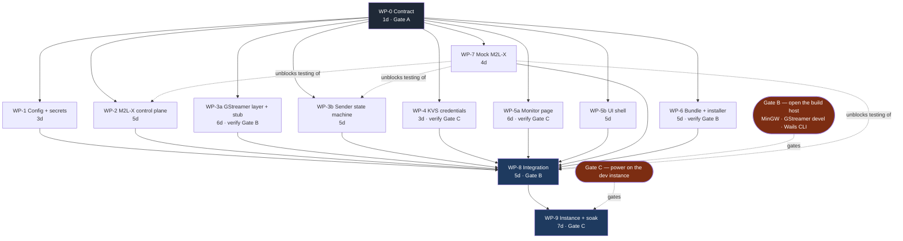

# WSL Commentary — Project Plan

**Implements:** [windows-app-spec.md](windows-app-spec.md) v2. **Purpose:** break the build into work packages that can run concurrently, and define the contract that lets them.

---

## 1. The organising idea

Work is split by **gate**, not by feature. A gate is what a package needs before anyone can tell whether it works. This machine already has Go 1.24.5, Node 24.6, git and the WebView2 Evergreen runtime; it has no MinGW gcc, no GStreamer, no Wails CLI and no pkg-config. The M2L-X dev instance is powered off.

| Gate | Needs | Blocks | Currently |
|---|---|---|---|
| **A — pure code** | Go + Node, already here | nothing | **open** |
| **B — build host** | MinGW gcc, GStreamer 1.28.5 mingw *devel*, pkgconfiglite, Wails CLI (~2 GB, ~30 min) | compiling any cgo; the DLL bundle; the installer | **closed, user-openable** |
| **C — live instance** | M2L-X dev event running | the KVS endpoint shapes, `statusKey`, SRT passphrase, all real testing, the soak | **closed, user-openable** |

The plan's central move is to push as much of the product as possible behind Gate A. Two design decisions do that:

**The GStreamer layer is thin, and has a stub twin.** `internal/gst` is a minimal wrapper over go-gst — build a pipeline, list devices, swap a sink. All *logic* — the reconnect state machine, backoff, timestamp pinning policy, lamp derivation — lives in `internal/sender`, which is pure Go and never imports cgo. `internal/gst` ships two implementations selected by build tag: the real one (`//go:build cgo`, Gate B) and a stub (`//go:build !cgo`, Gate A) that emits fake devices and fake state transitions. Everything above the seam is identical in both.

**A mock M2L-X ships as part of the project.** `cmd/mockm2lx` serves the sign-in endpoint, the status WebSocket and an SRT listener that logs what it receives. It is not a test fixture bolted on later; it is what makes Gate A meaningful.

Together these mean the whole application — UI, control plane, config, status lamps, the reconnect logic that will actually cause the outages — can be written, run and demonstrated today, with no toolchain and no instance. Only the ~600 lines that touch GStreamer, and the final verification, wait on Gates B and C.

---

## 2. WP-0 — the contract

One agent, serial, blocks everything. It writes no logic. It writes the tree, the type declarations, and the two dependency manifests, and then those are frozen.

```
wslcomms/
  go.mod  go.sum          WP-0 — FROZEN
  main.go  app.go         WP-8 (WP-0 leaves compiling stubs)
  internal/
    config/               WP-1
    secrets/              WP-1
    m2lx/                 WP-2
    gst/                  WP-3a
    sender/               WP-3b
    kvs/                  WP-4
  cmd/mockm2lx/           WP-7
  frontend/
    package.json          WP-0 — FROZEN
    src/monitor/          WP-5a
    src/ui/  src/styles/  WP-5b
  build/                  WP-6
  assets/slate.png        WP-0
```

The interfaces WP-0 declares, which every other package codes against:

```go
// internal/config
type Config struct { /* §9 of the spec, verbatim */ }
func Load() (*Config, error)
func (c *Config) Save() error

// internal/secrets — Windows Credential Manager
type Store interface {
    Get(key string) (string, error)      // "m2lx" | "srt"
    Set(key, value string) error
}

// internal/m2lx
type Client interface {
    SignIn(ctx context.Context, alias, password string) error
    Refresh(ctx context.Context) error
    Token() string
    KVSInfo(ctx context.Context, eventID string) (KVSInfo, error)
    KVSToken(ctx context.Context, eventID string) (KVSToken, error)
}
type Status struct {
    StreamState string          // streaming | starting | stopped
    Video       VideoFormat
    Audio       []AudioFormat   // empty array == the MP2/AC-3 silent-drop signature
    At          time.Time
}
type Watcher interface { Watch(ctx context.Context, statusKey string) <-chan Status }

// internal/gst — the ONLY cgo surface. Two implementations, build-tag selected.
type Device struct{ ID, Name string }          // ID is the IMMDevice endpoint GUID
type Pipeline interface {
    Start(PipelineOpts) error
    ReplaceSink(SinkOpts) error                 // block, unlink, NULL, remove, recreate, relink
    ForceKeyUnit() error
    Errors() <-chan error
    Stop() error
}
func ListInputDevices() ([]Device, error)
func New() (Pipeline, error)

// internal/sender — pure Go. Owns §6 in full. Unit-testable with a fake Pipeline.
type State string  // CONNECTING CONNECTED DRAINING BACKOFF STOPPED
type Sender interface {
    Start(Opts) error
    Stop() error
    States() <-chan State
}

// internal/kvs
type Credentials struct { Region, ChannelARN, AccessKeyID, SecretKey, SessionToken string; Expiry time.Time }
func Fetch(ctx context.Context, c m2lx.Client, eventID string) (Credentials, error)
```

The Wails surface, which is the frontend's entire view of Go:

| Bound method | Returns | Owner of the caller |
|---|---|---|
| `ListInputDevices()` | `[]Device` | WP-5b |
| `GetConfig()` / `SaveConfig(c)` | `Config` / `error` | WP-5b |
| `Start()` / `Stop()` | `error` | WP-5b |
| `GetKVSCredentials()` | `Credentials` | WP-5a |

Events emitted Go → JS: `status` (a `Status`), `sender` (a `State`), `error` (a string). Headphone enumeration and selection are **JS-side only** (`enumerateDevices` + `setSinkId`); no Go package owns output devices.

### Three rules that make the parallelism real

1. **WP-0 freezes `go.mod` and `frontend/package.json`, with every dependency pre-declared.** No agent runs `go get` or `npm install <pkg>`. Concurrent edits to those two files are the classic way parallel work on a Go project falls apart, and this removes the possibility rather than managing it.
2. **Each package owns its paths exclusively.** No agent edits a file another package owns. `main.go` and `app.go` belong to WP-8 alone.
3. **If an interface is wrong, report it — don't edit it.** A silently widened interface breaks every sibling that already compiled against it.

---

## 3. Work packages

| WP | Scope | Owns | Gate to write | Gate to verify | Eng-days |
|---|---|---|---|---|---|
| **WP-0** | Contract, tree, frozen manifests, slate | see above | A | A | 1 |
| **WP-1** | Config file, Credential Manager wrapper | `internal/config`, `internal/secrets` | A | A | 3 |
| **WP-2** | Sign-in, token refresh, status WS, 4 s debounce, 15 s staleness | `internal/m2lx` | A | A (mock) | 5 |
| **WP-3a** | Pipeline string, element handles, sink swap, device monitor, **stub twin** | `internal/gst` | A | **B** | 6 |
| **WP-3b** | Reconnect state machine, backoff ladder, timestamp pinning, leaky queue policy | `internal/sender` | A | A (fake pipeline) | 5 |
| **WP-4** | M2L-X → Cognito credential chain, behind an interface so shapes can change | `internal/kvs` | A | **C** | 3 |
| **WP-5a** | KVS viewer, 8 transceivers, mosaic crop, Web Audio return, `setSinkId` | `frontend/src/monitor` | A | **C** | 6 |
| **WP-5b** | Controls, lamps, Settings view, styling, the honest line | `frontend/src/ui`, `styles` | A | A | 5 |
| **WP-6** | DLL allowlist script, LGPL notices + written offer, WiX/Inno installer | `build/` | A | **B** | 5 |
| **WP-7** | Mock M2L-X: REST, status WS, SRT listener, fault injection | `cmd/mockm2lx` | A | A | 4 |
| **WP-8** | `main.go`, `app.go`, Wails bindings, wire-up, end-to-end on the mock | root | A | **B** | 5 |
| **WP-9** | Instance bring-up, six spikes, match-length soak | — | — | **C** | 7 |

**55 engineer-days ≈ 11 weeks.** The spec's estimate was 9–11; the difference is WP-7, which the spec did not cost. It pays for itself the first time someone needs to test reconnect behaviour without booking the instance.

WP-7 deserves a note on scope, because its value is concentrated in one feature: **fault injection.** The mock must be able to drop the SRT session on command, hold the listener socket open after a disconnect (to reproduce the ~5 s re-accept refusal), stall the status WebSocket, and report a `stream_state` that disagrees with reality. Those are the four failure modes the measurements found, and they are the ones WP-3b must survive. A mock that only works when everything works is not worth four days.

---

## 4. Dependency graph



**Critical path:** WP-0 → WP-3a → WP-8 → WP-9 = 19 days. Eleven weeks of effort compresses to **four to six weeks of wall clock** with four concurrent workers — six being the realistic figure once Gate B and Gate C scheduling is allowed for.

---

## 5. The six spikes

These are the spec's open questions, costed and assigned. Each is small, and each can invalidate a package if left until that package is written.

| Spike | Question | Gate | Cost | Reorders |
|---|---|---|---|---|
| **SP-1** | Do the KVS credential endpoints exist with the assumed shapes? | C | 0.5 d | WP-4, WP-5a |
| **SP-2** | Does `go-gst` v0.0.2 build under MinGW? | B | 1 d, timeboxed | WP-3a (→ cgo shim) |
| **SP-3** | Is the top-ranked H.264 encoder `mfh264enc`, and are its IDRs conformant? | B | 0.5 d | WP-3a |
| **SP-4** | What is the production `statusKey`? | C | 0.5 d | config only |
| **SP-5** | Is a passphrase set, at what `pbkeylen`? | C | 0.5 d | config only |
| **SP-6** | Does the KVS channel serve our viewer alongside the gallery browser? | C | 0.5 d | confirmation |

**SP-1 and SP-2 are the two that matter**, and both should be settled before their packages are written rather than after. SP-1 is five minutes with Chrome DevTools on Sony's own GUI — filter Network on `kinesis`, read the last M2L-X request before the first `wss://*.kinesisvideo.eu-west-1.amazonaws.com`. SP-2 is the one-day timebox from the spec: if go-gst fights the MinGW build, drop to the hand-written cgo shim and move on rather than debugging someone else's CI gap.

---

## 6. Execution as a multi-agent workflow

Three waves, thirteen agents.

**Wave 1 — one agent, serial.** WP-0. Nothing else can start, because everything else compiles against what it writes. Its output is reviewed before Wave 2 launches: a wrong interface here costs nine agents' work, and this is the one place where a few minutes of care has that leverage.

**Wave 2 — nine agents, fully parallel.** WP-1, 2, 3a, 3b, 4, 5a, 5b, 6, 7. Every one is path-disjoint from every other. None can block on another, because all cross-package needs go through WP-0's interfaces.

**Wave 3 — three agents.** WP-8 integration, plus two adversarial reviewers pointed at `internal/sender` and `internal/gst` specifically. Those two packages hold every failure mode the measurements actually found, and they are the two the toolchain cannot check yet.

**Then Gates B and C**, which are the user's to open, and WP-9, which is a person with the instance running and several hours to let it run.

**Merge discipline.** `git init` and commit WP-0 before Wave 2, so each agent's work is an independently reviewable diff against a known base. Path-disjointness makes worktree isolation unnecessary — worktrees cost setup time per agent and buy nothing when no two agents can touch the same file.

**What the workflow cannot produce.** It will produce a complete, coherent, reviewed codebase. It will not produce a *verified* one. Nothing touching cgo compiles until Gate B; nothing touching KVS or SRT is confirmed until Gate C; the two bugs most likely to hurt in service — the backwards-DTS jump on encoder restart and the reconnect window — only appear over hours of running, which is WP-9 and cannot be shortened by adding agents. The plan is built so that everything *except* that verification is done by the time the gates open.

---

## 7. Sequencing recommendation

Wave 1 and Wave 2 can start immediately and need nothing from anyone. In parallel, and worth starting now because they are pure waiting-on-installs and waiting-on-hardware:

1. **Open Gate B** — MinGW gcc, GStreamer 1.28.5 mingw-x86_64 *devel* installer, `pkgconfiglite`, `go install github.com/wailsapp/wails/v2/cmd/wails@v2.13.0`. Roughly 2 GB and half an hour, all on this machine, all unattended.
2. **Open Gate C** — power the dev event back on, and run SP-1 and SP-4 while it is up. Ten minutes of browser work that de-risks two packages.

The dev instance still carries the `CLAUDE-` prefixed test objects from the measurement work — router inputs 20–22 and outputs 8–13, configured and stopped. Reuse one of the router inputs for WP-9 rather than provisioning fresh, and leave the rest until the end.
