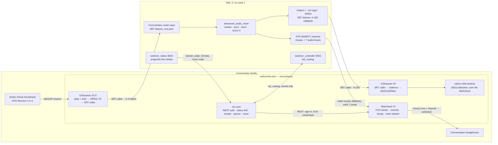

# WSL Studios Commentary Contribution — Specification v3

**Replaces:** v2 of 2026-07-31, archived unchanged as
[`archive-windows-app-spec-v2-superseded.md`](archive-windows-app-spec-v2-superseded.md).
**Target:** Windows 11 x64, one commentary position at a broadcast facility.
**Status:** v2 was a design. **This is a description of a built application that has been used on
air.** Where the two disagree, this document is what the code does and v2 was what was intended.

**Evidence convention, kept from v2 and worth keeping.** A number in this document is either
**MEASURED** — with the date, the instance and what was read — or it is a **DECISION** with its
reasoning, or it is **UNPROVEN** and says so. There are no unlabelled numbers. Section 14 is the
list of things nobody has measured, and it is meant to stay populated.

---

## 0. What changed from v2, in one table

Everything in this column happened between 2026-07-31 and 2026-08-07 and every entry was measured
or built, not decided on paper.

| v2 said | v3 says | Where |
|---|---|---|
| The picture is the KVS mosaic, CSS-cropped | The picture is **SRT** from M2L-X Output 1, H.265 1080p50, GPU-decoded into a native child window over the WebView2. The mosaic is the **fallback** | §5.2, §7 |
| The return is one KVS bus, CLN or PGM | The return is Kinesis with a **seven-bus** selection and a **stereo / left / right channel** selection | §7 |
| Two secrets | **Three** secrets. The SRT return/picture path has its own passphrase | §9 |
| No mixer control of any kind | A **routing matrix**, read-only until armed, used live to take commentary out of the client's clean feed | §11 |
| Every `switcher_status` frame is a snapshot | The socket is **snapshot-then-delta** and `path` is load-bearing | §8 |
| The honest line is permanent | The honest line is **withdrawn from the GUI** at the operator's instruction. `deriveHonestLine` is kept and tested | §8, §10 |
| `mfh264enc ... bframes=0` | `mfh264enc` **has no `bframes` property**; the v2 pipeline string could not be run as published | §5.1 |
| Resolve the encoder by rank | Resolve it by **preference**; rank picks whichever GPU vendor's encoder is installed | §5.1 |
| Go 1.24 | Go **1.25** | §3 |

---

## 1. What it is

`wslcomms.exe` is a single Windows desktop application, run by the commentator (or the facility
engineer sitting with them) from a desktop shortcut. It takes commentary audio from one Dante
Virtual Soundcard stereo input, encodes it against a static slate, and sends it to a pre-provisioned
Sony M2L-X router input over SRT. In the same window it shows the M2L-X programme picture, plays a
selected return bus into the commentator's headphones, shows whether the feed is up, and — behind an
arming gate — shows and can correct M2L-X's audio routing. One process, one installer, one shortcut.
Everything it needs, including GStreamer, sits in its own program folder and is installed with it.
Nothing else is installed, no service is registered, and nothing runs when the app is closed.

---

## 2. Scope

**Built, and the whole product:**

- **R1** Capture commentary audio from a DVS input chosen from a dropdown.
- **R2** Send it to M2L-X as an SRT router input: H.264 slate + AAC-LC commentary, MPEG-TS over SRT
  caller.
- **R3** Show the M2L-X programme picture in the window — from SRT, with the KVS mosaic as fallback.
- **R4** Play a selectable return bus, and a selectable channel of it, to the commentator's
  headphones.
- **R5** Show whether the feed is connected and working.
- **R6** Show M2L-X's audio routing matrix, and — only after an explicit arm — change it.

**Still not in scope, and this list is shorter than v2's on purpose.** Webcam instead of slate. Any
*provisioning* of M2L-X — inputs, outputs, passphrases, latency and formats are configured on M2L-X
by someone else before the app is pointed at them. Redundant/spare machine coordination. Talkback.
Recording. Loudness measurement, cough control, mute of the contribution feed. Audio delay or
sample-rate correction between Dante and the pipeline. Diagnostic bundles, structured telemetry, log
shipping. Auto-update. Multi-event or multi-user support. Preview tile or source thumbnails. Codec,
resolution or bitrate choices exposed to the user. Pre-match self-test. Alarm severities, escalation,
notifications. Installer-driven configuration.

**And the limits on R6, because "mixer control" is now a true statement and needs bounding.** The
drawer reads routing, mutes, faders and meters and can write routing, mutes, faders and a
compressor/limiter. It does not do scenes, snapshots, EQ, dynamics beyond that one limiter, or
anything on a node other than `advanced_audio_mixer`. It never writes on its own — every write comes
from a named operator gesture made inside a two-minute armed window (§11).

---

## 3. Stack

| Component | Choice | How it ships | Why, and what was rejected |
|---|---|---|---|
| Language | **Go 1.25**, `CGO_ENABLED=1` | the .exe | Client preference; cgo is required for GStreamer. `go.mod` says `go 1.25.0`. v2's "1.24" was never reachable: Wails v2.13.0, go-gst v0.0.2 and gosrt all declare `go 1.25.0`. Rejected: C#/.NET. |
| GUI | Wails v2.13.0, rendering in WebView2 | frontend embedded via `//go:embed all:frontend/dist` | The UI is HTML, so WebRTC audio, Opus decode and headphone-device selection come free. Rejected: Fyne/Gio, walk. |
| WebView2 | Evergreen runtime; `wails build -webview2 embed` | in the .exe | Evergreen is part of Windows 11. Rejected: Fixed Version (+250 MB). |
| Media | GStreamer 1.28.5 (mingw-x86_64), hand-picked DLL allowlist | `<appdir>\gst\` | Client preference, and it is bundled. Rejected: the 916 MB full installer. |
| Bindings | `github.com/go-gst/go-gst` v0.0.2 (+ `go-glib`), version-pinned | linked into the .exe | **Built under MinGW at Gate B; the ~200-line cgo shim fallback was not needed.** v2's open question 2 is closed. |
| Video encoder (send) | **`mfh264enc`, chosen by preference, not by rank** | part of Windows | §5.1. Denylisted: `x264enc` (GPL, cannot ship in a commercial deliverable). |
| Audio encoder (send) | `mfaacenc` | part of Windows | AAC-LC 48 kHz stereo, no extra library, no AAC patent licence. |
| Audio capture | `wasapi2src` | GStreamer bundle | Takes the IMMDevice endpoint ID in `device=`, and is the maintained plugin. |
| **SDI capture** | **`decklinkvideosrc` / `decklinkaudiosrc`**, always behind `videorate`, and `deinterlace` when the feed is interlaced | GStreamer bundle (`libgstdecklink.dll`, `libgstvideorate.dll`, `libgstdeinterlace.dll`) — **plus Blackmagic Desktop Video, which the operator installs and this product does not ship** | A commentary position in a sports facility takes its programme feed off SDI, so the card is a Blackmagic one. All three plugins are LGPL. **`videorate` is mandatory, not decoration:** `decklinkvideosrc` emits a 720x486 NTSC placeholder as its first buffer on every start and the real caps arrive ~170 ms later, so a fixed capsfilter with nothing in between dies in 0.088 s with `not-negotiated` (-4) — measured 3/3 runs. `deinterlace` is the only thing in the bundle that can take a 1080i50 camera. **The driver is a deployment prerequisite in the same class as the WebView2 runtime**, and unlike WebView2 there is no bootstrapper to embed: without Desktop Video there is no DeckLink API, so there are no devices, no capture, and no error the operator can act on. |
| **Video decoder (picture)** | **`d3d11h265dec` → `d3d11videosink`** | GStreamer bundle (`libgstd3d11.dll`) | D3D11/DXVA, LGPL, wrapping a decoder in the GPU driver. **Rejected: `avdec_h265` / gst-libav** — FFmpeg is the same commercial-shipping concern as x264enc, and `build/bundle-gst.ps1` refuses to copy anything matching `*libav*` or `*avcodec*`. **`mfh265dec` is absent on the target**: the Windows HEVC video extension is not installed, and requiring the operator to buy it from the Microsoft Store is not a deployment step. |
| Audio decoder (SRT return) | `mfaacdec` → `wasapi2sink` | part of Windows / bundle | Same argument: an OS codec, not `avdec_aac`. |
| SRT | `srtsink` (send) and `srtsrc` (picture, return), all with `auto-reconnect=false` | libsrt DLL in the bundle | Reference implementation. Rejected: `datarhei/gosrt` in the product — it stays a **mock-only** dependency. |
| Monitor | AWS `amazon-kinesis-video-streams-webrtc` JS SDK, npm-vendored at build time | in the .exe, inside the embedded frontend | The only AWS-supported KVS signalling client we can host; there is none for Go. Never loaded from a CDN — facility networks have no outbound web access. |
| Mixer control | `github.com/gorilla/websocket` against `switcher_controller` | linked into the .exe | The mixer is **not** a REST resource (§11). |
| Secrets | `github.com/danieljoos/wincred` | linked into the .exe | **Three** credentials in Windows Credential Manager instead of a plaintext file. |

**Bundling mechanism.** Before `gst_init` the Go side sets `GST_PLUGIN_SYSTEM_PATH_1_0=""` (disables
all default plugin search), `GST_PLUGIN_PATH_1_0=<appdir>\gst\lib\gstreamer-1.0`, and
`GST_REGISTRY_1_0=%LOCALAPPDATA%\WSLComms\registry.bin`. Go's `os.Setenv` calls
`SetEnvironmentVariableW`, which is what GLib reads, so this crosses the cgo boundary cleanly. A
GStreamer installation elsewhere on the machine is invisible to the app, and vice versa.

**Plugin allowlist** — an explicit file list, never a directory copy, because a directory copy drags
GPL `x264enc` and LGPL-plus-patent-encumbered `gst-libav` into a commercial deliverable:
`coreelements`, `typefindfunctions`, `videoconvertscale`, `audioconvert`, `audioresample`,
**`volume`**, `imagefreeze`, `png`, `audioparsers`, `videoparsersbad`, `wasapi2`, `mediafoundation`,
`mpegtsmux`, **`mpegtsdemux`**, `srt`, **`d3d11`**, **`level`**, **`decklink`**, **`videorate`**,
**`deinterlace`** — twenty.

Seven of those twenty were added after this section was first written, and they are marked here
rather than folded in silently, because `build\bundle-gst.ps1` **throws** when its file list and this
paragraph disagree: adding a plugin is a specification change, so the two move together or the build
stops. `mpegtsdemux` is the return monitor's demuxer, `d3d11` the picture's HEVC decoder and video
sink, `level` the input meters' analyser, and `decklink` + `videorate` + `deinterlace` the SDI
capture path added on 2026-08-16 — before which the shipped app could not use a Blackmagic card on
either platform, whatever the Go side did. The same three are in the macOS bundler's
`WANTED_ELEMENTS`, where the cost was measured rather than reasoned: three plugin files, 0.5 MB, and
not one new library — see `build\README-darwin.md` §9.

`volume` is the seventh, added on 2026-08-16 for the **cough mute** (§5's audio leg). It is
unconditional and on every seat, so a bundle without it is not a seat lacking a cough button — it is
`gst_parse_launch` failing at Start on every machine.

One correction to the paragraph above, because it overstates its own guard: `bundle-gst.ps1` does
**not** read this file. Its `Assert-ManifestSane` compares two PowerShell arrays *inside the script*,
so a plugin added to the bundler and not to this list will build clean and leave the specification
quietly stale. The forcing function that does fire is `TestTheVolumePluginIsStagedByBothBundlers`
(Gate A, `internal/gst/coughmute_test.go`), which fails by name if either bundler stops staging the
plugin. Keeping this paragraph correct is still a manual step.

---

## 4. How it works



**Outbound.** On launch the app signs in to M2L-X (`POST /api/local_auth/signin`, body
`{"alias":"…","password":"…"}` — the field is **`alias`**; `username` returns HTTP 500), stores the
bearer token, and opens the status WebSocket. The user picks their DVS input and presses **Start**.
GStreamer opens that WASAPI endpoint in shared mode, freezes the slate PNG into a 1080p50 live video
stream, encodes both, muxes to MPEG-TS and dials M2L-X as an SRT **caller**. M2L-X's input is an SRT
**listener**, so no inbound firewall rule is needed. MEASURED: the input locks in about 1.1 s. The
app makes no REST call to start or stop anything on M2L-X, because none is required.

Each SRT listener accepts exactly one peer and never displaces the incumbent, so only one machine may
point at a given router input at a time. If a stale session is still held, the reconnect backoff
keeps trying until libsrt times the old one out.

**Picture.** A second, entirely separate GStreamer pipeline dials M2L-X **Output 1** as an SRT caller,
demuxes, decodes H.265 on the GPU and renders into a native child window positioned over the
WebView2. §5.2.

**Return audio.** The app fetches KVS credentials from M2L-X and hands them to the embedded page,
which opens one `RTCPeerConnection` with the same eight recvonly transceivers Sony's own GUI uses.
One audio track is routed to an `<audio>` element whose `setSinkId` points at the commentator's
headphone device. §7. MEASURED control-to-audible upper bound on this path is **489 ms**, so the
return is a monitor feed, not a reference for lip-sync work.

---

## 5. The media pipelines

There are three, and the first rule of this application is that **the second and third must never be
able to disturb the first.** Separate types, separate pipelines, separate bus handlers, separate
reconnect machines, separate locks, and no code path from a monitor into the sender or back.

### 5.1 Contribution — out (R1, R2)

One `gst_parse_launch` string, built once at Start. `srtsink` properties are set with `g_object_set`
rather than in the URI, so the passphrase is never percent-encoded and never appears in a log line.

```
mpegtsmux name=mux alignment=7 pcr-interval=3600
  ! queue name=srtq leaky=downstream max-size-buffers=4000
  ! srtsink name=srtout sync=false async=false auto-reconnect=false

filesrc location="<appdir>\slate.png" ! pngdec ! imagefreeze is-live=true
  ! videoconvert ! videoscale
  ! video/x-raw,format=NV12,width=1920,height=1080,framerate=50/1,pixel-aspect-ratio=1/1,colorimetry=bt709
  ! <encoder> name=venc bitrate=2000 rc-mode=cbr gop-size=100 low-latency=true cabac=true
  ! video/x-h264,profile=high
  ! h264parse config-interval=-1
  ! video/x-h264,stream-format=byte-stream,alignment=au
  ! queue max-size-time=1000000000 ! mux.

wasapi2src name=asrc device="<IMMDevice endpoint id>" low-latency=true
  ! audio/x-raw,rate=48000,channels=2
  ! audioconvert ! audioresample
  ! audio/x-raw,format=S16LE,rate=48000,channels=2,layout=interleaved
  ! volume name=coughmute mute=false
  ! mfaacenc bitrate=128000
  ! aacparse ! audio/mpeg,mpegversion=4,stream-format=adts
  ! queue max-size-time=1000000000 ! mux.
```

`srtout` properties: `uri="srt://<host>:<port>"`, `mode=caller`, `latency=120`,
`passphrase="<from Credential Manager>"`, `pbkeylen=16`.

**MEASURED end to end at Gate C, 2026-07-30.** Driven from a real capture device into M2L-X router
input 22, this brought the input to `online` reporting `h264 1920x1080@50` and `aac/48000`, and held
it.

**`bframes=0` is gone, and v2's pipeline string could not be run as published.** MEASURED at Gate B,
2026-07-30: **`mfh264enc` in GStreamer 1.28.5 has no `bframes` property.** Its full property set is
`adapter-luid, bitrate, cabac, d3d11-aware, gop-size, low-latency, max-bitrate, max-qp, min-qp, qos,
qp, qp-b, qp-i, qp-p, quality-vs-speed, rc-mode, ref, vbv-buffer-size`. `gst_parse_launch` rejects an
unknown property **outright** — `ERROR: no property "bframes" in element "mfh264enc"` — so anyone
pasting v2 §5 into `gst-launch-1.0` to reproduce a fault got nothing at all. That was a real defect
in v2, not a cosmetic one. The intent behind `bframes=0` is unaffected: Media Foundation's H.264 MFT
emits no B-frames in low-latency mode, and `low-latency=true` delivers it. `videoscale` is also
present so a slate that is not exactly 1920x1080 is scaled rather than failing negotiation.

**The encoder is chosen by PREFERENCE, and this reverses v2's open question 3.** v2 said "resolve the
element by rank at runtime rather than hardcoding the name". That was the right instinct before
anyone could measure it. MEASURED at Gate B, 2026-07-30, on the target machine (RTX 5070, GStreamer
1.28.5):

```
nvh264enc    primary + 1 (257)
x264enc      primary (256)      <- denylisted, GPL
amfh264enc   primary (256)
mfh264enc    secondary (128)
openh264enc  marginal (64)
```

So **`mfh264enc` is not the highest-ranked encoder**, and resolving by rank selects whichever GPU
vendor's element happens to be installed. Three reasons that is the wrong answer here:

1. The property set above was written against `mfh264enc`, and properties are applied only where the
   chosen factory has one of that name. On `nvh264enc` most are silently skipped — so the deliberate
   CBR-not-QVBR decision quietly does not happen.
2. It makes encoding depend on the graphics card. Two commentary positions running the same build
   would encode differently, and a fault reproducible at one would not reproduce at the other.
3. `mfh264enc` is Media Foundation, part of Windows, present on every target by definition, so
   preferring it costs no availability.

The implementation therefore walks a preference list — `mfh264enc`, `qsvh264enc`, `nvh264enc`,
`d3d11h264enc`, `amfh264enc` — with `x264enc` denylisted, and uses **rank only** to exclude factories
GStreamer has marked unusable and to tie-break two equally-preferred candidates. It logs what it
chose, so the answer is in the field log rather than in someone's memory:
`gst: H.264 encoder mfh264enc chosen by preference (rank 128), from 5 candidates`.

**Decided values and why** (unchanged from v2, and still right). 2000 kbps CBR video plus 128 kbps
AAC-LC is about 2.3 Mbit/s on the wire after MPEG-TS and SRT overhead; provision 2.9 Mbit/s of uplink
to cover libsrt's default 25% retransmission allowance. CBR rather than quality-targeted: a static
slate under QVBR collapses to 200–350 kbps, which is cheaper but bursty at every IDR and makes "is it
flowing" harder to observe. `gop-size=100` is a 2 s GOP at 50p, matching the profile M2L-X locked
cleanly. `config-interval=-1` puts SPS/PPS in front of every IDR so M2L-X can re-lock mid-stream.
`alignment=7` gives 7 × 188 = 1316-byte buffers, exactly one SRT payload, so nothing fragments.
`imagefreeze is-live=true` is mandatory — without it the slate branch is not a live source and will
not pace correctly. `latency=120` is **milliseconds**, roughly 5× the MEASURED 21 ms median RTT.

Audio codec is pinned: M2L-X silently drops MP2 and AC-3 — video stays online and the audio just
vanishes — so there is no codec choice in the UI and none in the config file.

**The dropdown.** Populated from a `GstDeviceMonitor` filtered to `Audio/Source` on the wasapi2
provider. The list shows `display-name`; what is persisted and passed to `wasapi2src` is the
**IMMDevice endpoint ID GUID**, never the friendly name. That sidesteps the double space in
"DVS Receive  1-2 (Dante Virtual Soundcard)" and survives a rename.

### 5.2 Picture — in (R3). This is the largest change from v2.

**The commentator's picture comes from SRT. The audio comes from Kinesis.** Worth stating flatly,
because the first attempt at SRT on this machine built it as an *audio* path, which is the opposite,
and selecting it took the operator's audio away.

The v2 picture was the KVS multiviewer mosaic: a 2240x1440 track, CSS-cropped to a 640x360 tile and
scaled up. That is why it looked soft. The operator's requirement, in their words, was *"DIRTY
PICTURES — PGM high res pictures in what the commentator sees, with the audio coming from Kinesis."*

```
srtsrc uri=srt://<host>:40501 mode=caller latency=<ms>
  ! tsdemux
  ! h265parse ! d3d11h265dec
  ! d3d11videosink sync=false qos=false
```

The demuxer's **audio** pad goes to a `fakesink sync=false` and is thrown away. That is not
free-by-omission: an unlinked src pad on a demuxer is not inert, `mpegtsbase` aggregates `NOT_LINKED`
across its pads, and the whole transport stops a few seconds in. Playing that audio would also put
the same programme in the commentator's ears twice at two different offsets.

**MEASURED at the live instance, 2026-08-07, port 40501, one 25 s run:**

```
tsdemux video pad   video/x-h265, stream-format=byte-stream
h265parse src       video/x-h265, hev1, 1920x1080, 50/1, main, level 4.1, bt709, 4:2:0 8-bit
d3d11h265dec src    video/x-raw(memory:D3D11Memory), NV12, 1920x1080, 50/1,
                    on "NVIDIA GeForce RTX 5070", hardware=true, DXVA
frames              1178 decoded, PTS 0.816 s → 24.797 s at a clean 20 ms spacing
                    11 tsdemux CONTINUITY warnings — ordinary loss on an unprotected
                    internet path at 120 ms of SRT latency
audio pad           audio/mpeg, mpegversion=4, adts — present, and discarded
```

The wire format is **byte-stream**, not the `hvc1` an earlier note recorded; `h265parse` converts to
`hev1` for the decoder. Nothing depends on which, because the parser is between them, but a caps
string copied into a `capsfilter` would fail against byte-stream and the failure would look like a
decoder problem.

**`sync=false` on the video sink, and this is where a second of latency went.** MEASURED, same
instance and date, two 30 s runs of the shipped element chain differing only in this property.
GStreamer's own latency query, from the sink's log:

```
min(855 ms) = upstream(840 ms) + processing_deadline(15 ms) + render_delay(0)
upstream 840 ms = srtsrc 120 + tsdemux 700 + h265parse 20 + d3d11h265dec 0
```

and the latency tracer's srtsrc-src-pad to sink-pad transit time:

```
sync=true    mean 993.7 ms   (n=1309, min 944.6, max 1022.7)
sync=false   mean   1.2 ms   (n=1404, min   0.3, max   49.5)
```

That is the operator's "about a second behind the main feed", in full, and it is very nearly all one
number: **tsdemux's `latency` property, which defaults to 700 ms.** That property is a *claim* made
to the latency query, not a queue — tsdemux is not holding buffers for 700 ms — which is exactly why
the transit time collapses to about a millisecond the moment the sink stops honouring the claim.

`sync=true` is the right default for playback, because it keeps a video track lined up with the audio
track beside it. **There is no audio in this pipeline.** The commentator's audio arrives over an
entirely separate path from Kinesis, with its own clock and no relationship to this pipeline's clock,
so there was nothing here for the clock to synchronise the video *against*. **If this pipeline ever
carries the audio the commentator hears, `sync` must come back**, or a video sink rendering on
arrival and an audio sink rendering on the clock will drift apart without limit. There is no warning
for that failure other than this paragraph and the one on `pictureSinkSync` in `internal/gst`.

`qos=false` goes with it. With `sync=false` `GstBaseSink` short-circuits its sync step, so no lateness
is ever computed and "late" has no meaning to measure a drop against. MEASURED over the same runs:
`sync=true` gave 1309 clock waits, `GST_CLOCK_OK`, mean jitter −18.9 ms; `sync=false` gave 1290
buffers every one logged "sync disabled", `GST_CLOCK_BADTIME`, jitter exactly 0. Neither run dropped
a frame and neither emitted a QoS event. Turning QoS off changes nothing observable today; what it
removes is a frame-dropping heuristic left armed against a deadline the sink no longer honours, which
upstream `d3d11h265dec` would act on by skipping frames on a 50p feed.

**`Play` waits for a decoded frame, not for `PLAYING`.** `srtsrc` reaching PLAYING proves nothing: it
connects lazily inside `gst_srt_src_fill` on a streaming thread, *after* the state change has already
returned success, bounded by libsrt's default `SRTO_CONNTIMEO` of 3 s. MEASURED 2026-08-07 against a
configured-but-not-started output, the pipeline reported "Pipeline is live and does not need PREROLL"
then "Setting pipeline to PLAYING", and only **3.011 s later**
`Error on SRT socket: Connection timeout (16)`. So a `Play` that returned at PLAYING would report a
working picture on a socket that does not exist. Waiting for the first buffer out of `d3d11h265dec`
covers the socket, the PMT, the parser and the decoder in one wait, with a 10 s timeout.

**The picture SRT latency is a control, and on this instance it is not floored.** SRT buffers to the
larger of the two peers' latencies, so a receiver cannot unilaterally get below what the sender
demands, and the operator's Output 1 is configured with Buffer (msec) = 300 — a reason to *expect* a
floor at 300. MEASURED 2026-08-07, time from process start to first decoded frame:

```
latency=40     1803, 1884, 1909, 2053, 2341 ms   (n=5, mean 1998)
latency=300    2407, 2430, 2430, 2447, 4045 ms   (n=5, mean 2752)
latency=2000   3865, 3869 ms                     (n=2, mean 3867)
```

The two lower groups do not overlap: the slowest `latency=40` run beat the fastest `latency=300` run,
five times out of five. A floor at 300 would have made them indistinguishable. **This is not
conclusive about the mechanism** and the difference matters: time-to-first-frame also contains DNS,
the SRT handshake, PMT discovery and a wait of up to one GOP for something decodable, which is why
the deltas overshoot the nominal setting differences. The *negotiated* latency was never read —
`srtsrc`'s `stats` property is not reachable from `gst-launch` and nothing at
`GST_DEBUG=srtobject:7` prints it — so this is inferred from end-to-end timing rather than read off
the socket. See §14.

**The overlay.** The decoded picture goes into a native child window owned by this process, placed
over the WebView2. The page sends the rectangle it wants **in CSS pixels together with the
`window.devicePixelRatio` it measured them with**, in one call, and Go multiplies. Reading the DPI on
the Go side instead would be a different number measured at a different moment:
`GetDpiForWindow` is the monitor's scale factor, equal to the WebView's device pixel ratio only at
100% zoom, and Ctrl+scroll changes one and not the other. Edges are rounded rather than position and
size independently, because truncation shows up as a one-pixel seam against black. The overlay is
opaque, and is shown only when the page has asked for it **and** there are frames to put in it: a
black rectangle over the fallback mosaic is worse than the mosaic.

**The mosaic remains, as the fallback.** SRT is a real network stream to a native decoder; it takes a
moment to dial, it can be refused, and the M2L-X output can be switched off by somebody else. When it
is not delivering, the KVS mosaic — soft, CSS-cropped, and already arriving on a connection that is up
for the audio anyway — is shown instead, and the screen says so. That is a *fallback*, not a
preference. The Settings control chooses what the application should be **trying** for; `Mosaic` is
there for the case where the operator wants the SRT fan-out slot back.

### 5.3 SRT audio return — in, and switchable

A third pipeline exists and is **not** the default:

```
srtsrc uri=srt://<host>:<port> mode=caller latency=<ms>
  ! tsdemux ! aacparse ! mfaacdec
  ! audioconvert mix-matrix=<stereo | left | right>
  ! audioresample ! wasapi2sink device=<IMMDevice endpoint id>
```

It exists for the case Kinesis cannot serve, it has its own passphrase in Credential Manager
(§9), and its video pad is thrown away for the same `NOT_LINKED` reason the picture path throws away
its audio pad. It is **mutually exclusive with the picture**, and the app refuses rather than racing:
both dial the same M2L-X output, an SRT listener accepts exactly one peer and never displaces the
incumbent, so two callers from one process means one of them sits in its backoff ladder for the whole
match and which one wins is a race. `StartPicture` refuses while `returnSource` is `"srt"` and says
what to change.

---

## 6. Timestamps and reconnect

### 6.1 Monotonic timestamps across a pipeline restart

The MEASURED bug — audio DTS jumping backwards by exactly the previous run's uptime, 1,523
non-monotonic errors downstream, commentary never returning while every indicator read healthy — is
precisely GStreamer's documented default behaviour. Running time is `clock − base_time`. Taking a
pipeline to READY or NULL and back re-samples the clock, resets base time, and `mpegtsmux` restarts
PTS from zero. M2L-X's relay forwards our timestamps verbatim, so the jump lands downstream and
nothing recovers it.

The primary defence is structural: **the capture, encode and mux chain never leaves PLAYING for the
life of the process.** Reconnect replaces only the `srtsink` element. Running time never moves, so
the problem cannot arise on the path that actually happens during a match.

The secondary defence is four lines, for the one case that does force a rebuild — the user picking a
different DVS device mid-match:

```go
var savedBase = gst.ClockTimeNone           // process-lifetime, never reset
clk := gst.SystemClockObtain()
pipeline.UseClock(clk)                       // pinned; never renegotiated
pipeline.SetStartTime(gst.ClockTimeNone)     // stops the base-time reset on PAUSED->PLAYING
if savedBase == gst.ClockTimeNone { savedBase = clk.GetTime() }
pipeline.SetBaseTime(savedBase)              // the SAME value on every rebuild, forever
pipeline.SetState(gst.StatePlaying)
```

Do **not** set `start-time-selection=first` on `mpegtsmux` — that reproduces the bug. The cost of
pinning the system clock is that the Dante audio clock drifts slowly against it; `audioresample`
absorbs it, and because the structural fix means this path is rarely exercised, the accumulated
correction stays small.

**None of this applies to the picture or the return.** They have no capture and no encoder, and the
source of timestamps is the far end, so an attempt is a whole pipeline built and destroyed. The
sink-swapping machinery would be complexity with nothing to buy.

### 6.2 Reconnect

`srtsink`'s built-in `auto-reconnect` is worse than useless here. Reading `gstsrtobject.c`: on a
write failure it closes the socket, reopens it *immediately* with no backoff, and retries once; if
that single reopen fails it raises `GST_ELEMENT_ERROR(RESOURCE, WRITE)` and the pipeline errors out.
Fired into M2L-X's ~5 s re-accept refusal window, that will reliably hard-fail — while looking, to
anyone reading the property name, as though reconnect is handled. Set `auto-reconnect=false` and own
the loop.

On total network loss libsrt declares the peer dead at ~5.27 s and exits, and M2L-X never recovers by
itself. The app must reconnect indefinitely.

```
CONNECTING ──connect ok──> CONNECTED ──error on srtout──> DRAINING ──> BACKOFF ──> CONNECTING
     └──connect fails──────────────────────────────────────────────────> BACKOFF
```

- **DRAINING**: block the src pad of `srtq` (`GST_PAD_PROBE_TYPE_BLOCK_DOWNSTREAM`), unlink, set
  `srtout` to NULL, remove it from the pipeline. Everything upstream stays in PLAYING.
- **BACKOFF**: on a goroutine — never inside the pad probe or the bus callback — sleep 7 s, 7 s,
  10 s, 15 s, 20 s, then 30 s capped, forever. The first delay must be ≥ 6 s to clear the listener's
  re-accept refusal window; the same backoff is what eventually wins the one-peer race against our
  own stale socket.
- **CONNECTING**: create a fresh `srtsink` with identical properties, add, link,
  `SyncStateWithParent`, remove the probe. On success, send a `GstForceKeyUnit` event upstream so the
  picture recovers immediately instead of waiting up to 2 s for the next IDR.

The `leaky=downstream` queue means output produced during an outage is dropped rather than
back-pressuring the live capture, so the encoder never stalls and the timestamps never bunch.

**There are three reconnect machines, with the same ladder and deliberately no shared code.**
`internal/sender` owns the send path's; `internal/gst` owns the picture's (`stopped / connecting /
showing / backoff`) and the SRT return's (`STOPPED / CONNECTING / PLAYING / BACKOFF`). They are
duplicated rather than factored because `internal/sender` imports `internal/gst`, so importing back
would be a cycle — and because three paths with three different tolerances should be free to disagree
about how hard to retry. The monitors have **four** states rather than five: there is no DRAINING,
because the whole pipeline is rebuilt per attempt and teardown is the first thing the failure path
does. In all three the **order is close-then-wait**, not wait-then-close: the backoff only clears
M2L-X's re-accept window if our own socket is already gone when it starts ticking.

Neither monitor ever gives up. A picture that dies silently mid-match is a commentator watching a
frozen frame and describing something that is no longer happening, which is worse than no picture.

---

## 7. The monitor and return audio (R4)

R4 comes from one `RTCPeerConnection`, opened inside the WebView2 page using AWS's KVS WebRTC JS SDK,
doing exactly what Sony's own GUI does. Go fetches the credentials
(`GET /api/live_operation/kvs/webrtc_info/{eventId}` for region and channel,
`GET /api/live_operation/kvs/webrtc_token/{eventId}` for the Cognito identity and token, then Cognito
`GetCredentialsForIdentity`) and passes them to the page; the SDK resolves the channel ARN, does
`GetSignalingChannelEndpoint` with role VIEWER, `GetIceServerConfig`, and the SigV4-presigned WSS
connect. A KVS signalling channel serves up to ten viewers, so this does not displace the gallery
operator's browser.

**v2 open question 1 is settled.** MEASURED responses:

```
GET /api/live_operation/kvs/webrtc_info/{event}
  → {"region":"eu-west-1","signaling_channel":{"pgm":["webrtc-wslstudios-matcht"]}}
GET /api/live_operation/kvs/webrtc_token/{event}
  → {identity_id, token}
```

Note what `webrtc_info` does **not** return: a channel **ARN**. M2L-X gives a channel **name**, so
the name is the authoritative identifier and the ARN is resolved in JavaScript with
`DescribeSignalingChannel`. That is why `go.mod` has the Cognito client but no `kinesisvideo` client
and `package.json` has both KVS clients.

The page offers the same eight recvonly transceivers Sony's page offers — 1 video (mid 0) + 7 audio
(mids 1–7) — so the mid-to-bus map holds positionally. Silent tracks cost ~1.2 kbps and all seven run
at 50.0 pkt/s, so subscribing to the lot is ~8.4 kbps idle, cheaper than risking a re-mapped answer.
**Do not reorder or trim the plan.**

**The bus map.** MEASURED by injecting a tone on one bus at a time, reading it back off each track,
then swapping the routing as a control; the tones swapped tracks exactly, proving the mapping follows
the **bus**, not the strip. Isolation 94–95 dB.

| mid | bus | Sony's enum | note |
|---|---|---|---|
| 0 | video mosaic | — | 2240x1440 multiviewer, one track — now the picture **fallback** |
| 1 | master | PGM | programme, includes commentary |
| 2 | aux1 | CLN | the clean feed. **Default.** |
| 3 | aux2 | MON | no egress via any M2L-X output, but it *does* reach the WebRTC monitor |
| 4 | mon1 | MIC1 | MIC 1's mix-minus leg |
| 5 | mon2 | MIC2 | |
| 6 | mon3 | MIC3 | |
| 7 | mon4 | PFL | reachable only via the matrix `pfl` |

**v2 offered two entries, CLN and PGM. That was wrong in practice.** It was fine only as long as the
documented routing convention held, and it did not: the commentator on mid 2 could hear themselves
delayed, which means commentary *is* routed to aux1 on this event — which is also what drove §11.
The app cannot fix that from the return dropdown; what it can do is stop being a two-option dropdown
with no way out, and offer every track so a clean one can be found by ear in the ten seconds before
kick-off. This is configuration measured on the dev event, not a constant of the protocol; if a live
instance disagrees, the fix is `returnMid` in `config.json` and a report, not an edit to the offer
order.

**Channel selection, and why it had to exist.** The operator needed FX and comms mixed on PGM but
hard-panned left and right on CLN. **M2L-X's pan is per input STRIP, not per bus** — `pan_balance`
lives at `state.effect.<strip>` and there is nothing pan-like on `state.outputs` — so a strip's pan
applies to every bus that strip feeds. The way out was **double router inputs**: each source arrives
twice, one copy panned centre and routed to master, the other panned hard L or R and routed to aux1.
The consequence lands in this application: the CLN bus now carries **left = the effects bed, right =
comms**, so choosing a *bus* is no longer enough to choose what the commentator hears.

So there is a Stereo / Left only / Right only control, and **"Left only" means the left SOURCE channel
in BOTH ears.** It does not mean "audio in the left ear". A commentator with one dead ear is not
monitoring, half of them wear single-ear cans, and which ear that is is not something this application
knows. It is implemented as a `ChannelSplitter` with the chosen output wired to both `ChannelMerger`
inputs, and the tests assert on the source-to-output pairs rather than on a gain value, because
zeroing a gain node on one side would look identical on a meter and be wrong in the way that matters:
it silences an *ear*, not a *source*. **The mono caveat:** a `ChannelSplitter` is
`channelInterpretation: 'discrete'`, so a mono track up-mixed to two channels puts audio on channel 0
and digital silence on channel 1 — "Right only" would then be silence. There is no Web Audio API that
reports the true channel count of a remote WebRTC track, so this cannot be detected and turned into a
warning; it is stated in the UI hint for the Right option instead.

**Make-up gain.** MEASURED: the KVS monitor track arrives approximately **18 dB below** the level fed
into the SRT input — repeatably, at two injection levels, matching the M2L-X bus meter to within
0.1 dB. **Cause not established.** Without make-up gain the return is far too quiet to commentate
over, so the frontend applies a `GainNode` of `10^(returnGainDb/20)` with the level slider scaling the
result. It is configuration, not a constant, for the same reason `monitorTile` is.

One environment variable, set in Go before the window is created, so `enumerateDevices()` returns
device labels rather than blanks:

```go
os.Setenv("WEBVIEW2_ADDITIONAL_BROWSER_ARGUMENTS",
  "--autoplay-policy=no-user-gesture-required --auto-accept-camera-and-microphone-capture")
```

If the peer connection fails or the signalling socket closes, tear the whole thing down, re-fetch
credentials in Go and redo the chain. No refresh scheduler.

---

## 8. Status display

Five indicators.

| Indicator | Source | Good state |
|---|---|---|
| **SENDING** | The app's own SRT state machine (§6.2) | `CONNECTED` |
| **SWITCHER SEES FEED** | Status WebSocket, the `stream_state` of the node named by `statusKey` | `streaming`. `starting`/`stopped` are bad. This is the sole liveness truth. |
| **VIDEO OK** | WebSocket, that node's `streams.video.format` | h264, 1920x1080, 50 |
| **AUDIO OK** | WebSocket, that node's `streams.audio[0].format` | aac, 48000, 2ch. An empty or absent array is the MP2/AC-3 silent-drop signature, and reads **red**, not grey. |
| **MONITOR** | `RTCPeerConnection.connectionState` | `connected` |

The picture has its own indicator on the `picture` event, separate from the return's, because they
were the same thing for as long as SRT was an audio path and merging them would put the picture's
health and the headphones' health behind one lamp.

Not used, deliberately: `statistics.bitrate` (freezes at its last value, so a dead input advertises a
healthy bitrate forever — it is not displayed at all, because displaying it invites the wrong
conclusion); REST `width`/`height`/`frame_rate`/`codec` (these are the *configured* values and will
report 1080p50 over a 720p25 stream); output `status` (reads "online" whether its source is healthy,
dead for 90 s, or never connected).

Debounce `stream_state` by 4 s. If the WebSocket has been silent for more than 15 s, grey the three
WebSocket-derived lamps and say `STATUS UNAVAILABLE` rather than showing stale green. A token refresh
means reopening the socket, since the token is in the URL.

### 8.1 The wire shape, which v2 got wrong

MEASURED 2026-07-31 against the live instance while this app was streaming into it, captured verbatim
as `internal/m2lx/testdata/switcher_status-live-2026-07-31.json`.

One frame is an **object** with two keys, and every node lives in an **array**:

```json
{"status":[{"node":"cam22","path":"/","state":{...}}, ...], "timestamp":1785522083212}
```

v2 §8 and `CONTRACT.md` name the lamp fields `<statusKey>.stream_state` and
`<statusKey>.streams.video.format`, which reads as "statusKey is a property at the top level". **It is
not, and never was:** `statusKey` is the value of an entry's `node` field and everything the lamps
want is nested under that entry's `state`. The parser written against v2's description looked
`statusKey` up as a top-level property, so it could never match with **any** key — which is why the
three WebSocket-derived lamps had never worked. The capture is right; v2 was wrong.

`timestamp` is deliberately not modelled. It is M2L-X's clock, and every time in this application
comes from the receiving process's own clock, so a switcher whose clock has stopped cannot defeat the
staleness rule.

The measured frame carries 36 entries: 24 that carry a `stream_state` (`cam1`–`cam10`, `cam14`–`cam24`
and `"MIC 1"`–`"MIC 3"` — note the spaces; node names are not identifiers) and 12 that do not
(`advanced_audio_mixer`, `discovery1`, `lipsync`, `live_recorder`, `media_transfer`, `mixer`,
`output_recorder`, `replay1`, `router`, `tally`, `vtr1`, `vtr2`). Some of the latter carry a
`display_name` but no streams, so `display_name` alone does not make a node a router input.
`stream_state` is the test.

### 8.2 The socket is SNAPSHOT-THEN-DELTA, and `path` is load-bearing

MEASURED 2026-08-01 over 150 s and 3180 frames on the live instance. The 84 KB capture is a single
frame and **cannot show this**; it took watching the socket to find it, and everything written about
this socket before — v2 §8, `CONTRACT.md`, `docs/architecture.md` — describes it as though every frame
were a full snapshot. It is not:

- The **first** frame after a connection opens is a full snapshot: all 36 nodes, every entry at
  `path: "/"`, every state complete. 84 KB. **Once per connection.**
- **Every frame after it is a delta**: normally one entry, about a *subtree* of one node, at roughly
  21 frames a second. `path` says which subtree and `state` is the value **at that path**, not the
  whole node.

The paths observed in those 3180 frames were, in full:

```
   1 x  path "/"                                — the opening snapshot, once
1501 x  advanced_audio_mixer  "/levels"
1500 x  advanced_audio_mixer  "/peak_levels"
 163 x  advanced_audio_mixer  "/peak_hold_levels"
  15 x  cam1                  "/statistics"     — the one node that was streaming
```

`testdata/switcher_status-delta-statistics-2026-08-01.json` is the trap in one frame:

```json
{"node":"cam1","path":"/statistics","state":{"bitrate":6523.6, ...}}
```

A parser that ignores `path` unmarshals that state into a node, finds no `stream_state` in it, and
concludes that `cam1` — the only input on the switcher that was actually working — is not a router
input. Once a second, forever.

**The deltas are merged, not skipped.** Skipping them was the first fix and it closed that misreading
at the cost of a worse bug: the lamps were then correct at connect and frozen for the rest of the
session, an input that was stopped when the socket opened reading STOPPED, NO VIDEO and BAD FORMAT
however loudly it was actually streaming. The merge is by JSON pointer at the delta's path, onto the
opening snapshot; a path is parsed as a **grammar**, not matched against the four paths that have been
seen, and a delta whose path descends through something that is not a JSON object is refused rather
than guessed at.

Two consequences fall out of the protocol and are load-bearing elsewhere:

- **A complete document exists exactly once per connection.** So the mixer drawer's fresh-snapshot
  guarantee (§11) can only be met by opening a new connection per read. It does exactly that.
- **A reconnect is the only backstop** if a `stream_state` change turns out never to be pushed.
  `watcher.go`'s `resyncInterval` is explicitly that backstop against that one unproven assumption.
  See §14.

---

## 9. Configuration

One JSON file at `%APPDATA%\WSLComms\config.json`, editable from a Settings screen. Written
atomically (temp file in the same directory, `Sync`, `Rename`), so a reader always sees either the old
complete file or the new one. Absent keys take their documented defaults, so an older or hand-edited
file does not silently acquire Go zero values.

| Key | Default | Notes |
|---|---|---|
| `m2lxHost`, `alias`, `eventId` | — | required. `m2lxHost` may carry an explicit `http://` for the mock only — a visible, logged, dev-only downgrade |
| `srtHost` | empty | optional. Empty means "the same host as M2L-X"; read through `EffectiveSRTHost` |
| `srtPort` | — | required |
| `srtLatencyMs` | 120 | send path, milliseconds |
| `pbkeylen` | 0 | send path: 0, 16 or 32 |
| `statusKey` | empty | **not required to send.** Empty means the three WebSocket lamps read NO STATUS, which is honest. It cannot be derived from any REST endpoint, so requiring it would make the app unstartable until the operator had guessed a value nothing in the API can tell them |
| `audioDeviceId` | — | required. WASAPI IMMDevice endpoint GUID |
| `headphoneDeviceId` | — | **browser** `mediaDeviceId`, for `setSinkId` on the WebRTC return |
| `headphoneEndpointId` | empty | **WASAPI** endpoint GUID, for `wasapi2sink` on the SRT return. Empty = Windows default |
| `returnSource` | `webrtc` | `webrtc` or `srt`, exclusive |
| `returnChannel` | `stereo` | `stereo`, `left`, `right` |
| `returnMid` | 2 | 1–7 |
| `returnGainDb` | 18.0 | the measured KVS level offset |
| `srtReturnPort` | 40501 | Output 1, `src=pgm` |
| `srtReturnPBKeyLen` | 0 | 0, 16 or 32 |
| `pictureLatencyMs` | 120 | picture path, milliseconds |
| `monitorTile` | `{0,360,640,360}` | the PGM tile in the **2240x1440 reference** mosaic |
| `pictureSource` | `srt` | `srt` or `mosaic` — what to *try* for |
| `slatePath` | `slate.png` | |

**`headphoneDeviceId` and `headphoneEndpointId` must not be merged.** They identify the same physical
output and are different *kinds* of identifier: one is a per-origin, per-session salted hash minted by
the WebView and meaningful only to `enumerateDevices`/`setSinkId`; the other is an IMMDevice endpoint
GUID, which is what WASAPI takes and what survives a rename. Neither converts to the other, and the
failure of using one where the other belongs is **silent in both directions** — `setSinkId` rejects an
endpoint GUID and keeps playing to the default device; `wasapi2sink` does not recognise a
`mediaDeviceId` and falls back to the default endpoint. In both cases the commentator gets audio, in
the wrong ears, with nothing saying why.

`monitorTile` is a rectangle in the pixels of the mosaic it was **measured against**, not in the
pixels of whatever arrives. The crop is recomputed from the size that actually arrived; assuming
otherwise put the picture in the wrong place.

### 9.1 Three secrets, not two

The M2L-X password and both SRT passphrases go in Windows Credential Manager, never in
`config.json` — that file is written to `%APPDATA%` in plain text, is hand-editable by design, and is
the first thing that gets pasted into a support ticket.

| Target | What it is |
|---|---|
| `WSLComms/m2lx` | the M2L-X sign-in password |
| `WSLComms/srt` | the SRT passphrase for the **send** path — the commentary input this app dials |
| `WSLComms/srtreturn` | the SRT passphrase for the **inbound** path — the M2L-X output the picture (and the SRT audio return) dials |

**There are three because M2L-X sets encryption PER OUTPUT.** MEASURED on the live instance:

```
Output 1  src=pgm  port 40501  encrypted=false
Output 2  src=pvw  port 40502  encrypted=true
Output 3  src=cln  port 40503  encrypted=true
Outputs 4-7                    byte-transparent relays of router inputs
```

M2L-X's output `source` field accepts only `pgm | pvw | cln | <router input id>` — `aux1`, `aux2`,
`master` and `mon1` all return HTTP 400 — so that is the whole menu, and `pvw`'s **audio** is the
master bus, the same as `pgm`, so it is not a fourth bus. Sharing one credential meant that entering
the key which made the return work changed the key the feed went out with. The key *lengths* are
separate too, and are not secrets, so they live in `config.json`.

There is deliberately **no getter**. A secret goes in across the Wails boundary and does not come
back, so the Settings screen can only ever show "set this session", never the value.

**A known gap, reported rather than papered over.** The picture path currently reads
`srtReturnPort` and `WSLComms/srtreturn` — correct today, because it is the same M2L-X *output* and
encryption is per output, but the field names now describe two different things. The picture wants its
own `srtPicturePort`, `srtPicturePBKeyLen` and credential target, and until it has them a config that
describes an encrypted audio return also describes the picture.

---

## 10. UI

One window. The picture fills the top: the native SRT overlay when it is showing, the CSS-cropped
mosaic underneath it otherwise, with the screen saying which. Below it, the device and return
controls, the START/STOP button and the five lamps. A Settings screen (same window, swapped view)
holds §9 and the mixer drawer.

```
+--------------------------------------------------------------------------+
|  WSL Commentary                                          [ Settings ]    |
+--------------------------------------------------------------------------+
|                                                                          |
|         M2L-X PROGRAMME  (SRT 1080p50 overlay; mosaic if not)            |
|                                                                          |
+--------------------------------------------------------------------------+
| Commentary input:  [ DVS Receive  1-2 (Dante Virtual Soundcard)    v ]   |
| Headphones:        [ Headphones (Focusrite Scarlett)               v ]   |
| Return bus:        [ CLN (aux1)  v ]   Channel: [ Left only  v ]         |
| Picture:           [ SRT (high quality)  v ]            Level [====|--]  |
+--------------------------------------------------------------------------+
|  [ START ]        * SENDING   * SWITCHER SEES FEED   * VIDEO   * AUDIO   |
|                   * MONITOR                                              |
+--------------------------------------------------------------------------+
```

**The honest line is withdrawn from the GUI, at the operator's instruction.** v2 §8 made it permanent
and not a placeholder; that has been overruled by the person using the application. This is recorded
as a deliberate change, not a tidy-up.

Nothing behind it was removed or weakened. `deriveHonestLine` and its per-state wording are intact and
tested in `frontend/src/ui/lamps.js`, with no caller in this build — exactly as `internal/mixer`'s
golden/`Compare` machinery was kept when the drift panel was withdrawn from the drawer. **Putting the
line back is a change to `home.js` alone**, and nothing needs rewriting first.

It is worth recording *why* it was per-state at all, because that is the part that would be
re-derived: the original single sentence, *"Your feed is reaching the switcher"*, was shown while
STOPPED, when it was simply false — and a permanent honest line that is sometimes a lie is worse than
no line. The caveat itself never changed: nothing this application can see proves the commentator is
audible on the broadcast output.

---

## 11. The mixer drawer (R6) — new in v3

### Why it exists

The M2L-X `advanced_audio_mixer` is **not** a REST resource — `/api/audio/mixer/list` and its
neighbours 404. Strip state is read from the `switcher_status` frame and written over
`wss://<host>/api/v1/switcher_controller?access_token=<percent-encoded>`.

The DSP node has seven stereo buses. Two of them leave the building: `master` → the PGM output, and
`aux1` → the CLN output.

**`aux1` IS the clean feed.** Sony's mixer surface calls that bus "AUX"; Sony's output list calls the
same bus "cln". **Nothing in Sony's UI states that they are the same bus.** That one missing sentence
is the whole reason this drawer exists, because of the next fact:

**Every strip defaults to `["master","aux1","aux2"]`.** So any input that is unmuted joins the clean
feed unless somebody corrects its routing. In the captured live frame the commentary input `cam22-1`,
display name `CLAUDE-COMMS`, is routed exactly that way. **Commentary was sitting in the client's
clean feed on the live event, from the default, with nothing in the vendor UI naming it.** The drawer
has since been used live to take it out.

So the drawer's primary job is not control. It is to show, in words an operator cannot misread, which
strips are in the clean feed. Control is secondary and gated. Anything rendering a bus name to a human
renders it through one table — `master (PGM)`, `aux1 (CLN - clean feed)`, `aux2 (no egress)`,
`mon4 (PFL)` — duplicated between Go and JS on purpose, so the warning renders on the first frame even
when the backend is unreachable.

### What was measured about the buses

- `aux2` is routable and live — its fader works and its meter moves — but **no M2L-X output accepts it
  as a source**. Audio sent there is delivered to nobody *except* over the WebRTC monitor (mid 3).
  It is carried in the model rather than hidden precisely because it looks functional: an operator who
  sees a moving meter will otherwise plan a mix-minus around a bus that cannot be delivered.
- `mon1`–`mon3` are the three MIC monitor legs: MIC 1-* route to `["master","mon1"]`, MIC 2-* to
  `mon2`, MIC 3-* to `mon3`.
- `mon4` is PFL: the only bus whose `state.outputs` entry carries `"pfl_mode":true`.
- **`master` sums at unity with no limiter.** MEASURED: two sources at −5 dBFS summed to +1 dBFS and
  produced a −27 dB distortion residual. Gain staging on the contributing strips, or a limiter placed
  with `set_comp_limit`, is the only mitigation; there is no bus-level protection to fall back on.

### The control socket

MEASURED 2026-07-31 against the live dev event:

- The dial completes the HTTP 101 upgrade and the socket stays open.
- With a bad token the upgrade is refused **HTTP 401 before any WebSocket exists**, so a dial failure
  is authoritative about credentials — which is why the first dial error is surfaced to the caller
  rather than retried behind it.
- **The peer pushed nothing for 45 s on an idle connection** and the socket stayed open. There is no
  unsolicited status push and no application-level heartbeat here. This is not the telemetry socket;
  `switcher_status` is.

The command vocabulary is `set_routing`, `set_input_muted`, `set_output_muted`, `set_ch_fader`,
`set_comp_limit`, each an envelope of `{node, command, args}` against `advanced_audio_mixer`.

```json
{"node":"advanced_audio_mixer","command":"set_routing",
 "args":{"input":"cam22-1","matrix":"output","outputs":["master"]}}
```

**`set_routing` is an ABSOLUTE REPLACE, not a delta.** `nil` is refused outright rather than read as
"leave unchanged"; an explicit empty slice serialises as `[]` and never `null`.

### The safety model

1. **The drawer is read-only until armed.** Before that it renders state and offers no control that
   can reach the mixer. `mixer.NewController` opens a socket capable of changing a live clean feed, so
   the controller is built by `ArmMixer` and closed by `DisarmMixer` — never on application start,
   because a socket that exists is a socket that can be used.
2. **Two independent gates**, one in the frontend model and one in Go, so that a bypass needs both.
   `SendMixerCommands` reaches the mixer only through `Controller.Send`, which refuses with
   `ErrDisarmed` outside a window. There is no second path and there must never be one; a convenience
   binding that built a command and wrote it without the Controller would be a bypass with a friendly
   name.
3. **The window is two minutes.** Long enough for an operator to read a 54-row matrix, stage
   crosspoints, press Apply and see the result; short enough not to be left open on a live desk.
4. **The drawer never writes on its own** — not on open, close, update, arm, destroy, or a diff
   appearing. Every write originates in a specific operator gesture made while armed.
5. **Every snapshot is fresh.** `GetMixerSnapshot` caches nothing: each call opens a new
   `switcher_status` connection, takes the opening frame, parses it and closes. That is the only way to
   satisfy the guarantee, because of §8.2 — a held-open socket delivers one snapshot and then subtree
   deltas forever. It matters because `set_routing` is an absolute replace: a write planned on a
   forty-second-old matrix is one intended change **plus a rollback of every other bus on that strip**,
   applied to a desk that is on air.
6. **A resolved send means SENT, not applied.** Confirmation comes from reading the next
   `switcher_status` frame back, never from the promise.

### What is not known, and is not papered over

Responses are **not correlated to commands**, and the reason is stated rather than engineered around.
Nothing arrives unsolicited, so an idle observation cannot reveal a response shape; observing one
requires sending a command; and `docs/architecture.md` records from an earlier session that
`set_ch_fader` and `set_output_fader` writes were *"ACKed 200 but silently dropped"*. So some form of
acknowledgement probably exists, but its envelope, whether it carries a request identifier, and
whether the vocabulary even accepts one are all **unverified**. Inventing a request id and matching
replies to it would produce code that looks like it verifies writes and does not. Instead every inbound
frame is read, retained, flagged if it looks like an error, and **never attributed to a particular
send**.

Because §14's first open question is unanswered, **no mixer state is pushed to the frontend.** There is
no `mixer` event. The drawer gets a current picture by *calling* `GetMixerSnapshot` repeatedly while it
is open, one dial per call. That cost is real and is the price of the open question; if changes turn
out to arrive at `/`, a delta-fed subscription replaces the polling. If the polling stops or fails, the
drawer declares itself STALE and blocks its Apply path — reached honestly, not simulated.

---

## 12. Build and packaging

Built on Windows — cgo means no cross-compilation. Build host needs MinGW gcc, `pkgconfiglite`, the
GStreamer 1.28.5 mingw-x86_64 **development** installer, and
`PKG_CONFIG_PATH=C:\gstreamer\1.0\mingw_x86_64\lib\pkgconfig`. `build\env.ps1` sets all of it and
prints the correct test command. The frontend is `npm ci && npm run build` into `frontend/dist`,
embedded by `wails build -webview2 embed`. End users need none of this.

`build\bundle-gst.ps1` copies the plugin allowlist plus the core GStreamer, GLib, orc, libpng, OpenSSL
and libsrt DLLs and the MinGW runtime (`libwinpthread`, `libgcc_s_seh`, `libstdc++`) into `dist\gst\`,
from an **explicit file list**, and carries a forbidden-pattern list that refuses to copy anything
matching `*libav*` or `*avcodec*`. It emits `BUNDLE-MANIFEST.txt` and verifies the copied set against
the expected one, so a plugin silently gained or lost is a build failure rather than a runtime one on
the installed machine.

Installer: Inno Setup (`build\installer.iss`), per-machine, one feature, no options. Lays down
`wslcomms.exe`, `gst\`, `slate.png`, the LGPL-2.1 text and a written offer for the corresponding
source of the GStreamer and GLib components (shipped unmodified and dynamically linked).

Two build-tag guards exist and must not be "simplified":

- `main.go`/`app.go` and their siblings are `//go:build dev || production || bindings`;
  `main_nocgo.go` is the complement and prints one line and exits. A stray `go build .` therefore
  produces an inert binary rather than Wails' modal dialog.
- `CGO_ENABLED=0 go build -tags production ./internal/gst` **fails to compile**, by design, in
  `gst_stub_guard.go`. Without that guard it produced a plausible-looking `wslcomms.exe` silently
  backed by the stub — one that installs, opens, enumerates invented Dante devices, lights SENDING
  green and sends nothing at all.

---

## 13. What was actually built

v2 §12 estimated 9–11 engineer-weeks. That table is in the archived copy; repeating it here would be
an estimate for work that is done. What exists instead:

- **Nine Go packages** — `internal/{config,secrets,m2lx,gst,sender,kvs,mixer}`, `cmd/mockm2lx` and the
  root — plus the frontend's `monitor`, `ui` and `ui/mixer` modules.
- **`cmd/mockm2lx`**, a mock M2L-X with REST, the status WebSocket, a real SRT listener (via
  `datarhei/gosrt`, a **mock-only** dependency that must never be imported under `internal/`) and
  fault injection: drop the SRT session, hold the listener socket open after a disconnect, stall the
  status WebSocket, empty the audio array, and lie about `stream_state`.
- Green, 2026-08-07, `go test -tags 'dev gststub' ./...`: all nine packages `ok`; and 612 frontend
  tests under Node's built-in runner (`package.json` is frozen and has no test framework in it).
- Proven on air: the contribution feed, the SRT picture, the Kinesis return with bus and channel
  selection, and one live use of the mixer drawer to take commentary out of the clean feed.

**Not done:** a match-length soak (§14).

---

## 14. Open questions

v2 listed six. Four are now answered by measurement and are recorded where they were answered — the
KVS endpoint shapes (§7), the encoder name and selection rule (§5.1), go-gst under MinGW (§3), and the
`statusKey`/passphrase questions, which turned out to be **configuration** rather than facts about the
system (§9). What follows is what is genuinely still open.

1. **Is a `stream_state` CHANGE ever pushed as a delta, or does it only appear in the connect
   snapshot?** This is the most consequential unknown in the application, because every
   WebSocket-derived lamp depends on it. MEASURED: over 150 s and 3180 frames, **no input changed
   state**, so the question was never put. Finding out means making an input change state, which means
   writing to a live switcher. *Test:* on a dev event, start and stop a router input while capturing
   every frame, and record the `(node, path)` of whatever it produces. If a transition is never pushed,
   merging deltas cannot help and only a reconnect can — which is exactly what `watcher.go`'s
   `resyncInterval` is: an explicit backstop against this one assumption. **When this is answered,
   delete the backstop or make it the mechanism.** The same answer decides whether the mixer drawer can
   stop polling (§11).

2. **What SRT latency is actually negotiated, on any of the three paths?** SRT buffers to the larger of
   the two peers' latencies, and M2L-X Output 1 is configured with Buffer (msec) = 300. §5.2's
   time-to-first-frame measurements show the setting taking effect across its whole range, which is
   evidence *against* a floor at 300 — but it is end-to-end timing, not the negotiated value.
   `srtsrc`'s `stats` property is not reachable from `gst-launch` and nothing at
   `GST_DEBUG=srtobject:7` prints it. *Test:* read `stats` through the API from inside the process, or
   read the far end's own statistics from M2L-X. Until then the number is inferred.

3. **What is the absolute glass-to-glass picture latency?** Unmeasurable as things stand: it needs a
   reference clock visible **at the source**, and there is none. What *is* measured is the part this
   application controls — 1.2 ms of transit from `srtsrc`'s src pad to the sink (§5.2) — and what is
   not measured is everything before `srtsrc`: M2L-X's own encode and packetisation, and the network.
   The operator's subjective verdict is that the picture is now good. That is a real data point and it
   is not a measurement. *Test:* a timecode burn-in on the M2L-X source and a single camera seeing both
   the source monitor and the commentary screen.

4. **No match-length soak has been run.** The two bugs that will actually hurt — the backwards
   timestamp jump and the reconnect window — only appear over hours, and everything in §6 is defended
   by construction and by unit tests rather than by having survived a match. The application has been
   used on air; it has not been left running for the length of one, unattended, with the log kept.
   *Test:* one uninterrupted match-length run against the real instance, with `error_packet_count`,
   the sender state transitions, the picture state transitions and memory read at the end.

5. **A wrong or missing SRT passphrase cannot be named precisely.** libsrt distinguishes
   `ERROR:BADSECRET` from `ERROR:UNSECURE` and `internal/gst` logs whichever it got, but neither
   `gst.ReturnOpts` nor `gst.PictureOpts` has an `OnConnectError` callback the way `sender.Opts` does,
   so the reason reaches the log and stops there. After three consecutive failed attempts the app emits
   one message naming the endpoint and the encryption it offered, and points at the log. Adding
   `OnConnectError func(error)` to both would let the operator be told which of the two it was. It is
   reported, not worked around.

6. **The KVS return level offset has a measurement but no cause.** The ~18 dB is repeatable at two
   injection levels and matches the M2L-X bus meter to within 0.1 dB, and `returnGainDb` compensates
   for it. Nobody knows *why* it is 18 dB, which means nobody knows whether it moves.
